# 第 三十一 课： 计算机安全
就像是现实中有警察，我们需要网络安全（CyberSecurity）减少虚拟世界中的犯罪。
计算机没有道德概念。
只要给计算机写清具体问题，他们很乐意以闪电的速度解决你的问题。

破坏医院计算机系统的代码 和 保持病人心跳的代码
对计算机来说没有区别。

## 1. 保密性, 完整性, 可用性 Secrecy, Integrity, Availability

计算机为了安全，要实现三性
**保密性**：只有有权限的人，才能读取计算机系统和数据
- 黑客泄露别人的信用卡信息，就是攻击"保密性"
 
**完整性**：只有有权限的人，才能使用和修改系统和数据
 - 黑客知道你的邮箱密码，假冒你发的邮件：攻击"完整性"

**可用性**：有权限的人，可以随时访问计算机系统和数据
 - Distributed Denial of Service，DDOS “分布式拒绝服务”
	 - 也就是黑客发大量的假请求到服务器，让网站很慢或者挂掉

> DDOS是什么？
> 打个比方：某商店生意异常火爆，引起了其他商户的不满，于是商户们找了百来号人去他店里，看商品、问价格，但却不掏钱购买。该商家看似忙了一天，其实一件也没卖出去。同时，真正想要买东西的顾客也没得到接待，因为店里挤得进不去。

## 2.Threat Model 威胁模型

为了实现这三个目标，安全专家会从抽象层面想象"敌人"可能是谁，这叫"威胁模型分析"。
>换句话说：要怎么保护，具体看对抗谁
模型会对攻击者有个大致描述：
- 能力如何
- 目标可能是什么
- 可能用什么手段

攻击手段又叫"攻击矢量"，"威胁模型分析"让你能为特定情境做准备，不被可能的攻击手段数量所淹没。

安全问题可以总结成 2个问题：
1.Who are you？(你是谁？)
2.What should you have access to?（你能访问什么？）

PIN码：(Personal Indentification Number)
## 3.身份验证 (Authentication) 的三种方式：
1.What you know, 你知道什么 (eg.用户名和密码)
2.What you have, 你有什么(eg.你有钥匙，就可以开锁)  
3.What you are, 你是什么 (eg.生物识别验证器)

(1),(2)的验证方式是有"确定性"(deterministic)的(Y,N)

(3)/"生物识别"(Biometric Authentication) 是 "概率性"(Probabilistic)的，系统有可能认不出来你。
另外一个问题是："生物识别" 是无法替换的（人就这么多手指）
## 4.访问控制 Access Control

Permissions(权限)：有以下情况
- 读 Read
	- 允许用户查看文件内容
- 写 Write
	- 允许用户修改内容
- 执行 Execute
	- 允许用户运行文件

假设我们有三个访问级别： 公开(Public),机密(Secret),绝密(Top secret)

第一，用户不能"读上"(Read Up)：不能读等级更高的信息。

第二，用户不能"写下"(Write down)
 - "绝密"用户 不能写 下等级的内容，避免泄密。

这就是：**Bell LaPadula model** （不能向上读取，不能向下写入）

## 5.安全内核
安全内核应该有一组尽可能少的操作系统软件，和尽量少的代码。

## 6.独立安全检查和质量验证
最有效的验证手段

## 7.隔离 Isolation, 沙盒 Sandbox

优秀的开发人员，应该计划当程序被攻破后，\N如何限制损害，控制损害的最大程度，并且不让它危害到计算机上其他东西，这叫"隔离"。

要实现隔离，我们可以"沙盒"程序，这好比把生气的小孩放在沙箱里，他们只能摧毁自己的沙堡，不会影响到其他孩子，方法是给每个程序独有的内存块，其他程序不能动。一台计算机可以运行多个虚拟机，如果一个程序出错，最糟糕的情况是它自己崩溃，或者搞坏它处于的虚拟机。

# 第 三十二 课：黑客 与 攻击 Hacker and Attack

## 1.社会工程学 Social Engineering
黑客最常见的方式：不是通过技术，而是欺骗别人。

这就是"社会工程学"，欺骗别人让人泄密信息。
## 2.钓鱼 Phishing
"社会工程学" 最常见的攻击就是：网络钓鱼
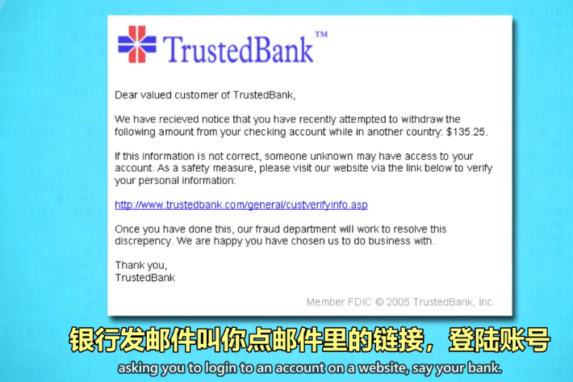

## 3.假托 Pretexting
攻击者给某公司打电话，假装是IT部门的人。
## 4.木马 Trojan Horses
邮件里的"木马"：木马会伪装成无害的东西，比如照片或发票，但实际上是恶意软件(Malware).
## 5.NAND镜像 NAND Mirroring
如果能物理接触到电脑，可以往内存上接几根线，复制整个内存。
复制之后，暴力尝试密码，直到设备让你等待。
这时只要把复制的内容覆盖掉内存，本质上重置了内存，就不用等待，可以继续尝试密码了。
## 6.漏洞利用 Exploit
利用系统漏洞。
## 7.缓冲区溢出 Buffer Overflow
"缓冲区"：指预留的一块内存空间
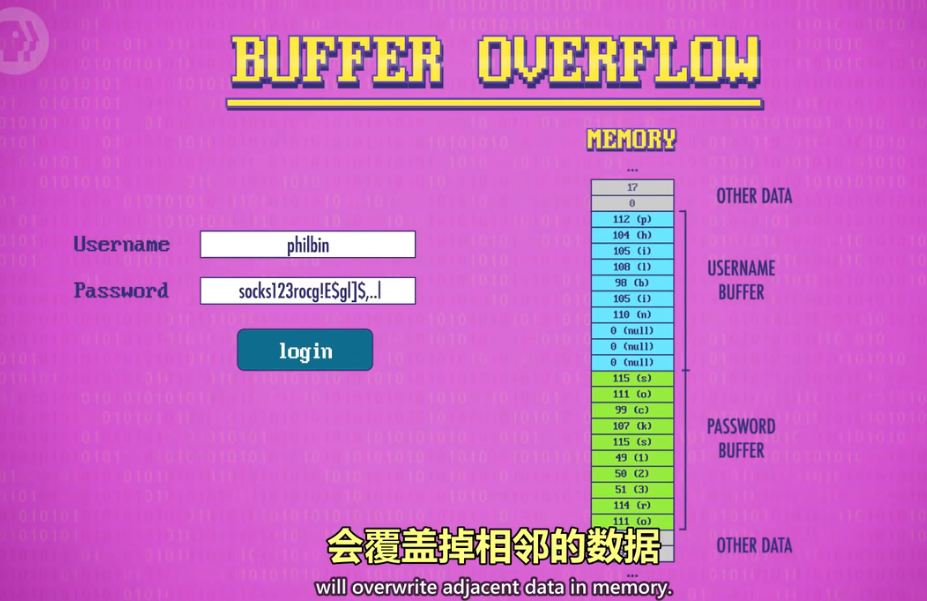
## 8.边界检查 Bounds Checking
最简单的方法。复制之间先检查长度。
## 9.代码注入 Code Injection
最常用于攻击用数据库的网站。
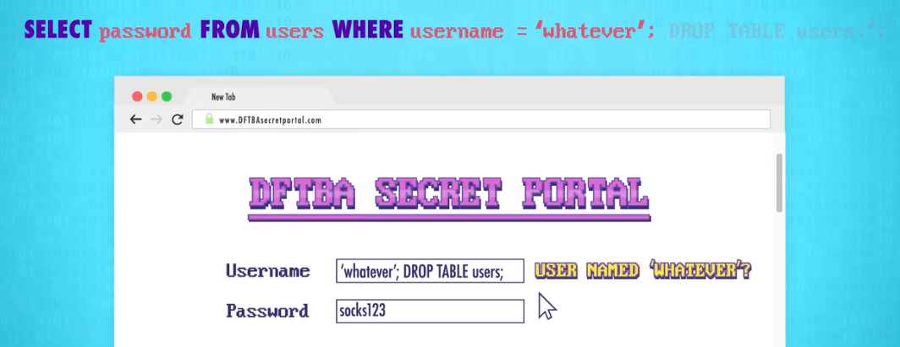
## 10.零日漏洞 Zero Day Vulnerability
当软件制造者不知道软件有新漏洞被发现了，在漏洞就叫做"零日漏洞"
黑帽黑客经常赶时间，抢在白帽程序员做出补丁之前利用该漏洞。
## 11.计算机蠕虫 Worms
如果有足够多的电脑有漏洞，让恶意程序可以在电脑间互相传播。

## 12.僵尸网络 Botnet
如果黑客拿下大量电脑，这些电脑可以组成"僵尸电脑"
可以用于很多目的。比如发大量垃圾邮件
用别人电脑的计算能力和电费挖Bitcoin
## 13.拒绝服务攻击 DDOS
DDoS就是僵尸网络里的所有电脑发一大堆垃圾信息
堵塞服务器，要么迫使别人交钱消灰
或者纯粹作恶

# 第 三十三 课 ： 加密 Encryption

## 1.多层防御 Defence in depth
就像是城堡一样，多重安全机制挡住入侵。
## 2.加密 Encryption,解密 Decryption

密码学(cryptography)一词：来自crypto和graphy,大致翻译成"秘密写作"
为了加密信息，要用加密算法(Cipher)把明文转为密文

### 2.1 凯撒加密 Caesar cipher
朱利叶斯•凯撒，用如今我们叫凯撒加密"的方法来加密私人信件。
他会把信件中的字母向前移动三个位置
所以A会变成D,brutus变成euxwxv
### 2.2 替换加密 Substitution cipher
有一大类算法叫"替换加密”，凯撒密码是其中一种
为了解密，接收者要知道：1.用了什么算法2.要偏移的字母位数

1587年，s正因为一个替换加密的密文被破译
导致杀伊丽莎白女主的阴谋暴露：使得玛丽女王被处决
### 2.3 移位加密 Permutation cipher
另一类加密算法叫"移位加密"
### 2.4 列移位加密 Columnar transposition cipher
简单例子叫"列移位加密"
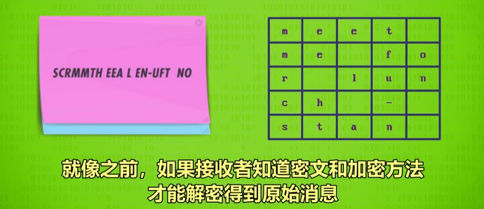

## 3.德国 Enigma 加密机
到了1900年代，人们用密码学做了加密机器.Enigma 就是最有名的那个。

## 4.加密标准：
### 4.1 1977年"数据加密标谁” Data Encryption Standard(DES)
是IBM和NSA手1977年开发的数据加密标准。
DES最初用的是56 bit 长度的二进制密钥，意味着有2的56次方，或者大约72千万亿个不同密钥。

### 4.2 2001年"高级加密标准" Advanced Encryption Standrad(AES)
AES用更长的密钥·128位/192位/256位，·让暴力破解更加困难

AES将数据切成一块一块，每块16个字节。然后用密钥进行一系列替换加密和移位加密
再加上一些其他操作，进一步加密信息
每一块数据，会重复这个过程10次或以上。
10次？为什么10次？因为是性能衡量。

## 5.密钥交换·Key exchange
我们需要某种方法在公开的互联网上传递密钥给对方
这看起来好像不安全，如果密钥被黑客拦截了
黑客不就能解密通信了吗？

密钥交换是一种不发送密钥
但依然让两台计算机在密钥上达成共识的算法
我们可以用"单向函数"来做

07.27 用颜色来举例"单向函数”和"密钥加密"的原理

迪菲赫尔漫密钥交换-Diffie-Hellman Key Exchange

## 6. 非对称加密 Asymmetric encryption
人们用公钥加密消息，只有有私钥的人能解密
换句话说，知道公钥只能加密但不能解密。它是”不对称"的！

非对称加密算法 RSA

# 第 三十四 课：机器学习与人工智能 Machine Learning & Artificial Intelligence
"机器学习"本质：根据数据做决定！机器学习算法让计算机可以从数据中学习，然后自行做出预测和决定。
大多数计算机科学家会说
机器学习是为了实现人工智能这个更宏大目标的技术之一
 ## 1. 分类 Classification
 判断飞蛾是月蛾"还是"帝蛾" 就是分类。
 ## 2. 分类器 Classifier
 分类的算法，就是分类器。
 ## 3. 特征 Feature
 很多算法会减少复杂性，把数据简化成"特征”。
对于之前的飞蛾分类例子
我们用两个特征："翼展"和"重量"
 ## 4. 标记数据 Labeled data
 不但记录特征值，还会把种类也写上。这叫"标记数据"
 ## 5. 决策边界 Decision boundaries
 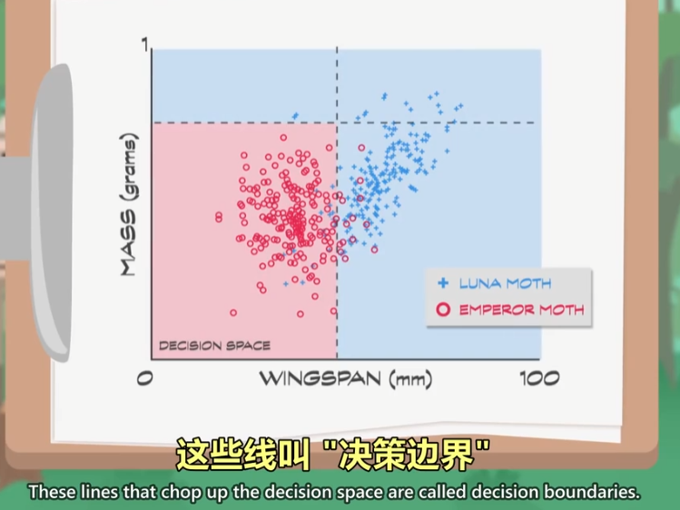
 
 
 ## 6. 混淆矩阵 Confusion matrix
 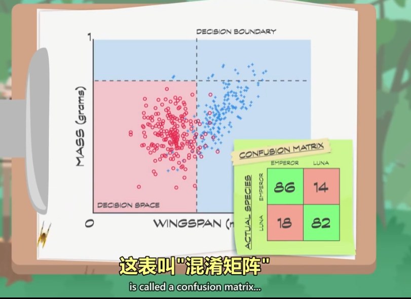
 ## 7. 未标签数据 Unlabeled data
 如果我们进入森林，碰到一只不认识的飞蛾
 我们可以测量它的特征，并绘制到决策空间上
 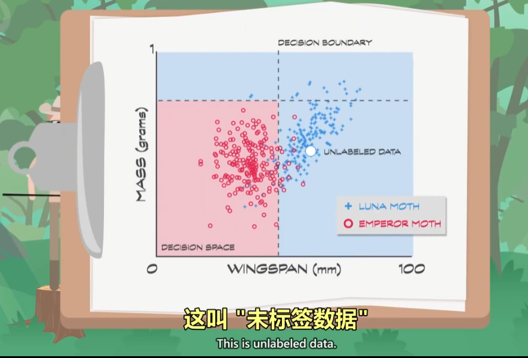
 ## 8. 决策树 Decision tree
 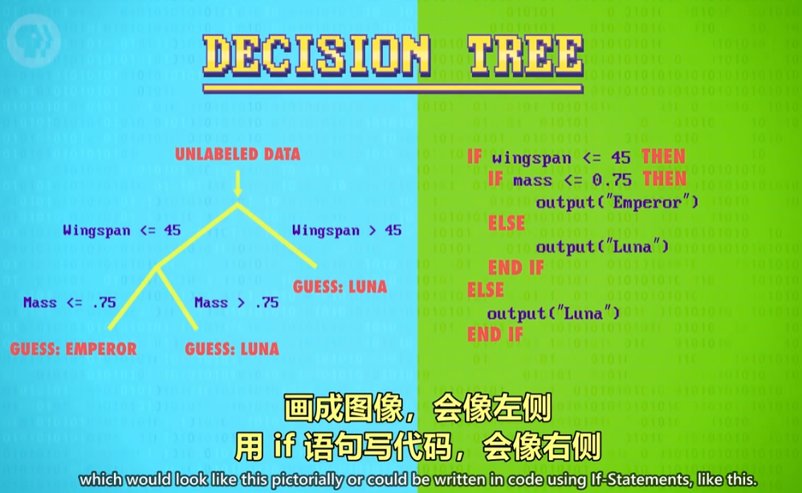
 ## 9. 支持向量机 Support Vector Machines
 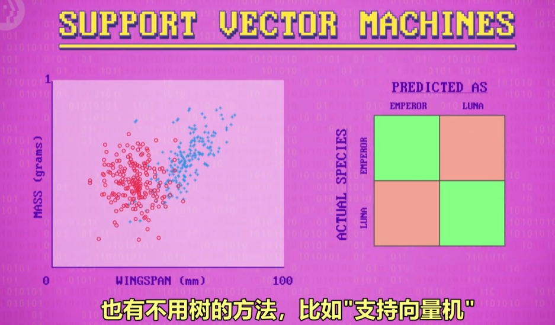
 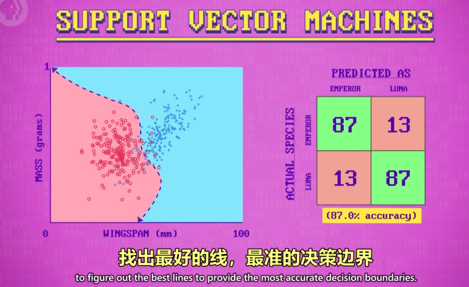
 这条线可以是一个数学公式。
 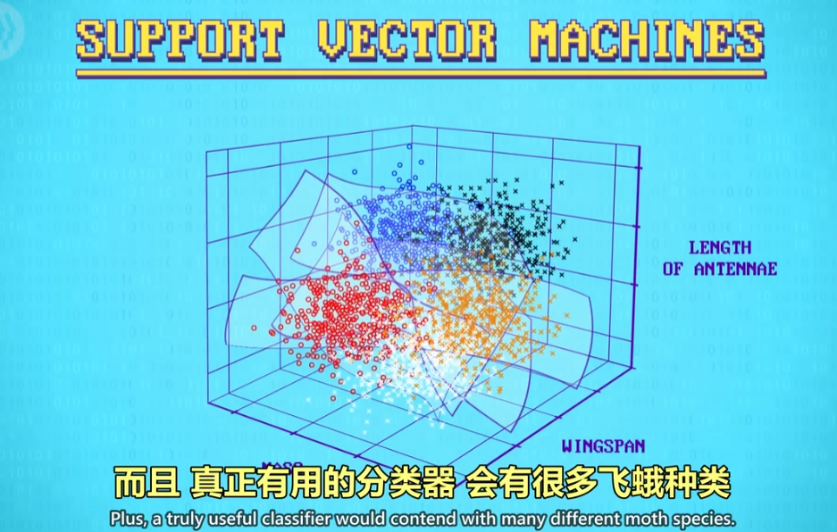
 
 >"决策树”和"支持向量机"这样的技术发源自 统计学
 ## 10. 人工神经网络 Artificial Neural Networl
 不用统计学的算法。灵感来自大脑里的神经元。
 
 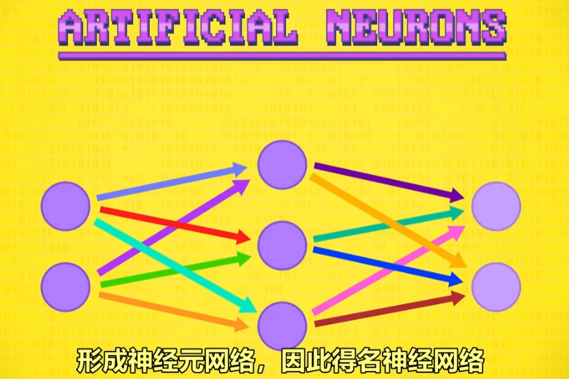
 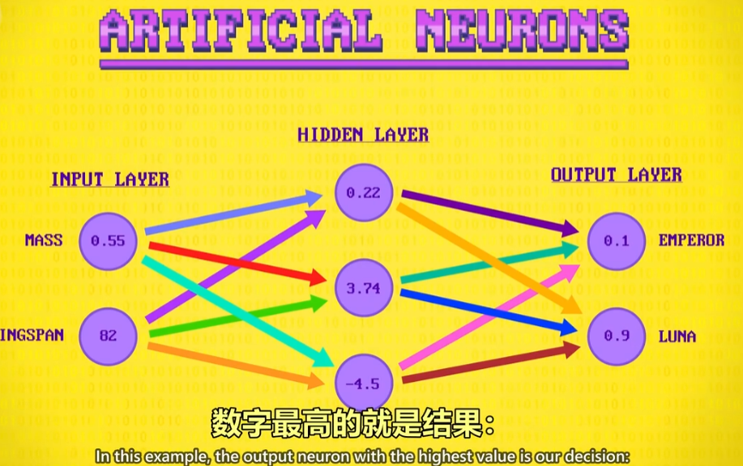
 
 ## 11. 深度学习 Deep learning
 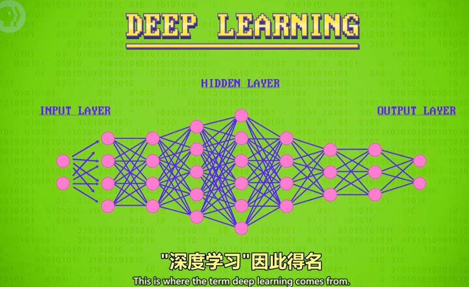
 ## 12. 弱AL, 窄AI Weak Al, Narrow AI
 只能做特定任务的AI。
 ## 13. 强AI Strong Al
 真正通用的，像人一样聪明的AI。目前没人能做出来，接近人类的智能AI。
 ## 14. 强化学习 Reinforcement Learning
 学习什么管用，什么不管用，自己发现成功的策略。
 
 ### 第 35 课 计算机视觉 Computer Vision