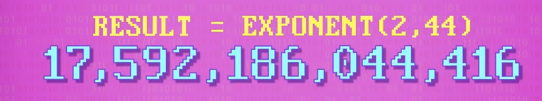
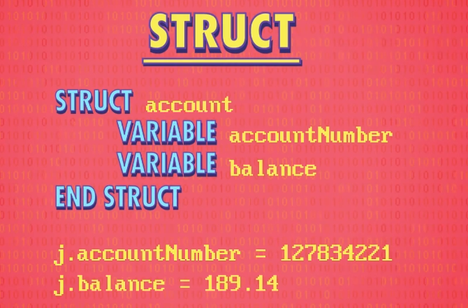
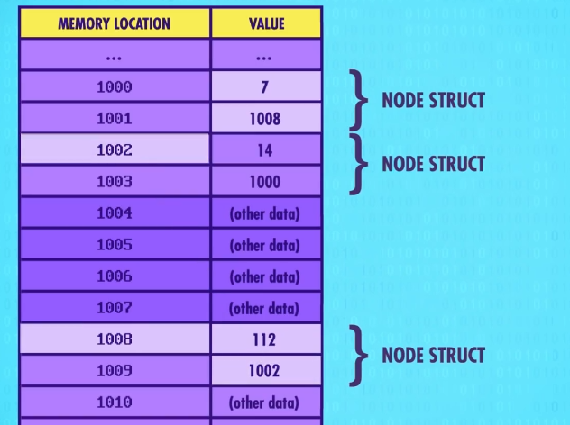

[toc!]
## 第十一课  编程语言发展史
### 0、概念梳理

 - 伪代码（Pseudo-Code)：用自然语言（中文、英语等）对程序的高层次描述，称为“伪代码”
     - 用"操作码表"(Opcode Tables)把伪代码转成 二进制机器码
 - 汇编器(Assembler)：是一个二进制(Binary)程序它可以读懂文字指令，自动转成二进制指令。用于将汇编语言装换成机器语言。一条汇编语句对应一条机器指令。
 - 助记符(Mnemonics)（汇编器）：每个操作码分配一个简单名字。1940~1950年代，程序员开发出的一种新语言，具有更可读和更高层次。此时与其使用1和0写代码，程序员可以写"LOAD_A 14"
 - 软件

### 1、早期二进制写代码
先前都是硬件层面的编程，硬件编程非常麻烦，所以程序员想要一种更通用的编程方法，就是软件。
早期，人们先在纸上写伪代码，用"操作码表"把伪代码转成二进制机器码，翻译完成后，程序可以喂入计算机并运行。

### 2、汇编器&助记符

 - 背景：1940~1950s，程序员开发出一种新语言， 更可读 更高层次。每个操作码分配一个简单名字，叫"助记符"。但计算机不能读懂“助记符”，因此人们写了二进制程序“汇编器来帮忙”
 - 作用：汇编器读取用"汇编语言"写的程序，然后转成"机器码"。

汇编器的一个效果例子:
功能：自动分析JUMP 地址(第八章提到的JUMP 指令)

注意： 此时 JUMP-NEG 指令跳到地址 5
IF 我们多加了几个程序，或者改变程序的位置，JUMP指令就会报BUG。

这就是汇编器给的效果，它会自动检测程序。


### 3、最早高级编程语言“A-0”
汇编只是修饰了一下机器码，一般来说，一条汇编指令对应一条机器指令，所以汇编码和底层硬件的连接很紧密，汇编器仍然强迫程序员思考底层逻辑。

1950s，为释放超算潜力，葛丽丝·霍普博士，设计了一个高级编程语言，叫 "Arithmetic Language Version 0"，一行高级编程语言  可以转成几十条二进制指令。但由于当时人们认为，计算机只能做计算，而不能做程序，A-0未被广泛使用。

过程：高级编程语言→编译器→汇编码/机器码
现在，编程语言会比之前的汇编语言好很多，高级很多。需要做的事也相对简单很多，这都是多亏了语言背后的编译器(Compiler)。
至于背后有什么原理，编译器做了什么，物理层面上发生了什么。
Out of sight, Out of Mind!(眼不见,心不烦)


### 4、开始广泛应用的高级编程语言FORTRAN
FORTRAN (Formula Translation)
1957年由IBM1957年发布，平均来说，FORTRAN 写的程序，比等同的手写汇编代码短 20 倍， FORTRAN 编译器会把代码转成机器码。
Tips:FORTRAN 项目总监 John Backus 说过,我写这个语言，因为我懒。（懒是人类的第一大动力）


### 5、通用编程语言——COBOL
普通面向商业语言- Common Business-Oriented Language  COBOL
1959年，研发可以在不同机器上通用编程语言。最后研发出一门高级语言："普通面向商业语言"，简称 COBOL每个计算架构需要一个 COBOL 编译器，不管是什么电脑都可以运行相同的代码，得到相同结果。

Write Once, Run Anywhere （一次编写，到处运行）

### 6、现代编程语言:1960s-2000

 - 1960s起，编程语言设计进入黄金时代。
 - 1960 ：ALGOL, LISP 和 BASIC 等语言
 - 70年代有：Pascal，**C** 和 Smalltalk
 - 80年代有：C++，Objective-C 和 Perl
 - 90年代有：Python，Ruby 和 Java
 - 新千年： Swift, C#, Go

### 7、安全漏洞&补丁由来：
在1940年代，是用打孔纸带进行的，但程序出现了问题（也就是漏洞），为了节约时间，只能贴上胶带也就是打补丁来填补空隙，漏洞和补丁因此得名。

## 第十二课 编程基础 - 语句和函数
编程语言 (Programming Languages)

### 1.语句(Statements)- 语法(syntax)
就像口语一样，编程语言有"语句"(Statements):表达一整句子的意思。
以下为语句：
```
a = 5
b = 10
c = a+b
```

### 2. Initialize 初始化

把打Bug当作一个游戏，你需要初始化一下数据:
```
Level = 1
Score = 0
Bugs = 5
Relays = 4
Playername = senpai
```

### 3.控制流语句 Control Flow Statements

为了做成交互式游戏，程序的执行顺序要更灵活，而不是只是从上到下运行。
因此我们需要：
- "Control Flow Statements" (控制流语句)
   - 其中最常见的是 **IF 语句** 
   - 这种类型的语句又叫："Conditional Statements"(条件语句)
 #### IF 语句
 C 语言：
```c
if (a > 0){
	printf("yes");
}else {
	printf("no");
}
```
C++:
```c++
#include <iostream>
using namespace std;
 
int main ()
{
   // 局部变量声明
   int a = 10;
 
   // 使用 if 语句检查布尔条件
   if( a < 20 )
   {
       // 如果条件为真，则输出下面的语句
       cout << "a 小于 20" << endl;
   }
   cout << "a 的值是 " << a << endl;
 
   return 0;
}
```
Python:
```python
if a > 0 :
	print "yes"
else
	print "no"
```

Java:
```java
public class Test {
 
   public static void main(String args[]){
      int x = 10;
 
      if( x < 20 ){
         System.out.print("这是 if 语句");
      }
   }
}
```
#### While 语句
 C 语言：
```c
int main ()
{
   /* 局部变量定义 */
   int a = 10;

   /* while 循环执行 */
   while( a < 20 )
   {
      printf("a 的值： %d\n", a);
      a++;
   }
 
   return 0;
}
```

C++:
```c++
#include <iostream>
using namespace std;
 
int main ()
{
   // 局部变量声明
   int a = 10;

   // while 循环执行
   while( a < 20 )
   {
       cout << "a 的值：" << a << endl;
       a++;
   }
 
   return 0;
}

```
Python:
```python
i = 1
while i < 7:
  print(i)
  i += 1
```

Java:
```java
public class Test {
   public static void main(String[] args) {
      int x = 10;
      while( x < 20 ) {
         System.out.print("value of x : " + x );
         x++;
         System.out.print("\n");
      }
   }
}
```


#### For 语句
 C 语言：
```c
#include <stdio.h>
 
int main ()
{
   /* for 循环执行 */
   for( int a = 10; a < 20; a = a + 1 )
   {
      printf("a 的值： %d\n", a);
   }
 
   return 0;
}
```
C++:
```c++
#include <iostream>
using namespace std;
 
int main ()
{
   // for 循环执行
   for( int a = 10; a < 20; a = a + 1 )
   {
       cout << "a 的值：" << a << endl;
   }
 
   return 0;
}

```
Python:
```python
sites = ["Baidu", "Google","Runoob","Taobao"] #列表
for site in sites:
    print(site)
```

Java:
```java
public class Test {
   public static void main(String[] args) {
 
      for(int x = 10; x < 20; x = x+1) {
         System.out.print("value of x : " + x );
         System.out.print("\n");
      }
   }
}
```

### 4.函数 functions
为了隐藏复杂度，代码可以打包成函数。


调用此程序后的效果：


多次的进行函数编写后，最后就只有这一行代码调用，就能获得以下的数据：


<center><h3>It's not Magic, it's the power of Adstraction!</h3> </center>

### 5.模块化编程 Modularizing Programs
不仅可以让单个程序员独立制作APP，也让团队协作可以写更大型的程序。

**Tips:多于100行的代码，就应该存在可以拆出来做成一个函数的代码。
所以就导致了多于100行的代码很少见。**

### 6.库 Libraries
现代编程语言 有很多预先写好的函数集合，用于给程序员直接调用使用，减少大量繁琐且重复的编写。

## 第十三课 算法入门 Algorithms（重点）
>**Algorithm 算法：解决问题的具体步骤**
>算法是很多东西的核心，程序，人工智能，以及现在最常用的各种软件都和算法抛不开关系
>算法也是**数据结构课**中重要知识点之一

### 排序算法 Sorting
这是一个记载最多的算法。eg.给名字，数据排序。

排序算法是非常非常多的。以下有几个知名的排序算法（有一些是数据结构里需要知道的）
- 冒泡排序 Bubble Sort
- 选择排序 Selection Sort
- 插入排序 Insertion Sort
- 希尔排序 Shell Sort
- 归并排序 Merge Sort
- 快速排序 Quick Sort
- 堆排序 Heap Sort
- 计数排序 Counting Sort
- 桶排序 Bucket Sort
- 基数排序 Radix Sort


- 意面排序 Spaghetti Sort （What?)

参考Blog: https://www.cnblogs.com/onepixel/articles/7674659.html#:~:text=%E5%8D%81%E5%A4%A7%E7%BB%8F%E5%85%B8%E6%8E%92%E5%BA%8F%E7%AE%97%E6%B3%95%EF%BC%88%E5%8A%A8%E5%9B%BE%E6%BC%94%E7%A4%BA%EF%BC%89%201%200%E3%80%81%E7%AE%97%E6%B3%95%E6%A6%82%E8%BF%B0%202%201%E3%80%81%E5%86%92%E6%B3%A1%E6%8E%92%E5%BA%8F%EF%BC%88Bubble%20Sort%EF%BC%89%203%202%E3%80%81%E9%80%89%E6%8B%A9%E6%8E%92%E5%BA%8F%EF%BC%88Selection,4%E3%80%81%E5%B8%8C%E5%B0%94%E6%8E%92%E5%BA%8F%EF%BC%88Shell%20Sort%EF%BC%89%206%205%E3%80%81%E5%BD%92%E5%B9%B6%E6%8E%92%E5%BA%8F%EF%BC%88Merge%20Sort%EF%BC%89%207%206%E3%80%81%E5%BF%AB%E9%80%9F%E6%8E%92%E5%BA%8F%EF%BC%88Quick%20Sort%EF%BC%89


#### 1.选择排序 Selection Sort 
>Example:
我们想象一下我们飞去 印度 的航班 有以下 票价：


**Array 是 数组 ，代表以上一组的数据**
视频中使用的是选择排序。
动画过程就不展示了，但是可以看以下动图（选择排序）


代码实现：
```c
function selectionSort(arr) {
    var len = arr.length;
    var minIndex, temp;
    for (var i = 0; i < len - 1; i++) {
        minIndex = i;
        for (var j = i + 1; j < len; j++) {
            if (arr[j] < arr[minIndex]) {     // 寻找最小的数
                minIndex = j;                 // 将最小数的索引保存
            }
        }
        temp = arr[i];
        arr[i] = arr[minIndex];
        arr[minIndex] = temp;
    }
    return arr;
} 
```

视频中的伪代码：

>遍历：把数组里的每一个数据都跑一遍

#### 1.1算法复杂度 Complexity of Algorithm
>引入一个概念：算法 输入大小 和 运行步骤 之间的关系 叫做 算法复杂度 

算法复杂度分别有： 时间 和 空间 复杂度 *（数据结构）*

算法的标志就是这个图。（对，不开玩笑）


#### 2.归并排序 Merge Sort
归并排序是建立在归并操作上的一种有效的排序算法。该算法是采用分治法（Divide and Conquer）的一个非常典型的应用。将已有序的子序列合并，得到完全有序的序列；即先使每个子序列有序，再使子序列段间有序。若将两个有序表合并成一个有序表，称为2-路归并。 
算法描述：

 - 把长度为n的输入序列分成两个长度为n/2的子序列；
 - 对这两个子序列分别采用归并排序；
 - 将两个排序好的子序列合并成一个最终的排序序列。


```c
function mergeSort(arr) {
    var len = arr.length;
    if (len < 2) {
        return arr;
    }
    var middle = Math.floor(len / 2),
        left = arr.slice(0, middle),
        right = arr.slice(middle);
    return merge(mergeSort(left), mergeSort(right));
}
 
function merge(left, right) {
    var result = [];
 
    while (left.length>0 && right.length>0) {
        if (left[0] <= right[0]) {
            result.push(left.shift());
        } else {
            result.push(right.shift());
        }
    }
 
    while (left.length)
        result.push(left.shift());
 
    while (right.length)
        result.push(right.shift());
 
    return result;
}
```

> 归并算法的时间复杂度为 O(n log n)
> 其中 
> - n 是需要 比较+合并 的次数 和 数组数量成正比
> - log n 是合并步骤的次数 
> For example:
> 把大小为8的数据分出来 8个 1的数组  = Log2 8 =3
> 如果大小是16 = Log2 16 =4
> 大小是8000 = Log2 8000 = 13

#### 经典的算法问题：图搜索 Graph Search！-Dijkstra 算法
>图状结构 代表着结构中的数据元素存在多个对多个的关系 --数据结构 严蔚敏

以下是以图的概念，给出一个问题：如何去找到花费最少的路径从 高庭 到达 凛冬城

##### 蛮力方法！Brute Force Approach
如果用野蛮的方式，也就是每条路径都走一遍，这样最简单，但是效率极低。
**时间复杂度：O(n!)** <<

> 常见的时间复杂度为
> O(1) < O(log n) < O(n) < O(n log n) < O(n^2^) < O(n^3^) < O(n!) < O(n^n^)
> ---王道考研 数据结构

<center><h3>
最短路径算法-迪杰斯特拉(Dijkstra)算法</h3></center>

> Dijkstra 算法是非常著名的算法， 在计算机网络领域中也经常使用。（毕竟网络可以抽象成一个图）
> Dijkstra 简单来说就是： 比较 取 最小。

参考网页：https://zhuanlan.zhihu.com/p/338414118
**Dijikstra 算法的时间复杂度为 O(n^2^)**

而在后续的改进，现在的时间复杂度为 O(n log n + l)
n 是 节点数 
l 是有多少条线

>成为计算机科学家的核心：就是根据情况合理确定 选用现有算法 或者 自己写新算法。

## 第 十四 课 数据结构 Data Structures
> 数据结构(Data Structures) 是非常非常重要的概念，也是中国内地研究生考试中必然出现的一个考试科目。
> **数据结构：是相互之间存在一种或多种特定关系的数据元素的集合。**

### 1.数组(Array)/列表(List)/向量(Vector)
为了从数组中拿出某个值，我们需要指定一个**下标 (Index)**
```python
J = {"12","13","14","22","12"} #数组
#index 0,1,2,3,4
a = j[0] + j[2] 
# a = 12+ 14 = 26
```

接下来，我们假设这个数组J 是从1000这个地址开始建立数据，以下为图：
（关于地址，一个数据的是占8位数，所以按道理来说地址是1000，1008，1016的形式）但是我们假设是1000.1001吧）

| Memory Location | Value | 对应的数组下表 |
| --------------- | ----- | -------------- |
| 1000            | 12    | J[0]           |
| 1001            | 13    | J[1]           |
| 1002            | 14    | J[2]           |
| 1003            | 22    | J[3]           |
| 1004            | 12    | J[4]           |
| 1005            | ...   | ...            |
| ...             | ...   | ...            |
| ...             | ...   | ...            |
>这种连在一起的数组我们称为 **顺序表** （数据结构）

### 2.字符串(string)
数组的亲戚，其形式是 字母，数字，标点符号等 组成的数组。
以下这个就是字符串。
```c
j = "STAN ROCKS"
```

而字符串在背后是这样的一个情况

| Memory Location | Value   | Index |
| --------------- | ------- | ----- |
| 1000            | S       | J[0]  |
| 1001            | T       | J[1]  |
| 1002            | A       | J[2]  |
| 1003            | N       | J[3]  |
| 1004            | (space) | J[4]  |
| 1005            | R       | J[5]  |
| 1006            | O       | J[6]  |
| 1007            | C       | J[7]  |
| 1008            | K       | J[8]  |
| 1009            | S       | J[9]  |
| 1010            | (null)  | J[10] |
字符串结尾那个是 **Null Character** ，表示字符串的结尾。
这非常重要，如果调用printf()函数，这个函数就得知道什么时候停止。

### 3. 矩阵 Matrix

```c
j = {{10,15,12},{8,7,42},{18,12,7}}
```

> 此时的Index 表示是这样的： a = j\[2\]\[1\] 代表了 12

我们不止可以做三维的矩阵，我们还可以做多位的！

Five Dimensional Matrix:
```c
a = j[2][0][18][18][3]
```

### 4. 结构体 Struct
> 结构体就是多个不同类型的数据，放在一起成为一个集合。
> 在C++中，形成了类和对象。这个是非常常用的一个东西，因为C\+\+是一个面向对象的编程语言。




### 5.链表(linked list)

> 节点也是一种结构体


> Pointer（指针） 这是一个非常重要且让人头疼的一个东西。在C和C++之中非常常用。（或者说这玩意是C/C\+\+的）
> 指针：指向一个内存地址。


用 节点 可以做 **链表**
链表是一个很灵活的数据结构，是通过每个节点 指向 下一个节点实现的。

#### 循环链表 Circular


第一个数据在1000这个位置，而Value = 7，他指向的下一个数据在1001的位置里，是地址1008.
这样下一个数据将会是地址1008的数据，Value 便是 112，而他指向的下一个数据便是1002.
接下来1002位置的数据是14，而他指向的下一个数据是地址1000的。

你发现了吗，一切都回到了起点！

而这便是循环链表，也就是可以循环的。

当然链表也存在非循环的链表，最后一个指针是0 即可。代表了"null" value = 尽头

用抽象表示来看链表：


> 链表是一个非常方便，灵活的数据结构，易于修改，重新排序，两端缩减，分割，倒序等。

以下这两个知名的数据结构都用上了链表。
#### 5.1队列 Queue 先进先出

队列就如同邮局排队，海底捞排队，其实就是排队问题。
存在 **先进先出（FIFO）**
所以队列所做的就是 **前走后进** 的工作

在队列里有两个词：
- 入队 Enqueueing
   - 从最后入队
- 出队 Dequeuing
   - 从最前离开

#### 5.2栈 Stack 后进先出

和队列差不多，但是处理的是 **后进先出（LIFO）**
栈就如同什么呢？**手枪子弹！** 你想象一下子弹弹夹从最低装到最高层，但发射是以最高的子弹先发出去，这个就是栈！

在栈里也有两个词：
- 入栈 Push
   - 从最后入队
- 出栈 Pop
   - 从最后离开

### 6.树 Tree
>从节点的结构体总稍作调整，改成2个指针，就会形成 树。


以下是树的抽象图形：


其中：
- 根节点 root : 最高节点
- 子节点 children : "根节点"下所有节点
- 母节点 parent: 任何"子节点" 的直属上层节点
- 叶节点 leaf: 没有任何"子节点" ，代表着"树"结束的地方

#### 6.1 二叉树 binary tree

在以上例子中，每个节点最多两个"子节点"，这便是二叉树.

> 树 有个非常重要的性质： "根"到"叶"是**单向**的


### 7.图 Graph Data
树虽然有这样的一个重要性质，那么是否存在数据随意链接，随意循环呢？
这就便是 图。


> 最后 ，数据结构还存在着非常重要且出名的效果。
> 红黑树和 堆 ，我建议是自己看一看。（

### 8.附加内容-红黑树 Red Black Tree
红黑树参考：https://blog.csdn.net/cy973071263/article/details/122543826

#### 8.1 平衡二叉树 AVL Tree(Balanced Binary Tree)

> 把平衡二叉树成为 AVL Tree 是因为 平衡二叉树的概念由两位大学教授 G.M. Adelson-Velsky 和 E.M. Landis 提出，为了纪念他们，就把这两名字的缩写 称为 平衡二叉树（AVL tree）

平衡二叉树参考：
1. https://blog.csdn.net/xiaojin21cen/article/details/97602146#:~:text=1%E3%80%81AVL%E6%A0%91%20%28%E5%B9%B3%E8%A1%A1%E4%BA%8C%E5%8F%89%E6%A0%91%29%E7%9A%84%E5%AE%9A%E4%B9%89.%20%E5%B9%B3%E8%A1%A1%E4%BA%8C%E5%8F%89%E6%A0%91%20%E5%85%A8%E7%A7%B0%E5%8F%AB%E5%81%9A%20%E5%B9%B3%E8%A1%A1%E4%BA%8C%E5%8F%89%E6%90%9C%E7%B4%A2%EF%BC%88%E6%8E%92%E5%BA%8F%EF%BC%89%E6%A0%91%20%EF%BC%8C%E7%AE%80%E7%A7%B0%20AVL%E6%A0%91%E3%80%82.%20%E8%8B%B1%E6%96%87%EF%BC%9ABalanced,%E7%A7%B0%E4%B8%BA%20AVL%E6%A0%91%E3%80%82.%20%E5%B7%A6%E5%8F%B3%E4%B8%A4%E4%B8%AA%E5%AD%90%E6%A0%91%20%E4%B9%9F%E9%83%BD%E6%98%AF%E4%B8%80%E6%A3%B5%E5%B9%B3%E8%A1%A1%E4%BA%8C%E5%8F%89%E6%A0%91%E3%80%82.%20%E5%9C%A8AVL%E6%A0%91%E4%B8%AD%EF%BC%8C%E4%BB%BB%E4%BD%95%E8%8A%82%E7%82%B9%E7%9A%84%E4%B8%A4%E4%B8%AA%E5%AD%90%E6%A0%91%E7%9A%84%E9%AB%98%E5%BA%A6%E6%9C%80%E5%A4%A7%E5%B7%AE%E5%88%AB%E4%B8%BA%201%20%EF%BC%8C%E6%89%80%E4%BB%A5%E5%AE%83%E4%B9%9F%E8%A2%AB%E7%A7%B0%E4%B8%BA%E5%B9%B3%E8%A1%A1%E4%BA%8C%E5%8F%89%E6%A0%91%20%E3%80%82.

2. https://zhuanlan.zhihu.com/p/56066942

AVL树本质上是一颗二叉查找树，但是它又具有以下特点：

 - 它是一棵空树或它的左右两个子树的高度差的绝对值不超过1，
 - 左右两个子树 也都是一棵平衡二叉树。

<center>**在AVL树中，任何节点的两个子树的高度最大差别为 1 ，所以它也被称为平衡二叉树** 。</center>

##### 平衡因子（Balance Factor，简写为bf）
平衡因子（bf）：结点的左子树的深度减去右子树的深度。
即： **结点的平衡因子 = 左子树的高度 - 右子树的高度** 。

**在 AVL树中，所有节点的平衡因子都必须满足： -1<=bf<=1;**

##### 学习计算每个节点的高度和平衡因子
下图的二叉树，计算每个节点的高度和平衡因子。图示如下：


##### 区分是否是平衡二叉树

下面是平衡二叉树和非平衡二叉树对比的例图：


>==其实平衡二叉树最大的作用就是查找,AVL树的查找、插入和删除在平均和最坏情况下都是O(logn)。AVL树的效率就是高在这个地方。 #12AA9C==

#### 红黑树简介
红黑树是一种自平衡的二叉查找树，是一种高效的查找树。它是由 Rudolf Bayer 于1978年发明，在当时被称为平衡二叉 B 树(symmetric binary B-trees)。后来，在1978年被 Leo J. Guibas 和 Robert Sedgewick 修改为如今的红黑树。红黑树具有良好的效率，它可在 O(logN) 时间内完成查找、增加、删除等操作。

它是具备了某些特性的二叉搜索树，能解决非平衡树问题，红黑树是一种接近平衡的二叉树（说它是接近平衡因为它并没有像AVL树的平衡因子的概念，它只是靠着满足红黑节点的5条性质来维持一种接近平衡的结构，进而提升整体的性能，并没有严格的卡定某个平衡因子来维持绝对平衡）。
#### 红黑树的特性
在讲解红黑树性质之前，先简单了解一下几个概念：

 - parent：父节点
 - sibling：兄弟节点
 - uncle：叔父节点（ parent 的兄弟节点）
 - grand：祖父节点（ parent 的父节点）

首先，红黑树是一个二叉搜索树，它在每个节点增加了一个存储位记录节点的颜色，可以是RED,也可以是BLACK；
通过任意一条从根到叶子简单路径上颜色的约束，==红黑树保证最长路径不超过最短路径的二倍，因而近似平衡（最短路径就是全黑节点，最长路径就是一个红节点一个黑节点，当从根节点到叶子节点的路径上黑色节点相同时，最长路径刚好是最短路径的两倍） #EE3F4D==。它同时满足以下特性：

- 节点是<font color=#FF0000>红色</font>或<font color=#000000>黑色</font>
 - 根是<font color=#000000>黑色</font>
 - 叶子节点（外部节点，空节点）都是<font color=#000000>黑色</font>，这里的叶子节点指的是最底层的空节点（外部节点），下图中的那些null节点才是叶子节点，null节点的父节点在红黑树里不将其看作叶子节点
 - <font color=#FF0000>红色</font>节点的子节点都是<font color=#000000>黑色</font>
   - <font color=#FF0000>红色</font>节点的父节点都是<font color=#000000>黑色</font>
   - 从根节点到叶子节点的所有路径上不能有 2 个连续的<font color=#FF0000>红色</font>节点
 - 从任一节点到叶子节点的所有路径都包含相同数目的<font color=#000000>黑色</font>节点

根据上面的性质，我们来判断一下下面这课树是不是红黑树


但实际上，在红黑树中真正被定义为叶子结点的，是那些空节点，如下图。


以上是不满足红黑树的第五个性质。

> 红黑树的查找，插入和删除操作，时间复杂度都是O(logN)。

### 9 堆 Heap

参考：https://blog.csdn.net/xiaomucgwlmx/article/details/103522410

#### 9.1基本概念：

1、完全二叉树：若二叉树的深度为h，则除第h层外，其他层的结点全部达到最大值，且第h层的所有结点都集中在左子树。

2、满二叉树：满二叉树是一种特殊的的完全二叉树，所有层的结点都是最大值。


#### 9.2什么是堆？
堆（英语：heap)是计算机科学中一类特殊的数据结构的统称。堆通常是一个可以被看做一棵树的数组对象。堆总是满足下列性质：

堆中某个节点的值总是不大于或不小于其父节点的值；

堆总是一棵完全二叉树。

将根节点最大的堆叫做最大堆或大根堆，根节点最小的堆叫做最小堆或小根堆。常见的堆有二叉堆、斐波那契堆等。


堆是非线性数据结构，相当于一维数组，有两个直接后继。

堆的定义如下：n个元素的序列{k1,k2,ki,…,kn}当且仅当满足下关系时，称之为堆。

(ki <= k2i,ki <= k2i+1)或者(ki >= k2i,ki >= k2i+1), (i = 1,2,3,4...n/2)

若将和此次序列对应的一维数组（即以一维数组作此序列的存储结构）看成是一个完全二叉树，则堆的含义表明，完全二叉树中所有非终端结点的值均不大于（或不小于）其左、右孩子结点的值。由此，若序列{k1,k2,…,kn}是堆，则堆顶元素（或完全二叉树的根）必为序列中n个元素的最小值（或最大值）。
注意： 在二叉树中，若当前节点的下标为 i， 则其父节点的下标为 i/2，其左子节点的下标为 i*2，其右子节点的下标为i*2+1；


## 第 十五 课 计算机理论之父 - 阿兰.图灵 Alan Turing


> 德国数学家 大卫.希尔伯特 David Hilbert 提出一个问题 :
> Is there an algorithm that takes, as input, a statement written in formal logic, and produces a "Yes" or "No" answer that's always accurate?
> (翻译：是否存在一个算法，输入正式逻辑语句的时候，输出准确的"是"或"否"答案？)
> 这个问题叫做 可判定性问题 (Decision Problem)

如果存在这样的算法，就可以回答“ 是否有一个数 大于 所有数" 的问题。
虽然我们知道这答案为 否，但是我们人类文明发展中不止有这些问题，我们还存在着更多更多的问题。我们想知道这方面的答案。

美国数学家 Alonzo Church 于 1935年提出解决方法：开发了一个叫"Lambda 算子"的 数学表达系统。

从这个表达系统，证明了这样的一个算法是不存在的。

而另一边，我们这课的主角，图灵。提出了一种假想的计算机，叫"图灵机 Turing Machine"

### 1.图灵机 Turing Machine


图灵机存在着以下概念:

 - 图灵机是个理论的机器，有着无限长的纸带，纸带用于存储符号。
 - 读写头：可以读取和写入纸上带上的符号
 - 状态变量：保存当前状态
 - 规则：描述机器做什么
   - 依据 当前状态 + 读写头看到的符号，决定机器做什么。
   - 结果可能是：
     - 在纸带上写入一个符号（0,1)
     - 改变状态
     - 吧读写头移动一格
     - 以上行为的组合

例子:可以通过视频享用，非常简单。

> 图灵证明的这个假想计算机，只要有足够的规则，状态和纸带，就能创造任何东西。

### 图灵完备 Turing Complete

>每个现代计算系统（电脑，手机），甚至是微波炉和恒温器内部的小电脑，都是运用了"图灵完备"

图灵 把 图灵机用于一个有趣的计算问题："停机问题 Halting Problem"

停机问题是这样的：
<h3>给定图灵机描述和输入纸带，是否有算法可以确定，机器会永远算下去还是到某一点会停机？</h3>

图灵通过一个巧妙逻辑矛盾，证明了停机问题是 <font color="red">无法解决</font> 的.

图灵停机问题参考：
1. https://blog.csdn.net/u014073556/article/details/86382019
2. https://zhuanlan.zhihu.com/p/142473069
3. https://zhuanlan.zhihu.com/p/505510329

>Church 和 Turing 都证明了计算机的计算是有极限的，起步了可计算性理论，现在叫"Chuch-Turing Thesis"

图灵最大的贡献，是提出了 **人工智能 Artificial Intelligence**(34集会聊)

> 图灵提出:
> A computer would deserve to be called intelligent if it could deceive a human into believing that is was human.
> (翻译：如果计算机能欺骗人类相信它是人类，才算是智能)
> 也就是如今的 "图灵测试 Turing Test"

图灵测试 中 最常用的 就是 验证码（图中内容）：


