参考：https://shimo.im/docs/PJAUY30F1uYksv0h/read
CCCS 计算机科学速成课 第 21到 30 课分别会讲：
21.压缩
22.命令行界面
23.屏幕& 2D 图形显示
24.冷战和消费注意
25.个人计算机革命
26.图形用户界面
27.3D 图形
28.计算机网络
29.互联网
30.万维网
## 第 二十一 课 压缩 Compression
>压缩的好处就是能存更多文件，传输也会更快

压缩：**用更少的bit 来表示数据**

### 1.游程编码 Run-Length Encoding
这个代码效果是：减少重复信息。
适合经常出现相同值的文件中。
就如同以下代码：这有一大串的黄色像素（连续7个像素的）

然后我们对这个黄色像素前面加个 run-length 表示他后面像素重复的次数
当然，既然有一个run-length在metadata里，那么每个像素都需要在前面标上长度。

### 2.无损压缩 Lossless Compression
>
>这种压缩方式便是"无损压缩"(Lossless Compression)，因为我们没有损失任何东西。解压缩后，数据和压缩前完全一样。

### 3.霍夫曼树 Huffman Tree
是另一种无损压缩，它用更紧凑的方式表示数据块。
>有点像 "Don't Forget to be Awesome" 简写成 DFTBA.

为此，我们需要一个字典，存储"代码"和"数据"间的对应关系。

生成 紧凑代码(Compact Codes)
黄黄 出现的最多，我们希望用最紧凑的方式来表示它，
而 黑黄 和 白白，可以用更长的东西来表示，因为出现频率低。

最下面的频率最低，而最上面的频率最高。

>这部分视频太棒了，一定要在视频里看。
### 4.字典编码 Dictionary Coders
然后通过这个数，变成字典：

And you did it，你就可以压缩了！

**这样就可以从 48bytes 变成 14 bits ！**

等等等等等等等，别开香槟，因为...你漏了字典！

加上了字典，这个东西就完整了！
现在图像是 30 bytes ,比原本的 48 bytes 也会少很多。

> 以上的两种方法分别是：
	- 消除冗余 Removing Redundancies 
	- 更紧凑的表示方法 Using More Compact Representation
	  通常都会一起使用。
	  
几乎所有无损压缩格式都用了上述两种形式，比如：GIF,PNG,PDF,ZIP
### 5. 有损压缩 Lossy Compression Techniques
> 有些文件是可以有损的，这些损失的东西人类也不怎么能察觉出来，比如说：音乐。
> 音乐中超声波的数据可以丢掉，因为人类听不到超声波。
> 另一方面，人类对人声很敏感，所以应该尽可能保持原样。

WAV / FLAC 属于没压缩的音频格式。
MP3 就是压缩音频文件，能小10倍甚至更多。
### 6.感知编码 Perceptual Coding
这种删除人类无法感知的数据的方法，就叫做"感知编码"
它依赖于人类的感知模型，模型来自"心理物理学"领域

#### 6.1 有损压缩图像格式 JPEG
人的视觉系统也不是完美的，我们善于看到尖锐对比，比如物体的边缘，但我们看不出颜色的细微变化。

JPEG 利用了这一点，把图像分解成 8x8 像素块，然后删除大量高频率空间数据。

然后变成了这样的一个效果：

最后得出来的效果就是这样的：

### 7. 时间冗余 Temproral Redundancy
> 视频只是一长串连续图片，所以图片的很多方面也适用于视频 
> 但视频可以做一些小技巧，因为帧和帧之间很多像素一样。

通过这种帧与帧之间的处理，就是"时间冗余"
视频里不用每一帧都存这些像素，可以只存变了的部分。
这比存所有像素更有效率，利用了帧和帧之间的相似性。

更高级的视频压缩格式，会更进一步：
- 找出帧和帧之间相似的补丁，然后用简单效果实现，比如
  - 移动
  - 旋转
  - 变亮
  - 变暗
### 8. MPEG-4 视频编码
>
>MPEG-4 是常见标准，可以比原文件小20~200倍。

## 第 二十二 课：命令行界面 Keyboards & Command Line Interfaces
>本集重点：计算机早期同时输入程序和数据(用纸卡/纸带)
>运行开始直到结束，中间没有人类进行操作。
>原因是计算机很贵，不能等人类慢慢输入，执行完结果打印到纸上

### 1.人机交互 （Human-Computer Interaction）发展史
计算机早期同时输入程序和数据（用纸卡/纸带）
运行开始直到结束，中间没有人类进行操作，原因是计算机很贵，不能等人类慢慢输入，执行完结果打印到纸上(02:34)

到1950年代，计算机足够便宜+快，人类和计算机交互式操作变得可行为了让人类输入到计算机，改造之前就有的打字机，变成电传打字机 (02:44~05:38)

到1970年代末，屏幕成本足够低，屏幕代替电传打字机，屏幕成为标配 (07:24)

### 2.人机交互工具的变化

1 早期输出数据是打印到纸上，而输入是用纸卡/纸带一次性把程序和数据都给进去

2 QWERTY 打字机的发展

3 电传打字机 Teletype machine  

作用：用于发电报，使两人可以远距离沟通 

### 3.命令行界面 Command line interface
输入命令，计算机会给予回应

## 第 二十三 课: 屏幕与 2D 图形显示
### 1.PDP-1 计算机、键盘和显示器分开，屏幕显示临时值 

### 2.阴极射线管 Cathode Ray Tube (CRT) 
CRT 有两种绘图方式：       
- 矢量扫描 Vector Scanning
	- 引导电子束描绘出形状
	- 重复得足够快，就可以得到清晰的图像。
- 光栅扫描 Raster Scanning
	- 按固定路径，一行行来，从上向下，从左到右，不断重复。
	- 用这方法，可以用很多小线段绘制形状，甚至文字

### 3.液晶显示器 Liquid Crystal Displays(LCD),像素（Pixel)
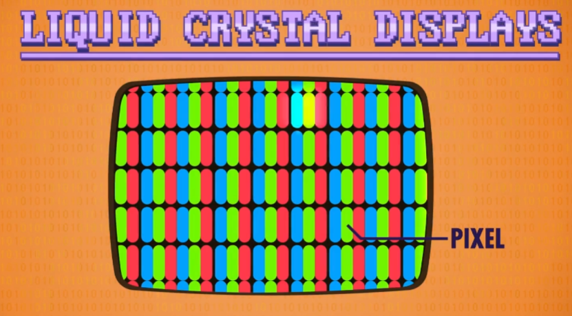

> LCD 也是用 光栅扫描 ：每次更新多次 像素里红绿蓝的颜色
### 4.字符生成器 Character Generator
>计算机需要额外硬件，来从内存读取字符，转换成光栅图形 \N 这样才能显示到屏幕上个硬件叫 "字符生成器"，基本算是第一代显卡。它内部有一小块只读存储器（Read-Only Memory），简称 ROM，存着每个字符的图形，叫"点阵图案"
### 5. 屏幕缓冲区 Screen Buffer
为了显示，"字符生成器" 会访问内存中一块特殊区域 这块区域专为图形保留，叫 屏幕缓冲区，程序想显示文字时，修改这块区域里的值就行。
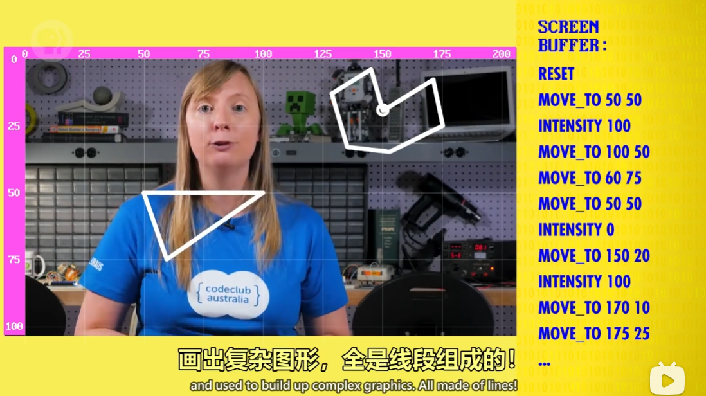
### 6. 矢量命令画图
概念：所有东西都由线组成,矢量指令可以画出线，把许多矢量指令存在硬盘上，就能画出很多由线组成的复杂图形。

计算机辅助设计（Computer-Aided Design，CAD）：第一个完整的图形程序！
### 7. Sketchpad，光笔（Light pen)
**Sketchpad** ，一个交互式图形界面，用途是计算机辅助设计 (CAD)。

**光笔**，就是一个有线连着电脑的触控笔，有了它们，用户可以画出很完美的线条并进行缩放等操作。

### 8. 函数画线，矩形

**位图显示**，内存中的位对应着屏幕上显示的像素。想画更复杂的图形，如画矩形，我们需要四个值，起点的x y坐标，高度和宽度。

计算机把像素数据存在内存种的一个特殊区域叫"帧缓冲区"(Frame Buffer)
早期时，这些数据存在内存里，后来存在高速视频内存里，简称VRAM（Video RAM）
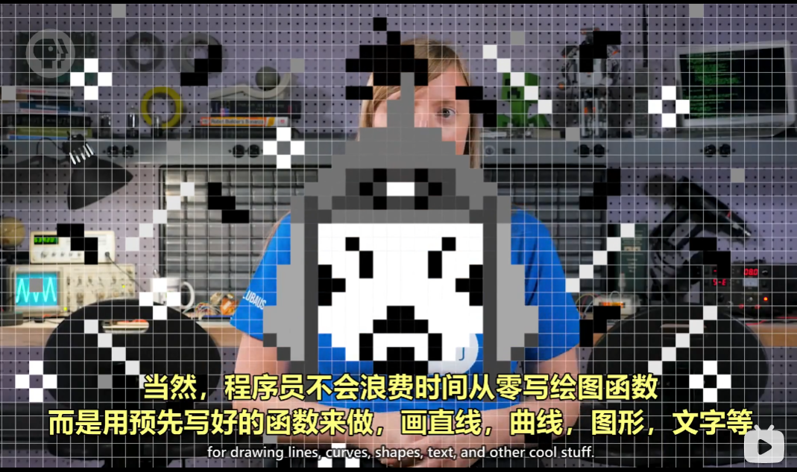
## 第 二十五 课 个人计算机革命
本集概括：
继续讲计算机发展史
00:18 1970年代初成本下降，个人计算机变得可行           
- RAM：Random-Access Memory 随机访问存储器          
- ROM：Read-Only Memory 只读存储器

01:51 Altair 8800 第一台取得商业成功的个人计算机

02:32 比尔·盖茨 和 保罗·艾伦写 BASIC 解释器，解释器和编译器类似，区别是解释器运行时转换，而编译器提前转换

03:45 乔布斯提议卖组装好的计算机，Apple-I 诞生

04:40 1977年出现3款开箱即用计算机："Apple-II"，"TRS-80 Model I"，"Commodore PET 2001"

06:26 IBM 意识到个人计算机市场IBM PC 发布，采用开放架构，兼容的机器都叫 IBM Compatible (IBM 兼容)生态系统产生雪球效应：因为用户多，软硬件开发人员更愿意花精力在这个平台因为软硬件多，用户也更乐意买 "IBM 兼容" 的计算机。

08:44 苹果选封闭架构，一切都自己来，只有苹果在非 "IBM 兼容" 下保持了足够市场份额。

## 第 二十六 课 图形用户界面 (GUI)
——GUI是“事件驱动编程”，代码可以在任意时间执行以响应事件，而不像传统代码一样自上而下。

01:10 图形界面先驱：道格拉斯·恩格尔巴特（Douglas Engelbart）——设想计算机成为未来知识性员工应对问题的工具，并发明了鼠标。

03:20 1970年成立 帕洛阿尔托研究中心（Palo Alto Research Center）
03:29 1973年完成 Xerox Alto(施乐奥托) 计算机——创立了桌面，窗口等计算机概念

05:25 在之前的例子中，代码是从上到下执行的，但是GUI是"事件驱动编程 "（Event-Driven Programming):代码考研在任意时间执行，以响应事件。
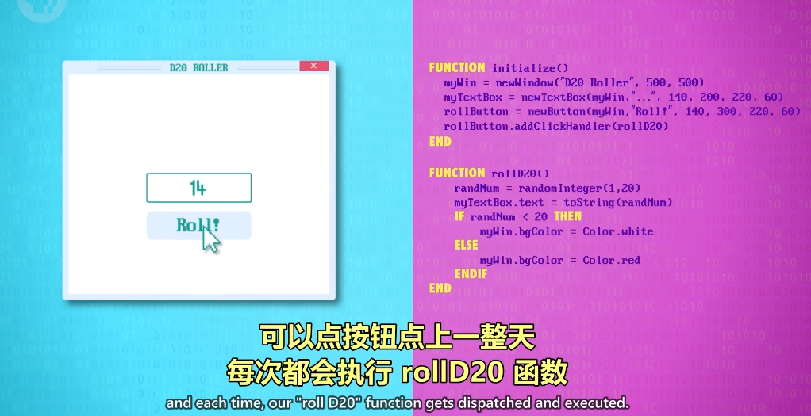

06:38 1981年的 **Xerox Star system(施乐之星系统)**         
创建了文档概念

07:45 所见即所得 WYSIWYG——施乐打印出来的东西和计算机上一样，并发明了**剪切 复制 黏贴**等计算机概念

08:18 史蒂夫·乔布斯去施乐参观09:15 1983年推出 Apple Lisa

09:31 1984年推出 Macintosh 成功
10:12 1985年推出 Windows 1.0，之后出到 3.1
10:43 1995年推出 Windows 95 提供新的图形界面，并有Mac没有的新功能，如多任务和受保护内存
11:08 1995年微软做失败的 Microsoft Bob——类似于房子的设计
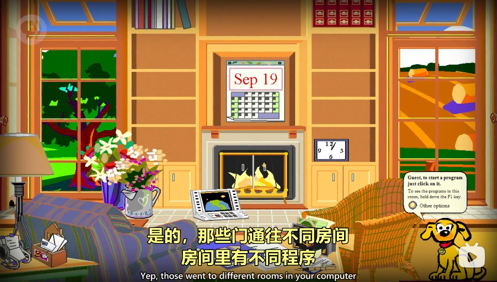

## 第 二十七 课：3D 图形

### 1. 线框渲染 Wireframe Rendering
如图所示：通过线描述一个立体。
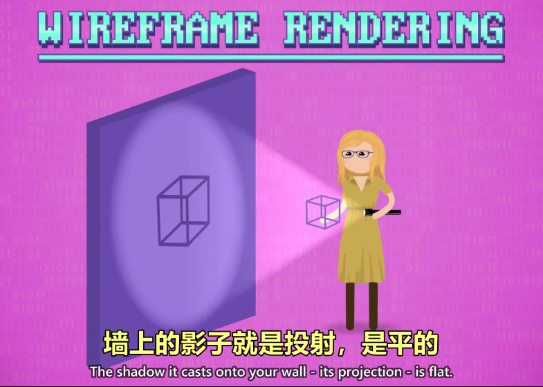
### 1.1 正交投射 Orthographic Projection
这种图很像在平时做数学题所体现出的图形效果。
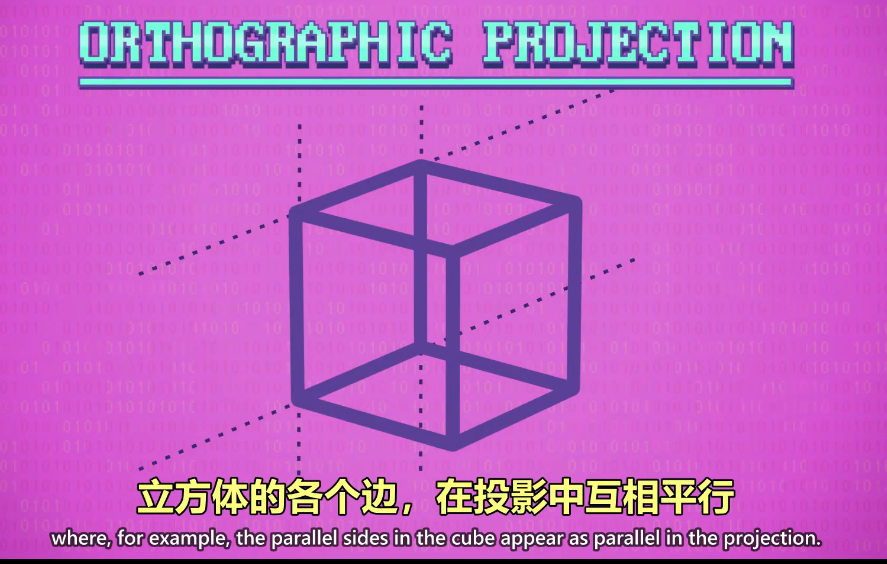
### 1.2 透视投射 Perspective Projection
而这种，类似于画画过程中的透视效果，便是透视投射。
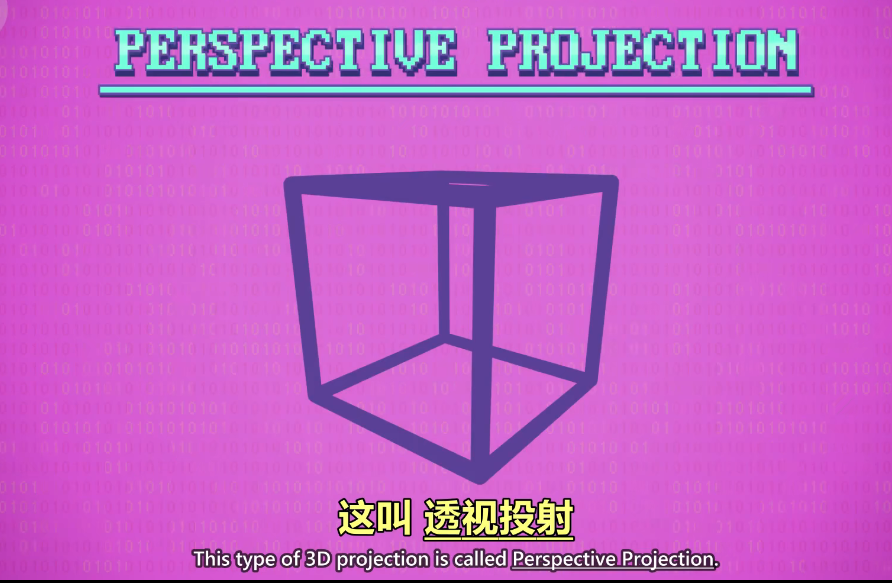
### 2. 网格 Mesh

>三角形更常用因为能定义唯一的平面

**网格：一堆多边形的集合**
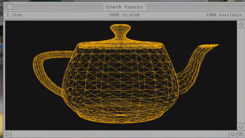
网格越密，表面越光滑，细节越多，当然计算量也会越多。

### 3. 扫描线渲染 Scanline Rendering
>线框渲染 虽然很酷，但3D图形需要填充。

**扫描线渲染** 是 **填充图形** 的 经典算法
过程如下：
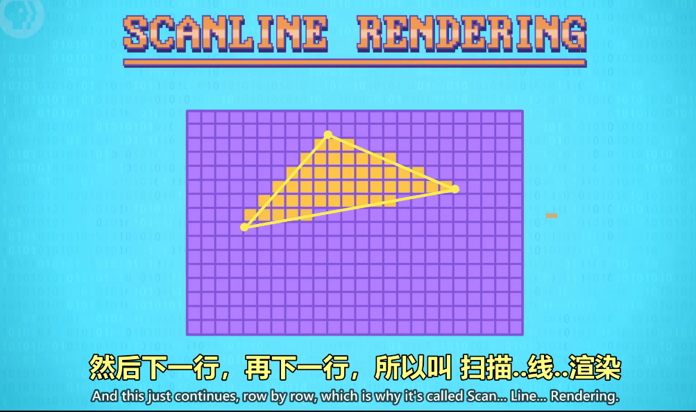
首先找到最大和最小的Y值，只在这两点间工作。
然后进行扫描，每一行进行扫描。先从最大Y值的那一行开始，存在于线内的像素就填上（包括线接触的像素点）。
然后到下一行，再到下一行，直到最小Y值的位置，便结束渲染。
（而这种填充的就叫做渲染）
填充的速度叫 Fillrate(填充速率)
这种算法做出来的效果，就会出现一个很熟悉的名词：锯齿
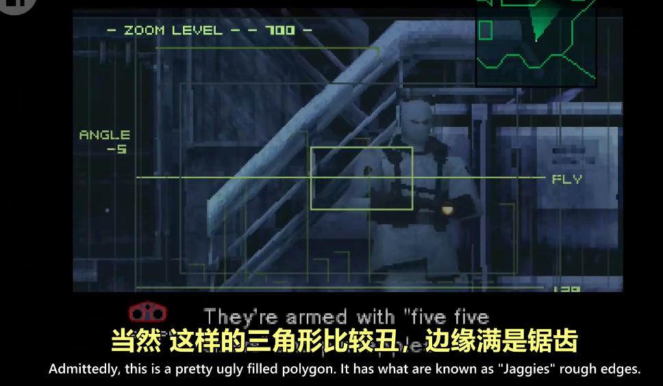
一种减轻锯齿的方法叫： 抗锯齿（Antialiasing）
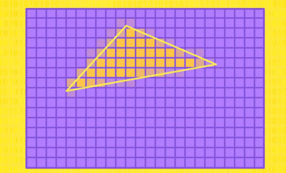
边缘羽化的效果，看着就更加舒服（平时用的Windows中的文字就有这样的效果）
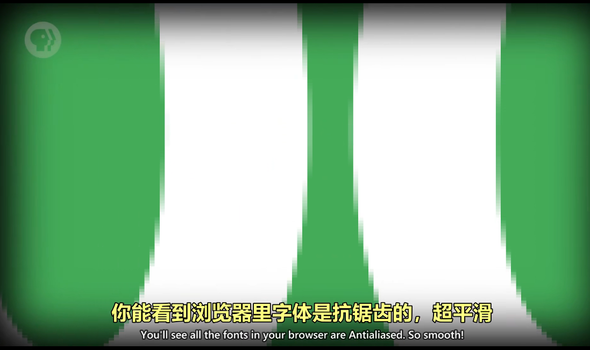
### 4. 遮挡 Occlusion
在3D场景中，多边形到处都是，但只有一部分能看见，因为其他的被挡住了，这叫做遮挡。（就是前后的遮挡）

### 4.1 画家算法 Painter's Algorithm
从远到近排列，然后从远到近渲染，这叫做画家算法（因为画师是从远画进）
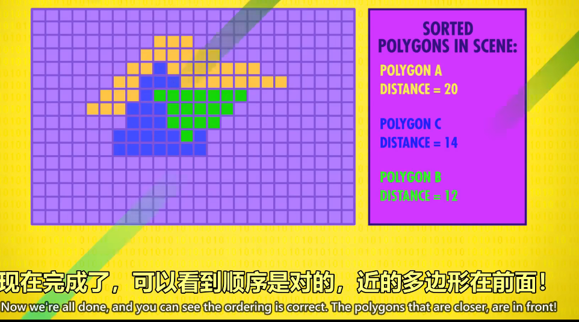
这种覆盖其实很耗资源，所以要找一个更好的方法：
### 4.2 深度缓冲 Z Buffering
另一种画遮挡的方法，简而言之，Z-buffering 算法会记录场景中每个像素和摄像机的距离，在内存里存一个数字矩阵，首先，每个像素的距离被初始化为"无限大"，然后 Z-buffering 从列表里第一个多边形开始处理，也就是A，它和扫描线算法逻辑相同，但不是给像素填充颜色，而是把多边形的距离和 Z-Buffer 里的距离进行对比，它总是记录更低的值，因为没对多边形排序，所以后处理的多边形并不总会覆盖前面的。
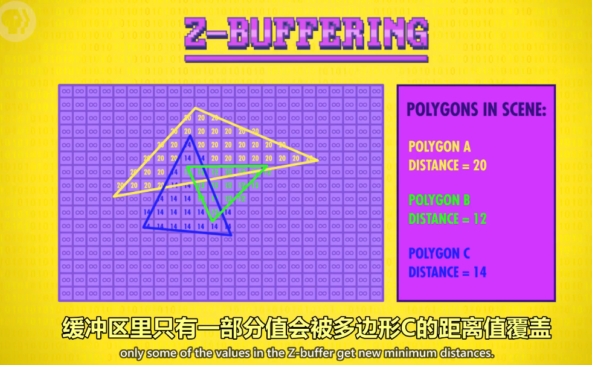
 #### 4.3 Z-Fighting 错误
 那如果发生以下情况：
 - 图形A 和 图形 B 的 位置 是一样的
 - 多边形会在内存中移来移去，访问顺序会不断变化
 - 计算浮点数会有舍入误差
在以上各种情况，哪一个画在上面，往往是不可预测的。这种就是 Z-fighting 效果

### 8. 背景剔除 Back-Fave Culling
这种是3D游戏的优化，因为三角形多边体有正反双面，为了优化（减少渲染还有消耗），就把背面去掉，只保留正面。（这种是非常常见的，就形成了我们俗称的"贴图")

### 9. 平面着色
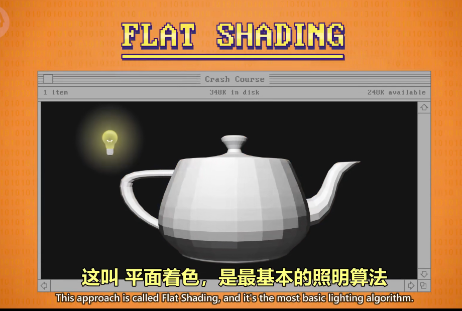
### 9.1 高洛德着色 Gouraud Shading 
### 9.2 冯氏着色 Phong Shading
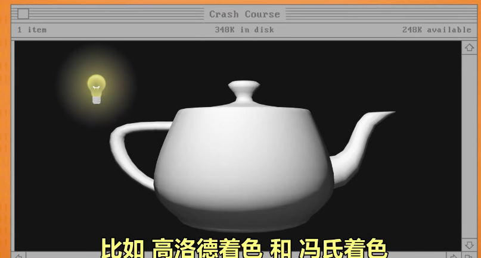

### 11. 纹理映射 Texture Mapping
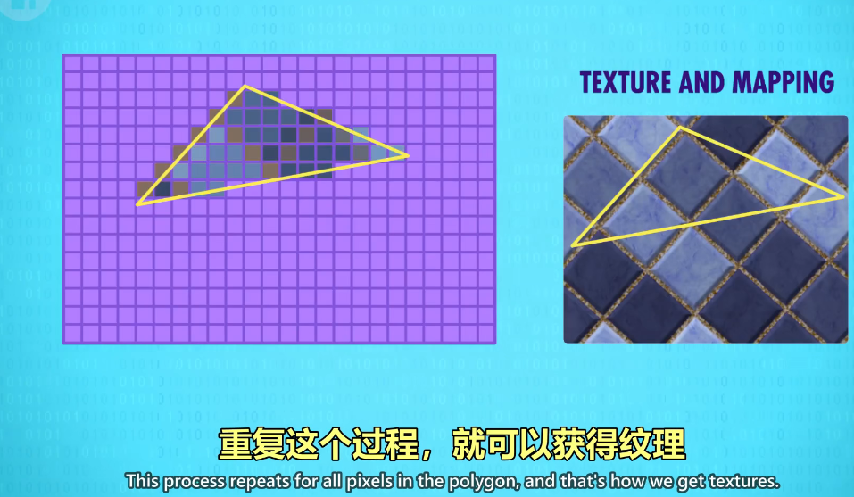
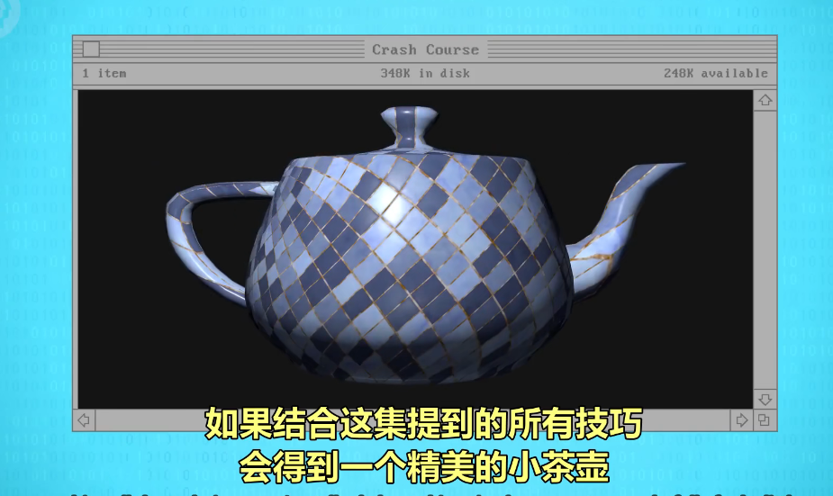
### 12. 图形处理单元 GPU , Graphics Processing Unit
GPU，就是显卡，英伟达就是目前最著名的GPU 厂商。
著名的GPU 有很多。
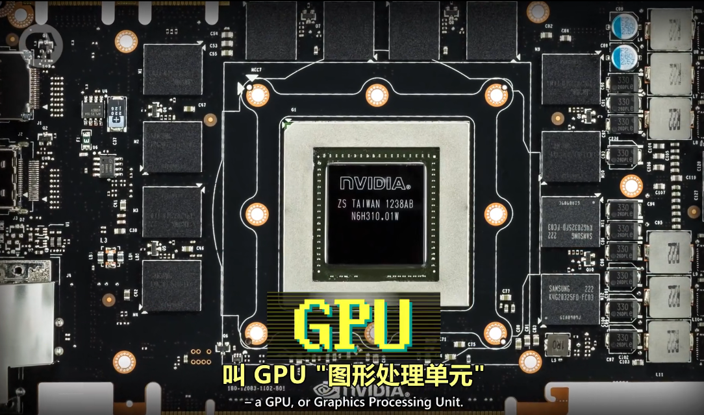
