CCCS 计算机科学速成课 第 21到 30 课分别会讲：
21.压缩
22.命令行界面
23.屏幕& 2D 图形显示
24.冷战和消费注意
25.个人计算机革命
26.图形用户界面
27.3D 图形
28.计算机网络
29.互联网
30.万维网
## 第 二十一 课 压缩 Compression
>压缩的好处就是能存更多文件，传输也会更快

压缩：**用更少的bit 来表示数据**

### 1.游程编码 Run-Length Encoding
这个代码效果是：减少重复信息。
适合经常出现相同值的文件中。
就如同以下代码：这有一大串的黄色像素（连续7个像素的）
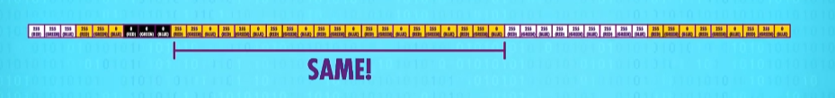
然后我们对这个黄色像素前面加个 run-length 表示他后面像素重复的次数
当然，既然有一个run-length在metadata里，那么每个像素都需要在前面标上长度。
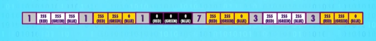

### 2.无损压缩 Lossless Compression
>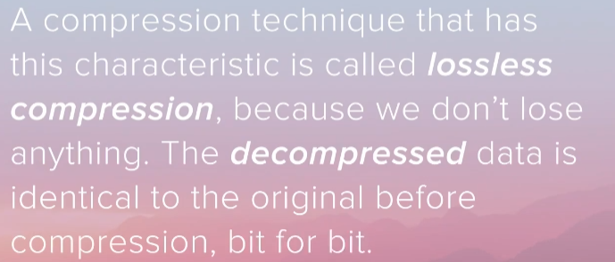
>这种压缩方式便是"无损压缩"(Lossless Compression)，因为我们没有损失任何东西。解压缩后，数据和压缩前完全一样。

### 3.霍夫曼树 Huffman Tree
是另一种无损压缩，它用更紧凑的方式表示数据块。
>有点像 "Don't Forget to be Awesome" 简写成 DFTBA.

为此，我们需要一个字典，存储"代码"和"数据"间的对应关系。
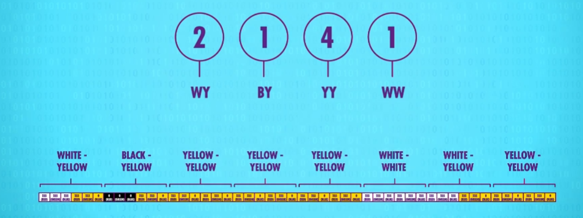
生成 紧凑代码(Compact Codes)
黄黄 出现的最多，我们希望用最紧凑的方式来表示它，
而 黑黄 和 白白，可以用更长的东西来表示，因为出现频率低。
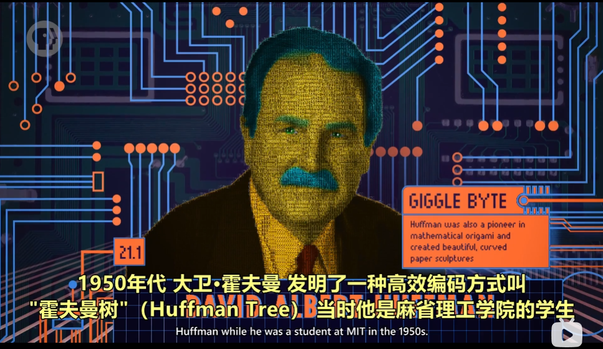

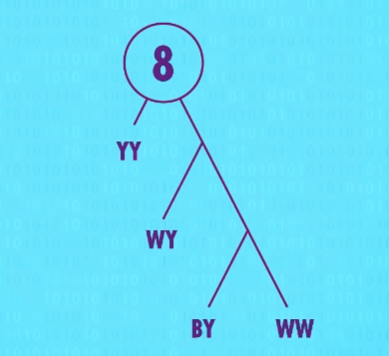
最下面的频率最低，而最上面的频率最高。

>这部分视频太棒了，一定要在视频里看。
### 4.字典编码 Dictionary Coders
然后通过这个数，变成字典：
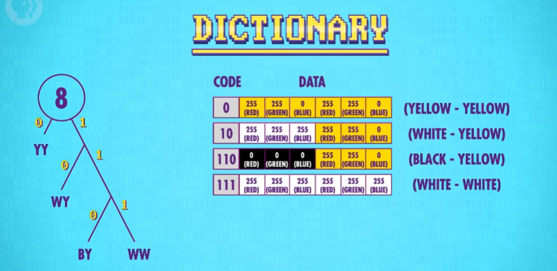

And you did it，你就可以压缩了！
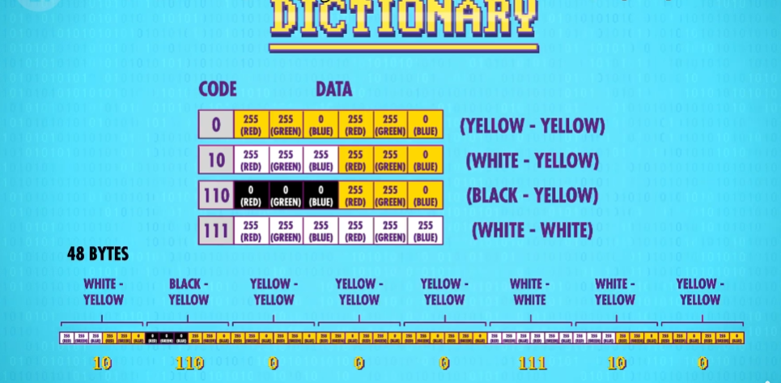
**这样就可以从 48bytes 变成 14 bits ！**

等等等等等等等，别开香槟，因为...你漏了字典！
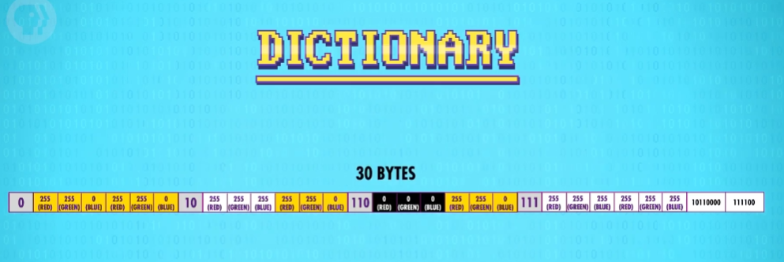

加上了字典，这个东西就完整了！
现在图像是 30 bytes ,比原本的 48 bytes 也会少很多。

> 以上的两种方法分别是：
	- 消除冗余 Removing Redundancies 
	- 更紧凑的表示方法 Using More Compact Representation
	  通常都会一起使用。
	  
几乎所有无损压缩格式都用了上述两种形式，比如：GIF,PNG,PDF,ZIP
### 5. 有损压缩 Lossy Compression Techniques
> 有些文件是可以有损的，这些损失的东西人类也不怎么能察觉出来，比如说：音乐。
> 音乐中超声波的数据可以丢掉，因为人类听不到超声波。
> 另一方面，人类对人声很敏感，所以应该尽可能保持原样。

WAV / FLAC 属于没压缩的音频格式。
MP3 就是压缩音频文件，能小10倍甚至更多。
### 6.感知编码 Perceptual Coding
这种删除人类无法感知的数据的方法，就叫做"感知编码"
它依赖于人类的感知模型，模型来自"心理物理学"领域

#### 6.1 有损压缩图像格式 JPEG
人的视觉系统也不是完美的，我们善于看到尖锐对比，比如物体的边缘，但我们看不出颜色的细微变化。

JPEG 利用了这一点，把图像分解成 8x8 像素块，然后删除大量高频率空间数据。
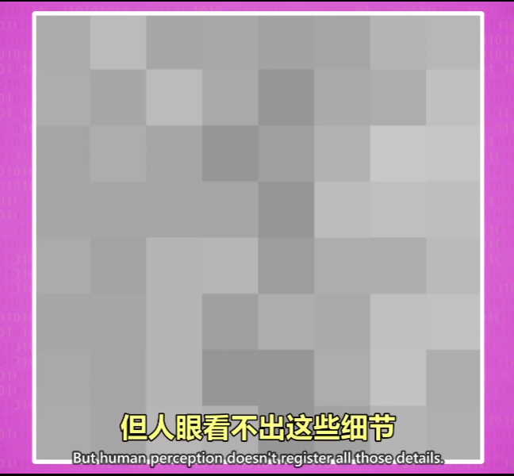
然后变成了这样的一个效果：
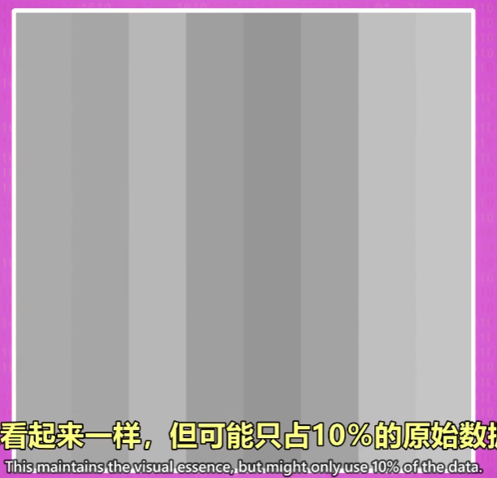

最后得出来的效果就是这样的：
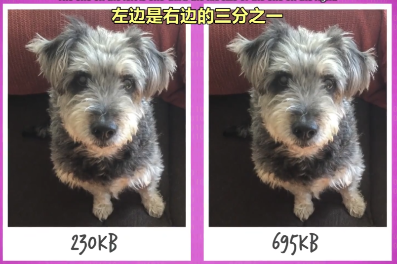

### 7. 时间冗余 Temproral Redundancy
> 视频只是一长串连续图片，所以图片的很多方面也适用于视频 
> 但视频可以做一些小技巧，因为帧和帧之间很多像素一样。

通过这种帧与帧之间的处理，就是"时间冗余"
视频里不用每一帧都存这些像素，可以只存变了的部分。
这比存所有像素更有效率，利用了帧和帧之间的相似性。

更高级的视频压缩格式，会更进一步：
- 找出帧和帧之间相似的补丁，然后用简单效果实现，比如
  - 移动
  - 旋转
  - 变亮
  - 变暗
### 8. MPEG-4 视频编码
>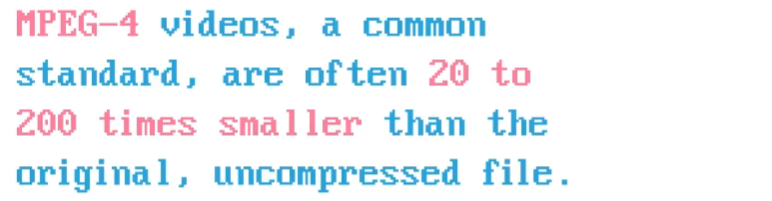
>MPEG-4 是常见标准，可以比原文件小20~200倍。

## 第 二十二 课：命令行界面 Keyboards & Command Line Interfaces
>本集重点：计算机早期同时输入程序和数据(用纸卡/纸带)
>运行开始直到结束，中间没有人类进行操作。
>原因是计算机很贵，不能等人类慢慢输入，执行完结果打印到纸上

