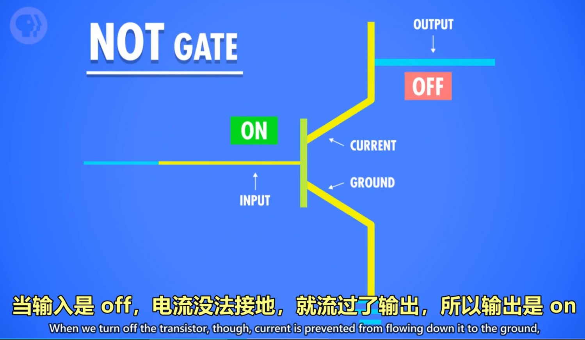

[toc!]
前十章笔记参考于:https://shimo.im/docs/vkCKkj3YxGtygrVg/read
课程链接：https://www.bilibili.com/video/av21376839?p=3

## 第一课：计算机早期历史
### 0、课程目标：
从高层次总览一系列计算机话题，快速入门计算机科学。

### 1、计算机技术的影响——进入信息时代
出现自动化农业设备与医疗设备
全球通信和全球教育机会变得普遍
出现意想不到的虚拟现实/无人驾驶/人工智能等新领域

### 2、计算机的实质：
极其简单的组件，通过一层层的抽象，来做出复杂的操作。计算机中的很多东西，底层其实都很简单，让人难以理解的，是一层层精妙的抽象。像一个越来越小的俄罗斯套娃。

### 3、关于计算的历史：

 - 公元前2500年，算盘出现，为十进制，功能类似一个计数器。
 - 公元前2500年-公元1500年：星盘、计算尺等依靠机械运动的计算设备出现
 - 公元1613年：computer的概念出现，当时指的是专门做计算的职业，
 - 1694年：步进计算器出现，是世界上第一台能自动完成加减乘除的计算器。
 - 1694-1900年：计算表兴起，类似于字典，可用于查找各种庞大的计算值。
 - 1823年：差分机的设想出现，可以做函数计算，但计划最后失败。
 - 19世纪中期：分析机的设想出现，设想存在可计算一切的通用计算机。
 - 1890年：打孔卡片制表机。原理：在纸上打孔→孔穿过针→针泡入汞→电路连通→齿轮使计数+1。

## 第二课：电子计算机的发展史

### 1、电子计算机元器件变化：
继电器→真空管→晶体管

### 2、计算机的出现背景：

0世纪人口暴增，科学与工程进步迅速，航天计划成形。以上导致数据的复杂度急剧上升、计算量暴增，对于计算的自动化、高速有迫切的需求。

### 3、电子计算机的发展：

1945年 哈佛马克1：使用继电器，用电磁效应，控制机械开关，缺点为有磨损和延迟。*最早还因为有虫子飞进去导致故障，引申出bug=故障的意思。

1943年 巨人1号：使用真空管（三极管），制造出世界上第一个可编程的计算机。

1946年 ENIAC：第一个电子数值积分计算机，为第一台通用计算机。

1947年 晶体管出现，使用的是固态的半导体材料，相对真空管更可靠。

1950s 空军ANFSQ-7： 真空管到达计算极限。

1957年 IBM 608： 第一个消费者可购买的晶体管计算机出现。

第三课：布尔逻辑与逻辑门

#### 1、计算机为什么使用二进制：
计算机的元器件晶体管只有2种状态，通电（1）&断电（0），用二进制可直接根据元器件的状态来设计计算机。

而且，数学中的“布尔代数”分支，可以用True和False（可用1代表True，0代表False）进行逻辑运算，代替实数进行计算。

计算的状态越多，信号越容易混淆，影响计算。对于当时每秒运算百万次以上的晶体管，信号混淆是特别让人头疼的的。

#### 2、布尔代数&布尔代数在计算机中的实现变量：

没有常数，仅True和False这两个变量。
三个基本操作：NOT/AND/OR。

##### 1）NOT操作：

 1. 命名：称为NOT门/非门。
 2. 作用：将输入布尔值反转。输入的True或False，输出为False或True。
 3. 晶体管的实现方式：
   半导体通电True，则线路接地，无输出电流，为False。
   半导体不通电False，则输出电流从右边输出，为True。

##### 2）AND操作

 1. 命名：AND门/与门
 2. 作用：由2个输入控制输出，仅当2个输入input1和input2都为True时，输出才为True，2个输入的其余情况，输出均为False。*可以理解为，2句话（输入）完全没有假的，整件事（输出）才是真的。
 3. 用晶体管实现的方式：串联两个晶体管，仅当2个晶体管都通电，输出才有电流（True）

##### 3）OR操作

 1. 命名：OR门/或门
 2. 作用：由2个输入控制输出，只要其中一个输入为True，则输出True。
 3. 用晶体管实现的方式：使用2个晶体管，将它们并联到电路中，只要有一个晶体管通电，则输出有电流（True）。

#### 3、特殊的逻辑运算——异或

 1. 命名：XOR门/异或门
 2. 作用：2个输入控制一个输出。当2个输入均为True时，输出False，其余情况与OR门相同。
 3. 图示：先用一个OR门，将其与AND门并联，AND门与NOT门串联，最后让NOT与AND门并联，获得输出。