[toc!]
前十章笔记参考于:https://shimo.im/docs/vkCKkj3YxGtygrVg/read
课程链接：https://www.bilibili.com/video/av21376839?p=3

## 第一课：计算机早期历史
### 0、课程目标：
从高层次总览一系列计算机话题，快速入门计算机科学。

### 1、计算机技术的影响——进入信息时代

 - 出现自动化农业设备与医疗设备
 - 全球通信和全球教育机会变得普遍
 - 出现意想不到的虚拟现实/无人驾驶/人工智能等新领域

### 2、计算机的实质：
极其简单的组件，通过一层层的抽象，来做出复杂的操作。计算机中的很多东西，底层其实都很简单，让人难以理解的，是一层层精妙的抽象。像一个越来越小的**俄罗斯套娃**。

### 3、关于计算的历史：

 - 公元前2500年，算盘出现，为十进制，功能类似一个计数器。
 - 公元前2500年-公元1500年：星盘、计算尺等依靠机械运动的计算设备出现
 - 公元1613年：computer的概念出现，当时指的是专门做计算的职业，
 - 1694年：步进计算器出现，是世界上第一台能自动完成加减乘除的计算器。
 - 1694-1900年：计算表兴起，类似于字典，可用于查找各种庞大的计算值。
 - 1823年：差分机的设想出现，可以做函数计算，但计划最后失败。
 - 19世纪中期：分析机的设想出现，设想存在可计算一切的通用计算机。
 - 1890年：打孔卡片制表机。原理：在纸上打孔→孔穿过针→针泡入汞→电路连通→齿轮使计数+1。

## 第二课：电子计算机的发展史

### 1、电子计算机元器件变化：
继电器→真空管→晶体管

### 2、计算机的出现背景：

0世纪人口暴增，科学与工程进步迅速，航天计划成形。以上导致数据的复杂度急剧上升、计算量暴增，对于计算的自动化、高速有迫切的需求。

### 3、电子计算机的发展：

 - 1945年 哈佛马克1：使用继电器，用电磁效应，控制机械开关，缺点为有磨损和延迟。*最早还因为有虫子飞进去导致故障，引申出bug=故障的意思。
 - 1943年 巨人1号：使用真空管（三极管），制造出世界上第一个可编程的计算机。
 - 1946年 ENIAC：第一个电子数值积分计算机，为第一台通用计算机。
 - 1947年 晶体管出现，使用的是固态的半导体材料，相对真空管更可靠。
 - 1950s 空军ANFSQ-7： 真空管到达计算极限。
 - 1957年 IBM 608： 第一个消费者可购买的晶体管计算机出现。

## 第三课：布尔逻辑与逻辑门

### 1、计算机为什么使用二进制：
计算机的元器件晶体管只有2种状态，通电（1）&断电（0），用二进制可直接根据元器件的状态来设计计算机。

而且，数学中的“布尔代数”分支，可以用True和False（可用1代表True，0代表False）进行逻辑运算，代替实数进行计算。

计算的状态越多，信号越容易混淆，影响计算。对于当时每秒运算百万次以上的晶体管，信号混淆是特别让人头疼的的。

### 2、布尔代数&布尔代数在计算机中的实现变量：

没有常数，仅True和False这两个变量。
三个基本操作：NOT/AND/OR。

#### 1）NOT操作：

 1. 命名：称为NOT门/非门。
 2. 作用：将输入布尔值反转。输入的True或False，输出为False或True。
 3. 晶体管的实现方式：
   半导体通电True，则线路接地，无输出电流，为False。
   半导体不通电False，则输出电流从右边输出，为True。

#### 2）AND操作

 1. 命名：AND门/与门
 2. 作用：由2个输入控制输出，仅当2个输入input1和input2都为True时，输出才为True，2个输入的其余情况，输出均为False。*可以理解为，2句话（输入）完全没有假的，整件事（输出）才是真的。
 3. 用晶体管实现的方式：串联两个晶体管，仅当2个晶体管都通电，输出才有电流（True）
   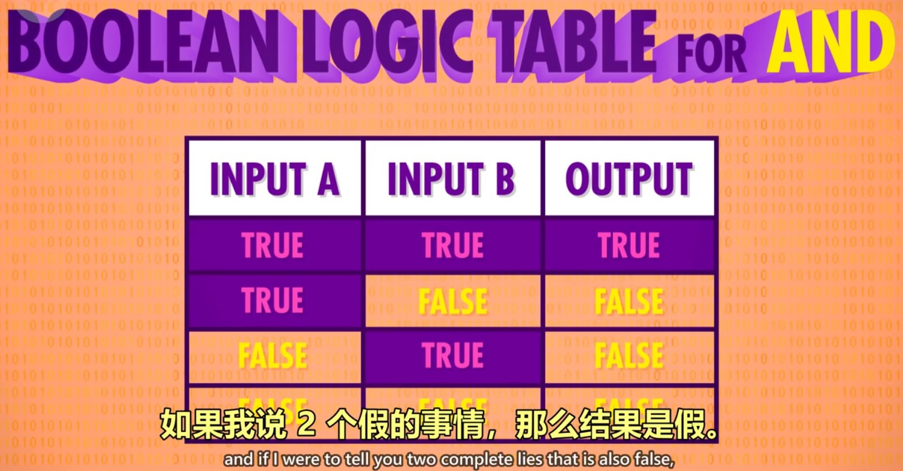
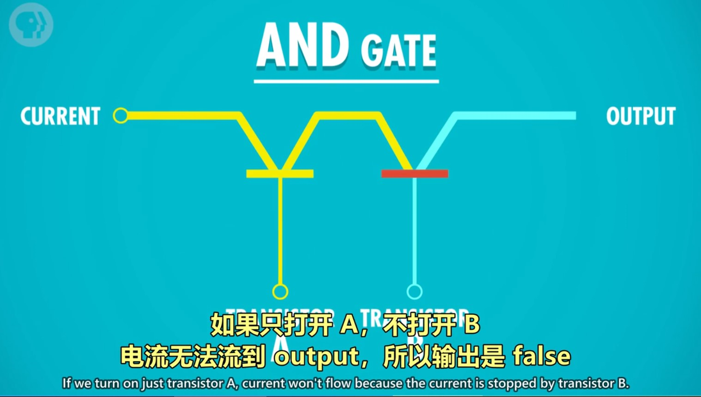
#### 3）OR操作

 1. 命名：OR门/或门
 2. 作用：由2个输入控制输出，只要其中一个输入为True，则输出True。
 3. 用晶体管实现的方式：使用2个晶体管，将它们并联到电路中，只要有一个晶体管通电，则输出有电流（True）。
   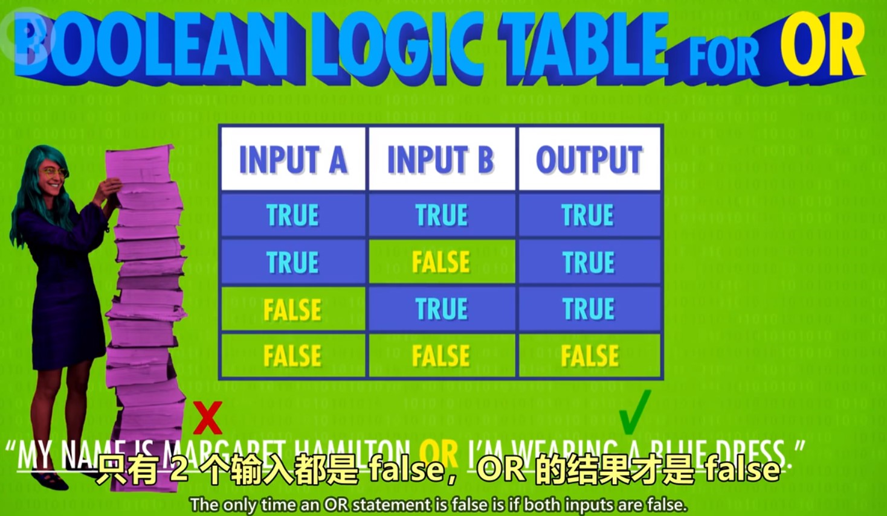

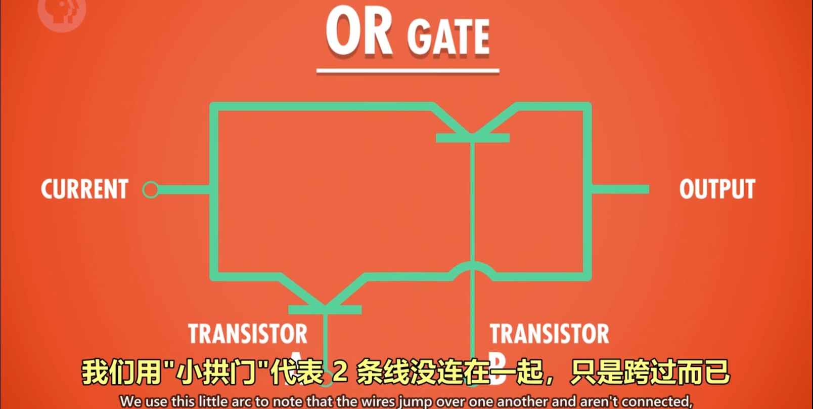
### 3、特殊的逻辑运算——异或

 - 命名：XOR门/异或门
 - 作用：2个输入控制一个输出。当2个输入均为True时，输出False，其余情况与OR门相同。
 - 图示：先用一个OR门，将其与AND门并联，AND门与NOT门串联，最后让NOT与AND门并联，获得输出。 
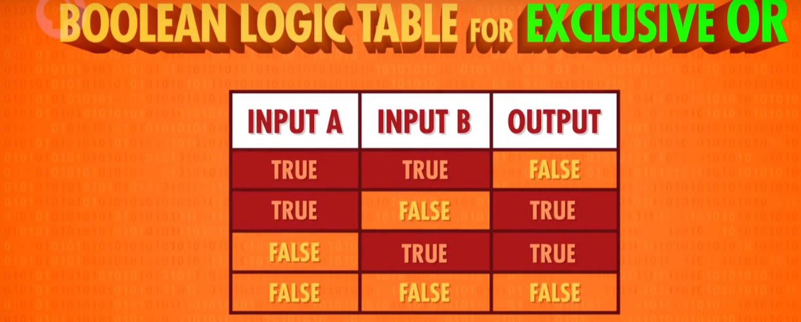

### 4、逻辑门的符号表示
 1.作用：将逻辑门简化，将逻辑门用于构建更大的组件，而不至于太复杂。
 2.图示：
 - 非门：用三角形+圆圈表示
 - 与门：用D型图案表示
 - 或门：用类似D向右弯曲的图案表示
 - 异或门：用或门+一个圆弧表示
  
  ### 5、抽象的好处
  使得分工明确，不同职业的工程师各司其职,而不用担心其他细节。
  ## 第四课：二进制
  ### 1、二进制的原理，存储单元MB/GB/TB解释
  #### 计算机中的二进制表示：
  单个数字1或0，1位二进制数字命名为位(bit),也称1比特。
  
  #### 字节（byte）的概念：
  1byte=8bit，即1byte代表8位数字。最早期的电脑为八位的，即以八位为单位处理数据。为了方便，将八位数字命名为1字节（1byte）.
  
  #### 十进制与二进制的区别：
  
 - 十进制有10个数字，0-9，逢10进1（不存在10这个数字），则每向左进一位，数字大10倍。
 - 二进制有2个数字，0-1，逢2进1,（不存在2这个数字），则每向左进一位，数字大2倍。

  
  #### 如何进行二进制与十进制联系起来：
  将十进制与二进制的位数提取出来，编上单位：
  eg.二进制的1011=1*2^0 + 1*2^1 + 0*2^2 + 1*2^3= 11（从右往左数）
  eg.十进制的1045= 1*10^3 + 0*10^2 + 4*10^1 + 5*10^03十进制与二进制的图示：十进制的263
   #### 十进制与二进制的图示：
   十进制的263
   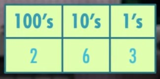
   二进制的10110111
   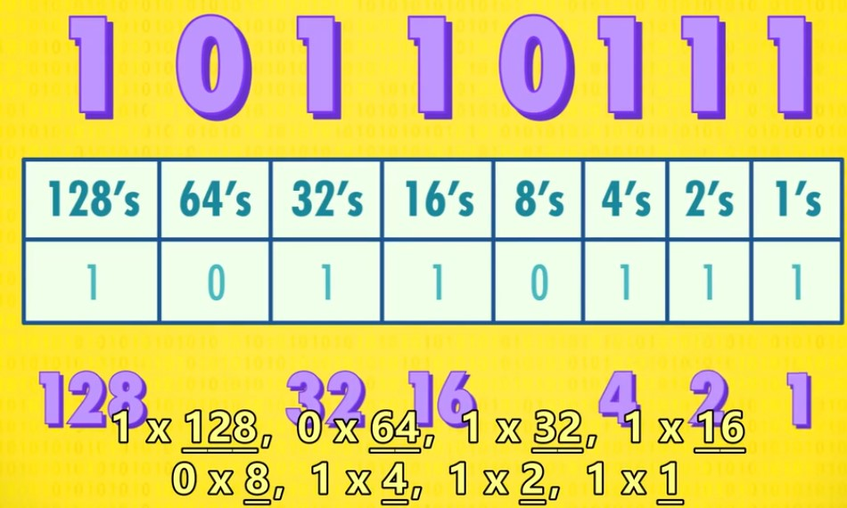
   #### 二进制的运算：
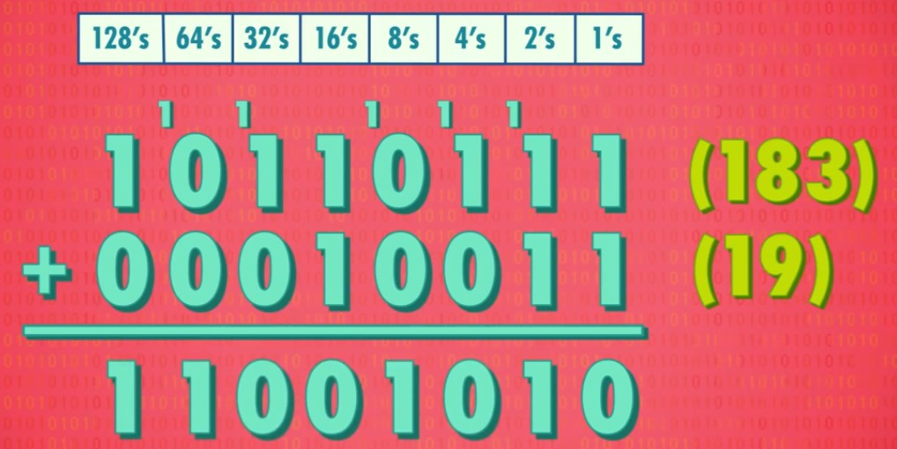   
#### byte在电脑中的单位换算：
1kb=2^10bit = 1024byte =1000b
1TB=1000GB
1GB=十亿字节=1000MB=10^6KB

#### 32位与64位电脑的区别
32位的最大数为43亿左右
64位的最大数为9.2*10^18

### 2、正数、负数、正数、浮点数的表示
1）计算机中表示数字的方法
1整数：
表示方法:
 - 第1位：表示正负 1是负，0是正（补码）
 - 其余31位/63位： 表示实数

2浮点数（Floating Point Numbers）：
定义：小数点可在数字间浮动的数（非整数）
表示方法：IEEE 754标准下
用类似科学计数法的方式，存储十进制数值

 - 浮点数=有效位数*指数
 - 32位数字中：第1位表示正负，第2-9位存指数。剩下23位存有效位数

eg.625.9=0.6259（有效位数）*10^3（指数）
### 3、美国信息交换标准代码-ASCⅡ，用来表示字符

 1. 全称：美国信息交换标准代码
 2. 作用：用数字给英文字母及符号编号
 3. 内容：7位代码，可存放128个不同的值。
 4. 图示： 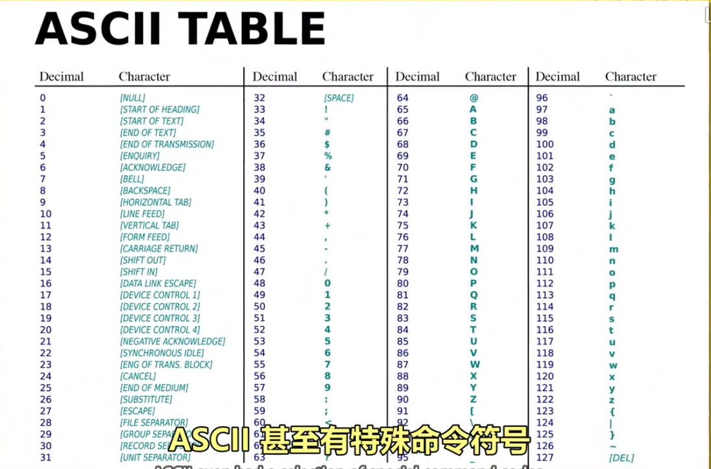
 ### 4，UNICODE，统一所有字符编码的标准
 1.  诞生背景：1992诞生，随着计算机在亚洲兴起，需要解决ASCⅡ不够表达所有语言的问题。为提高代码的互用性，而诞生的编码标准。
 2.  内容：UNICODE为17组的16位数字，有超过100万个位置，可满足所有语言的字符需求。

 ## 第五课：算术逻辑单元ALU
 ### 1、什么是算术逻辑单元

 1.  命名：简称ALU，Arithmetic&Logic Unit
 2.  组成：ALU有2个单元，1个算术单元和1个逻辑单元（Arithmetic Unit和Logic Unit）
 3.  作用：计算机中负责运算的组件，处理数字/逻辑运算的最基本单元。

### 2、算术单元
1) 基本组件：
- 由半加器、全加器组成。
  - 半加器、全加器由AND、OR、NOT、XOR门组成。

2) 加法运算
- 组件：AND、OR、NOT、XOR门
- 元素：输入A，输入B，输出（均为1个bit，即0或1）

3) 半加器：
- 作用：用于计算个位的数字加减。
  - 输入：A，B
  - 输出：总和，进位
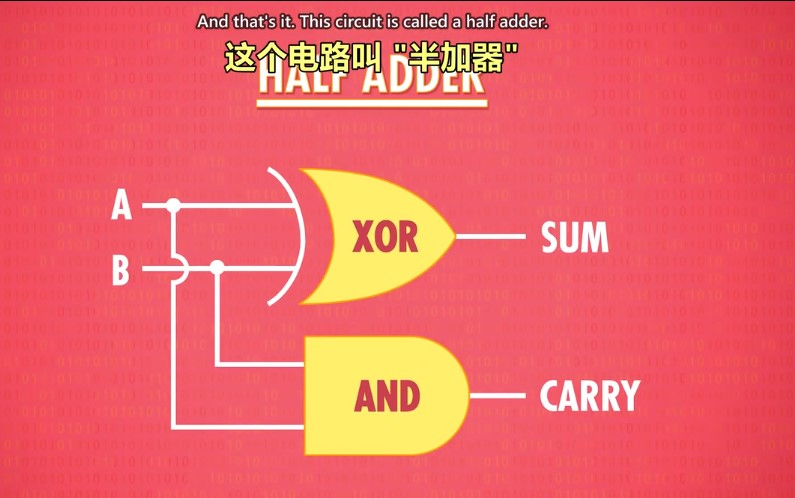
4) 全加器:
作用：用于计算超过1位的加法，由于涉及进位，因此有3个输入（C充当进位）。
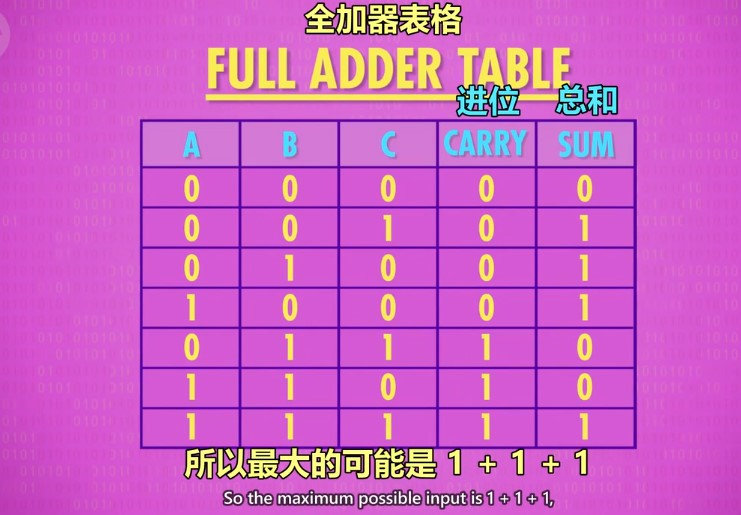
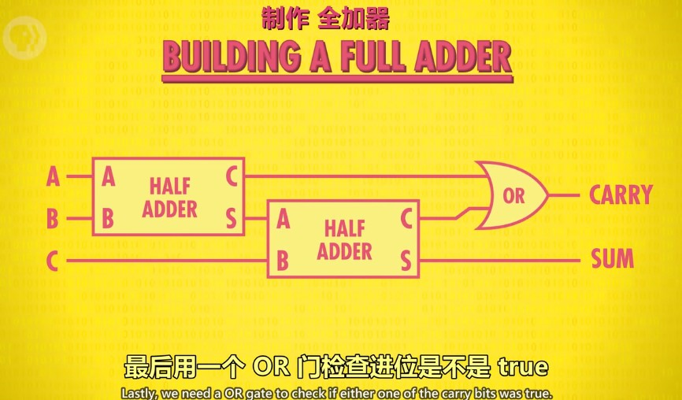

#### 2.1如何用半加器与全加器做8位数的加法
**说明：以8位行波加法器为例**

 1. 用半加器处理第1位数（个位）的加法，得到的和为结果的第1位。
 2. 将输出的进位，输入到第2位用的全加器的输入C中。
 3. 将第2位的2个数用全加器计算，得到的和为结果的第2位（sum）。
 4. 将第2位计算的进位连接到百位的全加器输入C中。
 5. 在第3-8位上，循环第3-4步的操作。

*现在电脑使用的加法器叫“**超前进位加法器”***
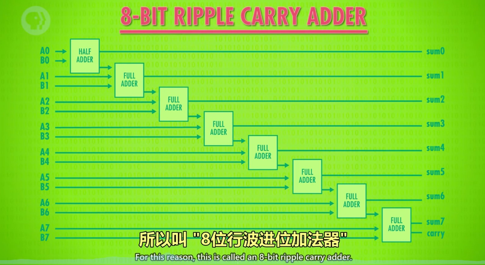
#### 2.2算术单元支持的其他运算
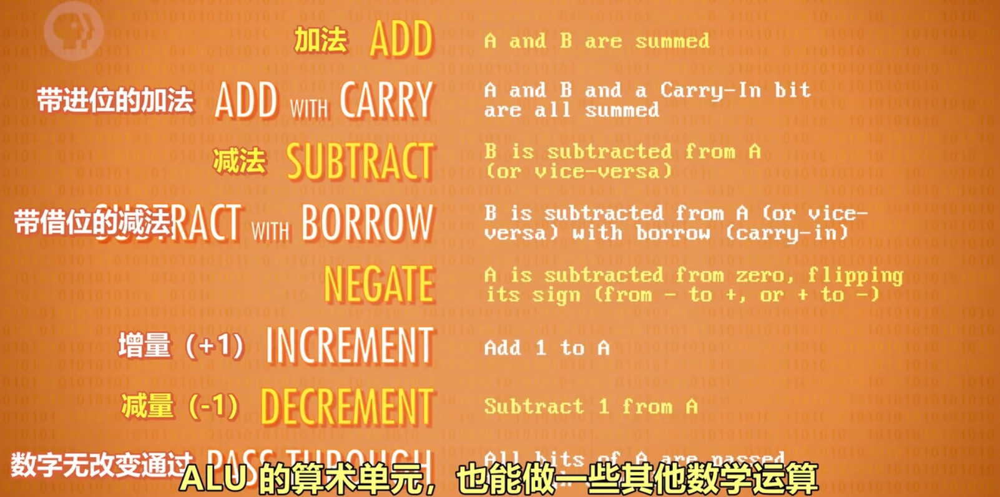
### 3、溢出的概念
内容：在有限的空间内，无法存储位数过大的数，则称为溢出。
说明：第8位的进位如果为1，则无法存储，此时容易引发错误，所以应该尽量避免溢出。

### 4、逻辑单元
作用：执行逻辑操作，如NOT、AND、OR等操作，以及做简单的数值测试。

### 5、ALU的抽象
1) 作用：ALU的抽象让工程师不再考虑逻辑门层面的组成，简化工作。
2) 图示：像一个大“V”。
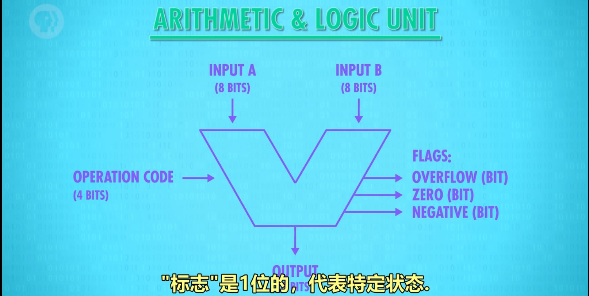
3) 说明：
图示内容包括：
- 输入A，B
- 输出
- 标志：溢出、零、负数

## 第六课 寄存器与内存
### 0、课程导入
当玩游戏、写文档时如果断电，进度会丢失，这是为什么？
- 原因是这是电脑使用的是RAM（随机存取存储器），俗称内存，内存只能在通电情况下存储数据。
- 本节课程将讲述内存的工作原理。

### 1、概念梳理
- 锁存器：锁存器是利用AND、OR、NOT逻辑门，实现存储1位数字的器件。
- 寄存器：1组并排的锁存器
- 矩阵：以矩阵的方式来存放锁存器的组合件，n*n门锁矩阵可存放n^2个锁存器，但同一时间只能写入/读取1个数字。（早期为16*16矩阵）
- 位址：锁存器在矩阵中的行数与列数。eg.12行 8列
- 多路复用器：一组电线，输入2进制的行址&列址，可启用矩阵中某个锁存器
- 内存（RAM）：随机存取存储器，由一系列矩阵以及电路组成的器件，可根据地址来写入、读取数据。类似于人类的短期记忆，记录当前在做什么事情。

### 2、锁存器
作用：存储1位数字。
图示：
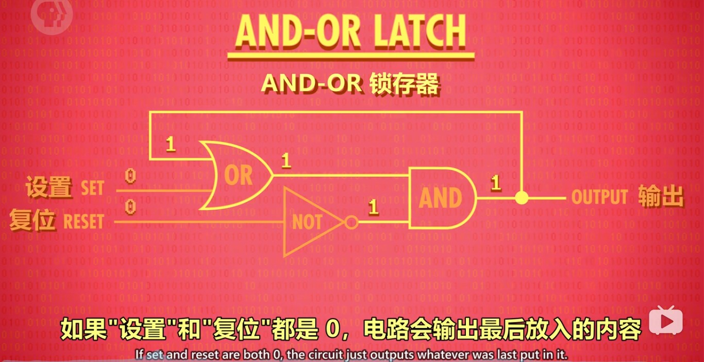
### 2.5、门锁：
锁存器需要同时输入2个数字，不太方便。
为了使用更方便，只用1根电线控制数据输入，发展了门锁这个器件。另外，用另一根电线来控制整个结构的开关。（和复位作用不同）

### 3、寄存器
作用：并排使用门锁，存储多位数字
图示：
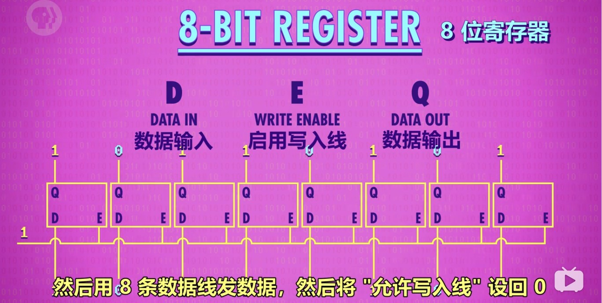
### 4、门锁矩阵
- 作用：
n×n的矩阵有n^2^个位址，则可以存储n^2^个数。但1个矩阵只可记录1位数字，n个矩阵组合在一起，才可记录n位数。如1个8位数，会按位数分成8个数，分别存储在8个矩阵的同一个位址中。
8个矩阵，则可以记录256个8位数字。

- 通俗理解：
16×16的门锁矩阵，可理解为1个公寓，1个公寓256个房间。8个门锁矩阵并排放，则有了8个公寓。规定每一个公寓同一个编号的房间，都有一样的标记（地址），共同组成8位数字。那么8个公寓就能存 （8×256 / 8）个数字。

- 原因：
16×16的门锁矩阵虽然有256个位置，但每次只能存/取其中1个位置的数字。因此，要表示8位数字，就需要同时调用8个门锁矩阵。