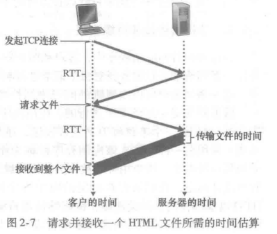
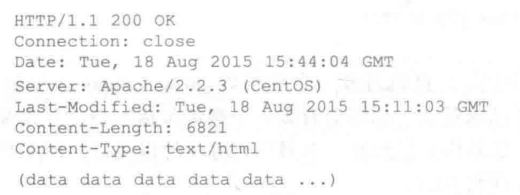
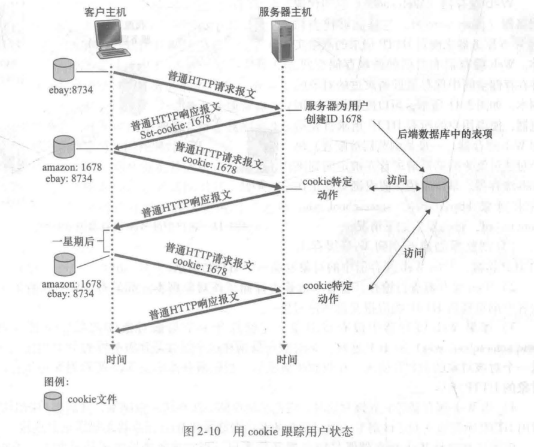
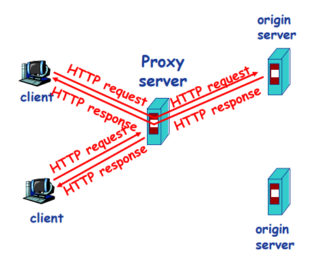
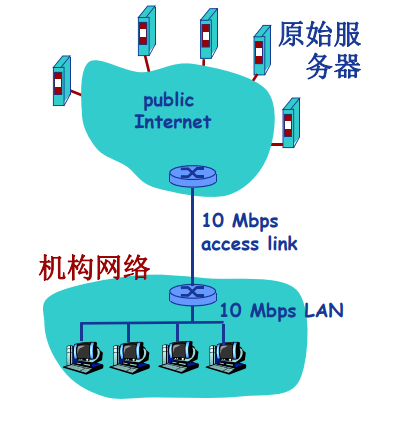
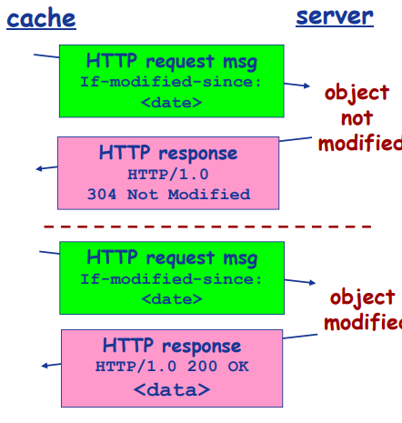

> 参考：
> 《计算机网络自顶向下方法第7版》
> MOOC 哈工大 计算机网络

本笔记内容：
应用层[P.54]

- 网络应用体系结构
	- 客户机/服务器(client/server)
	- P2P
	- 混合结构

- 网络应用的服务需求
	- 可靠性
	- 带宽
	- 时延
- Internet传输层服务模型
	-  TCP
	-  UDP
- 特定网络应用及协议
	- HTTP
	- SMTP, POP, IMAP
	- DNS
	- P2P应用
- Socket 编程 (开发网络应用)
	- TCP
	- UDP

# 网络应用的体系结构
体系结构包括：
- 客户机/服务器结构(Client-Server, C/S)
- 点对点结构(Peer-to-peer, P2P)
- 混合结构(Hybrid)

## 客户机/服务器结构

服务器 Server 
- 7*24小时提供服务
- 永久性访问地址/域名
- 利用大量服务器实现可扩展性

客户机
- 与服务器通信，使用服务器提供的服务
- 间歇性接入网络
- 可能使用动态IP地址
- 不会与其他客户机直接通信！

### 例子：Web

## 纯P2P 结构
没有永远在线的服务器
任意端系统/节点之间可以直接通讯
节点间歇性接入网络
节点可能改变IP地址

优点：高度可伸缩
缺点：难于管理

## 混合结构

Napster
文件传输使用P2P
文件搜索采用C\S结构

# 网络应用进程通信
进程(Process)：主机上运行的程序
客户机进程: 发起通信的进程
服务器进程: 等待通信请求的进程

同一主机上运行的进程之间如何通信？
- 进程间通信机制
- 操作系统提供
不同主机上运行的进程间如何通信？
- 消息交换

## 套接字：Socket

进程间通信利用socket发送/接收消息
类似于寄信：
- 发送方将消息送到门外邮箱
- 发送方依赖（门外的）传输基础设施将消息传到接收方所在主机，并送到接收方的门外
- 接收方从门外获取消息

传输基础设施向进程提供API
-  传输协议的选择
-  参数的设置

## 寻址进程？

进程的标识符
**IP地址+端口号**

不同主机上的进程间通信，那么每个进程必须拥有标识符
如何寻址主机？——**IP地址**
>Q: 主机有了IP地址后，是否足以定位进程？
A: 否。同一主机上可能同时有多个进程需要通信。

**端口号/Port number**
为主机上每个需要通信的进程分配一个**端口号**
HTTP Server: 80
Mail Server：25

>最好的例子：我的世界开 局域网,IP:xxxxx ，xxxxx就是端口号

## 应用层协议
公开协议：由RFC(Request For Comments)定义

协议内容：
- 消息的类型(type)
	- 请求消息
	- 响应消息
- 消息的语法(syntax)/格式
	- 消息中有哪些**字段(field)**？
	- 每个字段**如何描述**
- 字段的语义(senmantics)
	-  字段中信息的**含义**
- 规则(rules)
	- 进程 **什么时候** 发/响应
	- 进程 **如何** 发送/响应

# 网络应用的需求与传输层服务
- 数据丢失(data loss)/可靠性(reliability)
- 时间(timing)/延迟(delay)
- 带宽(bandwidth)

## Internet提供的传输服务

TCP服务（Transmission Control Protocol）
- 面向连接: 客户机/服务器进程间需要建立连接
- 可靠的传输
- 流量控制
- 拥塞控制
- 不提供时间/延迟保障
- 不提供最小带宽保障

UDP 服务(User Datagram Protocol)
- 无连接
- 不可靠的数据传输
- 不提供TCP的服务

# Web应用[P.64]
WWW:World Wide Web(万维网)

网页(Web Page)包含多个对象(objects)
对象:HTML文件，JPEG图片，视频文件，动态脚本等
基本HTML文件：包含对其他对象引用的链接

对象的寻址(addressing)
**URL(Uniform Resoure Locator)**:统一资源定位器 (RFC1738)
Scheme://host:port/path

## HTTP协议概述
超文本传输协议 (HyperText Transfer Protocol , HTTP)
C/S结构
客户- Browser 服务器 - Web Server

HTTP版本：1.0,1.1

使用TCP传输服务

 1. 服务器在80端口等待客户的请求
 2. 浏览器发起到服务器的TCP连接(创建套接字Socket)
 3. 服务器接受来自浏览器的TCP连接
 4. 浏览器(HTTP客户端)与Web服务器(HTTP服务器)交换HTTP消息
 5. 关闭TCP连接

无状态(stateless)：**服务器不维护**任何有关客户端过去所发请求的信息

## HTTP连接

两种：
- 非持久性连接(NonpersistentHTTP)
	- 最多允许传输**一个**对象
	- HTTP1.0
- 持久性连接(Persistent HTTP)
	- 允许传输**多个**对象
	- HTTP1.1

### 响应时间分析与建模 （RTT）***
**RTT(Round Trip Time)**:客户端发送一个很小的数据包到服务器并返回所经历的时间

响应时间(Response time):
- 发起、建立TCP连接：1个RTT
- 发送HTTP请求消息到HTTP响应消息的前几个字节到达：1个RTT
- 响应消息中所含的文件/对象传输时间

**Total响应时间=2RTT +文件发送时间**

### 非持久性链接

非持久性连接的问题：
每个对象需要**2个RTT**
操作系统需要为每个**TCP连接开销资源**(overhead)

### 持久性连接
发送响应后，服务器报错TCP Connect 的打开
后续的HTTP消息可以通过这个连接

持久性分两种：
- **无流水(pipelining)**的持久性连接
	- 客户端**收到前一个响应**后 才 发 新请求
	- 每个被引用的对象耗时 **1 RTT**
- 带有**流水机制**的持久性连接
	- HTTP1.1默认
	- 客户端只要遇到一个 引用对象 就 尽快发出请求
	- 理想情况下，收到所有的引用对像只需耗时 **1RT**T

## HTTP消息格式
有两类消息：
- 请求消息(request)
- 响应消息(response)

### 请求消息
ASCII：人直接可读

这个报文由5行组成 
请求行(request line) 第1行， 首部行(Header line) 2-5行
- 第一行：请求行(request line)：方法字段，URL字段和HTTP版本字段
	- 方法字段：GET，POST, HEAD, PUT, DELETE
	- URL字段
	- HTTP版本:1.1
- 第二行：Host 网页
	- 提供的信息是 Web 代理高速缓存所要求的。
- 第三行：Connection: close
	- 告诉服务器不要麻烦地使用 持续连接
	- 它要求服务器在发送完被请求的对象后就关闭这条连接.
- 第四行：User-agent:用户代理.
	- 指的是浏览器类型 Mozilla/5.0 = Firefox
- 第五行：Accept-language：语言
	- 得到该对象的法语版本

#### 上传输入的方法
**POST方法**
表格(form)
在请求消息的消息体(entity body)中上传客户端的输入

**URL方法**
使用GET方法
输入信息通过request行的URL字段上传

例子：www.somesite.com/animalsearch?monkeys&banana

#### 方法的类型：
- HTTP/1.0
	- GET
	- POST
	- HEAD
- HTTP/1.1
	-  GET,POST,HEAD
	-  PUT
	-  DELETE

### 响应消息

 分三个部分：
 - 初始状态行(status line)
	 - 显示版本，并显示状态代码 200 OK
	 - 状态代码有：
		 - 200 OK
		 - 301 Moved Permanently
		 - 400 Bad Request
		 - 404 Not Found
		 - 505 HTTP Version Not Supported
 - 6个首部行(header line)
	- Connection:close
		- 发送完报文，关闭TCP连接
	- date:时间
	- Server 是什么服务器产生的
	- Last-Modified: 对象创建或者最后修改的日期和时间
	- Content-Length:内容字节(Btye)长度
	- Content-Type:是什么类型的内容
 - 实体体(entity body)
	 - 内容

## Cookie技术
HTTP协议无状态
很多应用需要服务器掌握客户端的状态。
某些网站为了辨别用户身份、进行session跟踪而储存在用户本地终端上的数据（通常经过加密）。

Cookie的组件：
- HTTP响应消息的cookie头部行
- HTTP请求消息的cookie头部行
- 保存在客户端主机上的cookie文件，由浏览器管理
- Web服务器端的后台数据库

Cookie能够用于：身份认证，购物车，推荐，Web e-mail...
但是也存在**隐私问题**

## Web缓存/代理服务器技术
功能：
在不访问服务器的前提下满足客户端的HTTP请求。

优点：
缩短客户请求的响应时间
减少机构/组织的流量
在大范围内(Internet)实现有效的内容分发

Web缓存/代理服务器
用户设定浏览器通过缓存进行Web访问
浏览器向缓存/代理服务器发送所有的HTTP请求
如果所请求对象在缓存中，缓存返回对象
否则，缓存服务器向原始服务器发送HTTP请求，获取对象，然后返回给客户端并保存该对象

缓存既充当客户端，也充当服务器
一般由ISP(Internet服务提供商)架设

### Web缓存示例
假定：
对象的平均大小=100,000比特 => 100Kbps 
机构网络中的浏览器平均每秒有15个到原始服务器的请求 -> 100 X 15 = 1500 Kbps = 1.5Mbps
从机构路由器到原始服务器的往返延迟=2秒

网络性能分析：
局域网(LAN)的利用率=15% (局域网 10Mbps)
接入互联网的链路的利用率=100%(链路 1.5Mbps)
**总的延迟**=互联网上的延迟+访问延迟+局域网延迟=2秒+几分钟+几微秒

#### 解决方案（一）提高带宽
提升互联网接入带宽=10Mbps

**网络性能分析：**
局域网(LAN)的利用率=15%
接入互联网的链路的利用率=15%
**总的延迟**=互联网上的延迟+访问延迟+局域网延迟=2秒+几微秒+几微秒

**问题**：成本太高

#### 解决方案（二）： Web缓存

安装Web缓存
假定缓存命中率是0.4

**网络性能分析：**
40%的请求**立刻**得到满足
60%的请求**通过原始服务器**满足
接入互联网的链路的利用率下降到60%，从而其延迟可以忽略不计，例如10微秒
**总的平均延迟**=互联网上的延迟+访问延迟+局域网延迟=0.6×2.01秒+0.4×n微秒<1.4秒

## 条件性GET方法

目标：
如果缓存有最新的版本，则不需要发送请求对象

缓存:
在HTTP请求消息中声明所持有版本的日期
If-modified-since: \<date\>

服务器：
如果缓存的版本是最新的，则响应消息中不包含对象
HTTP/1.0 304 Not Modified

# Email应用