> 参考：
> 《计算机网络自顶向下方法第7版》
> MOOC 哈工大 计算机网络

本笔记内容：
应用层[P.54]

- 网络应用体系结构
	- 客户机/服务器(client/server)
	- P2P
	- 混合结构

- 网络应用的服务需求
	- 可靠性
	- 带宽
	- 时延
- Internet传输层服务模型
	-  TCP
	-  UDP
- 特定网络应用及协议
	- HTTP
	- SMTP, POP, IMAP
	- DNS
	- P2P应用
- Socket 编程 (开发网络应用)
	- TCP
	- UDP

# 网络应用的体系结构
体系结构包括：
- 客户机/服务器结构(Client-Server, C/S)
- 点对点结构(Peer-to-peer, P2P)
- 混合结构(Hybrid)

## 客户机/服务器结构

服务器 Server 
- 7*24小时提供服务
- 永久性访问地址/域名
- 利用大量服务器实现可扩展性

客户机
- 与服务器通信，使用服务器提供的服务
- 间歇性接入网络
- 可能使用动态IP地址
- 不会与其他客户机直接通信！

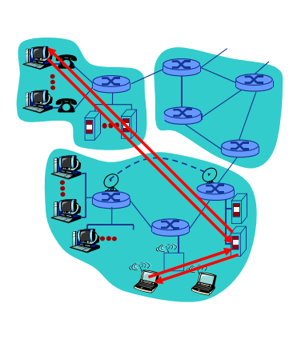

### 例子：Web

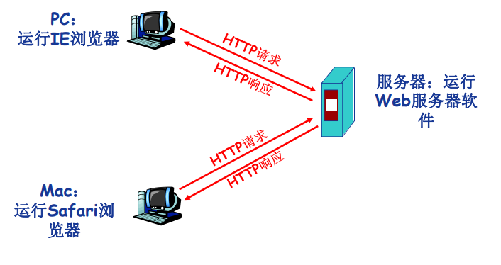

## 纯P2P 结构
没有永远在线的服务器
任意端系统/节点之间可以直接通讯
节点间歇性接入网络
节点可能改变IP地址

优点：高度可伸缩
缺点：难于管理

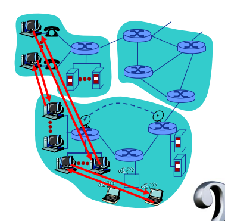

## 混合结构

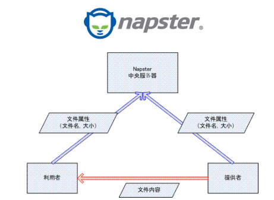
Napster
文件传输使用P2P
文件搜索采用C\S结构

# 网络应用进程通信
进程(Process)：主机上运行的程序
客户机进程: 发起通信的进程
服务器进程: 等待通信请求的进程

同一主机上运行的进程之间如何通信？
- 进程间通信机制
- 操作系统提供
不同主机上运行的进程间如何通信？
- 消息交换

## 套接字：Socket

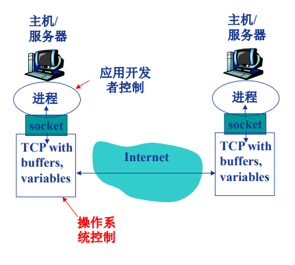

进程间通信利用socket发送/接收消息
类似于寄信：
- 发送方将消息送到门外邮箱
- 发送方依赖（门外的）传输基础设施将消息传到接收方所在主机，并送到接收方的门外
- 接收方从门外获取消息

传输基础设施向进程提供API
-  传输协议的选择
-  参数的设置

## 寻址进程？

进程的标识符
**IP地址+端口号**

不同主机上的进程间通信，那么每个进程必须拥有标识符
如何寻址主机？——**IP地址**
>Q: 主机有了IP地址后，是否足以定位进程？
A: 否。同一主机上可能同时有多个进程需要通信。

**端口号/Port number**
为主机上每个需要通信的进程分配一个**端口号**
HTTP Server: 80
Mail Server：25

>最好的例子：我的世界开 局域网,IP:xxxxx ，xxxxx就是端口号

## 应用层协议
公开协议：由RFC(Request For Comments)定义

协议内容：
- 消息的类型(type)
	- 请求消息
	- 响应消息
- 消息的语法(syntax)/格式
	- 消息中有哪些**字段(field)**？
	- 每个字段**如何描述**
- 字段的语义(senmantics)
	-  字段中信息的**含义**
- 规则(rules)
	- 进程 **什么时候** 发/响应
	- 进程 **如何** 发送/响应

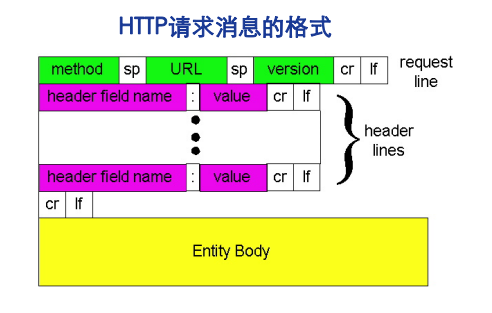

# 网络应用的需求与传输层服务
- 数据丢失(data loss)/可靠性(reliability)
- 时间(timing)/延迟(delay)
- 带宽(bandwidth)

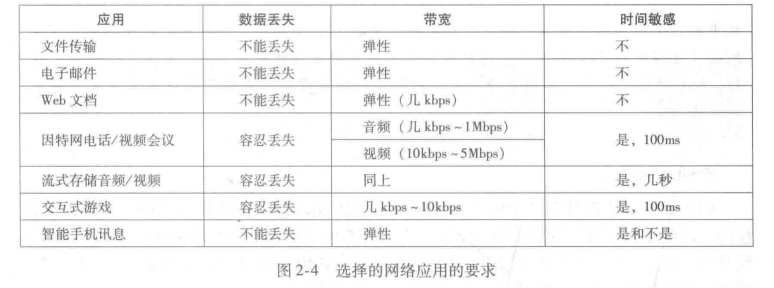

## Internet提供的传输服务

TCP服务（Transmission Control Protocol）
- 面向连接: 客户机/服务器进程间需要建立连接
- 可靠的传输
- 流量控制
- 拥塞控制
- 不提供时间/延迟保障
- 不提供最小带宽保障

UDP 服务(User Datagram Protocol)
- 无连接
- 不可靠的数据传输
- 不提供TCP的服务

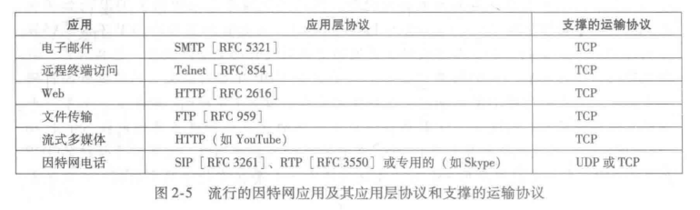

# Web应用[P.64]
WWW:World Wide Web(万维网)

网页(Web Page)包含多个对象(objects)
对象:HTML文件，JPEG图片，视频文件，动态脚本等
基本HTML文件：包含对其他对象引用的链接

对象的寻址(addressing)
**URL(Uniform Resoure Locator)**:统一资源定位器 (RFC1738)
Scheme://host:port/path

## HTTP协议概述
超文本传输协议 (HyperText Transfer Protocol , HTTP)
C/S结构
客户- Browser 服务器 - Web Server

HTTP版本：1.0,1.1

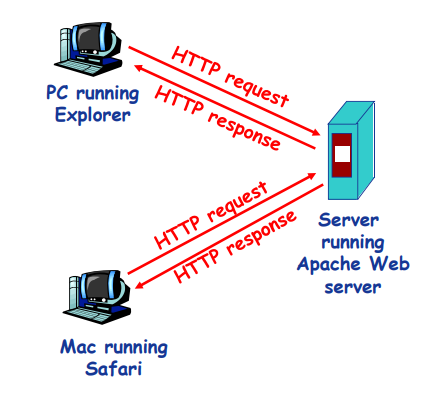

使用TCP传输服务

 1. 服务器在80端口等待客户的请求
 2. 浏览器发起到服务器的TCP连接(创建套接字Socket)
 3. 服务器接受来自浏览器的TCP连接
 4. 浏览器(HTTP客户端)与Web服务器(HTTP服务器)交换HTTP消息
 5. 关闭TCP连接

无状态(stateless)：**服务器不维护**任何有关客户端过去所发请求的信息

## HTTP连接

两种：
- 非持久性连接(NonpersistentHTTP)
	- 最多允许传输**一个**对象
	- HTTP1.0
- 持久性连接(Persistent HTTP)
	- 允许传输**多个**对象
	- HTTP1.1

采用非持久性链接：

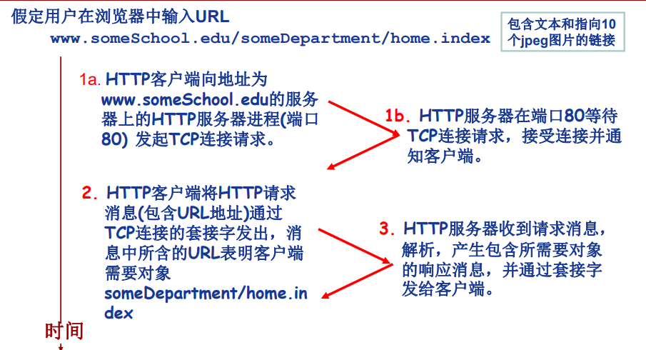

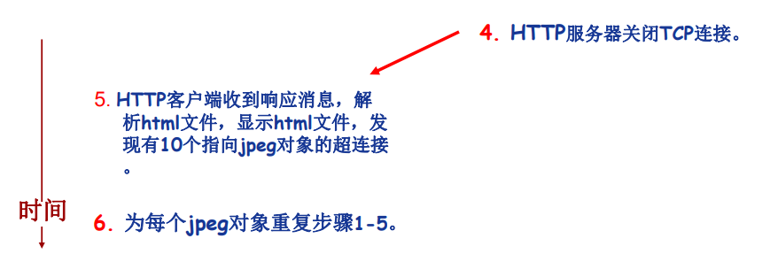

## 响应时间分析与建模 （RTT）***
