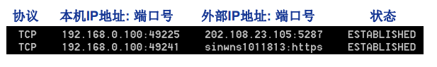
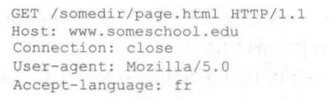

> 参考：
> 《计算机网络自顶向下方法第7版》
> MOOC 哈工大 计算机网络

本笔记内容：
应用层[P.54]
按照2024考研内容：
  - 应用层
	1. 客户/服务器（C/S）应用模型与P2P应用模型
	2. 网络应用通信原理
	3. DNS系统（层次域名空间、域名服务器、域名解析过程）
	4. FTP（FTP协议的工作原理、控制连接与数据连接）
	5. 电子邮件系统（组成结构、邮件格式与MIME、SMTP与POP3）
	6. WWW（WWW的概念与组成结构、HTTP协议）
	7. P2P文件分发应用的基本原理

# 网络应用的体系结构
体系结构包括：
- 客户机/服务器结构(Client-Server, C/S)
- 点对点结构(Peer-to-peer, P2P)
- 混合结构(Hybrid)

## 客户机/服务器结构

服务器 Server 
- 7*24小时提供服务
- 永久性访问地址/域名
- 利用大量服务器实现可扩展性

客户机
- 与服务器通信，使用服务器提供的服务
- 间歇性接入网络
- 可能使用动态IP地址
- 不会与其他客户机直接通信！

### 例子：Web

## 纯P2P 结构
没有永远在线的服务器
任意端系统/节点之间可以直接通讯
节点间歇性接入网络
节点可能改变IP地址

优点：高度可伸缩
缺点：难于管理

## 混合结构

Napster
文件传输使用P2P
文件搜索采用C\S结构

# 网络应用进程通信
进程(Process)：主机上运行的程序
客户机进程: 发起通信的进程
服务器进程: 等待通信请求的进程

同一主机上运行的进程之间如何通信？
- 进程间通信机制
- 操作系统提供
不同主机上运行的进程间如何通信？
- 消息交换

## 套接字：Socket

进程间通信利用socket发送/接收消息
类似于寄信：
- 发送方将消息送到门外邮箱
- 发送方依赖（门外的）传输基础设施将消息传到接收方所在主机，并送到接收方的门外
- 接收方从门外获取消息

传输基础设施向进程提供API
-  传输协议的选择
-  参数的设置

## 寻址进程？

进程的标识符
**IP地址+端口号**

不同主机上的进程间通信，那么每个进程必须拥有标识符
如何寻址主机？——**IP地址**
>Q: 主机有了IP地址后，是否足以定位进程？
A: 否。同一主机上可能同时有多个进程需要通信。

**端口号/Port number**
为主机上每个需要通信的进程分配一个**端口号**
HTTP Server: 80
Mail Server：25

>最好的例子：我的世界开 局域网,IP:xxxxx ，xxxxx就是端口号

## 应用层协议
公开协议：由RFC(Request For Comments)定义

协议内容：
- 消息的类型(type)
	- 请求消息
	- 响应消息
- 消息的语法(syntax)/格式
	- 消息中有哪些**字段(field)**？
	- 每个字段**如何描述**
- 字段的语义(senmantics)
	-  字段中信息的**含义**
- 规则(rules)
	- 进程 **什么时候** 发/响应
	- 进程 **如何** 发送/响应

# 网络应用的需求与传输层服务
- 数据丢失(data loss)/可靠性(reliability)
- 时间(timing)/延迟(delay)
- 带宽(bandwidth)

## Internet提供的传输服务

TCP服务（Transmission Control Protocol）
- 面向连接: 客户机/服务器进程间需要建立连接
- 可靠的传输
- 流量控制
- 拥塞控制
- 不提供时间/延迟保障
- 不提供最小带宽保障

UDP 服务(User Datagram Protocol)
- 无连接
- 不可靠的数据传输
- 不提供TCP的服务

# Web应用[P.64]
WWW:World Wide Web(万维网)

网页(Web Page)包含多个对象(objects)
对象:HTML文件，JPEG图片，视频文件，动态脚本等
基本HTML文件：包含对其他对象引用的链接

对象的寻址(addressing)
**URL(Uniform Resoure Locator)**:统一资源定位器 (RFC1738)
Scheme://host:port/path

## HTTP协议概述
超文本传输协议 (HyperText Transfer Protocol , HTTP)
C/S结构
客户- Browser 服务器 - Web Server

HTTP版本：1.0,1.1

使用TCP传输服务

 1. 服务器在80端口等待客户的请求
 2. 浏览器发起到服务器的TCP连接(创建套接字Socket)
 3. 服务器接受来自浏览器的TCP连接
 4. 浏览器(HTTP客户端)与Web服务器(HTTP服务器)交换HTTP消息
 5. 关闭TCP连接

无状态(stateless)：**服务器不维护**任何有关客户端过去所发请求的信息

## HTTP连接

两种：
- 非持久性连接(NonpersistentHTTP)
	- 最多允许传输**一个**对象
	- HTTP1.0
- 持久性连接(Persistent HTTP)
	- 允许传输**多个**对象
	- HTTP1.1

### 响应时间分析与建模 （RTT）***
**RTT(Round Trip Time)**:客户端发送一个很小的数据包到服务器并返回所经历的时间

响应时间(Response time):
- 发起、建立TCP连接：1个RTT
- 发送HTTP请求消息到HTTP响应消息的前几个字节到达：1个RTT
- 响应消息中所含的文件/对象传输时间

**Total响应时间=2RTT +文件发送时间**

### 非持久性链接

非持久性连接的问题：
每个对象需要**2个RTT**
操作系统需要为每个**TCP连接开销资源**(overhead)

### 持久性连接
发送响应后，服务器报错TCP Connect 的打开
后续的HTTP消息可以通过这个连接

持久性分两种：
- **无流水(pipelining)**的持久性连接
	- 客户端**收到前一个响应**后 才 发 新请求
	- 每个被引用的对象耗时 **1 RTT**
- 带有**流水机制**的持久性连接
	- HTTP1.1默认
	- 客户端只要遇到一个 引用对象 就 尽快发出请求
	- 理想情况下，收到所有的引用对像只需耗时 **1RT**T

## HTTP消息格式
有两类消息：
- 请求消息(request)
- 响应消息(response)

### 请求消息
ASCII：人直接可读

这个报文由5行组成 
请求行(request line) 第1行， 首部行(Header line) 2-5行
- 第一行：请求行(request line)：方法字段，URL字段和HTTP版本字段
	- 方法字段：GET，POST, HEAD, PUT, DELETE
	- URL字段
	- HTTP版本:1.1
- 第二行：Host 网页
	- 提供的信息是 Web 代理高速缓存所要求的。
- 第三行：Connection: close
	- 告诉服务器不要麻烦地使用 持续连接
	- 它要求服务器在发送完被请求的对象后就关闭这条连接.
- 第四行：User-agent:用户代理.
	- 指的是浏览器类型 Mozilla/5.0 = Firefox
- 第五行：Accept-language：语言
	- 得到该对象的法语版本

#### 上传输入的方法
**POST方法**
表格(form)
在请求消息的消息体(entity body)中上传客户端的输入

**URL方法**
使用GET方法
输入信息通过request行的URL字段上传

例子：www.somesite.com/animalsearch?monkeys&banana

#### 方法的类型：
- HTTP/1.0
	- GET
	- POST
	- HEAD
- HTTP/1.1
	-  GET,POST,HEAD
	-  PUT
	-  DELETE

### 响应消息

 分三个部分：
 - 初始状态行(status line)
	 - 显示版本，并显示状态代码 200 OK
	 - 状态代码有：
		 - 200 OK
		 - 301 Moved Permanently
		 - 400 Bad Request
		 - 404 Not Found
		 - 505 HTTP Version Not Supported
 - 6个首部行(header line)
	- Connection:close
		- 发送完报文，关闭TCP连接
	- date:时间
	- Server 是什么服务器产生的
	- Last-Modified: 对象创建或者最后修改的日期和时间
	- Content-Length:内容字节(Btye)长度
	- Content-Type:是什么类型的内容
 - 实体体(entity body)
	 - 内容

## Cookie技术
HTTP协议无状态
很多应用需要服务器掌握客户端的状态。
某些网站为了辨别用户身份、进行session跟踪而储存在用户本地终端上的数据（通常经过加密）。

Cookie的组件：
- HTTP响应消息的cookie头部行
- HTTP请求消息的cookie头部行
- 保存在客户端主机上的cookie文件，由浏览器管理
- Web服务器端的后台数据库

Cookie能够用于：身份认证，购物车，推荐，Web e-mail...
但是也存在**隐私问题**

## Web缓存/代理服务器技术
功能：
在不访问服务器的前提下满足客户端的HTTP请求。

优点：
缩短客户请求的响应时间
减少机构/组织的流量
在大范围内(Internet)实现有效的内容分发

Web缓存/代理服务器
用户设定浏览器通过缓存进行Web访问
浏览器向缓存/代理服务器发送所有的HTTP请求
如果所请求对象在缓存中，缓存返回对象
否则，缓存服务器向原始服务器发送HTTP请求，获取对象，然后返回给客户端并保存该对象

缓存既充当客户端，也充当服务器
一般由ISP(Internet服务提供商)架设

### Web缓存示例
假定：
对象的平均大小=100,000比特 => 100Kbps 
机构网络中的浏览器平均每秒有15个到原始服务器的请求 -> 100 X 15 = 1500 Kbps = 1.5Mbps
从机构路由器到原始服务器的往返延迟=2秒

网络性能分析：
局域网(LAN)的利用率=15% (局域网 10Mbps)
接入互联网的链路的利用率=100%(链路 1.5Mbps)
**总的延迟**=互联网上的延迟+访问延迟+局域网延迟=2秒+几分钟+几微秒

#### 解决方案（一）提高带宽
提升互联网接入带宽=10Mbps

**网络性能分析：**
局域网(LAN)的利用率=15%
接入互联网的链路的利用率=15%
**总的延迟**=互联网上的延迟+访问延迟+局域网延迟=2秒+几微秒+几微秒

**问题**：成本太高

#### 解决方案（二）： Web缓存

安装Web缓存
假定缓存命中率是0.4

**网络性能分析：**
40%的请求**立刻**得到满足
60%的请求**通过原始服务器**满足
接入互联网的链路的利用率下降到60%，从而其延迟可以忽略不计，例如10微秒
**总的平均延迟**=互联网上的延迟+访问延迟+局域网延迟=0.6×2.01秒+0.4×n微秒<1.4秒

## 条件性GET方法

目标：
如果缓存有最新的版本，则不需要发送请求对象

缓存:
在HTTP请求消息中声明所持有版本的日期
If-modified-since: \<date\>

服务器：
如果缓存的版本是最新的，则响应消息中不包含对象
HTTP/1.0 304 Not Modified

# Email应用

## Email应用的构成
Email应用的构成组件
- 邮件客户端(user agent)
	- 读写Email信息
	- 与Server 交互
	- eg:Outlook,Foxmail
- 邮件服务器
	- 邮箱：存储发给该用户的Email
- SMTP协议(Simple Mail Transfer Protocol)
	- 客户端：发送消息的服务器
	- 服务器：接收消息的服务器

## Email 应用实例:

1.Alice 调用她的邮件代理程序并提供Bob的邮件地址，写报文，指示用户代理发送该报文
2.Alice的用户代理把报文发到她的邮件服务器，报文被放在报文队列中
3.运行在Alice的邮件服务器的SMTP客户端发现了报文队列的这个报文，就会创建一个运行到bob邮件服务器的SMTP服务器的TCP连接
4.经过一些初始SMTP握手后，SMTP客户通过TCP连接发送Alice报文

## SMTP 协议
使用TCP进行可靠传输
端口为 25
传输过程三阶段：
1.握手
2.消息的传输
3.关闭

命令响应交互模式：
命令：ASCIIC文本
响应：状态代码和语句

Email Message只含7位ASCII码
使用持久性连接
要求消息必须由7位ASCII码构成
SMTP服务器利用 CRLF.CRLF确定结束

### 与HTTP对比

HTTP: **拉式(pull)**
SMTP: **退式(push)**

都使用命令/响应交互模式
命令和状态代码都是ASCII码

HTTP: 每个对象封装在**独立的响应消息中**
SMTP: 多个对象在由**多个部分构成**的消息中发送

# Email消息格式(SMTP,MIME)与POP3协议
**SMTP**：email消息的传输/交换协议
头部： To  From Subject

**MIME**：多媒体邮件扩展 RFC 2045, 2056
通过在邮件头部增加额外的行以声明MIME的内容类型

## 邮件访问协议：从服务器获取邮件
- POP: Post Office Protocol 
• 认证/授权(客户端<- ->服务器)和下载
- IMAP: Internet Mail Access Protocol [RFC 1730]
• 更多功能
• 更加复杂
• 能够操纵服务器上存储的消息
- HTTP：163, QQ Mail等

>SMTP是推协议，Bob要取报文的话，是拉操作，所以得用其他协议。

## POP 协议
POP是极为简单的邮件访问协议。当用户代理 打开了一个到邮件服务器端口110上的TCP连接后，POP3就开始工作了。

POP按照三个阶段工作：特许(authorization)、事务处理、更新。
- 特许阶段（认证）：用户代理发送(以明文形式)用户名和口令以鉴别用户。
	- 客户端命令
		- User:用户名
		- Pass:密码
	- 服务器响应
		- +OK
		- -ERR
- 事务处理阶段，用户代理取回报文
	- List:列出消息数量
	- Retr:用编号获取消息
	- Dele:删除消息
	- Quti
- 更新阶段：它出现在客户发出了 quit 命令之后，目的是结束该 POP会话。

**“下载并删除”模式**：用户如果换了客户端软件，无法重读该邮件
**“下载并保持”模式**：不同客户端都可以保留消息的拷贝
POP3是无状态的

## IMAP协议
IMAP 服务器把每个报文与一个文件夹联系起来;当报文第一次到达服务器时，它
与收件人的 lNBOX 文件夹相关联。

所有消息统一保存在一个地方：**服务器**
允许用户利用文件夹组织消息
IMAP支持跨会话(Session)的用户状态:文件夹的名字，文件夹与消息ID之间的映射等

# DNS：Domain Name System 因特网的目录服务！

Internet上主机/路由器的识别问题：IP地址，域名：www.hit.edu.cn

**域名解析系统DNS**
多层命名服务器构成的分布式数据库
应用层协议：完成名字的解析
• Internet核心功能，用应用层协议实现
• 网络边界复杂

DNS服务
- 域名向IP地址的翻译
- 主机别名
- 邮件服务器别名
- 负载均衡：Web服务器

集中式DNS问题：单点失败问题，流量问题，距离问题，维护性问题

## 分布式层次式数据库

客户端想要查询www.amazon.com的IP

1.客户端查询根服务器，找到com域名解析服务器
2.客户端查询com域名解析服务器，找到amazon.com域名解析服务器
3.客户端查询amazon.com域名解析服务器，获得www.amazon.com的IP地址

服务器层级：
1. DNS根域名服务器
2. 顶级域名服务器(Top-level Domain,TLD)
3. 权威域名解析服务器(Authoritative Domain)

## DNS根域名服务器
本地域名解析服务器无法解析域名时，访问根域名服务器
根域名服务器：
1.如果不知道映射，访问权威域名服务器
2.获得映射
3.向本地域名服务器返回映射

## 顶级域名服务器(TLD, top-level domain)
负责com, org, net,edu等顶级域名和国家顶级域名，例如cn, uk, fr等

## 权威(Authoritative)域名服务器
组织的域名解析服务器，提供组织内部服务器的解析服务

## 本地域名解析服务器
不严格属于层级体系
每个ISP有一个本地域名服务器：默认域名解析服务器
当主机进行DNS查询时，查询被发送到本地域名服务器：作为代理(proxy)，将查询转发给（层级式）域名解析服务器系统

## DNS查询示例

主机 cse.nyu.edu 想知道 主机 gaia.cs.umass.edu 这就会发生以上的交互。

最后，本地 NS 服务器直接向 dns. umass. edu 重发查询报文， dns. umass. ed gaia. cs. umass. edu IP 地址进行响应。

为了获得一台主机名的映射，共发送了8份DNS报文：**4查询，4回答。**

以上示范是：**迭代查询(iterative query)**：被查询服务器返回域名解析服务器的名字

## 例题：

## DNS记录缓存和更新

只要域名解析服务器获得域名—IP映射，即缓存这一映射
一段时间过后，缓存条目失效（删除）
本地域名服务器一般会缓存顶级域名服务器的映射
因此根域名服务器不经常被访问

## DNS记录（资源记录RR）
**资源记录**(RR, resource records)
资源记录的格式：
**(Name, Value, Type, TTL)**

Nalne Value 的值取决于 Type:
Type = A
Name：主机域名
Value：IP地址
例子：(relay1.bar. foo. com , 145. 37. 93. 126 ，A)

Type = NS
Name：域(edu.cn)
Value：该域权威域名解析服务器的主机域名
例子：(foo.com , dns.foo.com，NS)

Type = CNAME
Name：某一真实域名的别名
Value：真实域名
例子：(foo.com, relay1.bar.foo.com, CNANE)

Type = MX
Name：域名
Value：是与name相对应的邮件服务器
例子：(foo.com , mail.bar.foo.com，MX)

为了**获得邮件服务器**的规范主机名， DNS 客户应当请求 **MX 记录**;
而为了**获得其他服务器**的规范主机名， DNS 客户应当请求 **CNAME 记录**。

## DNS协议与消息

DNS协议：
查询(query)和 回复(reply)
消息格式相同

消息头部：
标识符 - Identification: 16bit 查询符号，回复使用相同的编号

标志 - Flags
- 查询或回复(1bit)
	- 查询(0)，回答(1)
- 期望递归(1bit)
- 递归可用(1bit)
- 权威回答(1bit)

### 如何注册域名？

