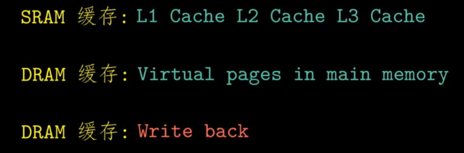

# 第 九 章 虚拟内存

在计算机系统中，多个进程之间共享CPU和内存
如果太多的进程需要过多的内存空间
那么其中一部分进程就会因为无法获得足够的内存空间而无法运行

除此之外，如果某个进程不小心把数据写入到 另外一个进程的内存空间中 
那么接下来就会发生一些令人困感的错误

>为了有效管理内存
现代计算机系统提供了一种对内存的抽象概念，叫做**虚拟内存**
它可以自动的完成内存管理的相关工作，并不需要应用程序员来干预

学习原因：

- 虚拟内存是核心
- 虚拟内存是强大的
	- 创建和释放内存空间，将内存空间映射到磁盘的某个部分。
- 虚拟内存是危险的
	- 虚拟内存使用不当，会产生很严重的错误。

## 9.1 虚拟内存 Virtual Memory

### 物理地址

>CPU访问内存最直接的方式就是使用物理地址 —— **物理寻址**（名词）

图中例子：
该指令的起始地址 = 2 ，长度 = 4 byte

此时CPU在读取这条指令时，就会生成一个有效的物理地址。
这个物理地址通过内存总线传递给内存控制器

内存响应：
从物理地址2开始的地方取出4个字节的内容返回给CPU

### 虚拟寻址 Virtual Addressing

>不过现在CPU用的是**虚拟寻址**。

在这种寻址模式下，CPU是通过一个虚拟地址来访问内存的。
这个虚以地址在被送到内存之前，需要先转换成相应的物理地址

将一个虚以地址转换成物理地址的任务叫做**地址翻译**（名词）。
在CPU芯片内部有一个专门的功能部件来做地址转换 —— **内存管理单元(MMU)** (名词)

### 地址空间（重要概念）

>地址空间是一个非负整数的有序集合。
>如果地址空间中的整数是连续的，那么我们说它是一个线性地址空间。(假设都是线性地址空间)

一个地址空间的大小是由表示最大地址所需要的位数来描述的。

例如：
一个8位的虚拟地址空间，一共包含2的8次方个虚拟地址数
一个32位的虚拟地址空间，一共包含2的32次方个虚拟地址数

除此之外，系统中还有一个物理地址空间概念
它对应于系统中的物理内存。

例如物理内存有M个字节，那么物理地址空间就是0~M-1。

>特别注意：：是虚拟内存地址与物理地址的差别

虚拟内存是如何用作缓存：

从概念上讲，虚拟内存可以看成一个由磁盘上N个连续的字节所组成的数组
其中每一个字节都有一个唯一的虚拟地址，这个虚拟地址就是数组的**索引值**。

其中虚拟地址的范围是0~N-1
对于磁盘上数组的内容被缓存到内存里

与存储器层次架构中其他缓存一样
磁盘上的数据被分割成块，这些块作为磁盘和内存之间的传输单元。

我们把这些数据块称为虚拟页，简称**VP**（名词）
每个虚拟页的大小为P个字节，通常P的值在4KB~2MB之间

类以的，物理内存也被分割为物理页 **(PP)** = 页帧(Page frame)
物理页与虚拟页的**大小是一样**的，也是P个字节.

关于虚拟页面可以分为三类：

- 未分配 Unallocated
	- 虚拟内存系统还没有创建的页
	- 没有任何数据和它们相关联
	- 不占用任何磁盘空间
-  已缓存的 Cached
	-  已经缓存在物理内存页中
	-  例如：VP1，4，6
- 未缓存  Uncached
	- 已经被分配，但并未缓存在内存中
	-	例如：VP2, 5, 7

为了方便理解存储层次结构中不同的缓存概念

>DRAM 比 SRAM 慢十倍， 磁盘 比 DRAM 慢 10万倍。
>因此，DRAM缓存不命中比SRAM缓存不命中对程序执行的影响更大

所以DRAM缓存采用**全相联**的联结方式
也就是说任何的虚拟页可以放在任意一个内存页中。

除此之外，不命中时的替换策略也非常重要
如果替换错了，那么也会耽误很长的时间。

与cachel的替换算法相l比，DRAM缓存的替换算法更加复杂
不过这个替换算法不在本书的讲述范围之内(())

磁盘访问的时间很长
所以DRAM缓存总是采用写回的策略，而不是写穿透

# 第 十 章 系统级 I/O