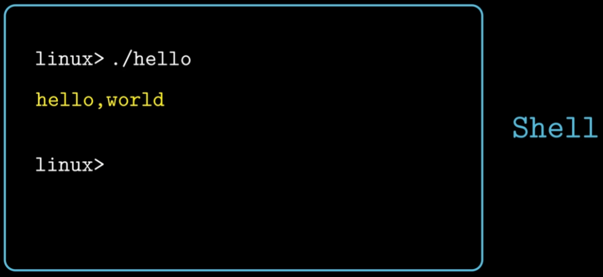

内容来源：[【CSAPP-深入理解计算机系统】](https://www.bilibili.com/video/BV1cD4y1D7uR/?spm_id_from=333.337.search-card.all.click&vd_source=d1002d9c1ba92da4ba3fca4fdca6d750)作者：九曲阑干

# 第一章 计算机系统漫游
一个Hello Program的生命周期：


The Hello Program—— hello.c
```c
#include<stdio.h>
int main()
{
	printf("hello,world\n");
}
```

>linux> gcc -o hello hell.c

通过以上的命令，便能生成一个可执行程序——hello.

>编译过程分为四个阶段：**预处理，编译，汇编，连接**


预处理器——会通过#开头的代码，来修改原始程序，将内容直接插入到源程序中。——hello.i（文本文件）

编译——词法分析，语法分析，语义分析——（进行翻译）——hello.s

汇编——翻译成机器指令的文件——hello.o(可重定位目标文件)(二进制文件)

链接——hello中调用了printf的函数，printf在printf.o文件中（提前编译号的目标文件），把两个进行合并。——可执行目标文件hello


了解这些知识是为了:
- 优化程序性能（第三章，第五章）
	- 一个函数调用的开销有多大？
		- while比for循环高效？
		- switch语句是不是要比一连串if-else高效的多？
- 理解链接时出现的错误（第七章）
	- 很多问题往往在链接时出现问题。
		- 函数库的调用
		- 静态变量/全局变量的区别
		- 静态库和动态库的区别？
- 避免安全漏洞（第三章）
	-   缓冲区溢出是常见的问题。
		-   理解数据和控制信息在程序栈上是如何存储
		-   书写方式

**运行一个 hello程序 by Shell**


## 计算机的硬件组成

(第四章讲述CPU)
中央处理单元(Central Processing Unit,CPU)

程序计数器 Program Count(PC)

32-bit:
1 word = 4 Byte

64-bit:
1 word = 8 Byte

系统上电，直到系统结束，CPU就不断在执行PC指向的指令。然后更新PC，指向下一条要执行的指令（两个指令不一定是相邻的）

寄存器 Register File 
CPU内部的存储设备：临时存放数据的空间

算术逻辑单元 Arithmatic/logic Unit (ALU)
用来进行算术

主存/内存 Main Memory （第六章）
存放程序指令以及数据。
物理上，随机动态存储器芯片组成。
逻辑上，看成一个从零开始的大数组。 每个字节都有相对应的地址。

总线 bus
内存和处理器之间通过总线来进行数据传递。
通常总线被设计为传送固定长度的字节块，也就是Word。

I/O 输入输出设备 （第六章、第十章）
每个 I/O 设备都通过一个控制器或者适配器与 I/O 总线相连。

**Hello程序执行的过程：**
1) 输入hello

2) 点击回车键，完成指令输入

3) 执行Main()函数的代码：
