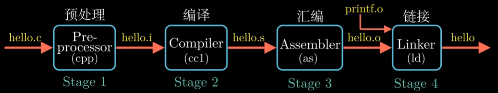
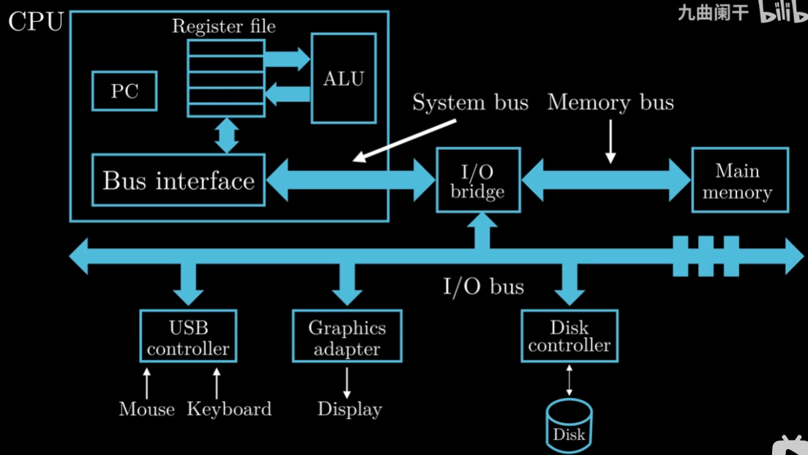
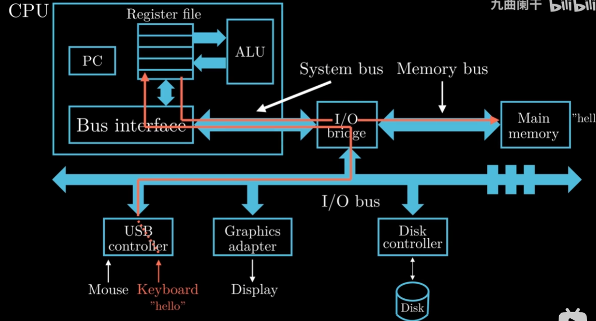
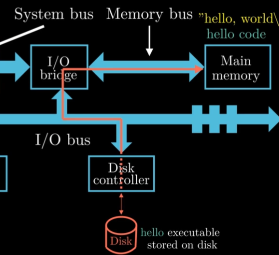
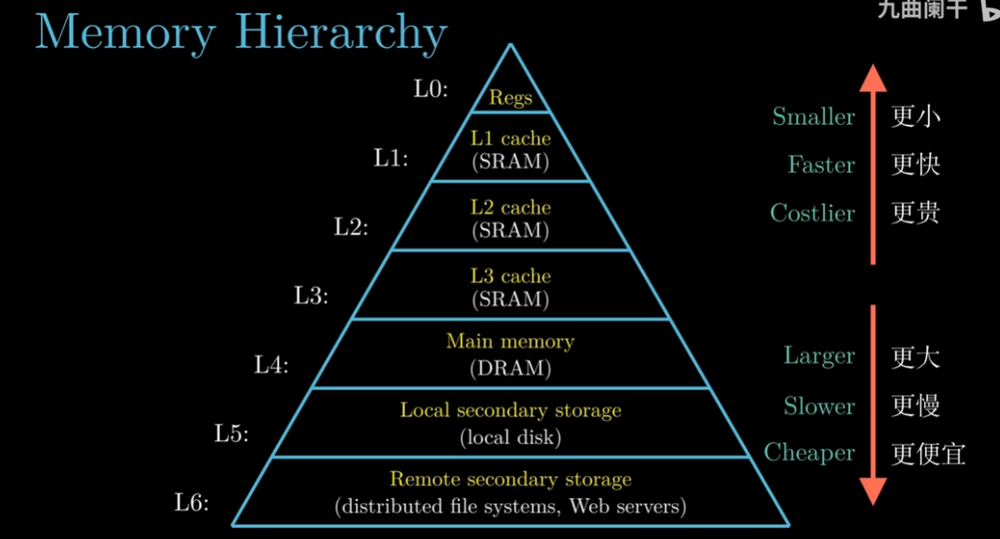
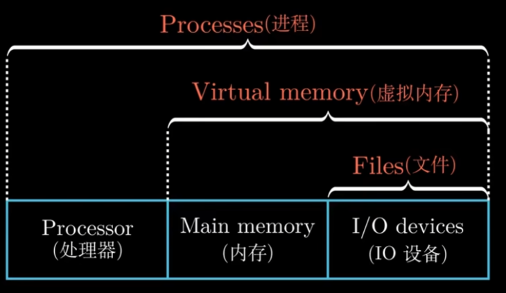
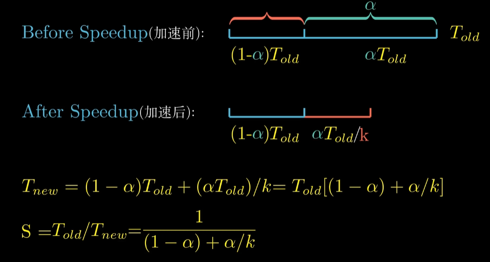
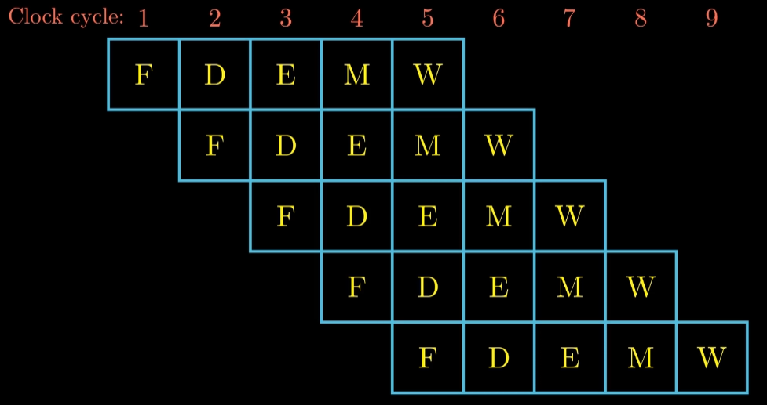
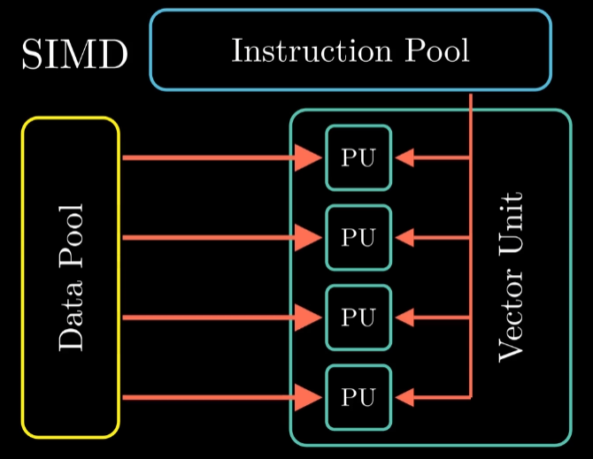

内容来源：[【CSAPP-深入理解计算机系统】](https://www.bilibili.com/video/BV1cD4y1D7uR/?spm_id_from=333.337.search-card.all.click&vd_source=d1002d9c1ba92da4ba3fca4fdca6d750)作者：九曲阑干

# 第一章 计算机系统漫游
一个Hello Program的生命周期：


The Hello Program—— hello.c
```c
#include<stdio.h>
int main()
{
	printf("hello,world\n");
}
```

>linux> gcc -o hello hell.c

通过以上的命令，便能生成一个可执行程序——hello.

>编译过程分为四个阶段：**预处理，编译，汇编，连接**



预处理器——会通过#开头的代码，来修改原始程序，将内容直接插入到源程序中。——hello.i（文本文件）

编译——词法分析，语法分析，语义分析——（进行翻译）——hello.s

汇编——翻译成机器指令的文件——hello.o(可重定位目标文件)(二进制文件)

链接——hello中调用了printf的函数，printf在printf.o文件中（提前编译号的目标文件），把两个进行合并。——可执行目标文件hello


了解这些知识是为了:
- 优化程序性能（第三章，第五章）
	- 一个函数调用的开销有多大？
		- while比for循环高效？
		- switch语句是不是要比一连串if-else高效的多？
- 理解链接时出现的错误（第七章）
	- 很多问题往往在链接时出现问题。
		- 函数库的调用
		- 静态变量/全局变量的区别
		- 静态库和动态库的区别？
- 避免安全漏洞（第三章）
	-   缓冲区溢出是常见的问题。
		-   理解数据和控制信息在程序栈上是如何存储
		-   书写方式

**运行一个 hello程序 by Shell**


## 计算机的硬件组成

(第四章讲述CPU)
中央处理单元(Central Processing Unit,CPU)

程序计数器 Program Count(PC)

32-bit:
1 word = 4 Byte

64-bit:
1 word = 8 Byte

系统上电，直到系统结束，CPU就不断在执行PC指向的指令。然后更新PC，指向下一条要执行的指令（两个指令不一定是相邻的）

寄存器 Register File 
CPU内部的存储设备：临时存放数据的空间

算术逻辑单元 Arithmatic/logic Unit (ALU)
用来进行算术

主存/内存 Main Memory （第六章）
存放程序指令以及数据。
物理上，随机动态存储器芯片组成。
逻辑上，看成一个从零开始的大数组。 每个字节都有相对应的地址。

总线 bus
内存和处理器之间通过总线来进行数据传递。
通常总线被设计为传送固定长度的字节块，也就是Word。

I/O 输入输出设备 （第六章、第十章）
每个 I/O 设备都通过一个控制器或者适配器与 I/O 总线相连。

**Hello程序执行的过程：**
1) 输入hello

2) 点击回车键，完成指令输入

3) 执行Main()函数的代码：


>存储关系：
>大容量的存储设备的存取速度要比小容量的慢
>运行速度更快的设备的价格相对于低速设备要更贵

系统设计人员在寄存器文件和内存之间引入了高速缓存


**存储层次**


>真正操控硬件的是**操作系统**
>所有的应用程序对硬件的操作必须通过操作系统来完成。
>目的有二：
>1.防止硬件被失控的应用程序滥用
>2.系统提供统一的机制来控制这些复杂的底层硬件

**抽象的概念：**



## 进程
借助hello程序运行的场景来解释 **进程**


通过shell进程加载hello进程，shell进程系统调用。
系统调用会将控制权从shell进程传递到操作系统，操作系统保存shell进程的上下文，然后创建一个新的hello进程及其上下文，将控制权转交给hello进程。
hello进程结束，系统就会恢复shell进程的上下文，并将控制权交给shell进程，shell进程等待下个命令行的输入。

Context（上下文）：操作系统会跟随进程运行中所需要的所有状态信息。（PC和寄存器的值，内存的内容等等）（第八章）

一个进程由多个线程组成，共享代码和数据。


## 虚拟内存
>它为每个进程提供了一个假象，就是每个进程都在独自占用整个内存空间。
>每个进程看到的内存都是一样的，便是 **虚拟地址空间**

虚拟地址空间：


第一个区域用来 **存放程序的代码** 和 **数据**
该区域的内容是从可执行目标文件中加载而来的。
C语言中，全局变量便是放在这。

第二区域 堆（malloc）
Memory Allocate
堆可以运行时动态的扩展和收缩

第三区域，共享库的存放区域
C语言标准库和数学库这种共享库的代码和数据

第四区域，用户栈
函数调用本质就是压栈：每次当程序进行函数调用的时候，栈就会增长，函数执行完毕返回时，栈就会收缩。
需要注意的是：栈的增长方向是从高地址到低地址。

最顶部区域，内核保留的区域
对应用程序是不可见的。

> Linux系统的哲学思想是：一切皆为文件（Everything is File）
> I/O设备，键盘，磁盘，显示器，网络都是文件。


>从一个系统来看，网络也可以视为一个IO设备


如何用ssh，通过网络在远程主机上运行hello程序。


## 阿姆达尔定律 Amdahl's Law

定量的看一下系统的加速比。
>定律的主要思想是，当我们对系统的某一部分进行加速时，被加速部分的重要性和加速程度是影响整体系统性能的关键因素。

假设一个应用程序的执行所需要的全部时间用Told表示。
红色部分为不可加速，另外一部分是可加速的。
其中可以加速部分速度 = a \* Told
所以不可加速部分为： Told - a \* Told = (1-a) Told

可加速的性能比例为k
可加速所花费的时间就是 (a\*Told)/k
最后可以得到加速比S



>因此，如果我们需要把系统的性能提高到2倍甚至更多，我们需要优化大部分组件。

**如何获得更高的计算能力？Concurrency（并发） and Parallelism(并行)**
1. 线程级并发
2. 指令级并行
3. 单指令，多数据并行


## 线程级并发

多核处理器的组织结构：


超线程（hyperthreading）/同时多线程

CPU内部，PC和寄存器存在多个备份，浮点运算部分只有一份。


超线程处理器可以在单周期的基础上决定执行哪一个线程。

## 指令集并行


近几年的处理器可以保持每个周期2-4条指令的执行速率。

## 单指令，多数据并行
单指令，多数据(Single Instruction Multiple Data,SIMD)
SIMD指令多是为了提高处理视频，以及声音这类数据的执行速度。




## 计算机系统的抽象 **


# 第二章 信息的表示和处理

Summary
1. Information Stroage（信息存储）
2. Integer Respresentations（整数表示）
3. Integer Arithmetic（整数运算）
4. Floating Point（浮点数）

## 2.1 信息存储
>通常情况下，程序将内存视为一个非常大的数组，数组的元素由**一个个字节**组成。每个字节都有唯一的数字表示，也就是**地址**。
>所有地址的集合——虚拟地址空间（virtual address space）


### 字节 Byte

>1 Byte = 8 bit


### 16进制数 Hexadecimal Notation
>十六进制好处：节省显示位置，方便与2进制转换。


