内容来源：[【CSAPP-深入理解计算机系统】](https://www.bilibili.com/video/BV1cD4y1D7uR/?spm_id_from=333.337.search-card.all.click&vd_source=d1002d9c1ba92da4ba3fca4fdca6d750)作者：九曲阑干

# 第一章 计算机系统漫游
一个Hello Program的生命周期：


The Hello Program—— hello.c
```c
#include<stdio.h>
int main()
{
	printf("hello,world\n");
}
```

>linux> gcc -o hello hell.c

通过以上的命令，便能生成一个可执行程序——hello.

>编译过程分为四个阶段：**预处理，编译，汇编，连接**


预处理器——会通过#开头的代码，来修改原始程序，将内容直接插入到源程序中。——hello.i（文本文件）

编译——词法分析，语法分析，语义分析——（进行翻译）——hello.s

汇编——翻译成机器指令的文件——hello.o(可重定位目标文件)(二进制文件)

链接——hello中调用了printf的函数，printf在printf.o文件中（提前编译号的目标文件），把两个进行合并。——可执行目标文件hello


了解这些知识是为了:
- 优化程序性能（第三章，第五章）
	- 一个函数调用的开销有多大？
		- while比for循环高效？
		- switch语句是不是要比一连串if-else高效的多？
- 理解链接时出现的错误（第七章）
	- 很多问题往往在链接时出现问题。
		- 函数库的调用
		- 静态变量/全局变量的区别
		- 静态库和动态库的区别？
- 避免安全漏洞（第三章）
	-   缓冲区溢出是常见的问题。
		-   理解数据和控制信息在程序栈上是如何存储
		-   书写方式

**运行一个 hello程序 by Shell**


## 计算机的硬件组成

(第四章讲述CPU)
中央处理单元(Central Processing Unit,CPU)

程序计数器 Program Count(PC)

32-bit:
1 word = 4 Byte

64-bit:
1 word = 8 Byte

系统上电，直到系统结束，CPU就不断在执行PC指向的指令。然后更新PC，指向下一条要执行的指令（两个指令不一定是相邻的）

寄存器 Register File 
CPU内部的存储设备：临时存放数据的空间

算术逻辑单元 Arithmatic/logic Unit (ALU)
用来进行算术

主存/内存 Main Memory （第六章）
存放程序指令以及数据。
物理上，随机动态存储器芯片组成。
逻辑上，看成一个从零开始的大数组。 每个字节都有相对应的地址。

总线 bus
内存和处理器之间通过总线来进行数据传递。
通常总线被设计为传送固定长度的字节块，也就是Word。

I/O 输入输出设备 （第六章、第十章）
每个 I/O 设备都通过一个控制器或者适配器与 I/O 总线相连。

**Hello程序执行的过程：**
1) 输入hello

2) 点击回车键，完成指令输入

3) 执行Main()函数的代码：
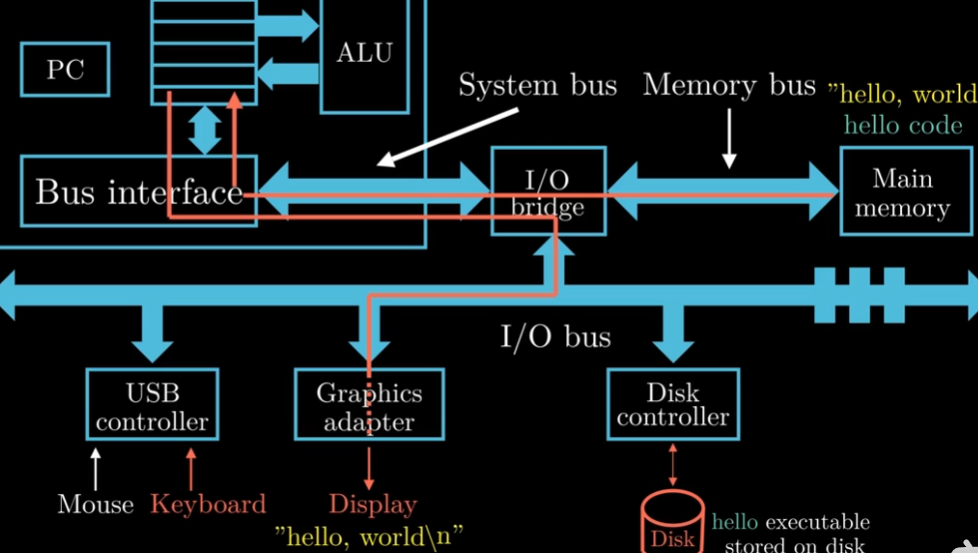


>存储关系：
>大容量的存储设备的存取速度要比小容量的慢
>运行速度更快的设备的价格相对于低速设备要更贵

系统设计人员在寄存器文件和内存之间引入了高速缓存
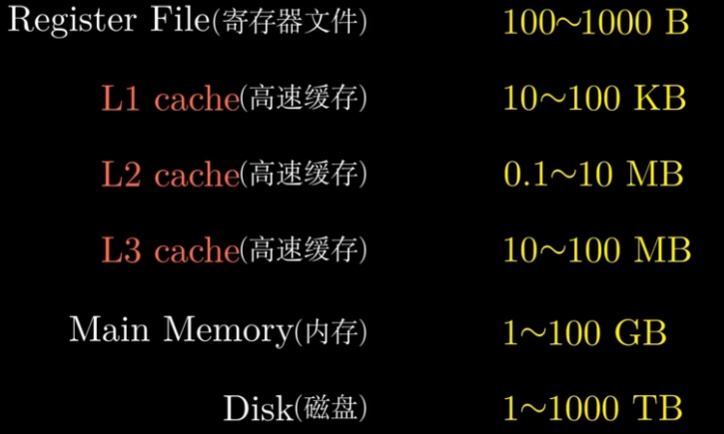

**存储层次**


>真正操控硬件的是**操作系统**
>所有的应用程序对硬件的操作必须通过操作系统来完成。
>目的有二：
>1.防止硬件被失控的应用程序滥用
>2.系统提供统一的机制来控制这些复杂的底层硬件

**抽象的概念：**


## 进程
借助hello程序运行的场景来解释 **进程**


通过shell进程加载hello进程，shell进程系统调用。
系统调用会将控制权从shell进程传递到操作系统，操作系统保存shell进程的上下文，然后创建一个新的hello进程及其上下文，将控制权转交给hello进程。
hello进程结束，系统就会恢复shell进程的上下文，并将控制权交给shell进程，shell进程等待下个命令行的输入。

Context（上下文）：操作系统会跟随进程运行中所需要的所有状态信息。（PC和寄存器的值，内存的内容等等）（第八章）

一个进程由多个线程组成，共享代码和数据。


## 虚拟内存
>它为每个进程提供了一个假象，就是每个进程都在独自占用整个内存空间。
>每个进程看到的内存都是一样的，便是 **虚拟地址空间**

虚拟地址空间：


第一个区域用来 **存放程序的代码** 和 **数据**
该区域的内容是从可执行目标文件中加载而来的。
C语言中，全局变量便是放在这。

第二区域 堆（malloc）
Memory Allocate
堆可以运行时动态的扩展和收缩

第三区域，共享库的存放区域
C语言标准库和数学库这种共享库的代码和数据

第四区域，用户栈
函数调用本质就是压栈：每次当程序进行函数调用的时候，栈就会增长，函数执行完毕返回时，栈就会收缩。
需要注意的是：栈的增长方向是从高地址到低地址。

最顶部区域，内核保留的区域
对应用程序是不可见的。

> Linux系统的哲学思想是：一切皆为文件（Everything is File）
> I/O设备，键盘，磁盘，显示器，网络都是文件。


>从一个系统来看，网络也可以视为一个IO设备

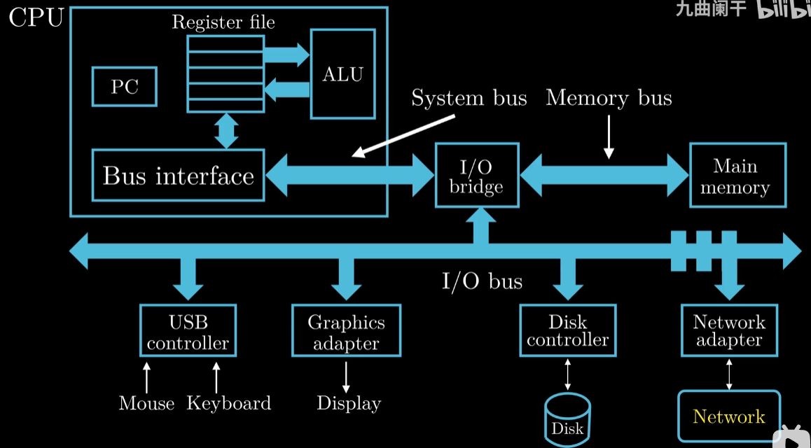


如何用ssh，通过网络在远程主机上运行hello程序。

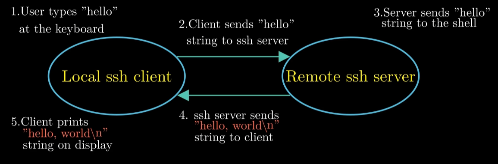

## 阿姆达尔定律 Amdahl's Law

定量的看一下系统的加速比。
>定律的主要思想是，当我们对系统的某一部分进行加速时，被加速部分的重要性和加速程度是影响整体系统性能的关键因素。

假设一个应用程序的执行所需要的全部时间用Told表示。
红色部分为不可加速，另外一部分是可加速的。
其中可以加速部分速度 = a \* Told
所以不可加速部分为： Told - a \* Told = (1-a) Told

可加速的性能比例为k
可加速所花费的时间就是 (a\*Told)/k
最后可以得到加速比S


>因此，如果我们需要把系统的性能提高到2倍甚至更多，我们需要优化大部分组件。

**如何获得更高的计算能力？Concurrency（并发） and Parallelism(并行)**
1. 线程级并发
2. 指令级并行
3. 单指令，多数据并行


## 线程级并发

多核处理器的组织结构：


超线程（hyperthreading）/同时多线程

CPU内部，PC和寄存器存在多个备份，浮点运算部分只有一份。

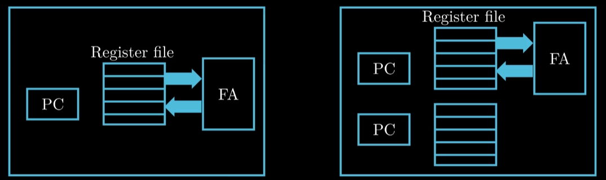
超线程处理器可以在单周期的基础上决定执行哪一个线程。

## 指令集并行


近几年的处理器可以保持每个周期2-4条指令的执行速率。

## 单指令，多数据并行
单指令，多数据(Single Instruction Multiple Data,SIMD)
SIMD指令多是为了提高处理视频，以及声音这类数据的执行速度。


## 计算机系统的抽象 **

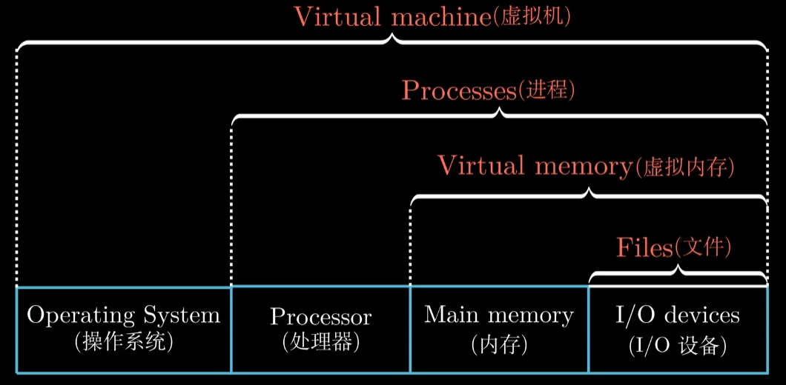

# 第二章 信息的表示和处理

Summary
1. Information Stroage（信息存储）
2. Integer Respresentations（整数表示）
3. Integer Arithmetic（整数运算）
4. Floating Point（浮点数）

## 2.1 信息存储
>通常情况下，程序将内存视为一个非常大的数组，数组的元素由**一个个字节**组成。每个字节都有唯一的数字表示，也就是**地址**。
>所有地址的集合——虚拟地址空间（virtual address space）

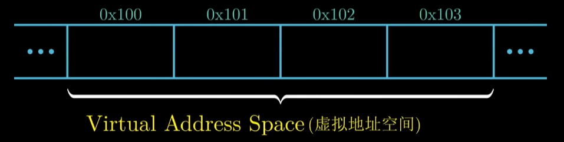
### 字节 Byte

>1 Byte = 8 bit


### 16进制数 Hexadecimal Notation
>十六进制好处：节省显示位置，方便与2进制转换。

十六进制表示：

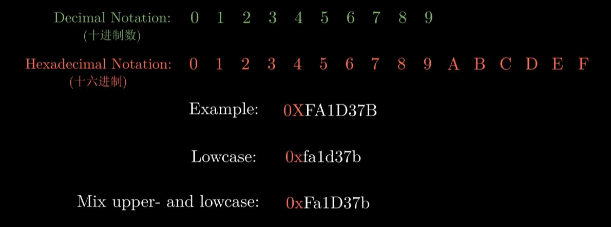
无论是大小写，还是混合都正确。

二，十，十六进制的转换。

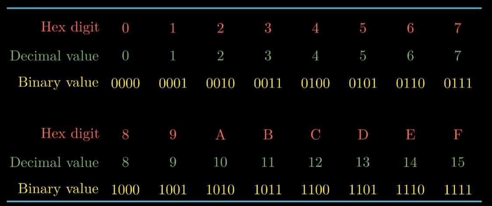
十六进制的转换比较直接，从图中能看出来。

>CSAPP原书介绍了一个小技巧：（好像没必要记住）
>记住 十六进制的 A,C,F
>那么B，D的数值可以由AC加一得到，E的数值可以由F减一得到。


#### 十六进制与二进制转换

>从最后一个，每四位分成一组，若最前一组出现没有四位的情况，那就补0


>记住这个： 2^(n)  -> n = i + 4j
>其中 
>i = 0 ，1，2，3
>hex = 1，2，4，8... 2^(i) (十进制)


#### 十进制与十六进制转换

>一直除 16，把余数拿来当作位数即可。

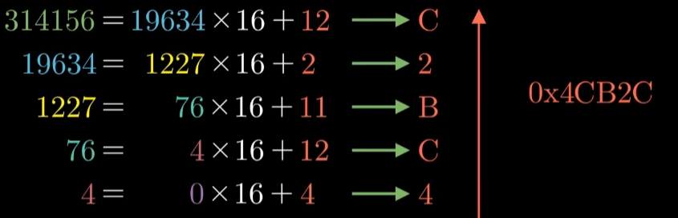
>对16进制，对应位置乘以 16^(i) 即可。


### 字 Word

**字长**

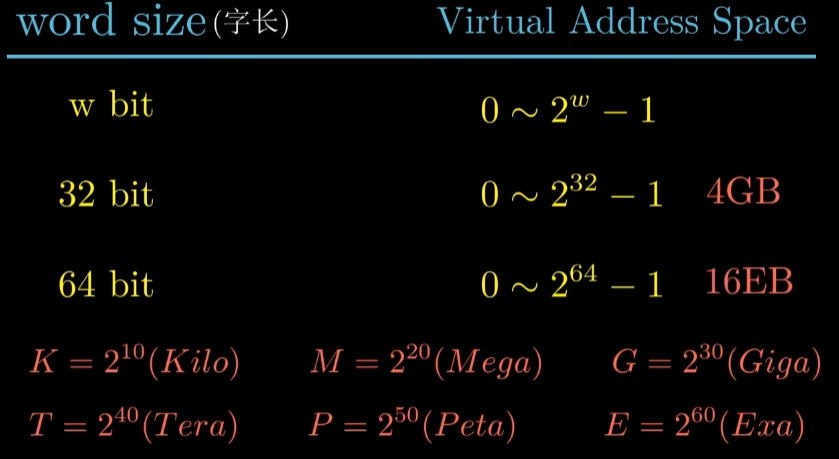

>大多数64-bit的机器做了向后兼容，因此32-bit可以在64-bit的机器上运用。
>主要的区别是：程序是如何编译的。

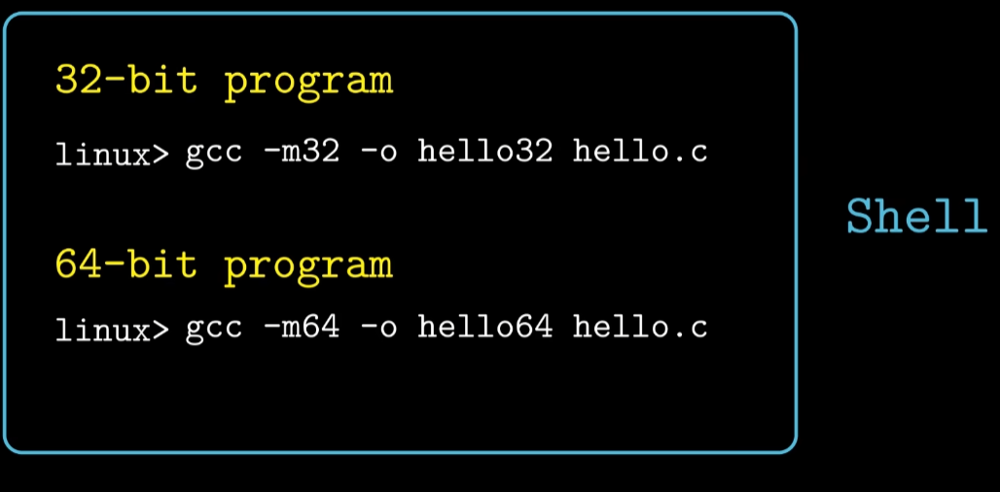
表格：C 的各个数据所占字节数的大小。


### 变量所在地址 *

>重点：**大端法(Big endian)**，**小端法(Little endian)**
>新的处理器，支持双端法，但android和IOS只支持小端法。


CSAPP原书在四个系统中尝试字节打印程序：

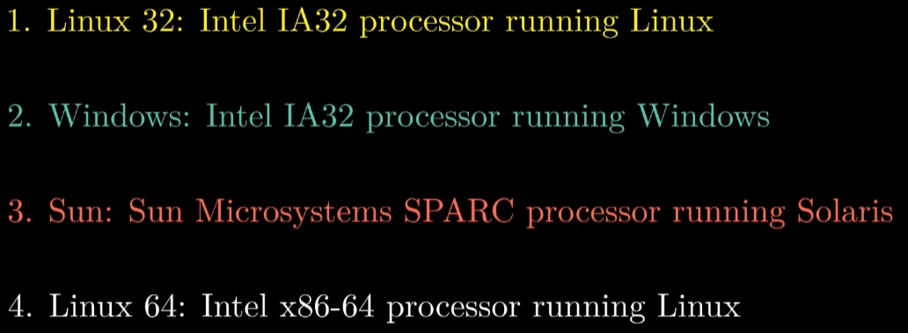

打印字节程序


其中：byte_pointer是强制切换为字节的序列。

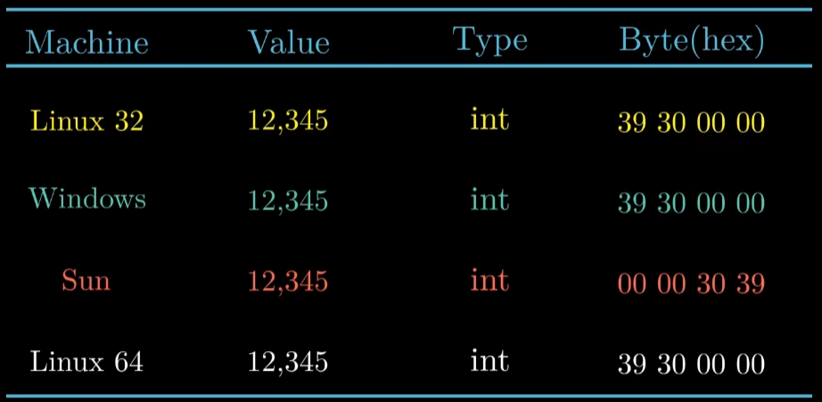
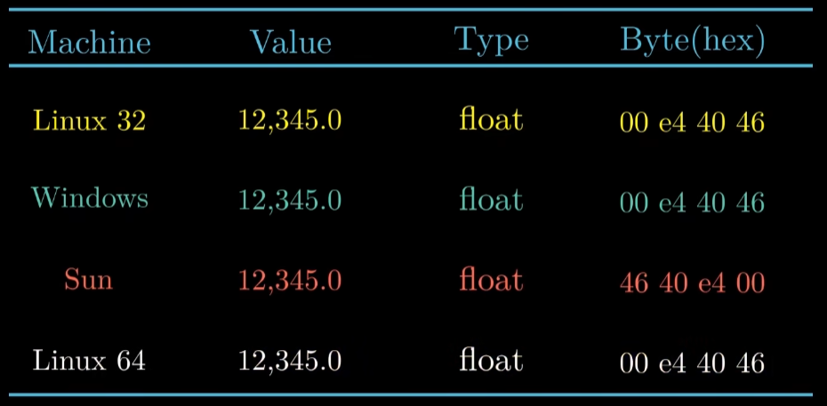

因为不同操作系统使用不同的存储分配规则，指针的值是完全不同的。且32位用4Byte的地址，64位用8Byte的地址。

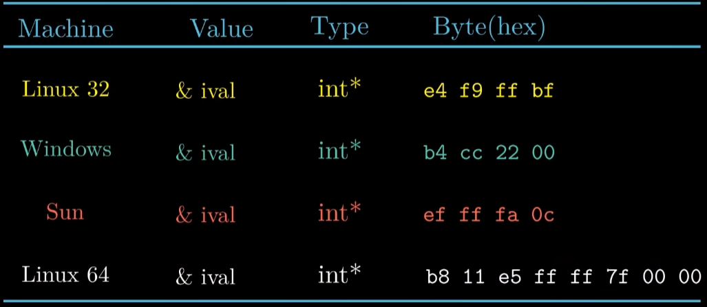
虽然整型和浮点数都是12345进行编码，但是却有完全不同的字节模式：

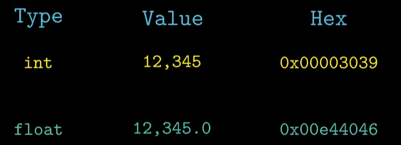

若换成二进制，并进行适当的移位，就发现有13个位的匹配：

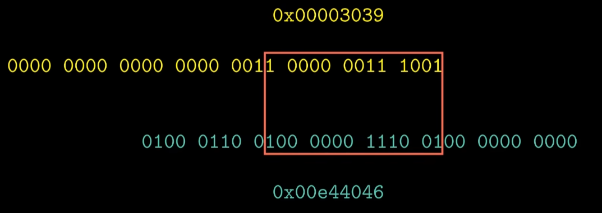

> C语言的字符串被编码为以NULL字符结尾的字符数组。

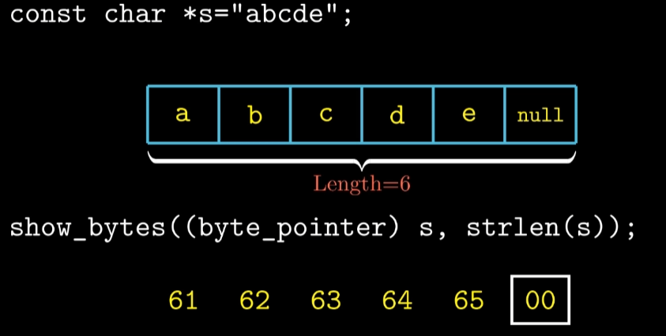

### 布尔运算 *

>重点如图所示。与，非，或，异或。


C语言的特性：按位级运算支持布尔运算。

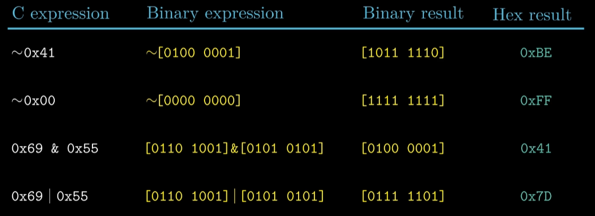
> 位运算的常见场景便是**掩码运算**

例如：对于一个数组，如何去获取最低有效数值？可以通过 & 0xFF

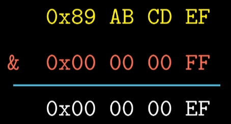

#### 逻辑运算：
(只有 True 和 False)


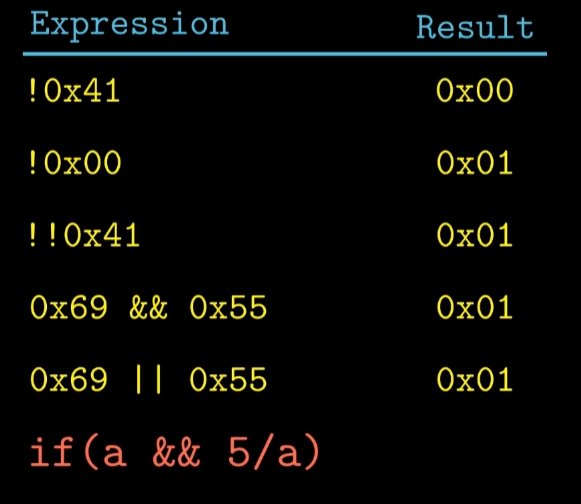
#### 移位运算：

>右移 分 逻辑右移 和 算术右移

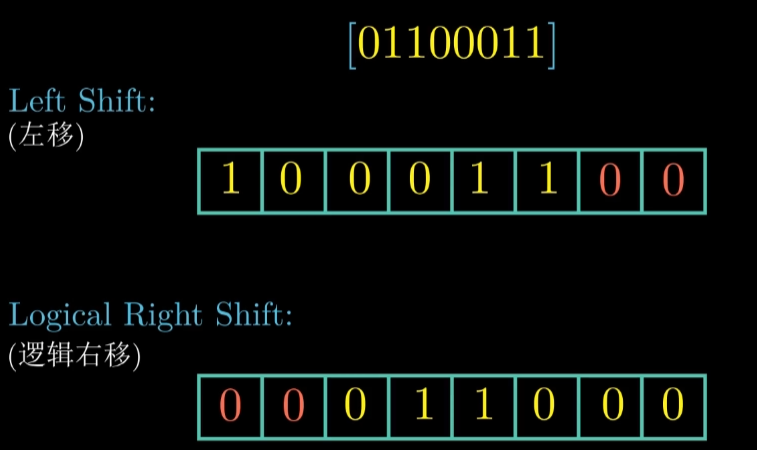

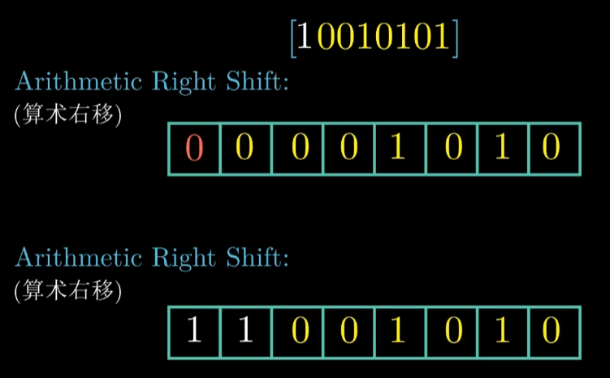
再看看例子：


>实际上，几乎所有的编译器以及机器的组合都是对**有符号数**使用**算术右移**，**无符号数**就是 **逻辑右移**


## 2.2 整数的表示

表格(64位机器上的取值范围）：

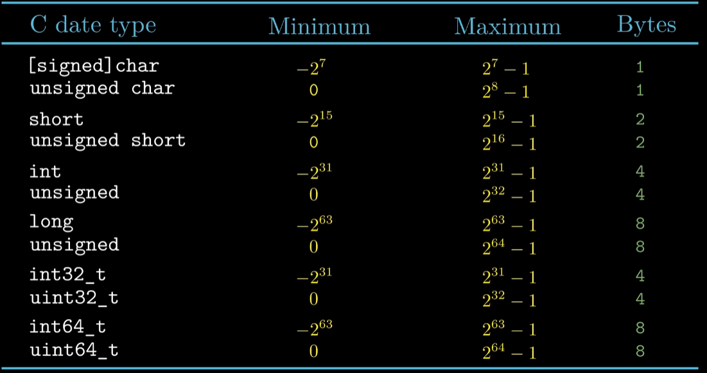
>long类型的大小：取值范围是与机器字长相关的。


### 无符号数编码

>假设一个整数的数据类型有w位，用向量x来表示。
>把向量x看成一个二进制表示的数，每个元素=一个二进制位，每个位取值为0/1;
>B2U = Binary to unsigned

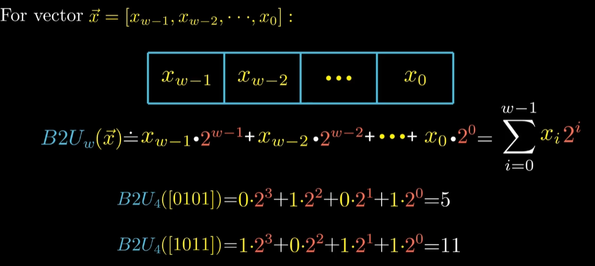

CSAPP原书的图形表示法：


### 有符号数编码 
Two's Complement Encodings （补码）

>主要注意的是，最高位的权重是 **负数**

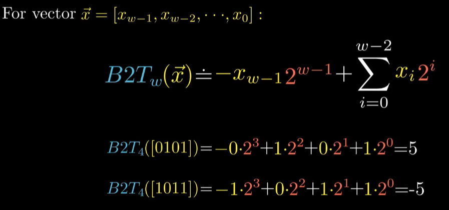
补码图形化：


### 可表示的整数范围

无符号数：

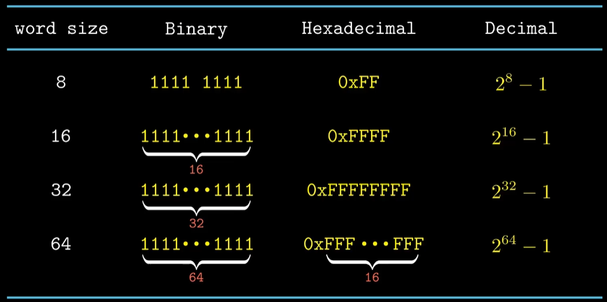

有符号数：
最大数：


最小值：


特别注意： 


例子：

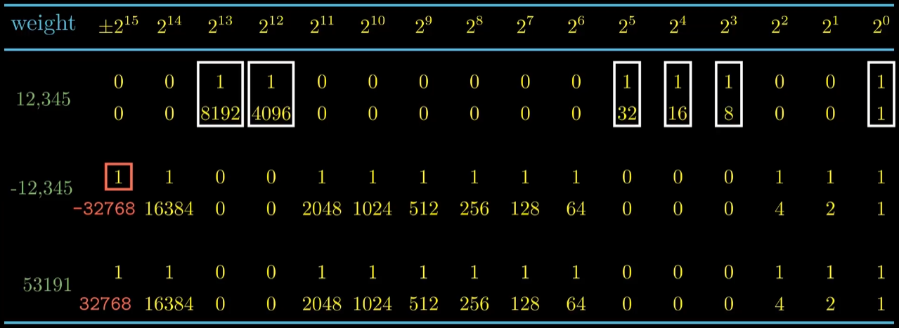


### 有符号数 / 无符号数的转换

通过强制转换，就会出现问题：

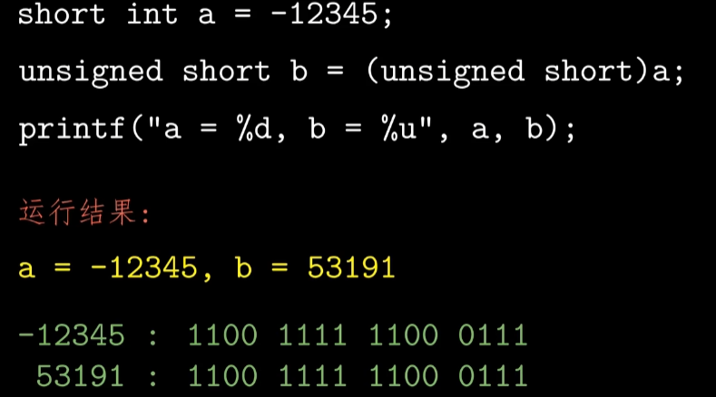
>位模式不变，解释这些位的方式改变了。

**有符号数与无符号数之差**
> B2U = 无符号数
> B2T = 有符号数 
> T2U= 有符号数到无符号数的函数映射


>有符号数到无符号数的规则：
>当有符号数为正数，那么就是 相同的数
>当有符号数为负数，那么就是 数值 + (最大的位+1)

>无符号数到有符号数的规则：
>当无符号数的最高位=0，那么就是 相同的数
>当无符号数的最高位=1，那么就是 数值 - (最大的位+1)


C语言会隐式的将有符号数强制转换为无符号数来执行运算。


>将一个较大的数据类型 转换 较小的类型 是不可能的。
>但较小的数据类型 转换 较大的类型 是可以的。


无符号数的转换：**零扩展**


#有符号数的转换： 符号位扩展


原书内容：

>数学归纳法

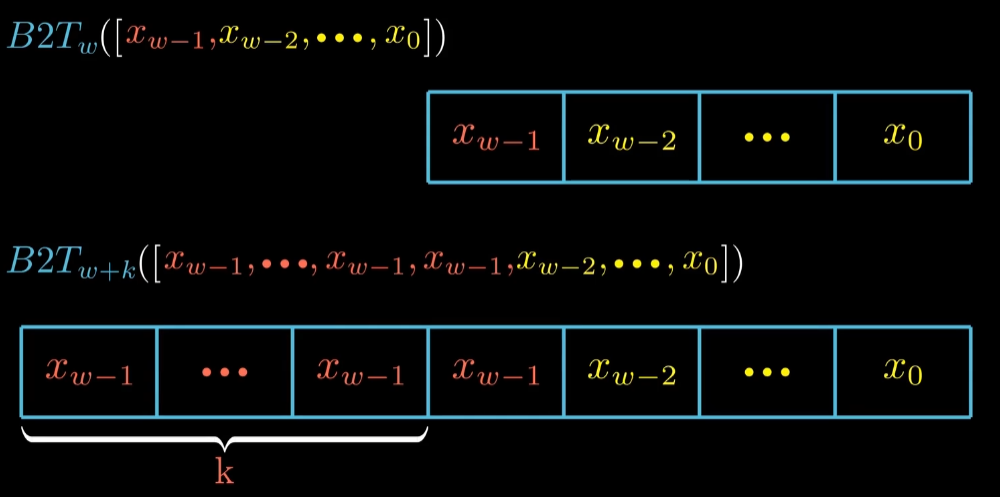

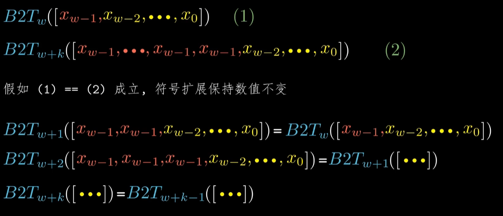


>较大数值 -> 较小数值
>高16位被丢弃，只留下低16位的数据. 

>总之，无符号数以及有符号数的转换会出现一些难以发现的错误（非直观）。了解这类知识，就避免这种问题。


## 2.3 整数运算

### 无符号数加法：


>产生这个结果的原因是 以及超过char的数值。(溢出)

引入无符号数的加法的标志：


两个无符号数加法的情况：


原因：


>由于加完1就溢出了，为了避免位数增加，因此变成这样，且不会报错。

**判断溢出：**

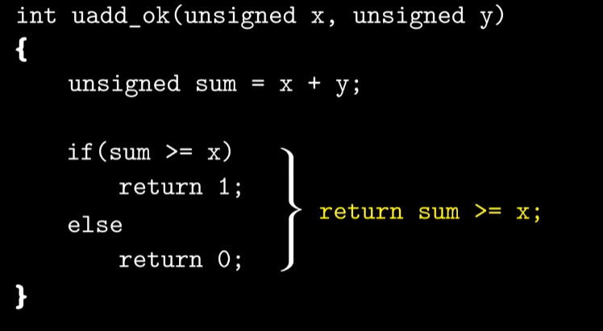
原理：

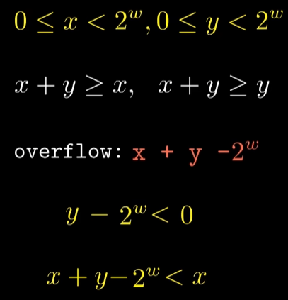

### 有符号数加法：

引入符号：


情况：


例子：


原理：

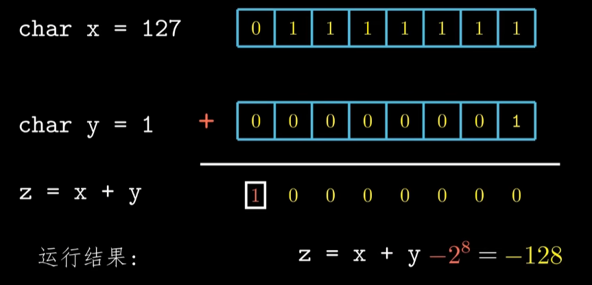

**检测是否发生溢出：**
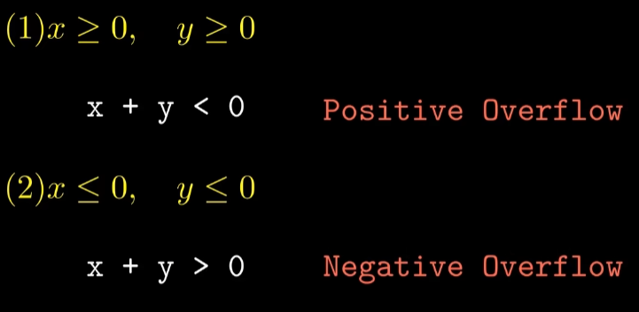


### 加法逆元（Additive Inverse）

图中：x' 便是 加法逆元。


**无符号数的逆元：**

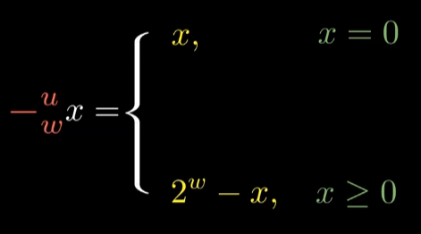
**有符号数的逆元**


### 乘除运算

**无符号数**


C语言中，定义了无符号数乘法所产生的结果是w位
因此结果会截取低w位的成果。——取模


**补码**

>与无符号数多了一个操作，就是把无符号数**补码**——转成有符号数

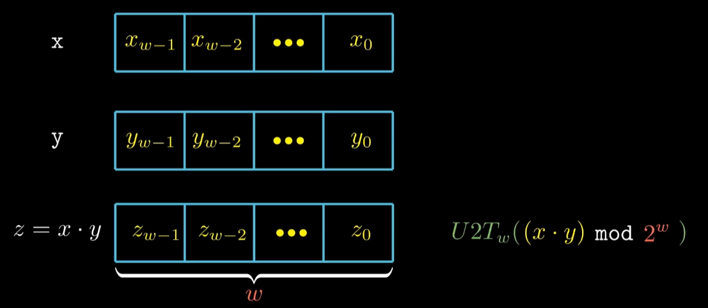
例子：


>虽然有符号数和无符号数在计算出来的位级表示可存在不同，但是截断后是**相同的**。

通过数学的方法来表示。 x，y有符号数，x' , y' 为 无符号数。


有符号数和无符号数的关系如下：


取模的推导过程：

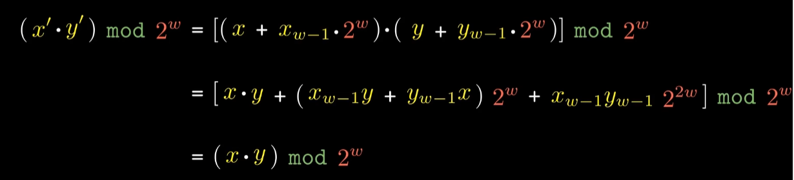
很多C语言的编译器试图用**移位**、加法以及减法来代替整数乘法操作。

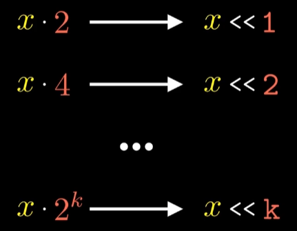
移位操作通过数学公式表达：


例子：


### 除法（右移）

>对于无符号数采用的是**逻辑右移**，而有符号数采用的是**算术右移（补1/0）**


会遇到除不尽的情况：

3.14向零舍入的结果是3，-3.14向零舍入的结果是-3
(1)正数，向下舍入
(2)负数，向上舍入

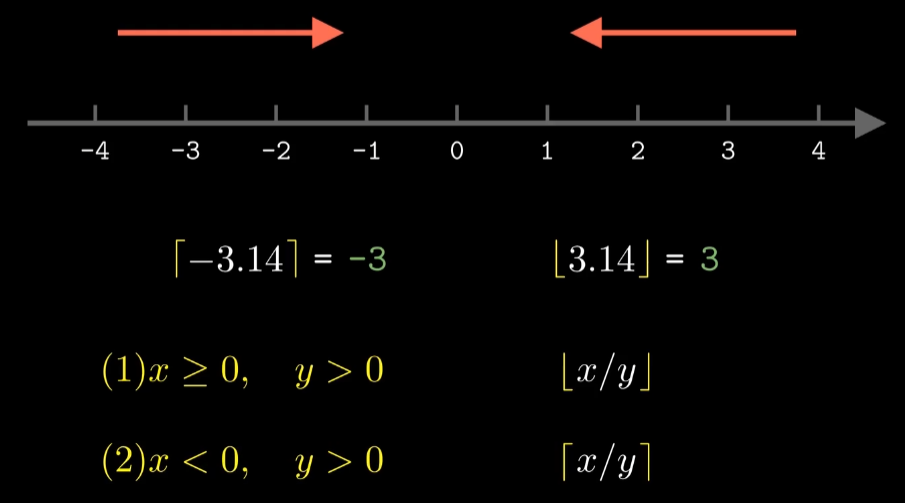
**无符号数除以2的幂的情况**

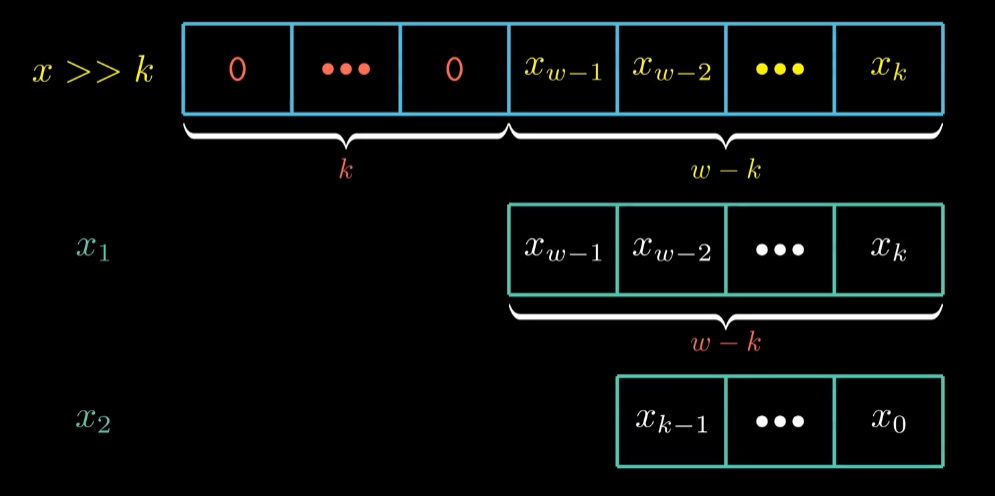

> x >> k：进行右移K位

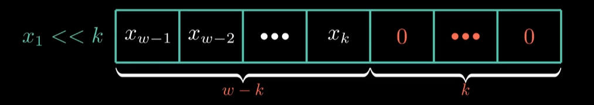
> x << k: x左移K位 = x1 × 2^(k)

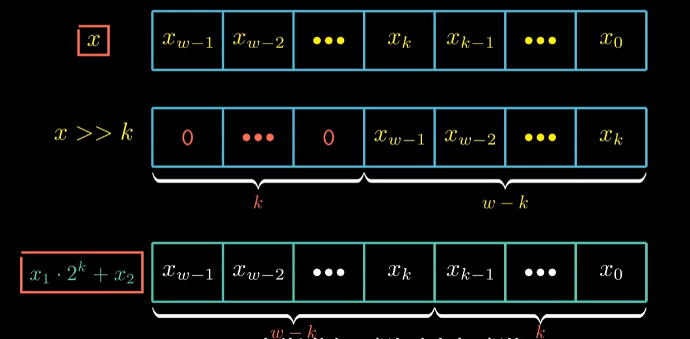
>x1 左移 k位 与 x2 相加之和 与 x 相等。

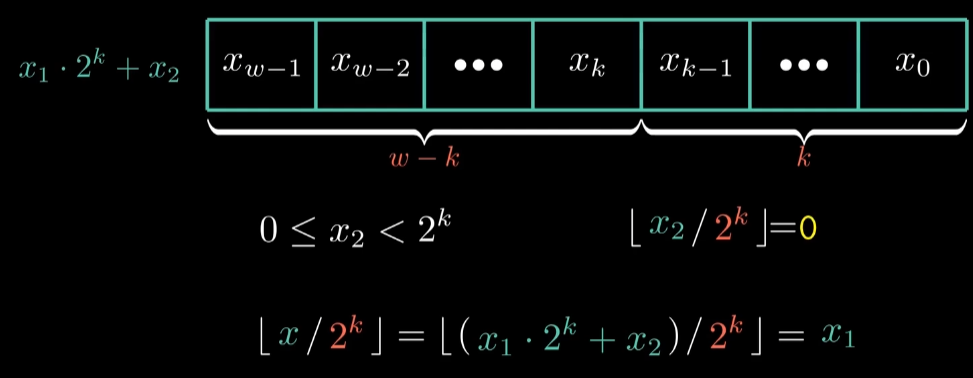
>由于 x2 的长度为 k 位， 因此 x2 的取值范围大于等于 0 ，小于2 的k 次方
>x 除以 2 的k次方，取整的结果 = x1


**补码**


>特别注意：当需要舍入时，移位导致 -771.25 向下舍入为 -772
>我们期望得到的结果是-771。
>因此需要加入偏置，修正这种不合适的舍入。


>当右移四位时，偏置量 = 15（1 << 4 -1)
>当右移八位时，偏置量 = 255 (1 << 8 - 1)
>注意红圈的位置。


> (1) 先加入偏置量，再进行**算术右移**
> (2) 直接进行**算术右移**

## 2.3 浮点数 Floating Point

考虑含有小数值的二进制数

十进制表示小数：

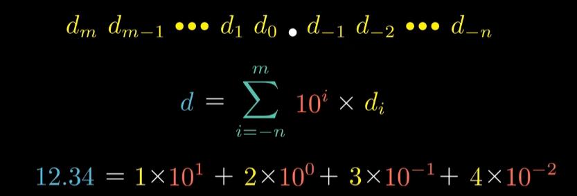
二进制表示小数：


IEEE对浮点数的表示：

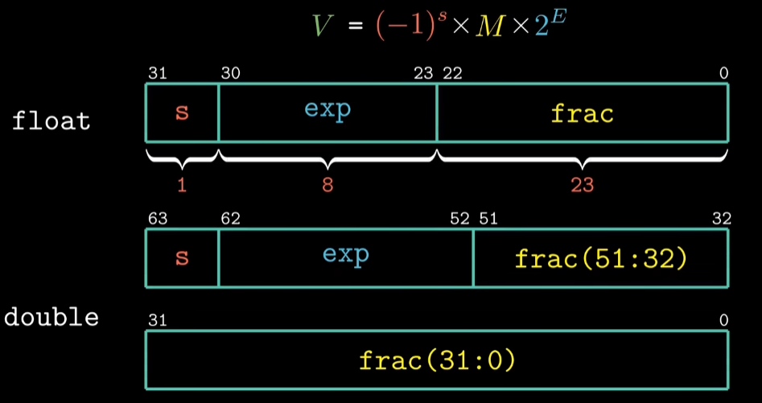

>以上红色的数字代表长度。
>exp与阶码的值是相关的
>frac与尾数M是相关的

浮点数的数值分为三类：
1. 规格化的值
2. 非规格化的值
3. 特殊值


### 规格化的值

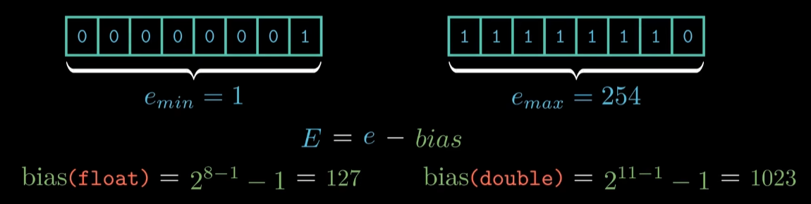
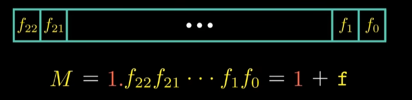

>单精度浮点数：
>阶码的最小值是 -126，最大值是127
>小数字段：M = 1+f
>1 是 因为 我们可以调整E的取值，使得尾数M的取值范围大于等于1，小于2，既然第一位总是1，就没必要显示的表示出来。

### 非规格化的值


>与规格化的解释方法不同。

### 特殊值


>NaN 的意思是 NOT A Number.
>当阶码字段全为1，且小数字段不为0时，可以表示NaN。

**例子：8为浮点数的表示**

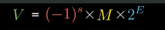

非规格化：


规格化、特殊值：


在之前进行过整型数和单精度浮点数的对比：


通过移位，发现二者有一段数位是相同的。


通过 转换 就能发现为什么会有数位相同的情况。

### 整型 转换 浮点数

整型 12345 如下，因为高位都是0，所以忽略。

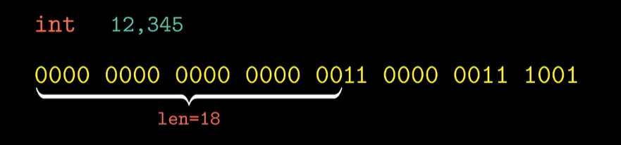
根据规格化的表示规则，如下表示：可以发现阶码E的值=13


由于单精度小数字段长度为23，末端需要补0：


这样就获得了浮点数的小数字段。

阶码E的值=13 ，由于单精度的浮点数bias = 127 （固定值），并可以通过以下公式进行计算：

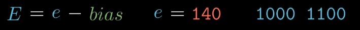
这样浮点数的表示就出现了。


由于表示方法原因，限制了浮点数的范围。

希望可以找到“最接近的值 x' 代替x”


IEEE定义了四种舍入方式：
1. 向偶数舍入(Round-to-even)
2. 向零舍入(Round-toward-zero)
3. 向下舍入(Round-down)
4. 向上舍入(Round-up)

**向下舍入，向上舍入，向零舍入：**


**向偶数舍入（向最近的值舍入）**

>当遇到两个可能结果的中间数值时（1.5，2.5），才需要进行这个舍入判断。
>一句话： **四舍六入五偶**


>为什么要用？
>因为如果总是用向上/向下舍入，会导致结果的平均值对于真实值略高/略低。
>向偶数舍入就避免这种偏差，让向上/向下舍入都有50%的概率。

例子：**四舍六入五偶**


二进制也能进行舍入：

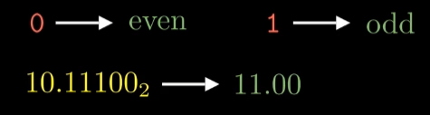

## 浮点数加减乘除：
>浮点数加减法不具备**结合性**(会通过舍入丢失)
>乘法不具备结合性（溢出和舍入导致丢失）
>乘法在加法上不具备**分配性**。

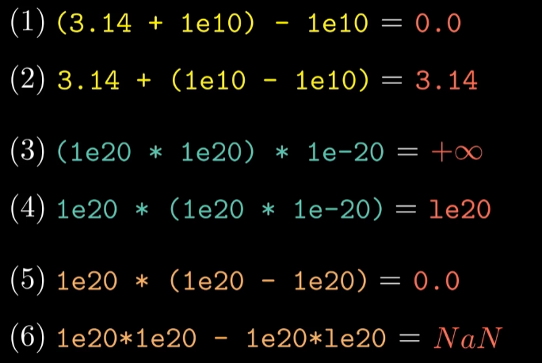
## int , float , double

1. int ——> float
	- 数值不会发生溢出，但是可能会被舍入
		- 单精度浮点数的小数字段为**23位**，可能会出现无法保留精度的情况。
2. int/float ——> float
	- Double类型有更大的范围，可以保留精确数值。
3. double ——> float
	- float类型数值范围更小，可能会发生溢出。
	- 精度也较小，转换后还可能被舍入
4. float/double ——> int
	- 值会向零舍入。
	- 发生溢出。

# 第三章  程序的机器级表示 （上难度了）

>详细提及：C语言，汇编代码，机器代码之间的关系

## 3.1 机器级表示

C代码例子：


```
linux > gcc -Og -o prog main.c mstore.c
```

>其中 （第七章详细讲解）
>gcc = GCC编译器，是linux系统上默认的编译器。
>-Og = 编译选项，告诉编译器生成符合原始C代码整体结构的机器代码。
>（为了获得更高性能，会使用 -O1 -O2，但是使用高级别的会产生变形)
>-o prog = 生成可执行文件的文件名

### C代码 转换 汇编代码-S(.s)

其中用 mstore.c 看看 C代码和汇编代码之间的关系。


>利用linux那一行的指令，便能生成出mstore.s的汇编代码。
>其中 -S 告诉编译器GCC产生的文件为汇编文件。

大致文件内容：

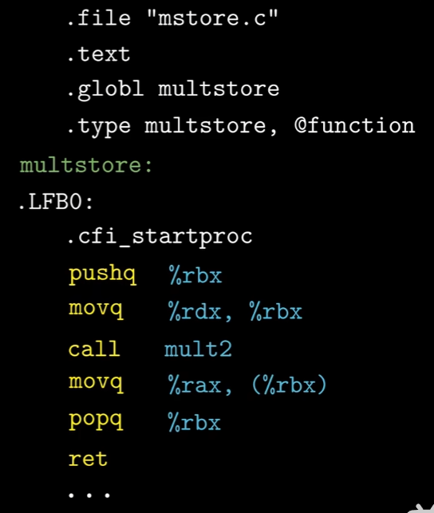

>白色的以“.”为开头的文字： 指导汇编器和链接器工作的伪指令。（在这可忽略）
>剩下的汇编代码与源文件中的C代码是相关的。

重点：
- pushq %rbx
	- 将寄存器rbx的值压入程序栈进行保存。
	- 理解这一步操作，先理解寄存器的背景故事。
- movq %rdx, %rbx
	- 将寄存器rdx的内容复制寄存器rbx。
	- 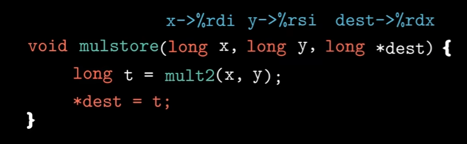
	- mov q ，q是数据大小。（看后面部分的数据类型）
	- 数据传送指令有四个变种：
		- movb
			- Move byte
		- movw
			- Move word
		- movl
			- Move double word
		- movq
			- Move quarter
- call mult2
	- 函数调用。
	- 该函数的返回值会保存到寄存器rax中（本代码rax保存了x和y的乘积结果）
- movq
	-  将寄存器rax的值送到内存(rbx)中
- popq %rbx
	- 恢复寄存器rbx的内容。
- ret 
	-  函数返回。

**寄存器背景故事**

>在Intel x86-64的处理器中包含了16个通用目的寄存器。
>这些寄存器用来存放**整数数据**和**指针**
>都是%r开头


>还需要了解两个概念：
>1.调用者保存寄存器
>2.被调用着保存寄存器

图中，func_A 调用了 func_B，因此func_A 是调用者 ，func_B 是被调用者。


>由于调用了函数B，寄存器rbx在函数b中被修改了（代码内容）
>逻辑上rbx的内容在调用函数b的**前后**应该保持一致。


解决方法：**先保存，后调用，再恢复。**
**调用者(Caller)保存**

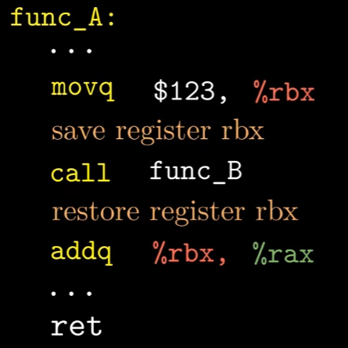

**被调用者(Callee)保存：**

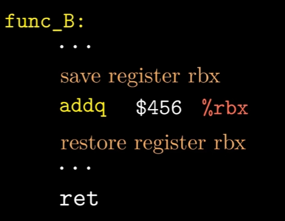

具体用哪个策略，每个寄存器都不同：具体为：

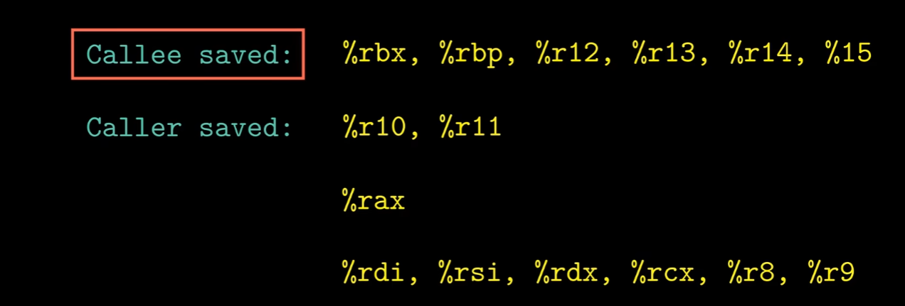
**数据类型的大小：**

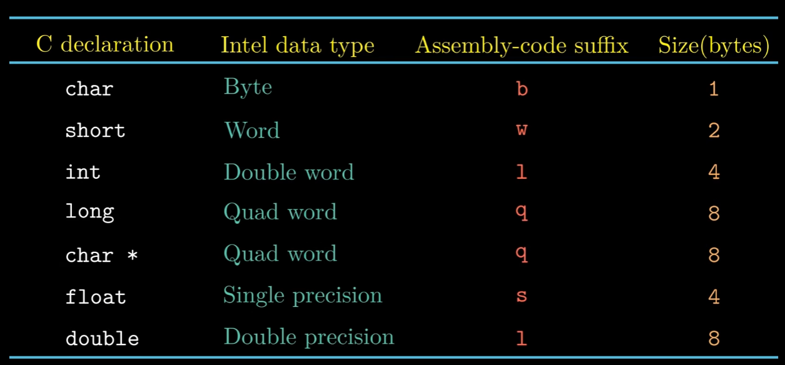

### C代码 转换成 机器代码-c(.o)


文件为二进制格式的，无法直接查看。
因此借助反汇编程序 objdump 
汇编器将汇编代码 翻译成 二进制的机器代码
反汇编器就是机器代码 翻译成 汇编代码


通过反汇编给出的代码：


>有区别，其中就和q有关。（q表示大小指示符）

## 3.2寄存器与数据传送指令

最早8086 CPU中，包含8个16位的通用寄存器。


CPU 扩展 32位 寄存器也扩展

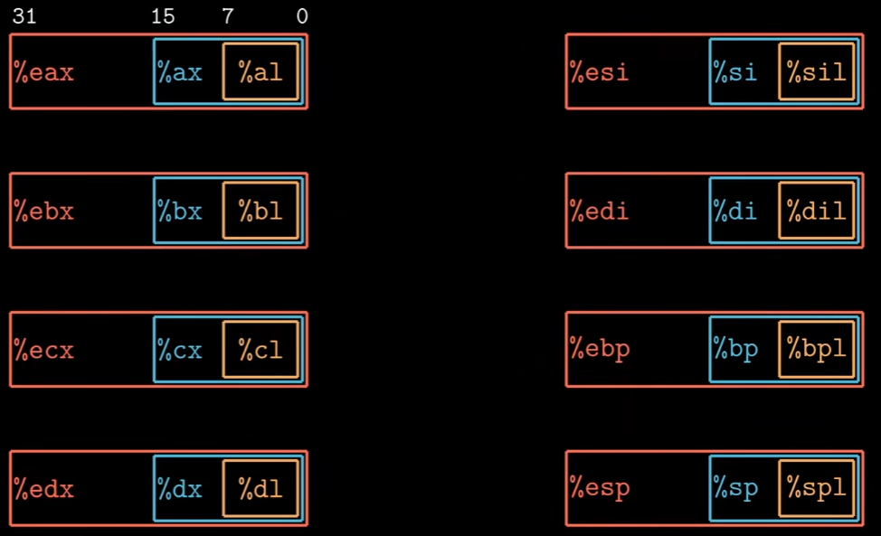
再到现在64位CPU，寄存器已经到64位。


寄存器有不同的用处：

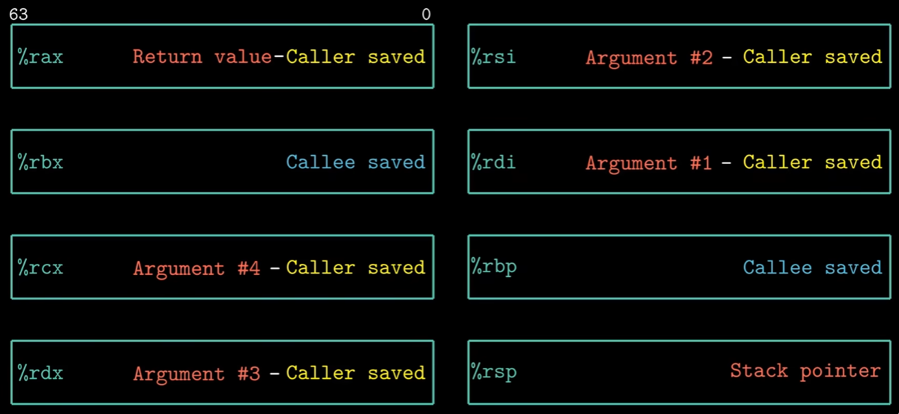


大多数的指令包含两部分—— **操作码** 和 **操作数**


**操作数**可以分为三类：
- 立即数(Immediate)
	- 在AT&T格式的汇编中，$符号开头，后面跟着整数（需要满足标准C语言定义）。
- 寄存器(Register)
	- %rdi,%rax...etc.
- 内存引用(Memory Reference)
	- (%rdi) 

### 内存引用 Memory

>要从内存中获得数据，需要**目的数据起始地址addr**以及**数据长度b**。Mb[addr]表示内存引用。


最常用的内存引用包含四个部分：
1. 立即数
2. 基址寄存器
3. 变址寄存器
4. 比例因子

其中的Imm（rb,ri,s) 是有效地址。


>比例因子的取值 与 源代码中 定义的 **数组类型** 是相关的。
>例如：
>char 比例因子 = 1
>int 比例因子 = 4
>double 比例因子 = 8

**内存引用的其他形式：**


### MOV 操作数 

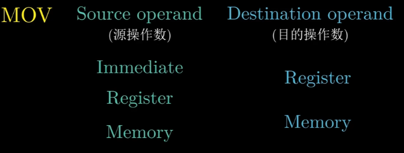
>x86-64处理器有一条限制，mov指令的源操作数和目的操作数不能都是**内存的地址**。（因为内存太慢了，所以不能这样做）

如果要 Memory ——> Memory，就只能这样做了。


>mov指令的 后缀 与 寄存器的大小 一定得是**匹配**的。
>例如：
>&eax 32位  movl 对应
>&al 8位 movb 对应

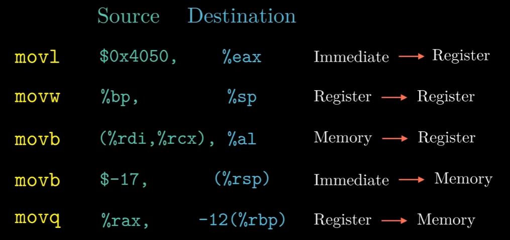


**特殊情况**

>立即数只能是 **32位** 补码表示。
>扩展后带到64位寄存器中。


>带来一个问题，当**立即数** 为 64位怎么办？

引入movabsq，该指令的源操作数可以是任意的64位立即数。目的操作数只能是**寄存器**。

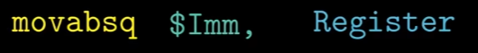
**例子：**

首先进行了movabsq的指令，寄存器保存数值如图所示。（注意：大端法）

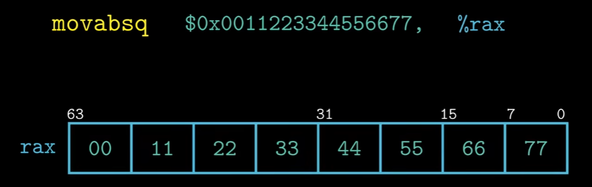
接下进行movb，低八位发生了变化。


再加上：

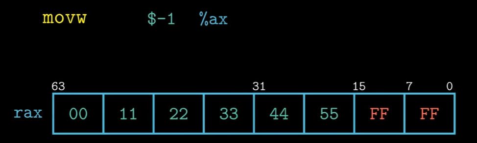

再来：

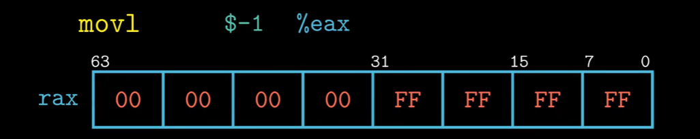
>当movl 的 目的操作数是寄存器时，会把该寄存器的高4字节**设置为0**
>这是x86-64的规定。

当源操作数的数位**小于**目的操作数时：
>需要对目的操作数剩余的字节进行**零扩展**或者**符号位扩展**。

零扩展：


符号位扩展：


>cltq 源操作数总是 %eax， 目的操作数总是 %rax

总结：


## 3.3 栈与数据传送指令

>先从计算机系统的视角，看一下程序执行时数据传送的情况。
>最初，可执行文件是保存在硬盘上。
>通过shell程序，将可执行程序从硬盘加载到内存。
>此时，程序指令以及数据都保存在内存中。
>实际上，在一些程序的执行过程中，需要CPU和内存之间进行频繁的数据存取。（所以为什么内存要靠近CPU）

假设：

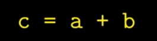

那么就得先：假设是64位处理器、%rax 为 8 Byte。

MOV Memory, Register

变量A为 long变量，因此也是 8 Byte，此时%rax就得存满变量A的数据。

如果变量A是int类型，那么就只需要4个字节来存储变量。(%eax)(低32位)

如果变量A是short类型，那么只需要2个字节，寄存器的低16位(%ax)


>虽然用的是不同符号，但是实际上是针对 **同一寄存器** 的 不同数位进行操作。

处理器完成加法运算和，会在通过**一条数据传送指令**将计算结果保存到内存。

>数据传输指令很常用，所以需要了解。

### 数据传送代码示例


其中exchange函数：

>x 放到 %rax 中

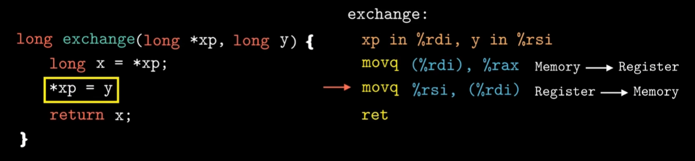
 >C语言所谓的指针其实就是地址。

### 程序栈

>还有两个数据传送指令需要借助**程序栈**。
>通过 push 压入栈 通过 pop 删除数据。

程序栈本质上是一个区域。图中User Stack便是。


栈顶在顶部，栈底在底部。

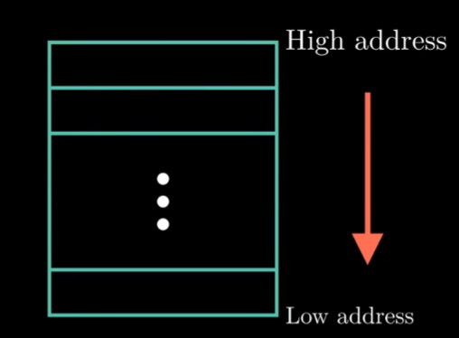
以下展示 pushq 的操作。


>pushq %rax =将%rax的数据放入栈中，等效以下两步：
>**subq $8，%rsp** 
>//这一步代表了 %rsp位置减8，从图中可知为什么要减8
>movq %rax,(%rsp)

>popq %rbx = 将栈顶保存的数据复制到寄存器rbx中，等效以下两条指令。
>movq (%rsp), %rbx
>addq $8,%rsp

>注意：popq 是通过**移动指针位置**进行删除的，并非真的删除数据。（这个是很常用的情况）
>就如同删除时数据是会保留，只有在被替代的时候才会消失。

## 3-4 算术和逻辑运算指令

### LEAQ
>功能：加载有效地址，q代表长度是4个字。
>因为64位处理器，因此不存在leab，leaw


这条指令的含义是把有效地址复制到寄存器rax中。

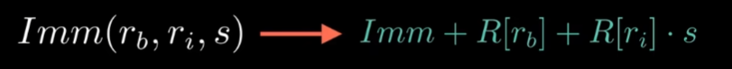
>有效地址的计算方式与之前讲到的内存地址的计算方式是一致的。


>这个代码并非为去内存地址(5x+7)处读取数据。
>而是将有效地址（5x+7）这个值直接写入到目的寄存器rax。

**leaq指令可以用来表示加法和有限的乘法运算**

以下scale函数代码编译后获得右侧的机器代码：


>其中：**x in %rdi， y in %rsi ， z in %rdx** （都是属于常规）

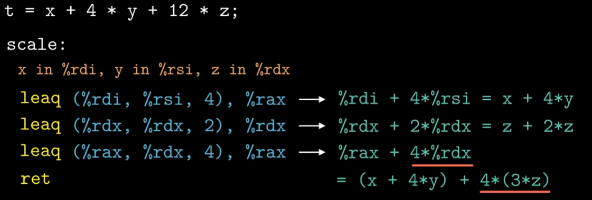

为什么不能用以下的代码？ 因为比例因子只有 1，2，4，8 。要操作就得拆分。

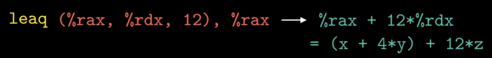

### 一元操作 Unary Operations

> 这一组指令只有一个操作数，因此操作数既是**源**，也是**目的**。

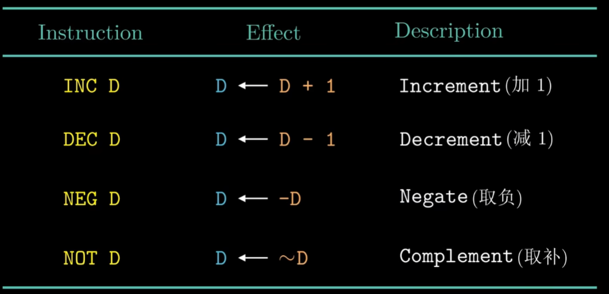
### 二元操作 Binary Operations

>这一组操作数包含两个：
>第一：源操作数：立即数，寄存器，内存地址
>第二：源操作数 /目的操作数：寄存器，内存地址，**不能是立即数**


例子：

一开始，内存以及寄存器中所保存的数据如图所示。

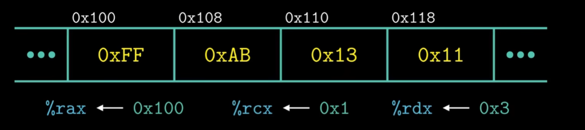
>(%rax) => 0x100地址的内存
>以下为：0x100的数据和%rcx 相加， 再存到0x100内存内。 （0x都是十六进制）


具体效果：

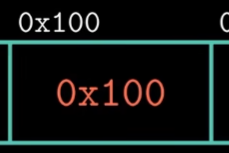
以下为：0x108的数据减去%rdx的数据，并再存到0x108内存中。


具体效果：


以下为：一元操作，自 +1;

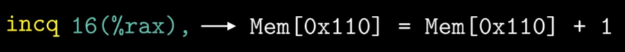

具体效果：

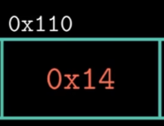

最后一个：二元操作： SUB S,D   D <—— D - S


>要记住，可以多做书中习题。

### 移位运算

>**算术右移**和**逻辑右移**和C语言讲述的移位操作是一致的。

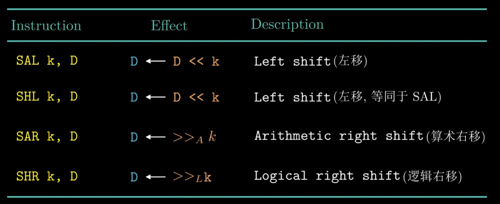
### 移位量k Shirt Amount

>可以是立即数，或者是放在寄存器cl中的数。（只允许%cl）
>移位量的编码范围 = 2^8 - 1 （255）

> 对于 **w位** 的操作数进行移位操作。移位量是由 寄存器cl 的 **低m位** 来决定。


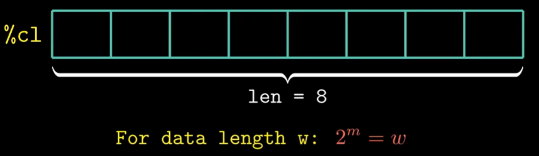

对于指令salb ，对低3位来决定。(btye = 8 = 2^3)


salw，低4位来决定。(word = 16 = 2^4)

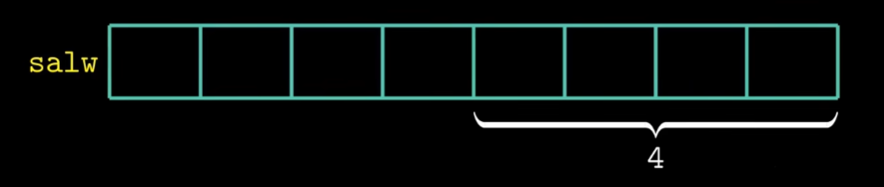
以此类推，双字对应的是低5位，四字对应的是低6位。


>如果数据只有8位，最多只能移动8为，如果移位9，就取9%8 = 1 ，移1位。


例子：


重点看这一指令：


第一步：


第二步：


>为什么编译器不直接使用乘法指令进行运算？ 主要是执行需要更长的时间。


### 特殊的算术指令


