[toc!]

# 第 11 周： 局域网 LAN
## 5.4 ARP 协议（地址解析协议）
### MAC 地址（Media Access Control Address）/ LAN 地址 / 以太网地址 / 物理地址
MAC地址： 32位 IP 地址：
- 接口的网络层地址
- 用于标识网络层分组，支持分组转发。
MAC地址(或称LAN地址，物理地址，以太网地址)：
- 作用：用于局域网内标识一个帧 从 哪个接口 发出，到达哪个物理相连的其他接口
- 48 位 MAC地址（用于大部分 LANs），固化在网卡的ROM(只读存储器，Read Only Memory)中，有时也可以软件设置。
- e.g: 1A-2F-BB-76-09-AD

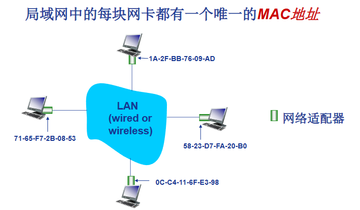

MAC地址由 IEEE（电气与电子工程师协会，Institute of Electrical and Electronics Engineers） 统一管理与分配。
网卡生产商购买MAC地址空间（前24 bit）
类比：
- MAC Address: 身份证号
- IP address：邮政地址

MAC地址是"平面" 地址 -> 可"携带"
- 可以从一个LAN 移动另一个LAN
 
IP地址是层次地址： ->不可"携带"
- IP地址依赖于结点连接到哪个子网

### 地址解析协议(Address Resolution Protocol，ARP)
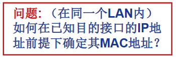
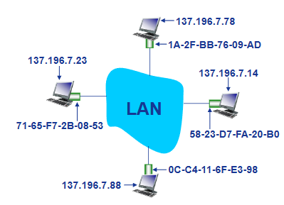
ARP表：LAN中的每个IP结点(主机，路由器)维护一个表。
- 存储某些LAN结点的IP/MAC地址映射关系：
- <IP地址; MAC地址; TTL>
	- 其中TTL是 **存活时间(Time To Live)**。指一个数据包(Packet)在经过一个路由器(Router)时，可传递的最长距离。（跳步数）：每经过一Router，TTL = TTL - 1.
- TTL:经过这个时间以后该映射关系会被遗弃(典型值为20min)

### ARP协议：同一局域网内（一系列过程）
- A想要给同一局域网内的B发送数据报(Datagram)
	- B的MAC地址不在A的 **ARP 表** 中
- A <font color="red">广播</font> ARP 查询分组，其中包含B的IP地址。
	- 目的MAC地址 = FF-FF-FF-FF-FF-FF
	- LAN 中 所有结点都会接收 ARP查询
- B 接收 ARP查询 分组，IP地址匹配成功，向A应答B的MAC 地址。
	- 利用 单播帧 向 A 发送应答
- A 在其 ARP表 中，缓存 B的IP-MAC地址对，直至超时
	- 超时后，再次刷新
- ARP 是"即插即用"(Plug-To-Play) 协议：
	- 结点自主创建 ARP 表，无需干预

### 寻址：从 一个LAN路由 至 另一个LAN
通信过程：A 通过 路由器R 向 B 发送数据报(Datagram)
- 关注寻址：IP地址（数据报中）和MAC地址（帧中）
- 假设A知道B的IP地址(How?)
- 假设A知道第一跳路由器R(左) 接口IP地址(How?)
- 假设A知道第一跳路由器R(左) 接口MAC地址(How?)

图：
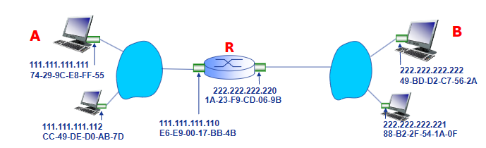


A 构造 IP 数据报，其中 源IP地址 是 A 的 IP地址，目的IP地址 是 B的IP地址
A 构造链路层帧，其中 源MAC地址 是 A 的MAC地址，目的IP地址 是  <font color="red">R(左)接口的MAC地址</font>，封装A到B的 IP数据报
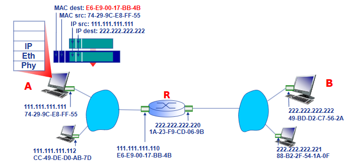
第二步：
帧从 A 发送到R
R接收帧，提取IP数据报，传递给上层IP协议
R 转发 IP 数据报（源和目的IP地址不变）
R 创建链路层帧，其中源MAC地址是R（右）接口的MAC地址，目的MAC地址是B的MAC地址，封装A到B的IP数据报。
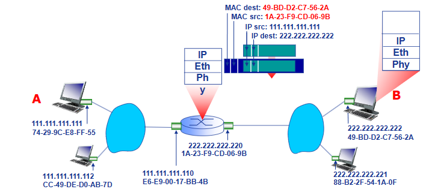
第三步：
数据报到达，然后让B主机解码数据报。
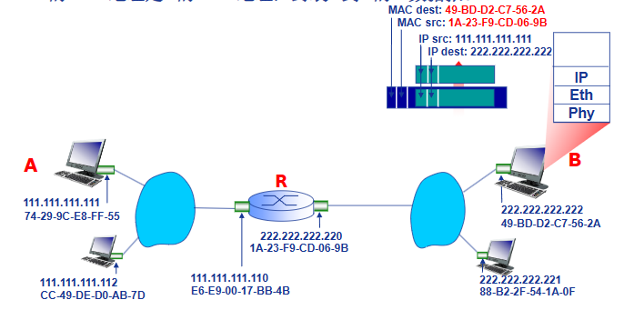
## 5.5 以太网
### 以太网 Ethernet
"统治地位"的有线LAN技术：
- 造价低廉（NIC便宜)
	- NIC (Network Interface Controller): 网络接口卡
	- 网卡是一块被设计用来允许计算机在计算机网络上进行通讯的计算机硬件。由于其拥有MAC地址，因此属于OSI模型的第1层和2层之间。它使得用户可以通过电缆或无线相互连接。
	- 每一个网卡都有一个被称为MAC地址的独一无二的48位串行号，它被写在卡上的一块ROM中。在网络上的每一个计算机都必须拥有一个独一无二的MAC地址。
- 应用最广泛的LAN技术
- 比令牌局域网和ATM等，简单、便宜
- 满足网络速率需求： 10Mbps - 10Gbps

#### 以太网：物理拓扑
- 总线(bus): 上世纪90年代中期前流行
	- 所有结点在同一 **冲突域(collision domain)**：可能彼此冲突
- 星型(star): 目前主流网络拓扑
	- 中心**交换机(switch)**
	- 每个结点一个单独冲突域：结点间彼此不冲突

总线示意图：
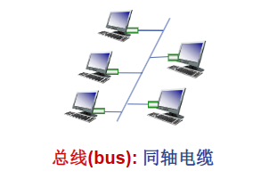
星型示意图：
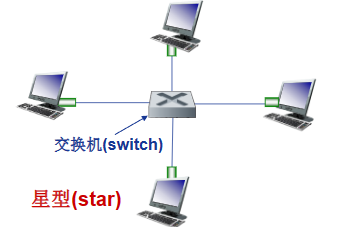

#### 以太网：不可靠、无连接服务
- **无连接(connectionless)**:发送帧的网卡与接收帧的网卡间没有“握手”过程
- **不可靠(unreliable)**:接收网卡不向发送网卡进行确认
	- 差错帧直接丢弃，丢弃帧中的数据恢复依靠高层协议(e.g,TCP),否则，发生数据丢失
- 以太网的MAC协议：**采用二进制指数退避算法的CSMA/CD**

### 以太网 CSMA/CD 算法
算法过程：
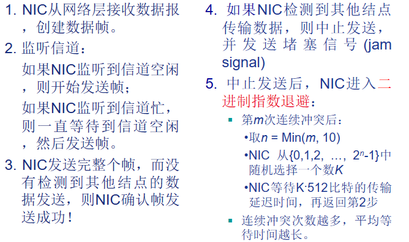

### 以太网帧结构：
图：

以太网帧存在以下结构：*\[自顶向下:P318\]*
- 数据字段( 46 ~ 1500 byte)
	- 这字段承载了IP数据报。以太网的**最大传输单元(MTU)** = 1500 byte，超过了这个量，必须分片。
	- 数据字段的最小长度 = 46 byte。 IP 数据报 < 46 byte，必须被填充到 46 byte (4.3.2 IPv4有讨论)
- 目的地址(6 byte)
	- 目的适配器的MAC地址，假设为：BB-BB-BB-BB-BB-BB，当适配器B收到一个以太网帧，帧的目的地址无论是BB-BB-BB-BB-BB-BB，还是MAC广播地址，它都将帧的数据字段的内容传递给 **网络层**。收到其他MAC地址的帧，丢弃。
- 源地址(6 byte)
	- 局域网上的适配器的MAC地址。
- 类型字段(2 byte)
	- 指示帧中封装的是哪种高层协议的分组（e.g，IP数据报，Novell IPX数据报，AppleTalk数据报）
- CRC(4 byte)
	- 循环冗余校验码：丢弃差错帧
- 前同步码(Preamble)(8 byte)
	- 前 7byte 的值 都是 10101010，最后一个byte = 10101011。
	- 前 7 byte 用于 “唤醒”接收适配器，。并且将他们的时钟和发送方的时钟同步。
		- 时钟不同步的原因：适配器不会以精确的额定速率传输帧，会发生 "漂移"
		- 接收适配器秩序通过锁定 前同步码 的 前 7byte 的 bit，就能锁定适配器A的时钟。
		- 前同步码 第 8 个 btye 的 最后2 bit 警告适配器B,"大的要来了"

### 802.3以太网标准：链路于物理层
许多不同的以太网标准
- 相同的MAC协议和帧格式
- 不同速率：2 Mbps ， 10 Mbps，10Mbps，1Gbps，10Gbps
- 不同物理介质：光纤，线缆。
图：
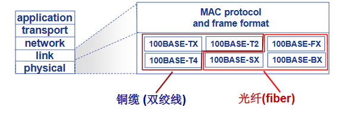

### 交换机 
**书本页数： P.322**

- 链路层设备
	- 存储-转发以太网帧
	- 检验到达帧的目的MAC地址，选择性(selectively)向一个或多个输出链路转发帧
	- 利用CSMA/CD访问链路，发送侦
- 透明(transparent)
	- 主机感知不到交换机的存在
- 即插即用(plug-and-play)
- 自学习(self-learning)
	- 交换机无需配置
#### 交换机：多端口间同时传输
主机利用独享(dedicated)链路直接连接交换机
交换机缓存帧
交换机在每段链路上利用CSMA/CD收发帧，但无冲突，且可以全双工
- 每段链路一个独立的冲突
域

**交换(switching)**:A-A’与B-B’的传输可以同时进行，没有冲突

图：
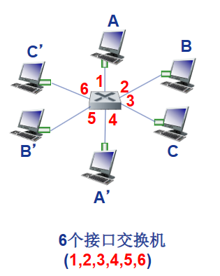

#### 交换机转发表：交换表
> Question:
> 交换机怎么知道A' 可以通过接口4到达，而B' 可以通过接口5到达？

**Answer**:
每个交换机有一个**交换表(switch table)**,每个入口(entry):
- (主机的MAC地址，到达主机的接口，时间戳)
- 看起来很像路由表！
>
>Q:交换表入口信息如何创建和维护的那？
>- 类似于路由协议？

**Answer:** 
交换机通过**自学习**，获知到达主机的接口信息

- 当收到帧时，交换机“学习”到发送帧的主机（通过帧的源MAC地址)，位于收到该帧的接口所连接的LAN网段
- 将发送主机MAC地址/接口信息记录到交换表中

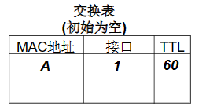

### 交换机：帧过滤/转发
当交换机收到帧：
1. 记录帧的源MAC地址与输入链路接口
2. 利用目的MAC地址检索交换表
3. 
```c
if 在交换表中检索到与目的MAC地址匹配的入口(entry）
then{
	if目的主机位于收到帧的网段
	then丢弃帧
	else将帧转发到该入口指向的接口
}
else 泛洪(flood)/*向除收到该帧的接口之外的所有接口转发*/
```

### 自学习与转发过程举例
图：
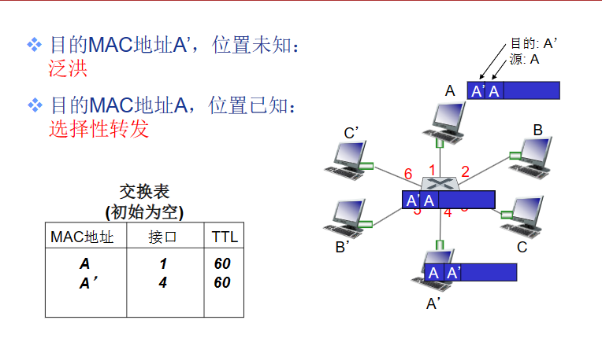

### 交换机互联
交换机可以互联。

这种连接在局域网中是非常常见的。

**Q:** 当A向G发送帧时，S,怎么知道通过S,转发？S又怎么知道通过S3转发？
**A:** 自学习！（工作过程与单一交换机情形相同！）

一个小题目：
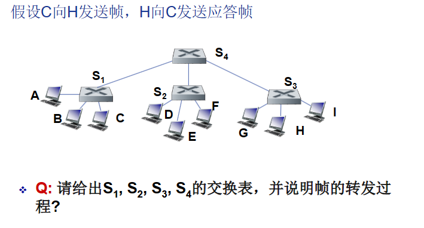

### 组织机构(Institutional)网络
很多组织结构都是这样的，特别是校园网。
图：
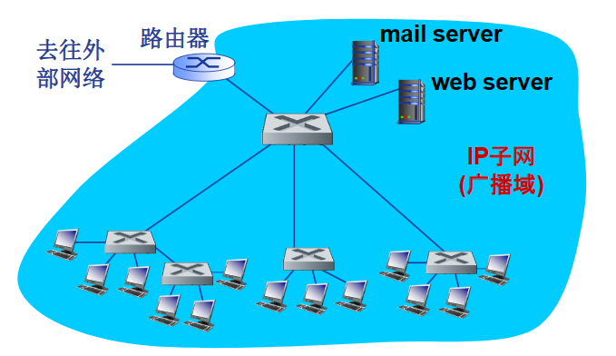


### 交换机 vs. 路由器[P.324]
两者均为存储-转发设备：
路由器：**网络层**设备（检测网络层分组首部)
交换机：**链路层**设备（检测链路层帧的首部)

二者均使用转发表：
路由器：利用**路由算法**（路由协议)计算（设置），依据IP地址
交换机：利用**自学习、泛洪**构建转发表，依据MAC地址

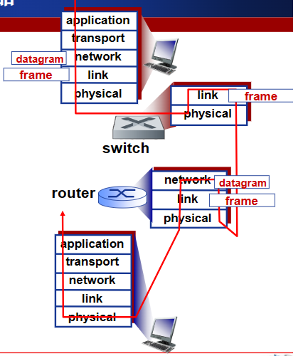
### 网络设备对比：
如图：
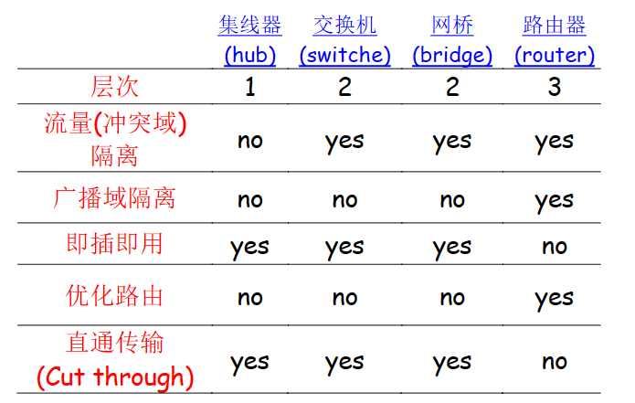

直通传输：一个接收接口接收后立马就给到另一个接口传输。

### 虚拟局域网（VLAN）[P.326]

动机：
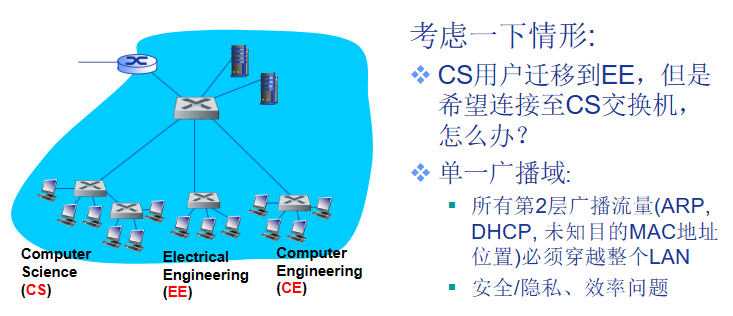

根据书中所说：
交换局域网总有一些缺点：
- 缺乏流量控制
	- 尽管该等级结构把组流量局域化导一个单一交换机中，但广播流量然必须跨越整个机构网络。
- 交换机的无效使用
	- 如果该机构不止有3个组，而是有10个组，则将要求有10个第一级交换机。
	- 但是如果每个组都较小，比如说10个人，则单台96端口的交换机将足以容纳每个人，但这台单一的交换机将不能提供流量隔离。
- 管理用户
	- 如果一个雇员在不同组间移动，必须改变物理布线。


虚拟局域网(Virtual Local Area Network)
- 支持VLAN划分的交换机，可以在一个物理LAN架构上配置，定义多个VLAN。
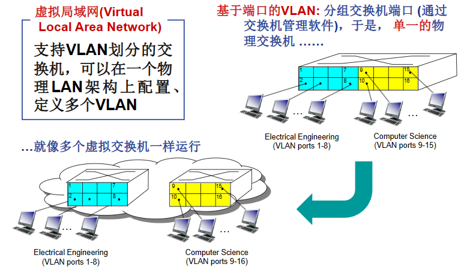

### 基于端口的VLAN

流量隔离(traffic isolation):
- 去往/来自端口1-8的帧只到达端口1-8
	- 也可以基于MAC地址定义VLAN,而不是交换端口

动态成员：
- 端口可以动态分配给不同VLAN

在VLAN间转发：通过路由（就像在独立的交换机之间)
- 实践中，厂家会将交换机与路由器集成在一起
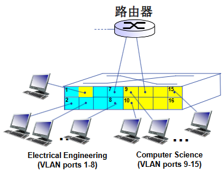


### 跨越多交换机的VLAN
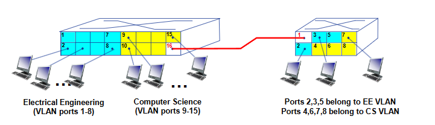
多线缆连接
- 每个线缆连接一个VLAN
中继端口(trunk port):在跨越多个物理交换机定义的VLAN承载帧
- 为多VLAN转发802.1帧容易产生歧义（必须携带VLAN ID信总）
- 802.1q协议为经过中继端口转发的帧增加/去除额外的首部域

### 802.1Q VLAN帧 格式
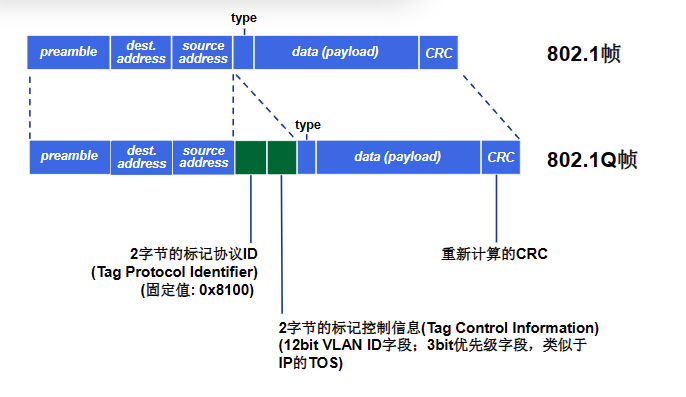

## 5.6 PPP 协议
PPP协议：PPP (Point to Point Protocol)
## 5.7 802.11无线局域网
