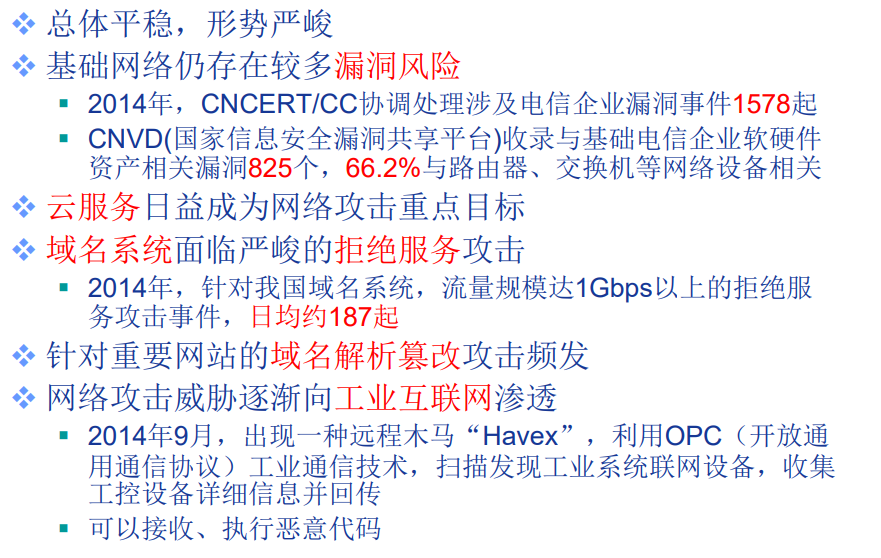
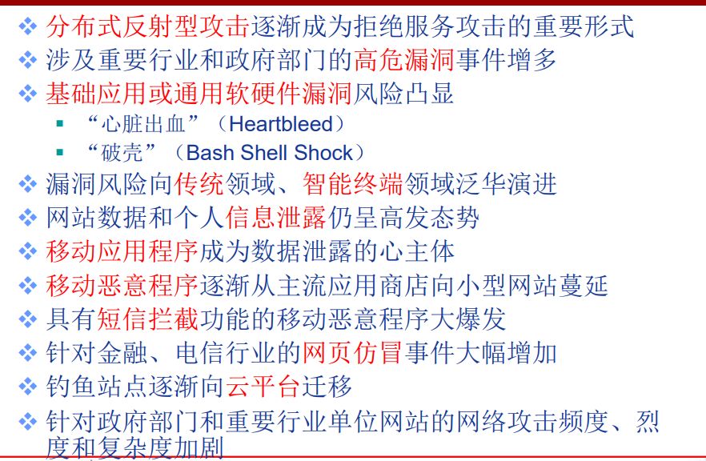
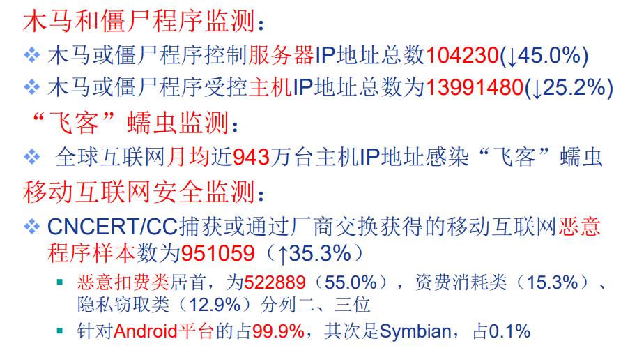
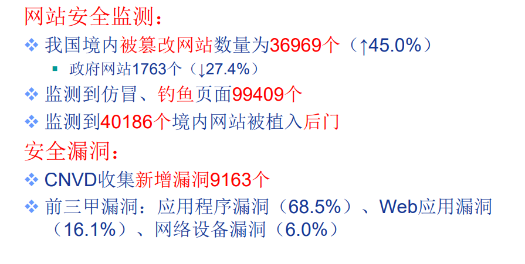
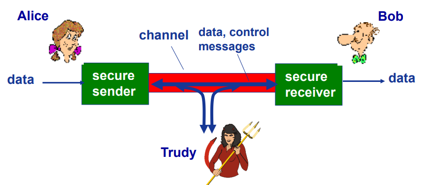
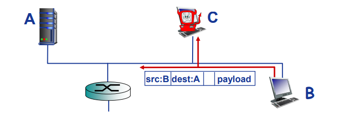
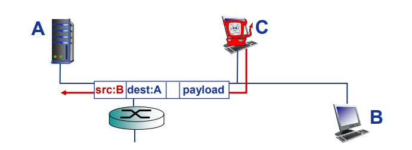

# 7.1 网络安全基础
## 网络安全现状
引自《2014年中国互联网网络安全报告》：
- 截至2014年12月底：
	- 网站总量 364.7w
	- 独立域名 481.2w
	- ISP 1068家
	- 网民规模 6.49亿
	- 手机网民规模 5.57亿
	- 互联网普及率 47.9%

## 我国互联网网络安全状况

## 网络安全基本概念
Q.什么是网络安全？

网络安全是指网络系统的硬件、软件及其系统中的**数据受到保护**，**不**因偶然的或者恶意的原因而**遭受到破坏、更改、泄露，系统连续可靠正常地运行，网络服务不中断。**

### 网络安全基本属性

**机密性(confidentiality)** 
只有 发送方 与 预定接收方 能够理解报文内容
发送方加密报文
接收方解密报文

**身份认证(authentication)**
发送方 与 接收方 希望确认彼此的真实身份

**信息完整性(message integrity)**
发送方 与 接收方 希望确保信息未被篡改（传输途中），发生篡改一定会被检测到。

**可访问与可用性(access and availability)**
网络服务必须对被授权用户 可访问 与 可用

### 基本特征
**相对性**
只有相对的安全，没有绝对的安全
**时效性**
新的漏洞与攻击方法不断发现
**相关性**
新配置、新系统组件可能会引入新的安全问题
**不确定性**
攻击时间、攻击者、攻击目标和攻击发起的地点都具有不确定性
**复杂性**
网络安全是一项系统工程，需要技术的和非技术（法律）的手段
**重要性**
网络安全关乎国家、政府、企业、个人的安全

### 网络安全研究领域
入侵者(bad guys)如何攻击计算机网络
如何防护网络对抗攻击
如何设计网络体系结构免疫(immune)攻击

> **Internet最初设计几乎不考虑安全性!**
最初愿景：“一组彼此信任的互助用户连接到一个透明网络”进行信息共享
Internet协议设计者扮演了“追赶者”(catch-up)角色
网络安全需要在网络各个层次考虑！

## 网络安全拟人模型[P.399]

- 网络中bob，alice = 
	- 电子交易过程的Web浏览器/服务器(e.g,网购)
	- 网络银行的客户/服务器
	- DNS服务器
	- 路由器之间交换路由表更新
	- ......
- 网络中的Trudy
	- 通过Internet向主机植入恶意软件(malware)
		- 病毒(virus)
		- 蠕虫(worm)
		- 间谍软件(spyware)：记录键盘输入、web站点访问、向收集站点上传信息等
		- ........
	- 被感染主机可能加入僵尸网络(botnet),用于发送垃圾邮件、DDoS攻击等
# 7.2 网络安全威胁
Q："坏蛋"bad guys 可以做什么？
- 窃听(eavesdrop)
- 插入(insert)
- 假冒(impersonation)
- 劫持(hijacking)
- 拒绝服务Dos(Denial of service)

## Internet 安全威胁
### 映射 Mapping
 发起攻击前: “探路”(case the joint) – 找出网络上在运行什么服务
 利用ping命令确定网络上主机的地址
 端口扫描(Port-scanning): 依次尝试与每个端口建立TCP连接
 
**对策(Countermeasures):**
 - 记录到达的网络流量
 - 分析，识别可疑活动

### 分组“嗅探”(sniffing):
- 广播介质
- 混杂(promiscuous)模式网络接口可以接收/记录所有
经过的分组/帧
- 可以读到所有未加密数据
 
Wireshark就是一个典型免费的分组嗅探软件

**对策(Countermeasures):**

组织中的所有主机都运行软件，周期性监测网络接口是否工作在混杂模式

每段广播介质连接一台主机(如交换式以太网)

### IP欺骗（Spoofing):
直接由应用生成“原始”IP分组，可以设置分组的源IP地址字段为任意值

接收方无法判断源地址是否被欺骗

**对策：入口过滤(ingress filtering)**