——本章学习目标
1.理解数据通信相关概念与基本原理
2.掌握物理传输介质特性
3.掌握信道与信道容量的概念,信道容量的计算
4.理解基带传输与频带传输的基本概念
5.掌握基带传输典型编码与频带传输的典型调制技术

# 6.1 数据通信基础

**信源**：将 消息 转换为 信号 的设备，如计算机等。
**发送设备**：将 信源 产生的 信号 进行适当的变换装置，使之适合于在信道中传输。主要包括编码和调制。
**信道**：信号传输通道，如物理介质。
**噪声**：自然界和通信设备中所产生的干扰。
**接收设备**：完成发送设备反变换，还原原始发送信号。
信宿：信号终点，将信号转换为 供人们能识别的消息。

## 常见数据通信术语
- 数据(data): 传送消息的实体
- 信号(signal): 数据的电气的或电磁的表示：y(t) = Asin(ωt+θ)
- "模拟的"(analogous): 参数的取值是连续的
- "数字的"(digital):参数的取值是离散的
- 码元(code): 信号基本波形(信号基本单元)
- 频带(Spectrum): 信号频率范围(单位:Hz)
- 带宽(Bandwidth): 有效带宽（能量主要是集中在这个范围内）(单位:Hz)
	- 数据传输速率的带宽 ≠ 频带带宽（最高频率和最低频率之差（宽度））
- 数据通信方式：单工，半双工，全双工
- 并行通信 vs 串行通信
	- 参考：https://zhuanlan.zhihu.com/p/645788553
	- 并行: 数据各位同时传送。
	- 串行：将要传送的数据或信息按一定的格式编码，然后在单根线上按一位接一位的先后顺序进行传送。

## 异步通信 vs 同步通信
> Timing problems require a mechanism to **synchronize** the transmitter and receiver
> （时间同步问题）

两大方案：
Asynchronous (异步通信)
Synchronous (同步通信)

异步通信:
- Data transmitted on character at a time.
	- 5 to 8 bits
- Timing only needs maintaining within each character
- Resync with each character

- In a steady stream, interval between characters in uniform(length of stop element)
- In idle state, receiver looks for transition 1 to 0
- Then samples next seven intervals(char length)
- Then looks for next 1 to 0 for next char
- **Simple**
- **Cheap**
- Overhead of 2 or 3 bits per char (~20%)
- Good for data with large gaps (keyboard)

同步通信：
- **Block of data** transmitted without start or stop bits
- **Clocks must be synchronized**
- Can use separate clock line
	- Good over short distances
	- Subject to impairments
- Embed clock signal in data
	-  Manchester encoding
	-  Carrier frequency (analog)
- More **efficient**(lower overhead) than async 

## 模拟通信 vs 数字通信:
区别在于信道中传输的是：

## 信源编码：
> Q:如果信源产生的是模拟数据，如何在数字通信系统中传输？
> A: 信源编码

典型的信源编码： PCM（Pulse Code Modulation）,脉冲编码调制.
PCM 包括三个步骤： 采样 -> 量化 -> 编码

- 采样：目的就是要用一系列在时间上离散的采样值，代替时间上连续的模拟数据，即实现时间上的离散化。
- 量化：就是使采样值在取值上离散化
- 编码：就是将量化后的采样值用一定位数的二进制数码来表示。如果量化级数为N,则每个采样值就编码成log2(N)位二进制码。

# 6.2 物理介质
## 6.2.1 导引型传输介质
- 架空明线：
	- 易受天气和外界电磁干扰，对外界噪声敏感，带宽有限。
- 双绞线：
	- 主要用于 **基带传输**
	- 屏蔽双绞线 STP (Shielded Twisted Pair)
	- 非屏蔽双绞线 UTP (Unshielded Twisted Pair) *(使用更多)*
	- 

- 同轴电缆(用的很少)
	- 主要用于 **频带传输**

- 光纤(广泛应用)
	- 基本原理：光的全反射
	- 分为：多模光纤和单模光纤

## 6.2.2 非导引型传输介质
- 自由空间
	- 无线电传播途径
	- 不同频段具有不同传播特性

- **地波传播**
	- 频率较低（~2MHz 以下） 的电磁波趋于沿地球表面传播
	- 有一定的绕射能力
	- 在低频和甚低频段，地波传播距离可以超过数百米或数千公里
- **天波传播**
	-  电离层，距离地表约60~400km 高度
	-  频率较高(~ 2~30MHz 之间)的电磁波会被电离层反射
	-  电离层的密度和厚度随时间随机变化
	-  电磁波可以传播10000km以上
	-  随参信道

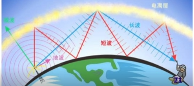
- **视线传播**
	- 频率高于 30MHz 的电磁波将穿透电离层，不会被反射回来
	- 沿地面绕射能力也很弱
	- 通常采用视线无障碍的点对点直线传播
	- 可以设立地面中继站或卫星中继站进行接力传播

# 6.3 信道与信道容量

## 信道分类与模型
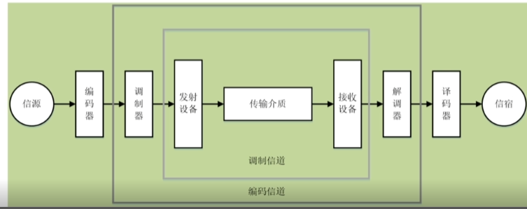

- 狭义信道
	- 信号传输介质
- 广义信道
	-  包括：信号 传输介质 和 通信系统 的一些变换装置 eg.发送设备，接收设备，天线，调制器等。

## 信道传输特性
- 恒参信道传输特性：
	- 各种有线信道 和 部分无线信道，eg. 微波视线传播链路 和 卫星链路 etc.
	- 理想的恒参信道是一个 理想的 无失真传输信道
	- 对信号幅值产生 **固定的衰减**
	- 对信号输出产生 **固定的时延**
- 随参信道传输特性：
	-  许多无线信道都是随参信道
	-  信号的传输 **衰减 随 时间 随机变化**
	-  信号的传输 **时延** **随** **时间** **随机变化**
	-  存在 **多途径传播现象**

## 信道容量
信道容量 -> 信道无差错传输信息的 **最大** 平均信息速率

- **奈奎斯特(Nyquist)信道容量公式**
	- 理想无噪声信道的信道容量: **C= 2B×log2 (M)**
		- 其中： C 信道容量 （b/s) ； B 信道带宽 （Hz）； M 进制数，即信号状态数
		- 理想信道 的 极限容量
	- **Example:**  
		- Q:在无噪声情况下，若某通信链路的带宽为3kHz,采用4个相位、每个相位具有4种振幅的QAM调制技术，则该通信链路的最大数据传输速率是多少？
		- A: 2×3×log2(4×4) = 24kbps

- **香农(Shannon)信道容量公式**
	- 有噪声信道的信道容量 ： **C= B×log2(1+S/N)**
		- 其中 S/N 为 信噪比，即 **信号能量(Signal Power)** 与 **噪声能量(Noise Power)** 之比
		- S/N 通常以 **分贝(dB)** 为单位描述：
			- (S/N)dB = 10log10(Signal power / Noise Power)
		- Example:
			-  Q:若某通信链路的带宽为2MHz,信噪比为30dB,则该通信链路的最大数据传输速率约是多少？
			-  A: 
			-  (30)dB = 10log10(Signal Power/ Noise Power)
			-   (Signal Power /Noise Power) = 1000
			-   2MHz × log2(1+1000) = 20Mbps(19.93446Mbps)

# 6.4 基带传输基础
> 信源发出的原始电信号是 **基带信号** !

模拟信源 -> 模拟基带信号
数字信源 -> 数字基带信号

基带信号往往包含有较多的 **低频成分**，甚至有直流成分。
直接在信道中传送基带信号称为 **基带传输**。（eg.以太网）

实现基带传输的系统称为 基带传输系统

在信道中直接传输数字基带信号，称为 数字基带传输，相应的系统称为 数字基带传输系统。

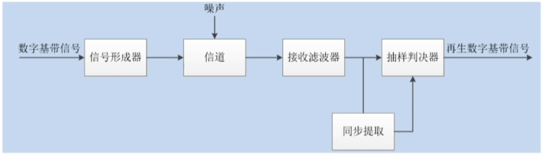
基带信号比较适合在具有 **低通特性** 的 **有线信道** 中 传输，通常**不适合**在**无线信道**中直接传输。
信道的传输特性会引起波形失真，并会受噪声的影响
信道中的信号传播一定距离后，信号质量就会有所下降，甚至出现传输误码现象

## 典型数字基带信号码型
- 单极不归零码(Not Return to Zero-NRZ)
	- 这种码型易于产生，但不适合长距离传输。
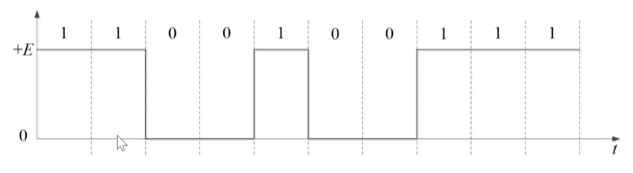

- 双极不归零码
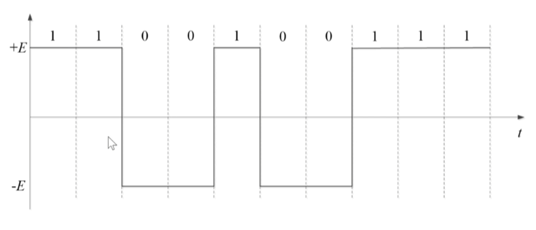

- 单极归零码 (Return to Zero-RZ)
	- 码元不为零的时间占一个码元周期的百分比为 **占空比**
	- 若码元不为零时间为 Tb/2 ,码元周期为Tb,则该单极归零码的占空比=50%
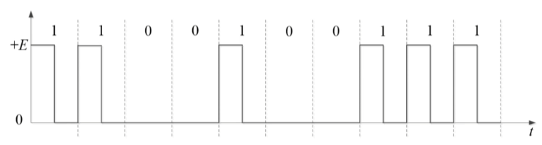
- 双极归零码
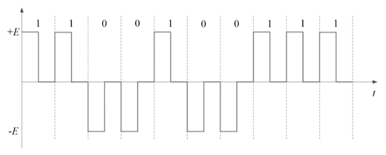

- 差分码
	- 又称 **相对码**
	- eg. 相邻脉冲有电平跳变 = 1 ，无跳变 = 0
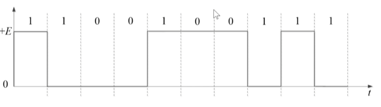

- AMI 码（传输码型：针对传输能力）
	-  AMI（Alternative Mark Inversion) 码 = **信号交替反转码**
	-  AMI 码的编码规则：
		-  信息码中的0编码为AMI传输码中的0（零电平）
		-  信号码总的1交替编码为AMI传输码中的+1（正脉冲）和-1（负脉冲）
		-  例如：
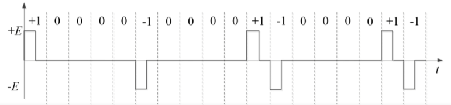

- 双相码(Biphase Code)
	- 又称 曼切斯特（Manchester) 码
	- 只有 正，负 两种电平
	- each bit 持续时间中 **中间时刻** 要进行 电平跳变。
	- 正（高）电平跳到负（低）电平 表示 **1**
	- 负电平跳到正电平 表示 **0**
	- 在每个比特周期 中间时刻都会有电平跳变， **便于提取定时信息**
	- 利用了两个脉冲编码信息码中的一个比特，相当于双极码中的2bits。
	- 10Mbps的以太网在用。

- 差分双相码
	- 差分曼切斯特（Manchester) 码
	- 在每个比特周期 中间时刻都会有电平跳变，但**仅用于同步**
	- 利用每个比特开始处是否存在电平跳变编码信息：
		- 开始处有跳变 表示 **1**
		- 无跳变 表示 **0**
	- IEEE802.5令牌环网采用差分ManChester code 

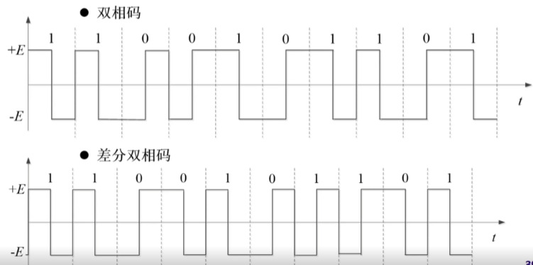

- nBmB
	- n和m是两个自然数，B是byte
	- nBmB码将 n 位 二进制信息码作为一组，映射成 m 位二进制新码组，其中**m>n**
	- m>n, 因此 2^m 个码的新码组中 只会用到2^n,多出（2^m - 2^n)个码
	- 可以从2m个码中优选出2n个码作为**有效码**，已获得良好的编码性能，其余码则作为**禁用码**，可以用于**检错**
	- 快速以太网（100BASE-TX和100BASE-FX)传输码采用的是4B5B编码
		- 这样只需从2^5=32个码中优化选择2^4=16个码，以便保证足够的同步信息，并且可以利用剩余的16个禁用码进行差错检测

# 6.5 频带传输基础
基带信号具有**低通特性**，可以在具有低通特性的信道中进行传输。
许多 **带通信道**（如无线信道）**不具有**低通特性，因此不能在这些信道中直接传输基带信号。
只能利用基带信号去调制与对应信道传输特性相匹配的载波信号
通过在信道中传送经过调制的载波信号实现将基带信号所携带信息传送出去
利用模拟基带信号调制载波，称为**模拟调制**，利用数字基带信号调制载波，称为**数字调制**（计算机网络调制主要是数字调制）
数字调制就是利用数字基带信号控制（或影响）载波信号的某些特征参量。

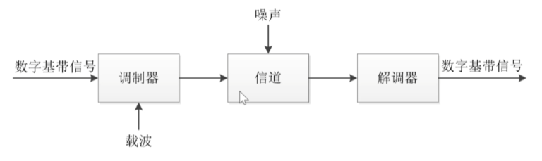

频带传输系统通常选择**正弦波信号**作为载波：

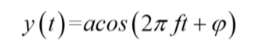
二进制数字调制：2ASK, 2FSK, 2PSK

- 二进制幅移键控（2ASK）
	- 利用二进制基带信号控制载波信号的幅值变化：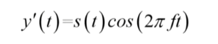
	- 二进制基带信号s(t)为 单极不归零码信号波形：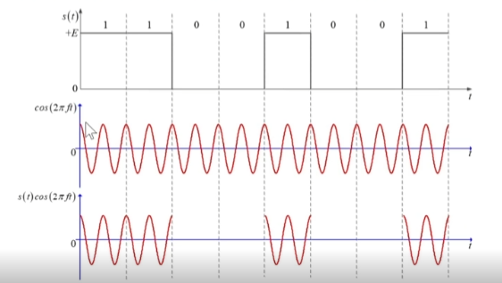
- 二进制频移键控（2FSK）
	- 选择两个不同频率的载波，f1和f2
	- 二进制基带信号编码的信息(bit)序列为{b*n*}:
	- 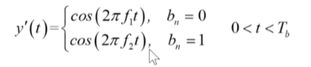
	- 示意图：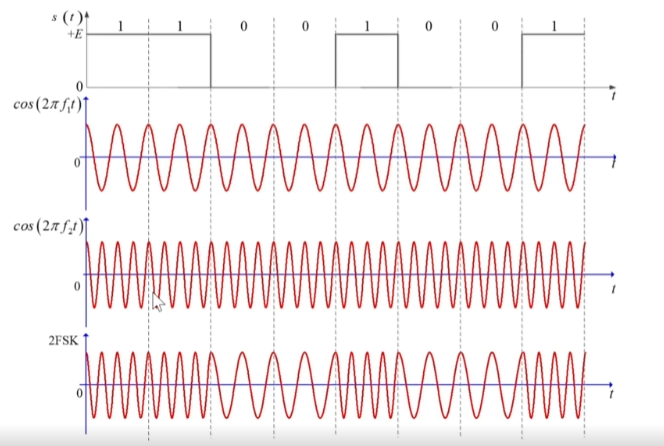
- 二进制相移键控（2PSK）
	- 利用二进制基带信号控制载波信号的**相位变化**
	- 二进制基带信号编码的信息（bit）序列为{b*n*}
	- 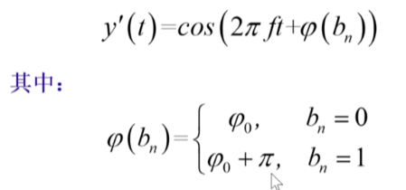
	- 示意图：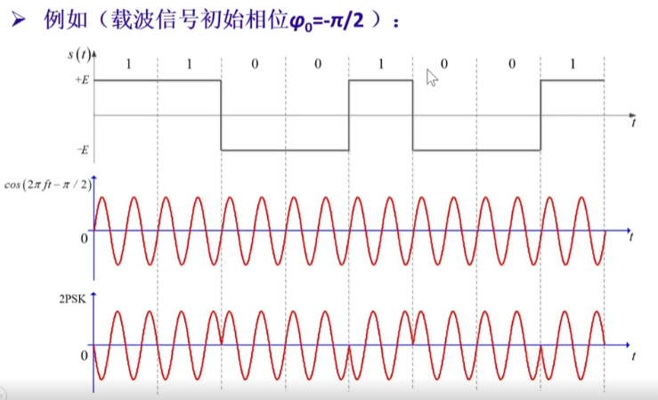（1是反相位，0是正相位）

- 二进制差分相移键控（2DPSK）
	- 利用相邻两个码元载波间的相对相位变化表示数字基带信号的数字信息
	- 二进制基带信号编码的信息（bit）序列为{b*n*}
	- 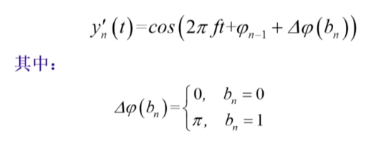
	- 示意图：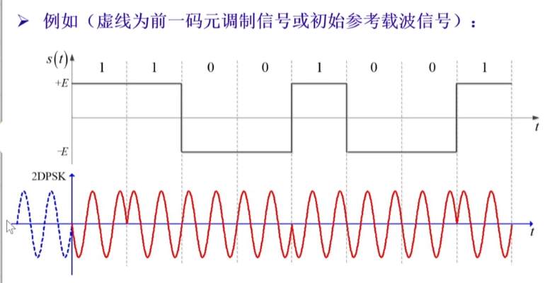
虚线是表示载波信号前一个序号的状态。

## 二进制数字调制性能：
- 频带利用率：（单位频带宽度上，能够实现数据传输的速率是多少）
	- 2ASK,2PSK,2DPSK 的 利用率相同
	- 2FSK 的利用率最低（因为要占用两个载波频率）
- 误码率：（ 受到干扰的时候，哪个更抗噪）
	- 在相同信噪比下， 2PSK的误码率最低，2ASK最高。
	- 抗噪声性能： 2PSK (相移) > 2FSK（频移）> 2ASK（幅移）
 - 对信道特性的敏感性：
	 - 2ASK 比较敏感。性能最差。
	 - 2FSK，2PSK 不怎么敏感。

## 多进制数字调制：
> 在确定 带宽 和 频带利用率 的情况下，提高数据传输速率的有效方法：多进制数字调制

提高每个码元传输信息量，每个码元调制多个比特信息，即 **多进制数字调制**

**数据传输速率 R*b* (bps)** 与 **码元传输效率 R*B*（Baud)** 以及**进制数M**（通常为2的幂次）之间的关系为： 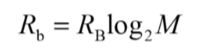
R*b* - 比特率 (bps) ， R*B* - 波特率 （Baud)

多进制数字调制需要更大的信噪比，发送端需要增大发送信号的功率