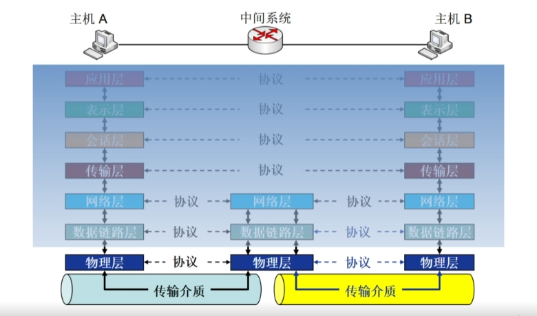
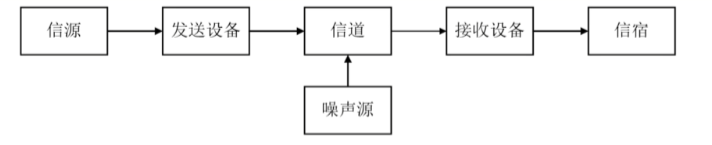
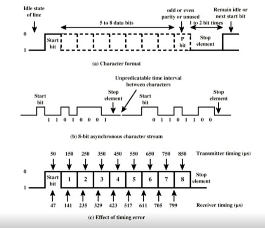
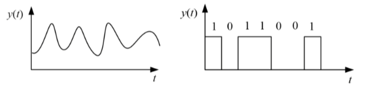
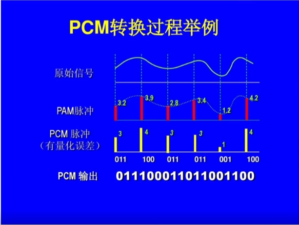
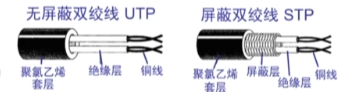
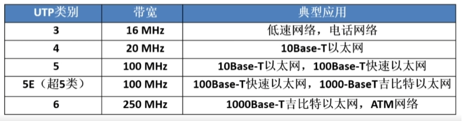
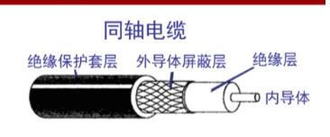
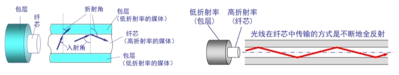
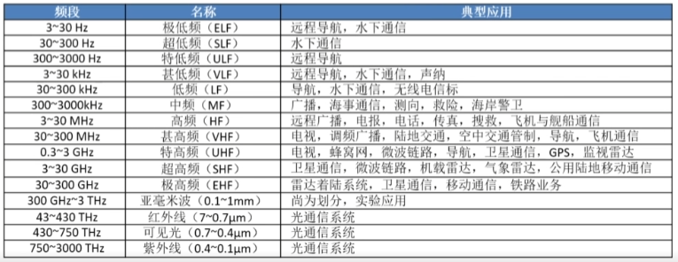

——本章学习目标
1.理解数据通信相关概念与基本原理
2.掌握物理传输介质特性
3.掌握信道与信道容量的概念,信道容量的计算
4.理解基带传输与频带传输的基本概念
5.掌握基带传输典型编码与频带传输的典型调制技术

# 6.1 数据通信基础

**信源**：将 消息 转换为 信号 的设备，如计算机等。
**发送设备**：将 信源 产生的 信号 进行适当的变换装置，使之适合于在信道中传输。主要包括编码和调制。
**信道**：信号传输通道，如物理介质。
**噪声**：自然界和通信设备中所产生的干扰。
**接收设备**：完成发送设备反变换，还原原始发送信号。
信宿：信号终点，将信号转换为 供人们能识别的消息。

## 常见数据通信术语
- 数据(data): 传送消息的实体
- 信号(signal): 数据的电气的或电磁的表示：y(t) = Asin(ωt+θ)
- "模拟的"(analogous): 参数的取值是连续的
- "数字的"(digital):参数的取值是离散的
- 码元(code): 信号基本波形(信号基本单元)
- 频带(Spectrum): 信号频率范围(单位:Hz)
- 带宽(Bandwidth): 有效带宽（能量主要是集中在这个范围内）(单位:Hz)
	- 数据传输速率的带宽 ≠ 频带带宽（最高频率和最低频率之差（宽度））
- 数据通信方式：单工，半双工，全双工
- 并行通信 vs 串行通信
	- 参考：https://zhuanlan.zhihu.com/p/645788553
	- 并行: 数据各位同时传送。
	- 串行：将要传送的数据或信息按一定的格式编码，然后在单根线上按一位接一位的先后顺序进行传送。

## 异步通信 vs 同步通信
> Timing problems require a mechanism to **synchronize** the transmitter and receiver
> （时间同步问题）

两大方案：
Asynchronous (异步通信)
Synchronous (同步通信)

异步通信:
- Data transmitted on character at a time.
	- 5 to 8 bits
- Timing only needs maintaining within each character
- Resync with each character

- In a steady stream, interval between characters in uniform(length of stop element)
- In idle state, receiver looks for transition 1 to 0
- Then samples next seven intervals(char length)
- Then looks for next 1 to 0 for next char
- **Simple**
- **Cheap**
- Overhead of 2 or 3 bits per char (~20%)
- Good for data with large gaps (keyboard)

同步通信：
- **Block of data** transmitted without start or stop bits
- **Clocks must be synchronized**
- Can use separate clock line
	- Good over short distances
	- Subject to impairments
- Embed clock signal in data
	-  Manchester encoding
	-  Carrier frequency (analog)
- More **efficient**(lower overhead) than async 

## 模拟通信 vs 数字通信:
区别在于信道中传输的是：

## 信源编码：
> Q:如果信源产生的是模拟数据，如何在数字通信系统中传输？
> A: 信源编码

典型的信源编码： PCM（Pulse Code Modulation）,脉冲编码调制.
PCM 包括三个步骤： 采样 -> 量化 -> 编码

- 采样：目的就是要用一系列在时间上离散的采样值，代替时间上连续的模拟数据，即实现时间上的离散化。
- 量化：就是使采样值在取值上离散化
- 编码：就是将量化后的采样值用一定位数的二进制数码来表示。如果量化级数为N,则每个采样值就编码成log2(N)位二进制码。

# 6.2 物理介质
## 6.2.1 导引型传输介质
- 架空明线：
	- 易受天气和外界电磁干扰，对外界噪声敏感，带宽有限。
- 双绞线：
	- 主要用于 **基带传输**
	- 屏蔽双绞线 STP (Shielded Twisted Pair)
	- 非屏蔽双绞线 UTP (Unshielded Twisted Pair) *(使用更多)*
	- 

- 同轴电缆(用的很少)
	- 主要用于 **频带传输**

- 光纤(广泛应用)
	- 基本原理：光的全反射
	- 分为：多模光纤和单模光纤

## 6.2.2 非导引型传输介质
- 自由空间
	- 无线电传播途径
	- 不同频段具有不同传播特性

