参考：黑书：《计算机网络自顶向下方法第7版》（笔记中出现页码对应书的页码）
参考：MOOC 哈工大 计算机网络
## 什么是计算机网络？
计算机网络 = 通信技术 + 计算机技术

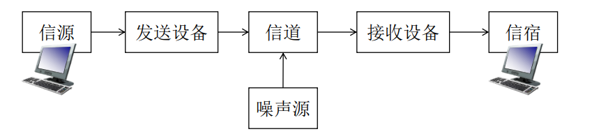

计算机网络 ： **互连的**，**自治的** 计算机集合。
通过交换网络互连主机

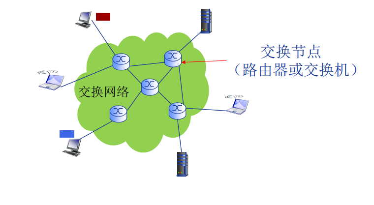
### 什么是Internet？
Internet是全球最大的互联网络
其中是由 网络服务提供商(Internet Service Provider, ISP) 网络互连的 **"网络之网络"**
其中有：
- 计算设备：主机电脑，服务器...
- 通信链路：光纤，卫星..
- 分组交换：转发分组 ： 路由器(routers) and 交换机(Switches)

**通信基础设施**：Web，VoIP，email.
为网络应用提供应用编程接口（Application Programming Interface，**API**）：支持应用程序“连接”Internet，发送/接收数据
>可参考：[API是什么: 一篇讲透](https://zhuanlan.zhihu.com/p/347125981)

## 什么是网络协议？
### 协议：是规则
如同交通系统一样，有不同的限制。

网络协议(network protocol)：是进行数据交换而建立的**规则，标准或约定**
协议规定：**1.格式**，**2.意义**，**3.顺序**，**4.动作**

### 协议三要素**
- **语法(Syntax)**
	- 结构，格式
	- 信号电平
- **语义(Semantics)**
	- 何种控制信息
	- 完成 何种动作 以及 做出 何种 响应 （TCP 里的三次握手）
	- 差错控制
- **时序(Timing)**
	- 事件顺序
	- 速度匹配(**会聊不少**)

协议规范了所有信息Send and receive 的过程

Internet协议标准：
- RFC：Request for Comments
- IETF: Internet Engineering Task Force (互联网工程任务组)

## 计算机网络的结构

- 网络边缘(edge)：
	- 主机
	- 网络应用
		- 客户/服务器 Client/Server 应用模型
		- 对等(peer-to-peer,P2P) 应用模型
	  
- 接入网络，物理介质：
	- 有限，无线 通信链路
- 网络核心 
	- 路由器
	- 网络之网络

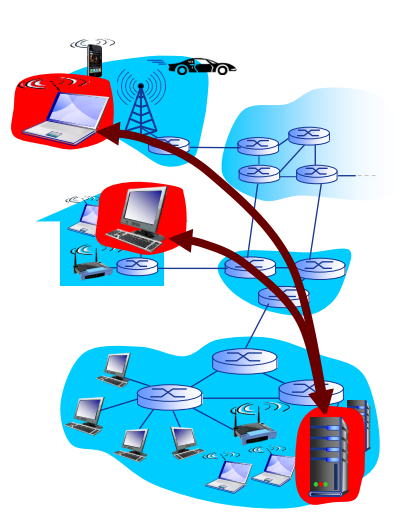
> Q：如何将网络边缘接入核心网
> A:各种的接入网络
> - 住宅接入网络(家庭)
> - 机构接入网络(学校，企业)
> - 移动接入网络(4G，5G)

### 接入网络: 数字用户线路 (DSL)
[数字用户线](https://blog.csdn.net/weixin_40408952/article/details/115187161)
数字用户线（Digital Subscriber Line，DSL)
利用已有的电话线连接中心局的DSLAM
 FDM: 
 - \>50 kHz - 1 MHz用于下行
 - 4 kHz - 50 kHz用于上行
 - 0 kHz - 4 kHz用于传统电话

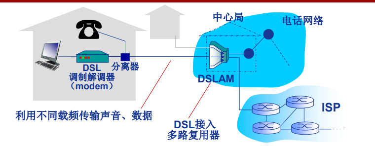
### 接入网络: 电缆网络

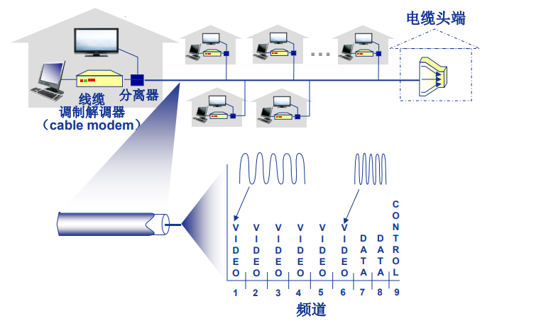
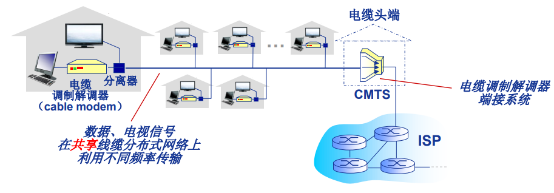

**HFC**:混合光纤同轴电缆（ hybrid fiber coax）

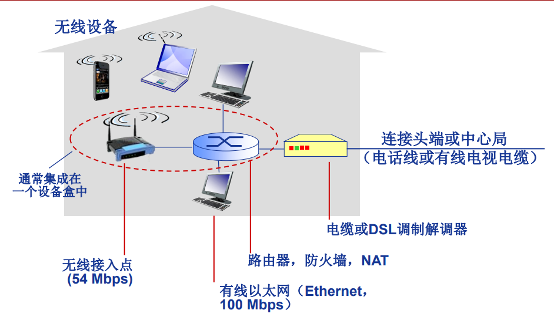

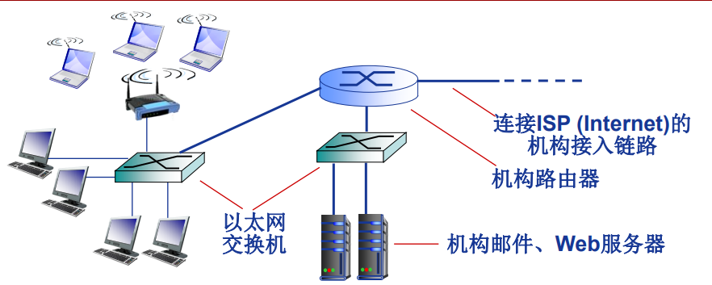
### 无线接入网络
通过共享的无线接入网络连接端系统与路由器
- 通过**基站（base station）** 或称为 **“接入点”（access point）**

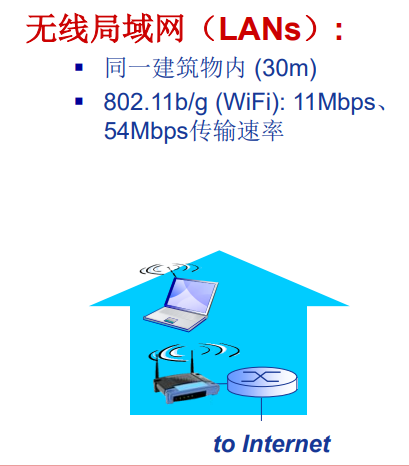

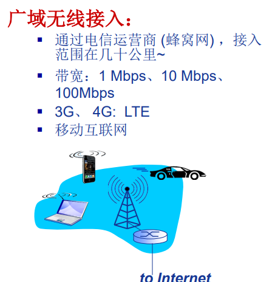
### 网络核心
网络核心的关键功能:**路由**+**转发**

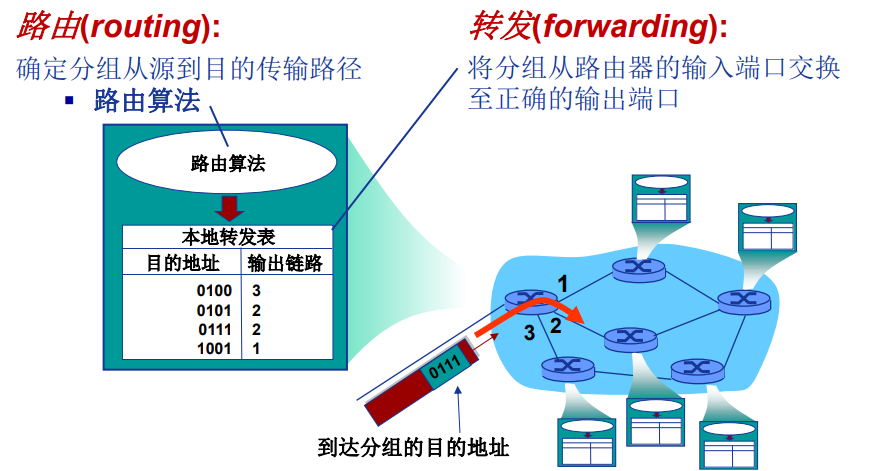

>网络核心解决的基本问题：
>Q：如何实现数据从源主机通过网络核心送达目的主机？
>A：**数据交换**

## Internet 结构
端系统通过 **接入ISP（access ISPs ）** 连接到Internet

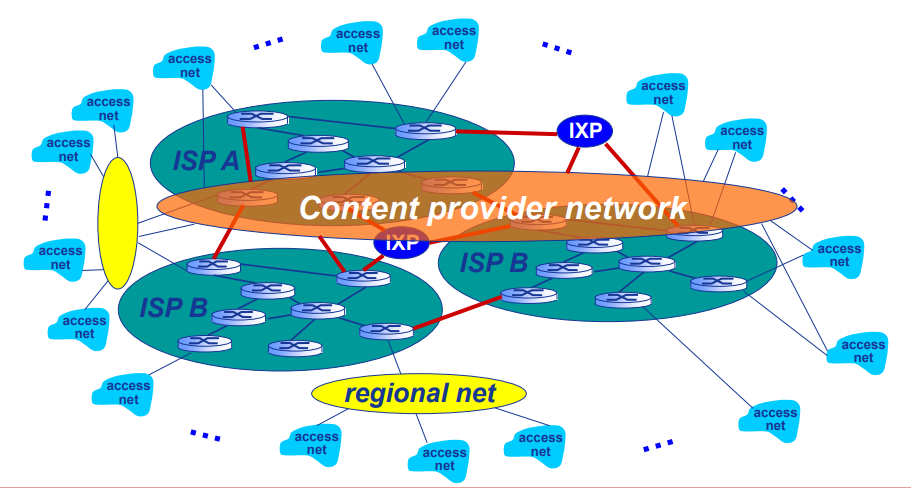
- **ISP**:Internet Service Provider(互联网服务提供商)
	- 这些ISP网络必须互连：**IXP**:Internet exchange point
	- **红线**：对等链路(Peering Link)
- **Regional net**:区域网络
	-  链接 **接入ISP** 和 **运营商ISP**
- Content Provider Network(内容提供商网络):Google,Microsoft
	- 可能运行其自己的网络，并就近为端用户提供服务、内容

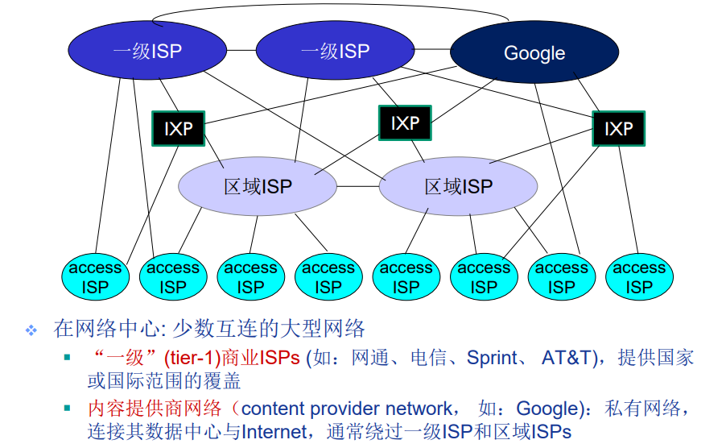
## 数据交换-电路交换
Why?
- N^(2)链路问题
- 连通性
- 网络规模

交换？
- 动态转接
- 动态分配传输资源

### 数据交换的类型**
[三种比较](https://zhuanlan.zhihu.com/p/205251011)
电路交换(Circuit Switching) **【P.19】**
报文交换(Message Switching)
分组交换(Packet Switching)  **【P.15】**

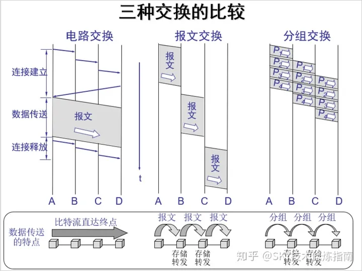
### 电路交换的特点 
最典型电路交换网络：电话网络
电路交换的三个阶段：
- 建立连接（呼叫/电路建立）
- 通信
- 释放连接（拆除电路）

**独占资源**!

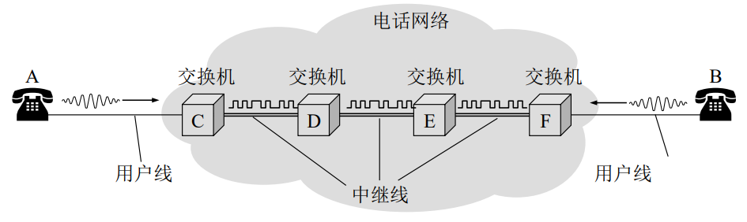
电路交换网络如何共享中继线？:多路复用

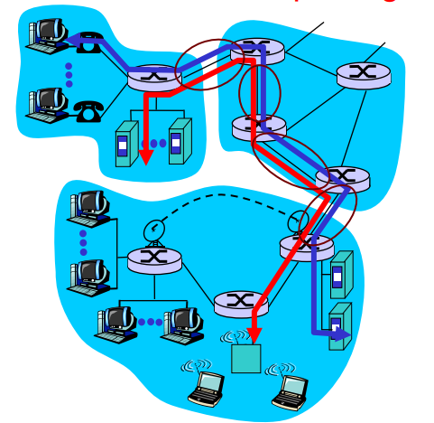

## 多路复用(Multiplexing)
简称：**复用**

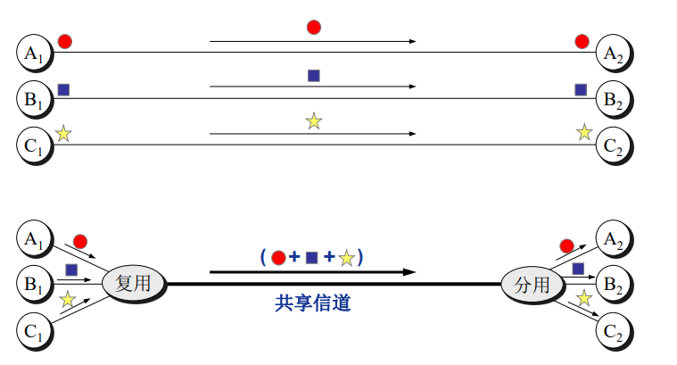

链路/网络资源（如带宽）划分为“资源片”
每路呼叫**独占**分配到的资源片进行通信
资源片可能“闲置”(idle) (无共享)

典型多路复用方法：
- 频分多路复用(Frequency division multiplexing-FDM )
- 时分多路复用(Time division multiplexing-TDM )
- 波分多路复用(Wavelength division multiplexing-WDM )
- 码分多路复用(Code division multiplexing-CDM )

### 频分多路复用
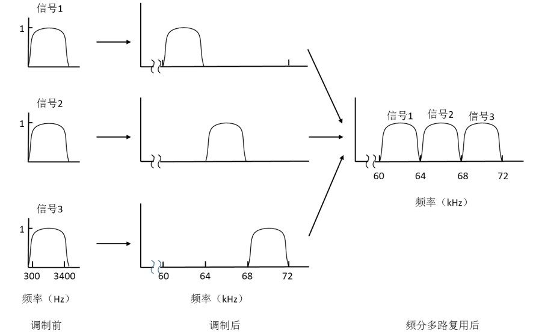

频分多路复用的各用户占用不同的
带宽资源（请注意，这里的“带宽”是频率带宽（单位：Hz）而不是数据的发送速率）