参考：黑书：《计算机网络自顶向下方法第7版》（笔记中出现页码对应书的页码）
参考：MOOC 哈工大 计算机网络
[toc!]
## 什么是计算机网络？
计算机网络 = 通信技术 + 计算机技术

计算机网络 ： **互连的**，**自治的** 计算机集合。
通过交换网络互连主机

### 什么是Internet？
Internet是全球最大的互联网络
其中是由 网络服务提供商(Internet Service Provider, ISP) 网络互连的 **"网络之网络"**
其中有：
- 计算设备：主机电脑，服务器...
- 通信链路：光纤，卫星..
- 分组交换：转发分组 ： 路由器(routers) and 交换机(Switches)

**通信基础设施**：Web，VoIP，email.
为网络应用提供应用编程接口（Application Programming Interface，**API**）：支持应用程序“连接”Internet，发送/接收数据
>可参考：[API是什么: 一篇讲透](https://zhuanlan.zhihu.com/p/347125981)

## 什么是网络协议？
### 协议：是规则
如同交通系统一样，有不同的限制。

网络协议(network protocol)：是进行数据交换而建立的**规则，标准或约定**
协议规定：**1.格式**，**2.意义**，**3.顺序**，**4.动作**

### 协议三要素**
- **语法(Syntax)**
	- 结构，格式
	- 信号电平
- **语义(Semantics)**
	- 何种控制信息
	- 完成 何种动作 以及 做出 何种 响应 （TCP 里的三次握手）
	- 差错控制
- **时序(Timing)**
	- 事件顺序
	- 速度匹配(**会聊不少**)

协议规范了所有信息Send and receive 的过程

Internet协议标准：
- RFC：Request for Comments
- IETF: Internet Engineering Task Force (互联网工程任务组)

## 计算机网络的结构

- 网络边缘(edge)：
	- 主机
	- 网络应用
		- 客户/服务器 Client/Server 应用模型
		- 对等(peer-to-peer,P2P) 应用模型
	  
- 接入网络，物理介质：
	- 有限，无线 通信链路
- 网络核心 
	- 路由器
	- 网络之网络

> Q：如何将网络边缘接入核心网
> A:各种的接入网络
> - 住宅接入网络(家庭)
> - 机构接入网络(学校，企业)
> - 移动接入网络(4G，5G)

### 接入网络: 数字用户线路 (DSL)
[数字用户线](https://blog.csdn.net/weixin_40408952/article/details/115187161)
数字用户线（Digital Subscriber Line，DSL)
利用已有的电话线连接中心局的DSLAM
 FDM: 
 - \>50 kHz - 1 MHz用于下行
 - 4 kHz - 50 kHz用于上行
 - 0 kHz - 4 kHz用于传统电话

### 接入网络: 电缆网络

**HFC**:混合光纤同轴电缆（ hybrid fiber coax）

### 无线接入网络
通过共享的无线接入网络连接端系统与路由器
- 通过**基站（base station）** 或称为 **“接入点”（access point）**

### 网络核心
网络核心的关键功能:**路由**+**转发**

>网络核心解决的基本问题：
>Q：如何实现数据从源主机通过网络核心送达目的主机？
>A：**数据交换**

## Internet 结构
端系统通过 **接入ISP（access ISPs ）** 连接到Internet

- **ISP**:Internet Service Provider(互联网服务提供商)
	- 这些ISP网络必须互连：**IXP**:Internet exchange point
	- **红线**：对等链路(Peering Link)
- **Regional net**:区域网络
	-  链接 **接入ISP** 和 **运营商ISP**
- Content Provider Network(内容提供商网络):Google,Microsoft
	- 可能运行其自己的网络，并就近为端用户提供服务、内容

## 数据交换-电路交换
Why?
- N^(2)链路问题
- 连通性
- 网络规模

交换？
- 动态转接
- 动态分配传输资源

### 数据交换的类型**
>参考:[三种比较](https://zhuanlan.zhihu.com/p/205251011)

电路交换(Circuit Switching) **【P.19】**
- F,T,W,C多路复用

报文交换(Message Switching)
- 一整个报文传输

分组交换(Packet Switching)  **【P.15】**
- 报文分组传输

### 电路交换的特点 
最典型电路交换网络：电话网络
电路交换的三个阶段：
- 建立连接（呼叫/电路建立）
- 通信
- 释放连接（拆除电路）

**独占资源**!

电路交换网络如何共享中继线？:多路复用

## 多路复用(Multiplexing)
简称：**复用**

链路/网络资源（如带宽）划分为“资源片”
每路呼叫**独占**分配到的资源片进行通信
资源片可能“闲置”(idle) (无共享)

典型多路复用方法：
- **频分**多路复用(Frequency division multiplexing-**FDM** )
	- 分配到一定的固定频带，一直用
- **时分**多路复用(Time division multiplexing-**TDM** )
	- 划分一段段等长的TDM帧
- **波分**多路复用(Wavelength division multiplexing-**WDM** )
	- 就是光的频分复用
- **码分**多路复用(Code division multiplexing-**CDM** )
	- 码片序列（1010有关）

>要记的话就是
>**F**requency,**T**ime,**W**avelength,**C**ode
### 频分多路复用

各用户占用不同的**带宽资源**（请注意，这里的“带宽”是 **频率带宽（单位：Hz）** 而不是数据的发送速率）
>此处参考：[WIFI中的频段、信道、信道带宽、传输速率的理解](https://zhuanlan.zhihu.com/p/357339416#:~:text=%E4%BC%A0%E8%BE%93%E9%80%9F%E7%8E%87%E5%9C%A8%E8%BF%99%E9%87%8C%E6%8C%87%E7%9A%84%E6%98%AF%E6%95%B0%E6%8D%AE%E4%BC%A0%E8%BE%93%E7%9A%84%E5%BF%AB%E6%85%A2%EF%BC%8C%E5%8D%95%E4%BD%8D%E6%98%AF%E6%AF%94%E7%89%B9%2F%E7%A7%92%E3%80%82%20%E5%BD%B1%E5%93%8D%E5%AE%83%E5%9B%A0%E7%B4%A0%E5%BE%88%E5%A4%9A%EF%BC%8C%E4%B8%BB%E8%A6%81%E6%98%AF%E4%BF%A1%E9%81%93%E5%B8%A6%E5%AE%BD%E5%92%8C%E9%A2%91%E7%8E%87%E3%80%82,%E5%B8%A6%E5%AE%BD%E8%B6%8A%E5%A4%A7%EF%BC%8C%E4%BC%A0%E8%BE%93%E9%80%9F%E7%8E%87%E8%B6%8A%E5%A4%A7%E3%80%82%20%E9%A2%91%E7%8E%87%E8%B6%8A%E9%AB%98%EF%BC%8C%E4%BC%A0%E8%BE%93%E9%80%9F%E7%8E%87%E8%B6%8A%E9%AB%98%E3%80%82%20%E5%8F%A6%E5%A4%96%EF%BC%8C%E8%BF%98%E6%9C%89%E4%B8%80%E4%BA%9B%E5%8F%A6%E5%A4%96%E7%9A%84%E6%8A%80%E6%9C%AF%E6%9D%A5%E6%8F%90%E4%BE%9B%E4%BC%A0%E8%BE%93%E9%80%9F%E7%8E%87%EF%BC%8C%E4%BE%8B%E5%A6%82%E6%AD%A3%E4%BA%A4%E9%A2%91%E5%88%86%E5%A4%8D%E7%94%A8%E3%80%81MIMO%E7%AD%89%E3%80%82)
>额外知识：
>频段：是指一个连续电磁波的**频率范围**
>信道：就是在**频段**基础上的更进一步的划分
>信道带宽：一个信道中**最大频率**与**最小频率**的**差**。
>传输速率：数据传输的快慢。(bit/s 或者 Byte/s)
>
>额外内容：[WiFi各协议理论速度计算](https://blog.csdn.net/pchaojin123/article/details/80272195)

用户在分配到一定的频带后，在通信过程中**自始至终**都占用这个频带.
以下图例：四个用户 四个颜色

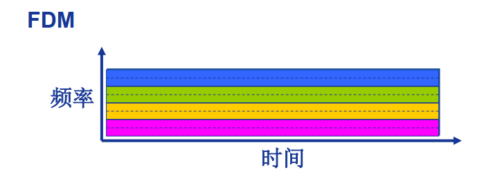

### 时分多路复用TDM
将时间划分为一段段等长的时分复用帧（TDM 帧），每个用户在每个 TDM 帧中占
用固定序号的时隙。

### 波分多路复用WDM
就是光的频分复用

### 码分多路复用CDM
广泛使用于无线
分配一个唯一的m bit**码片序列 (chipping sequence)**，其中“0”用“**-1**”表示、“1”用“**+1**”表示，例如：
S 站的码片序列：(–1 –1 –1 +1 +1 –1 +1 +1) 
各用户使用**相同频率**载波，利用各自码片序列编码数据。

编码信号 = (原始数据) × (码片序列)
- 如发送比特 1（+1），则发送自己的 **m bit 码片序列**
- 如发送比特 0（-1），则发送该码片序列的**m bit 码片序列的反码**

码片序列相互**正交(orthogonal)**

## 数据交换—报文、分组交换
### 报文交换（message switching）
报文：源（应用）发送信息整体(eg.一个文件)

### 分组交换（package switching）
分组：报文分拆出来的一系列相对较小的数据包
需要报文的拆分与重组

### 分组交换：统计多路复用(Statistical Multiplexing)

### 存储 - 转发 (Store - and - Forward)
也就是先存后转发。(在Router里会是先存在Router里然后转发)

**报文交换** 和 **分组交换** 均使用 S&F 。

### 分组交换: 传输延迟

其中：分组长度-L ， 传输速率R

### 报文交换 vs 分组交换？
例子：
- M = 7.5 Mbits
- L = 1500bits
	- M = 5000L
- R = 1.5Mbps

报文交换:
- 报文长度为M bits
- 链路带宽为R bps
- 每次传输报文需要M/R秒

分组交换:
- 报文被拆分为多个分组
- 分组长度为L bits
- 每个分组传输时延为L/R秒

两者之间最大的问题是**时间问题** 和 **缓存问题 ** .

### 分组交换的报文交付时间
- 报文: M bits
- 链路带宽（数据传输速率）: R bps
- 分组长度(大小): L bits
- 跳步数(经过链路次数): h
- 路由器数: n

计算公式：**T = M/R+(h-1)L/R = M/R+nL/R**

### 例题

**问：** 在下图所示的采用“存储-转发”方式的分组交换网络中，所有链路的数据传输速率为**100 Mbps**，分组大小为**1 000 B**，其中分组头大小为**20 B**。若主机H1向主机H2发送一个大小为**980 000 B**的文件，则在不考虑分组拆装时间和传播延迟的情况下，从H1发送开始到H2接收完为止，需要的时间至少是多少？

**解：** 980 000 B大小的文件需要分**1000个分组**，每个分组1 000 B。H1发送整个文件需要的传输延迟为 **(980 000+20×1000)×8/100 000 000=80ms** ；根据路由选择基本原理，所有数据分组应该经过两个路由器的转发，所以**再加上最后一个分组的两次转发**的传输延迟，即**2×1000×8/100 000 000=0.16ms**。所以，H2收完整个文件至少需要**80+0.16=80.16ms**。

### 分组交换 vs 电路交换？
适用于**突发**数据传输网络
分组交换允许更多用户同时使用网络！
分组交换：可能产生拥塞（congestion）: 分组延迟和丢失。

## 计算机网络性能
指标：速率=数据率(data rate)， 带宽(bandwidth)，延迟(delay)

- 速率
	- 数据传输速率= 数据率(data rate) / 比特率(bit rate)
	- 单位时间(sec) 传输信息量(bit)
	- b/s , kb/s , Mb/s , Gb/s
	- k = 10^3 M = 10^6 G = 10^9
	- 指 **额定速率**或**标称速率**

> 记得，速率单位是bit/sec，而不是Byte/sec,要记住读题，是bit还是btye(×8)

- 带宽(bandwidth)
	- 最高频率与最低频率之差
		- 单位是赫兹（Hz）
	- 网络的“带宽”通常是数字信道所能传送的 **“最高数据率”** 
		- 单位：b/s (bps)
	- 常用的带宽单位:
		- kb/s （10^3 b/s）
		- Mb/s （10^3 b/s）
		- Gb/s （10^3 b/s）
		- Tb/s （10^3 b/s）

> 带宽和速率单位一样，但情况不一样。
> 把车道作为比喻，速率便是**车的车速**，而带宽则是**车道数量**。

- 延迟/时延(Dalay/Latency)
	- 分组在路由器缓存中**排队**(queue)
		- 当分组到达速率超过输出链路容量时 就会排队
		- 而当排队的分组超过路由器缓存，就会**丢包**(loss)

### 四种分组延迟 [P.25]

结点延迟 = 结点处理 + 排队 + 传输 + 传播
d(nodal) = d(proc) + d(queue) + d(trans) + d(prop)

- **结点处理**延迟(Nodal processing delay) **d(proc)**
	- 差错检测
	- 确定输出链路
	- 通常 < msec(毫秒)
- **排队**延迟(Queueing delay) **d(queue)**
	- 等待输出链路可用
	- 取决于Router拥塞程度
- **传输**延迟(Transmission delay) **d(trans)**
	- **=L/R**
	- L:分组长度(bits)
	- R:链路带宽(bps)
- **传播**延迟(Propagation delay) **d(prop)**
	- **=d/s**
	- d:物理链路长度
	- s:信号传播速度(~2×10^(8) m/sec)

> 传输和传播延迟是不同的，具体不同是：
> 传输延迟 = 分组和带宽有关
> 传播 = 物理链路长度 和 传播速度有关
### 延迟类比

- 车速(100km/h) ~ 信号传播速度 
- 收费站放行一台 用时 12 sec ~ bit传输时间
- 车 ~ bit ; 车队 ~ 分组
- 车队通过收费站时间 ~ 传输延迟 d(trans) (120sec)
- 每台车从第一收费站到第二收费站用时(1h) ~ 传播延迟 d(prop)

### 排队延迟衍生 流量强度（traffic intensity）

- 流量强度（traffic intensity）= La/R
	- R: 链路带宽(bps)
	- L: 分组长度 (bits)
	- a: 平均分组到达速率

- La/R ~ 0: 平均排队延迟很小
- La/R -> 1: 平均排队延迟很大
- La/R > 1: 超出服务能力，平均排队延迟无限大！

### 时延带宽积
或者叫 : **以比特为单位的链路长度**
> 可参考：[CSDN时延带宽积](https://blog.csdn.net/ahLOG/article/details/116202211)

时延带宽积 = 传播时延 × 带宽 = d(prop) x R (bits)

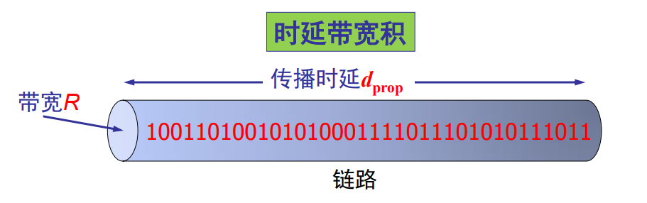
### 分组丢失(丢包) LOSS

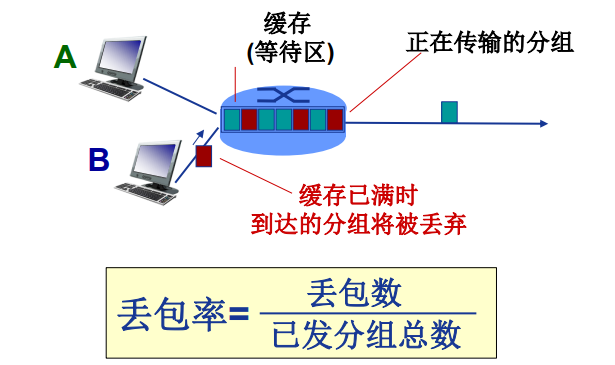

### 吞吐量/率 (Throughput)

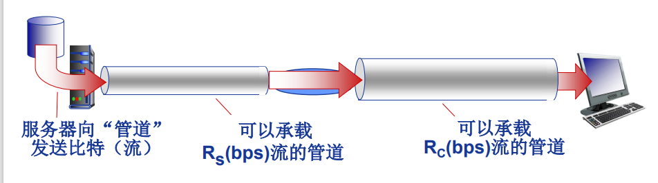

吞吐量:发送端与接收端之间传送**数据速率** (b/s)
即时吞吐量: 给定时刻的速率
平均吞吐量: 一段时间的平均速率

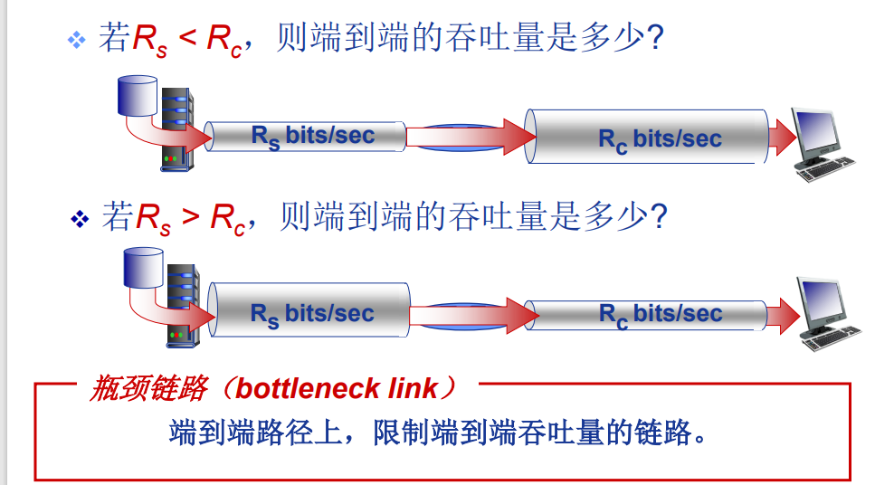

Internet 场景: min(Rc,Rs,R/10)
实际网络 Rc 或 Rs 通常是瓶颈。

## 计算机网络体系结构*[P.33]
分层结构（抽象的）
每层完成一种（类）特定服务/功能
网络体系结构是从**功能上**描述计算机网络结构
**计算机网络体系结构**是计算机网络的各层及其协议的集合

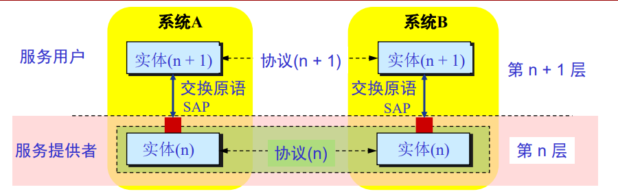

**实体(entity)** 表示任何可发送或接收信息的**硬件或软件进程**。
协议是控制两个对等实体进行通信的规则的集合，协议是**“水平的”**
任一层实体需要使用**下层服务**，遵循本层协议，实现**本层功能**，向**上层提供服务**，服务是 **“垂直的”**。
下层协议的实现对上层的服务用户是**透明的**。
同系统的相邻层实体间通过接口进行交互，通过服务访问点 SAP(Service Access Point)，交换原语，指定请求的特定服务。

### OSI 模型 ***
> 可供参考：[OSI七层模型 与 TCP/IP五层模型](https://zhuanlan.zhihu.com/p/143654140)

“OSI模型，即开放式通信系统互联参考模型（Open System Interconnection Reference Model），是国际标准化组织（ISO）提出的一个试图使各种计算机在世界范围内互连为网络的标准框架，简称OSI。”

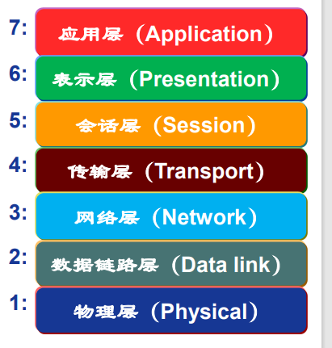

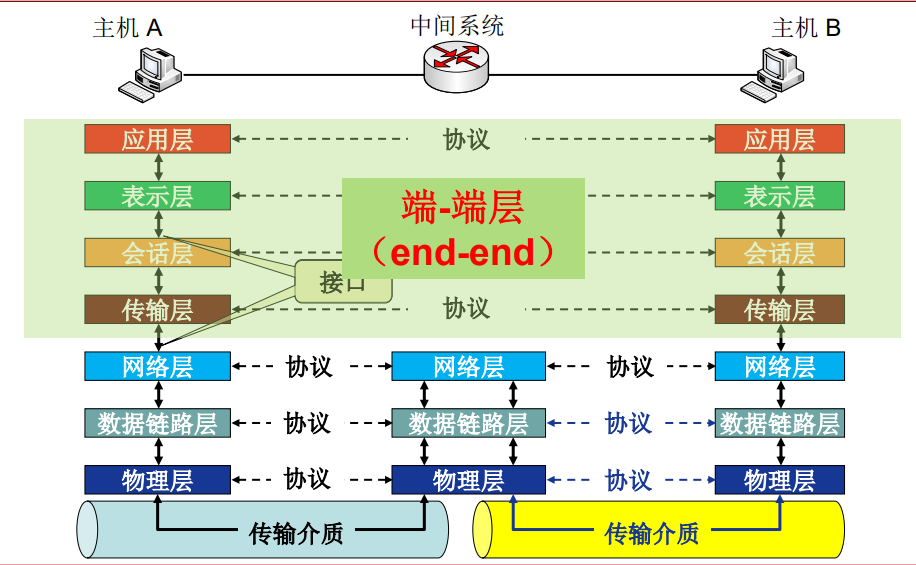

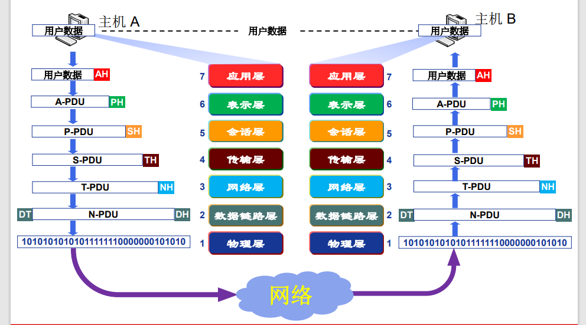
数据封装：
增加控制信息
构造协议数据单元(PDU)(Protocol Data Unit)
- 控制信息主要包括:
	- **地址（Address）**: 标识发送端/接收端
	- **差错检测编码（Error-detecting code）**: 用于差错检测或纠正
	- **协议控制（Protocol control）**: 实现协议功能的附加信息，如: 优先级（priority）、服务质量（QoS）、 和安全控制等

#### 物理层 Physical Layer(光纤)

- 接口特性
	- 机械特性、电气特性、功能特性、规程特性
- 比特编码
- 数据率
- 比特同步
	- 时钟同步
- 传输模式
	- 单工（Simplex）
	- 半双工（half-duplex）
	- 全双工（full-duplex）

#### 数据链路层 Data Link Layer(以太网)

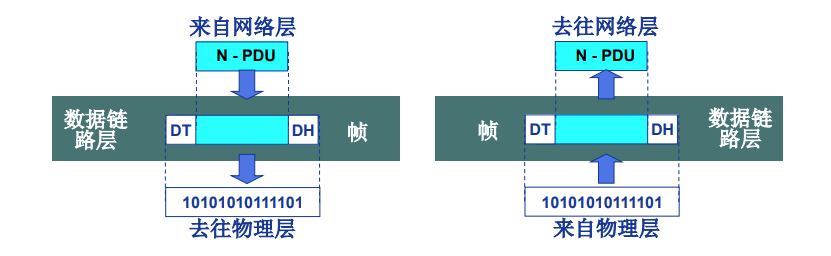
- 负责 **结点-结点（node-to-node）** 数据传输
- **组帧(Framing)**
- **物理寻址(Physical Addressing)**

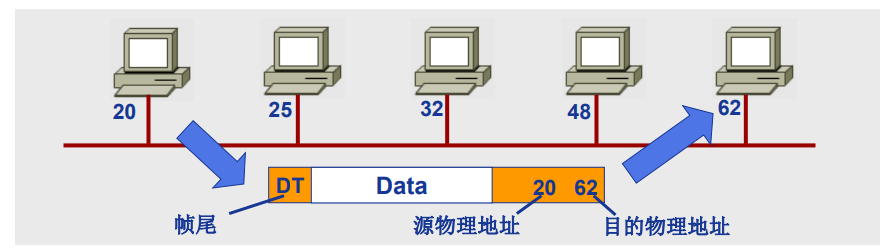
功能：
- **流量控制（Flow control）**
	- 避免淹没接收端
- **差错控制（Error control）**
	- 检测并重传损坏或丢失帧，并避免重复帧
- **访问(接入)控制（Access control）**
	- 在任一给定时刻决定哪个设备拥有链路（物理介质）控制使用权

#### 网络层 Network Layer(IP)

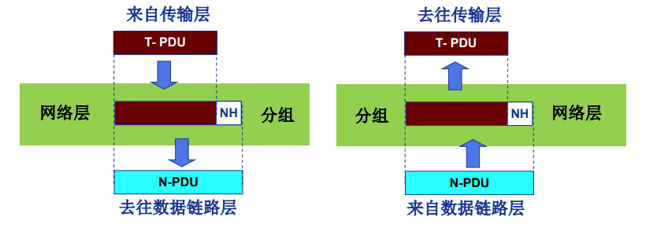
- 负责**源主机到目的主机**数据分组（packet）交付
- **逻辑寻址（Logical addressing）**
	- **全局唯一**逻辑地址，确保数据分组被送达目的主机，如**IP地址**

- **路由（Routing）**
	- 路由器(或网关)互连网络，并路由分组至最终目的主机
	- 路径选择

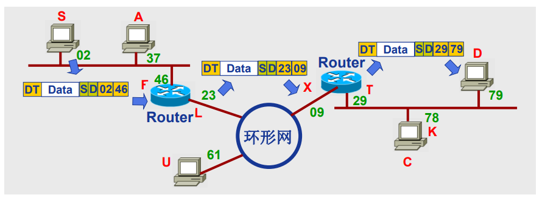

#### 传输层 Transport Layer (TCP,UDP)
负责**源-目的（端-端） （进程间） 完整报文**传输

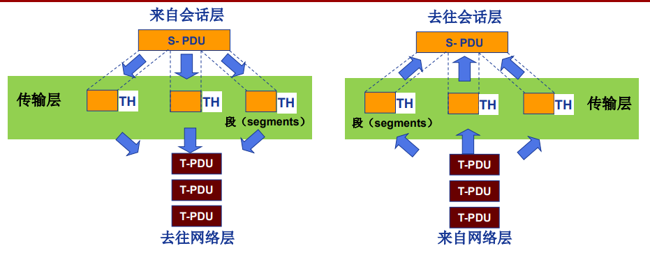

功能：
- 分段与重组
- SAP寻址
	- 确保将完整报文提交给正确**进程**，如端口号
- 连接控制
- 流量控制
- 差错控制

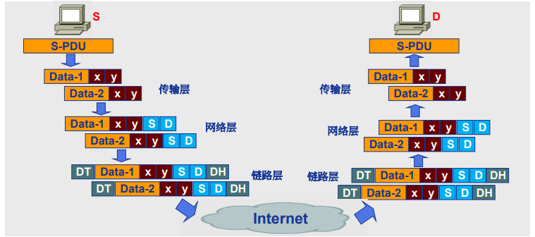
#### 会话层 Session Layer(SSL)

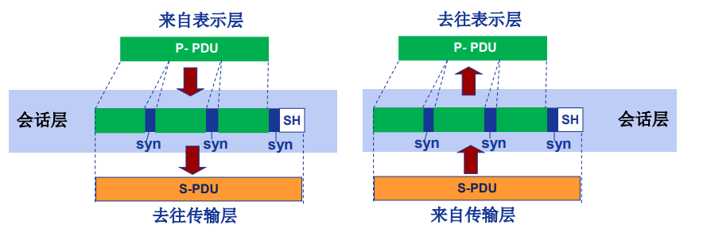
功能：
- **对话控制(dialog controlling)**
	- 建议，维护
- **同步(synchronization)**
	- 在数据流种插入“同步点”

#### 表示层 Presentation Layer (LPP)

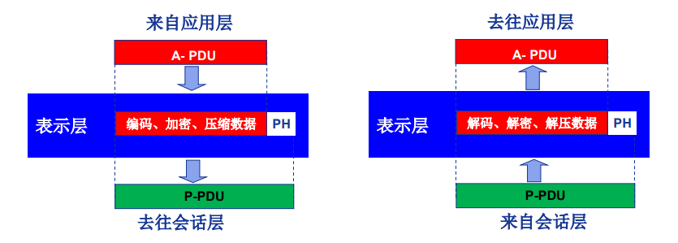

处理两个系统间交换信息的 **语法与语义（syntax and semantics ）** 问题
功能：
- 数据表示转化
- 加密/解密
- 压缩/解压缩

#### 应用层 Application Layer

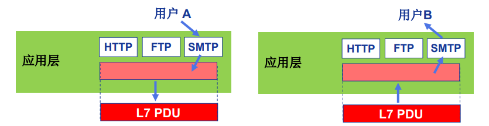

支持用户通过用户代理（如浏览器）或网络接口**使用网络（服务）**
典型应用层服务：
- 文件传输（FTP）
- 电子邮件（SMTP）
- Web（HTTP）
- .............

### TCP/IP 参考模型 **
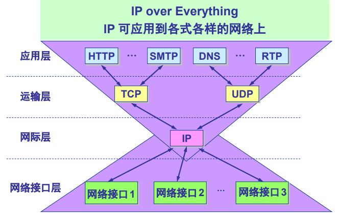

TCP/IP模型 从 OSI模型 里把 **表示层**和**会话层** 与 **应用层** 结合

然后剩下 五大层：**应用**，**传输**，**网络**，**链路**，**物理**。

5层模型的数据封装

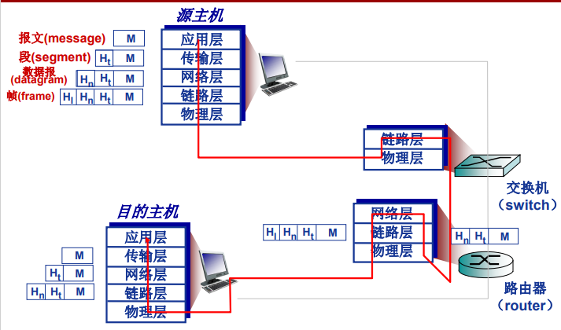