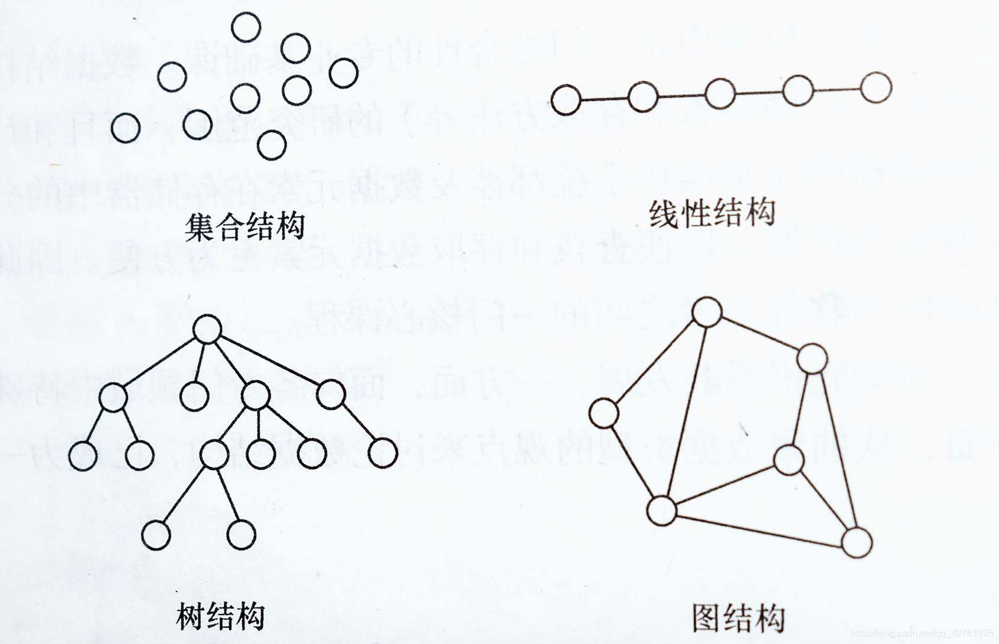
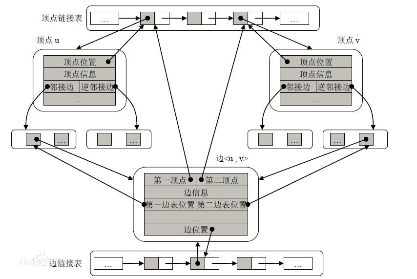

## 数据结构简介：

***数据结构：*** 用计算机解决一个具体的问题时，大致需要经过下列几个步骤：
*1.从具体问题抽象出一个适当的数学模型
2.设计一个解此数学模型的算法
3.编出程序
4.进行测试
5.调整直至得到最终解答。*

### 基本术语：
***数据 （data）：***
是对客观事物的符号，在计算机中是指所有能输入到计算机中并被计算机程序处理的符号的总称。
例子：1，2，a，b，啊，不。

***数据元素（data element）：***
是数据的基本单位，在计算机程序中通常作为一个整体进行考虑和处理。

***数据对象（data object）：***
是**性质相同**的**数据元素**的集合，是数据的一个子集。
例子：整数数据对象是集合N={0，+-1，+-2}，字母字符数据对象是集合C={‘A’，‘B’，....‘Z’}

***数据结构（data structure）：***

是相互之间存在一种或多种特定关系的数据元素的集合。

在任何问题中，数据元素都不是孤立存在的，而是存在着某种关系，这种数据元素相互之间的关系称为 **结构（structure）**。

通常有4类基本结构：
***(1.)集合：***
结构中的数据元素之间除了 **同属于一个集合** 的关系外，别无其他关系。

***(2.)线性结构：***
结构中的数据元素之间存在 **一个对一个** 的关系。

***(3.)树形结构：***
结构中的数据元素之间存在 **一个对多个** 的关系。

(***4.)图状结构或网状结构：***
结构中的数据元素之间存在 **多个对多个** 的关系。



数据结构的形式定义为：数据结构是一个二元组。

<h2>Data_Structure = (D,S)</h2>


其中：
D是数据元素的有限集
S是D上关系的有限集。

数据结构 在计算机中的 表示 称为数据的物理结构，又称存储结构。
在计算机中表示信息的最小单位是二进制的一位，叫位（bit）
用一个由若干位组合起来形成的一个位串表示一个数据元素：元素（Element）或 结点（node）
当数据元素由若干数据项组成时，位串中对应于各个数据项的子位串称位 数据域（data field）

数据元素之间的关系在计算机中有两种不同的表示方法。
！顺序映像
！非顺序映像

从而得到两种存储结构：顺序存储结构和链式存储结构。

 #### 顺序存储结构
顺序存储结构是存储结构类型中的一种
该结构是把逻辑上相邻的结点存储在物理位置上相邻的存储单元中，顺序存储结构的主要优点是节省存储空间。结点之间的逻辑关系由存储单元的邻接关系来体现。

#### 链式存储结构

链式存储结构，又叫链接存储结构。在计算机中用一组任意的存储单元存储线性表的数据元素(这组存储单元可以是连续的,也可以是不连续的).



#### 数据类型（data type）
是和数据结构密切相关的一个概念，它最早出现在高级程序语言中，用以刻画操作对象的特性。

##### 抽象数据类型 *

（Abstract data type，简称ADT）

是指一个数学模型以及定义在该模型上的一组操作。
抽象数据类型的定义仅取决于它的一组逻辑特性。

而抽象数据类型可以分为三种：
###### 原子类型（atomic data type）
属于原子类型的变量的值是 不可分解 的。
这类抽象数据类型比较少，因为固有数据类型足以满足需求。
例如数位为100的整数。

###### 固定聚合类型（fixed-aggregate data type）
属于类型的变量，其值由确定数目的成分按某种结构组成。
例如： 复数是由两个实数依确定的次序关系构成。

###### 可变聚合类型（variable-aggregate data type）
和固定聚合类型比较，构成可变聚合类型 值 的成分和数目不确定。
例如，可定义一个”有序整数序列“的抽象数据类型，其中序列的长度是可变的。

***后两种类型可统称为结构类型。***

抽象数据类型可用以下三元组表示：
（D，S，P）
其中，D是数据对象，S是D上的关系集，P是对D的基本操作集。

### 算法

算法（algorithm）
是对特定问题求解步骤的一种描述，它是指令的有限序列，其中每条指令表示一个或多个操作。

***1.有穷性***
一个算法必须总是 对任何合法的输入值 在执行 有穷 步骤 之后 结束，且每一步都可在 有穷时间 内完成。、

***2.确定性***
算法中的每一个指令，必须由确切的含义，读者理解时不会产生二义性。
在任何条件下，算法只有惟一的一条执行路径。意思是：相同的输入只能得出相同的输出。

***3.可行性***
一个算法是能行的，即算法中描述的操作都是可以通过已经实现的基本运算执行有限次来实现的。

***4.输入***
一个算法有 零个 或者 多个的输入，这些输入取自于某个特定的对象的 集合。

***5.输出***
一个算法有一个或 多个的输出， 这些 输出 是同输入有着某些特定关系的量。

#### 算法设计的要求。
I.正确性 II.可读性 III.健壮性 IV.效率与低存储量需求

#### 算法效率的度量
I. 事后统计的方法 II. 事前分析估算的方法

一个算法是由控制结构（顺序，分支和循环 3种） 和 原操作（指固有数据类型的操作）
算法时间取决于两者的综合效果。

以该基本操作重复执行的次数作为算法的时间量度
比如以下的编程：
```c
for (i = 1; i <= n; ++i)
  for (j = 1; j <= n; ++j){
     c[i][j] = 0;
	   for (k = 1; k<=n; ++k)
	     c[i][j] += a[i][k] * b[k][j];
  }

```
以上的时间量度为 T(n) = O(f(n))
这个O(n) 也代表着 **时间复杂度**

语句的频度(frequency count) 指的是 语句重复执行的次数
下列三个程序段中：
```c
a) {++x;s=0;}
b) for (i = 1 ; i <=n;++i){++x;s=0;}
c) for (j = 1 ; j <=n;++j)
    for(k = 1 ; k <=n;++k){++x;s=0;}
```
三者的时间复杂度为：
**a)** O(1)   **b)** O(n)     **c)** O(n^2)
