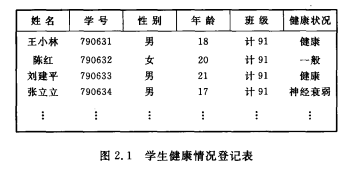

<h1>线性结构</h1>
特点：在数据元素中非空有限集中

(I):存在唯一的一个被称作"第一个"的数据元素
(II):存在唯一的一个被称作"最后一个"的数据元素
(III):除第一个之外，集合中每个数据元素都有且仅有一个前驱
(IV):除最后一个之外，集合中每个数据元素都有且仅有一个后继

## 线性表
(Linear_List)是最常用且最简单的一个数据结构。

线性表是n个数据元素的有限序列。
For example：(A,B,C,........,Z)
（6，17，28，50，92，188）

在稍微复杂的线性表中，一个数据元素可以由若干个数据项（Item）组成。
数据元素称为记录（Record）,含有大量记录的线性表称为文件（File）。

