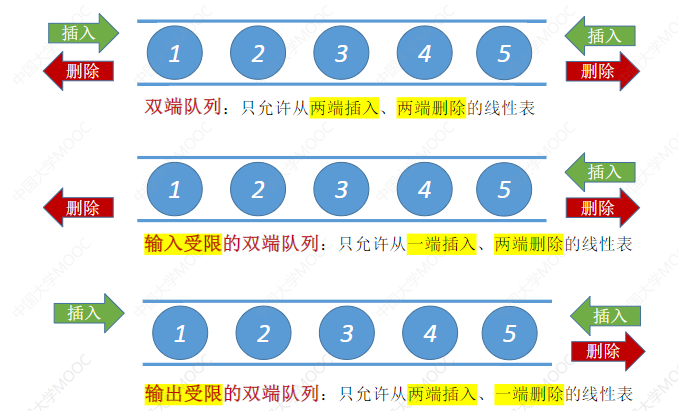
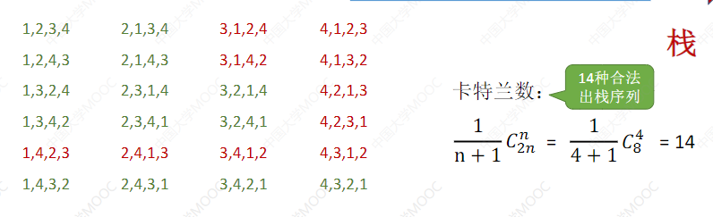
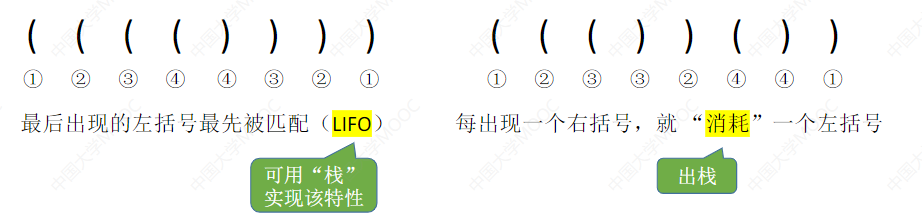
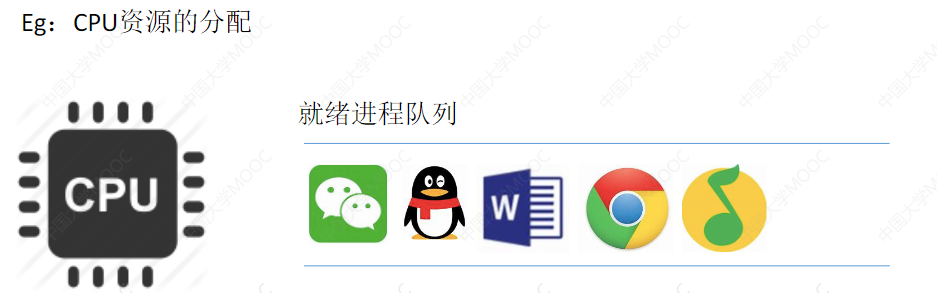
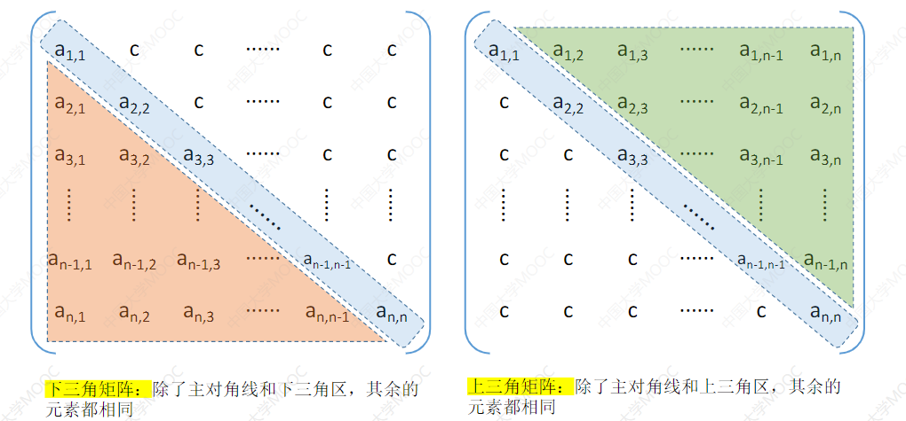
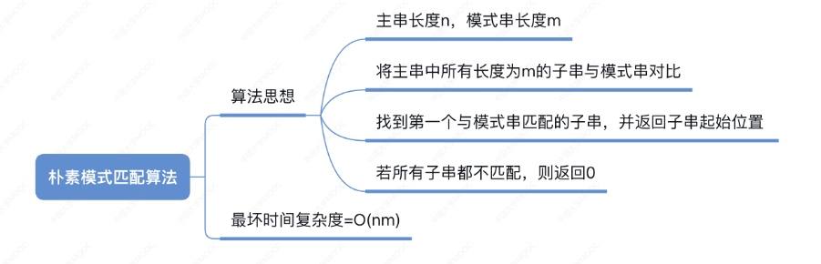
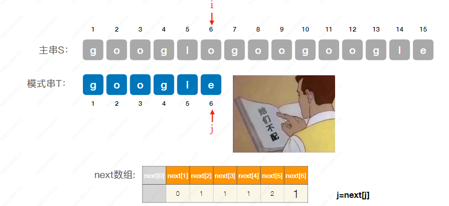

第三章 栈、队列、数组
# 栈(Stack)
## 定义：
线性表是具有相同数据类型的n(n≥0)个数据元素的有限序列，其中n为表长，当n=0时线性表是一个空表。若用L命名线性表，则其一般表示为

栈(Stack)是**只允许任一端进行插入或删除操作**的**线性表**
举个例子：石头堆，一串肉（只能从头吃到尾，放入的时候从顶部放到最低位）等等。

逻辑结构：与普通线性表相同
数据的运算：插入、删除操作有区别。

重要术语：**栈顶**，**栈底**，**空栈**

## 基本操作
线性表： 创销增删改查。

Pop(&S,&x)：&x是因为要把这个x带出去。

**栈的常考题型：**
进栈顺序：
a→b→c→d→e
有哪些合法的出栈顺序？

知识整合：

## 顺序栈的实现（物理结构）
跟线性表几乎一样：

**初始化操作：**

**增（进栈操作）：**

S.data[++S.top] =x：先+1，后执行S.data[S.top] = 1
S.data[\+\+S.top] =x：先执行S.data[S.top] = 1,后\+\+S.top

**删（出栈操作）：**

**查（读取栈顶元素操作）：**

跟出栈操作没啥区别。

另一种方式：

**共享栈：**

**知识整合：**

## 链式存储的栈（链栈）
**进栈**：头插法建立单链表
**出栈**：单链表的删除操作

### 定义：

**知识整合：**

# 队列(Queue)

栈(Stack) 是 只允许在一端进行插入 或 删除 操作的 线性表

队列(Queue) 是 只允许在一端进行 插入 在 另一端 删除 的线性表 

队列 其实就是 排队

**基本操作**

**知识整合：**

## 队列的顺序实现

初始化操作

**入队操作**

**假设队列并没有存满：**

**循环队列：**

**循环队列的入队操作：**

（其中，要牺牲这个2的存储单元，避免队列被程序当作空）

**循环队列的出队操作和查：**

（只能从队头 出队）

**方案一：**

方案二：

方案三：

**其他出题方法：**
当队尾指针指向队尾元素的话..：**（注意审题）**

初始化可以让front = 0 rear = n-1
**判断队空和队满：**

**知识整合：**

## 队列的链式存储
**和单链表几乎一样！（单链表的阉割版）**

**初始化（带头结点）：**

**初始化（不带头结点）：**

**入队（带头结点）**：

**入队（不带头结点）：**

**出队（带头结点）：**

**出队（不带头结点）：**

**队列满的条件：**

**知识整合：**

## 双端队列

**双端队列的更多形式：**

**考点：判断输出序列合法性**

输出：
**1，2，3，4 的情况**
输入1，再输出1，输入2，输出2.... 因此**合法。**

**2，4，1，3 的情况**

输入1，2 -> 输出 2 -> 输入3,4 ->输出4，没办法输出1，**因此不合法。**

**3，2，4，1的情况**

输入1，2，3 -> 输出3，2 -> 输入4 -> 出4 -> 出1 **合法。**

**4，3，2，1的情况**
这不用说了吧。

**具体答案：**

**如果用的是双端队列：**

栈合法的，双端也会合法。
**输入受限的双端队列：**

**输出受限的双端队列：**

**知识整合：**

# 栈的应用
##  括号匹配
IDE ： 可视化编程环境

**括号都是成双成对的。**

算法演示：

第2种情况：

第3种情况：

第4种情况：
栈非空，左括号单身。

过程图：

算法实现：

知识整合：
用栈实现括号匹配：
依次扫描所有字符，遇到左括号入栈，遇到右括号则弹出栈顶元素检
查是否匹配。
匹配失败情况：
①左括号单身②右括号单身③左右括号不匹配

## 表达式的应用（考试重点：频率不低）

### 中缀，后缀，前缀表达式

**常见的中缀表达式**

**波兰数学家的灵感**
一个灵感：可以不用界限符也能无歧义地表达运算顺序
Reverse Polish notation(逆波兰表达式=后缀表达式)
Polish notation(波兰表达式=前缀表达式)

第二行：
后缀表达式：
(把 ab+ 当作一个整体)
前缀表达式：
(把 +ab 当作一个整体)

Example：
第二个中缀： a + b - c 
如果先执行b - c 
后缀： a b c - +
（把bc- 当作一个整体）

#### 中缀表达式 转 后缀表达式（手算）：

**例子：**

**"左优先"原则 很重要，可以保证运算顺序唯一**

#### 后缀表达式的计算（手算）

**核心特点：**

#### 后缀表达式的计算（机算）
用栈实现后缀表达式的计算：
①从左往右扫描下一个元素，直到处理完所有元素
②若扫描到操作数则压入栈，并回到①：否则执行③
③若扫描到运算符，则弹出两个栈顶元素，执行相应运算，运算结果压回栈顶，回到①

==**注意：先出栈的是"右操作数"** #EE3F4D==
若表达式合法，则最后栈中只会留下一个元素，就是最终结果。

#### 中缀表达式转前缀表达式（手算）
**"右优先"原则：只要右边的运算符能先计算，就优先算右边的**

#### 前缀表达式的计算

操作数是左还是右很重要，影响计算。

知识整合1：

#### 中缀表达式 转 后缀表达式 （机算）
（具体看视频）

其中，重点是 2 和 3的处理。
乘除 的 优先级 > 加减

**优先度高的先弹出！**

另一种情况：

用这个练练手！

#### 中缀表达式的计算（用栈实现）
**中缀转后缀** + **后缀表达式求值**
两个算法的结合

用栈实现中缀表达式的计算：
初始化两个栈，**操作数栈**和**运算符栈**
若扫描到操作数，压入操作数栈
若扫描到运算符或界限符，则按照“中缀转后缀”相同的逻辑压入运算符栈（期间也会弹出运算符，**每当弹出一个运算符时，就需要再弹出两个操作数栈的栈顶元素并执行相应运算，运算结果再压回操作数栈**

（如果不懂，还是看看视频吧）

> 为什么要搞怎么复杂，因为CPU很蠢，用这种算法来翻译公式，喂给计算机做。所以这个**算法非常重要！**

**知识整合2：**

## 递归！
**递归：函数调用函数的过程。**

函数调用背后的过程

IDE调试模式(CLion)

### 栈在递归中的应用
适合用“递归”算法解决：可以把原始问题转换为**属性相同**，但**规模较小**的问题

Eg.2递归算法求阶乘

Eg.2递归算法求斐波那契数列

知识整合：

# 队列应用
## 树的层次遍历
(会在树章节更多学习)

遍历过程：

## 图的广度优先遍历
(会在图章节更多学习)

## 队列在操作系统中的应用
多个进程争抢着使用有限的系统资源时,**FCFS(First Come First Service,
先来先服务)** 是一种常用策略。

例子：

# 数组和特殊矩阵
## 数组的存储结构
### 一维数组

各数组元素大小相同，且物理上连续存放。
数组元素a[i] 的存放地址=LOC+i*sizeof(ElemType) (0≤i<10)
注：除非题目特别说明，否则数组**下标默认从0开始**
**注意审题！易错！**

### 二维数组

内存这样线性存储，带来的好处就是可以做**随机存取！**（计算机可以直接算出存放地址）

行优先：
M行N列的二维数组b\[M\]\[N\]中，若按列优先存储，则
b\[i\]\[j\]的存储地址=LOC+(i*N+j)*sizeof(ElemType)

列优先：
M行N列的二维数组b\[M\]\[N\]中，若按列优先存储，则
b\[i\]\[j\]的存储地址=LOC+(j*M+i)*sizeof(ElemType)

## 普通矩阵的存储

## 特殊矩阵的存储

### 对称矩阵(线性代数知识)

策略：只存储主对角线+下三角区

如果要访问的话，只要用这**映射函数**就可以了！（考研最喜欢考察的一个点）
数组下标 -1 的原因是数组下标一开始是0。

如果要访问上三角区的呢？利用对称矩阵的性质

转换规则：

考题例子：

### 三角矩阵

三角矩阵的压缩存储
下三角：

上三角：

### 三对角矩阵的压缩存储
当|i-j| > 1 有aij = 0

若已知数组下标K，如何得到 i, j？

注意对于"刚好" 的东西。

### 稀疏矩阵
策略一：

策略二：

**知识整合：**

# 第四章 串
## 串的定义（逻辑结构）

注意名词： 子串，主串，字符和子串的位置。
空串 v.s. 空格串

串 和 线性表 的区别？

串的数据对象限定为字符集（如中文字符、英文字符、数字字符、标点字符等）
串的基本操作，如**增删改查**等**通常以子串为操作对象**

## 串的基本操作
假设有串T="",S="iPhone11 Pro Max?”,W="Pro”
StrAssign(&T,chars): 赋值操作。把串T赋值为chars。
StrCopy(&T,S): 复制操作。由串S复制得到串T。
StrEmpty(S): 判空操作。若S为空串，则返回TRUE,否则返回FALSE。
StrLength(S): 求串长。返回串S的元素个数。
ClearString(&S): 清空操作。将S清为空串。(逻辑上清空，但没有还给系统)
DestroyString(&S): 销毁串。将串S销毁（回收存储空间）
Concat(&T,S1,S2): 串联接。用T返回由S1和S2联接而成的新串
SubString(&Sub,S,pos,len): 求子串。用Sub返回串s的第pos个字符起长度为len的子串。
Index(S,T): 定位操作。若主串S中存在与串T值相同的子串，则返回它在主串S中第一次出现的位置；否则函数值为0。
StrCompare(S,T): 比较操作。若S>T,川返回值>0；若S=T,则返回值=0；若S<T,则返回值<0。

Eg:
执行基本操作Concat(&T,S,W)后，T=“iPhone11 Pro Max?Pro” (存储空间的扩展)
执行基本操作SubString(&T,S,4,6)后，T=“one11”
执行基本操作ndex(S,W)后，返回值为11

其中，关于比较操作，在各个方面都有运用。

## 字符集编码

y=f(x)
字符集：函数定义域
编码：函数映射规则f
y:对应的二进制数

任何数据存到计算机中一定是二进制数。
需要确定一个字符和二进制数的对立规则这就是“编码”。
“字符集”：
英文字符一一ASCII字符集
中英文一一Unicode字符集

基于同一个字符集，可以有多种编码方案，如：UTF-8,UTF-16
>注：采用不同的编码方式，每个字符所占空问不同，考研中只需默认每个字符占1B即可。
>

## 拓展:乱码问题

其实是解码方式错了。

知识整合：

字符集编码很重要。

## 串的存储结构
### 顺序存储
结合顺序表的知识思考一下优缺点

基本和线性表一样，只是ElemType换成了Char

各种方案：

方案二： （由于一格只有1B)Length只能 0 ~ 255
方案三的 \0，以及存在缺点：去获取长度。
方案一和方案四 才常用。

### 链式存储
结合链表的知识思考优缺点（和基本操作相关）

下部分的编程更好，存储密度更高。

### 基本操作实现

StrAssign(&T,chars):赋值操作。把串T赋值为chars。
StrCopy(&T,S):复制操作。由串Ss复制得到串T。
StrEmpty(S):判空操作。若S为空串，则返回TRUE,否则返回FALSE。
StrLength(S):求串长。返回串S的元素个数。
ClearString(&S):清空操作。将S清为空串
DestroyString(&S):销毁串。将串S销毁(回收存储空间)
Concat(&T,S1,S2):串联接。用T返回由S1和S2联接而成的新串

**以下重点聊：**
SubString(&Sub,S,pos,len):求子串。用Sub返回串S的第pos个字符起长度为len的子串。

StrCompare(S,T):比较操作。若S>T,则返回值>0；若S=T,则返回值=0；若S<T,则返回值<0。

Index(S,T):定位操作。若主串S中存在与串T值相同的子串，则返回它在主串S中第一次出现的位置；否则函数值为0。

知识整合：

## 字符串模式匹配
什么是模式匹配？

字符串模式匹配：在主串中找到与模式串相同的子串，并返回其所在位置。

存在两种模式匹配算法： 朴素模式匹配算法，KMP算法。

### 朴素模式匹配算法
直接一一进行对比

**朴素模式匹配算法**：将主串中所有长度为的子串依次与模式串对比，直到找到一个完全匹配的子串，或所有的子串都不匹配为止。

算法：

直接操作数组下标来进行对比：
若当前子串匹配失败，则**主串指针指向下一个子串的第一个位置，模式串指针j回到模式串的第一个位置**

若j>T.length,则当前子串匹配成功，返回当前子串第一个字符的位置一一i-T.length

最坏时间复杂度=O(nm)

其实O((n-m+1)m) = O(nm) ()

知识整合：

### KMP算法 
> 由D.E.Knuth,J.H.Morris和V.R.Pratt提出，因此称为KMP算法

如果按照朴素模式匹配算法：**一旦发现当前这个子串中某个字符不匹配，就只能转而匹配下一个子串（从头开始）**

但是：**不匹配的字符之前，一定是和模式串一致的**，对吧。

前面都知道不匹配了，从这个开始才知道可以检查了。

从
主串S： 6
模式串T：3
来开始匹配。

对于模式串T="abaabc",当第6个元素匹配失败时，可令主串指针i不变，模式串指针j=3

如果其他位置不匹配呢？

对于模式串T=abaabc',当第3个元素匹配失败时？怎么搞？
可令主串指针ⅰ不变，模式串指针j=1

对于模式串T='abaabc',当第2个元素匹配失败时？怎么搞？
可令主串指针i不变，模式串指针j=1

对于模式串T='abaabc',当第1个元素匹配失败时？怎么搞？
匹配下一个相邻子串

以上的情况，都是i不变，J进行变化。

优化后主串指针不"回溯"

这个例子好好思考想象一下哈！

KMP算法就是这样的：（考研难度前三的哦？!)

Next数组调用

**朴素模式匹配 v.s. KMP算法**

只是整合：

这部分考查：去求出Next 数组。

### 求 Next 数组（KMP算法）

next数组的作用：当模式串的第j个字符失配时，从模式串的第next[j]的继续往后匹配

**任何模式串都一样：**
第一个字符不匹配时，只能匹配下一个子串，因此，next[1]都无脑写0。
第二个字符不匹配时，应尝试匹配模式串的第1个字符，因此，next[2]都无脑写1

接下来第三个字符开始就得看看了：用这**美丽的分界线~**

**最终答案：**

然后接下来用next数组进行模式匹配！

**练习：**

出答案前做题： 0 1 1 2 3 4 （是对的）
思路：第一个和第二个都无脑写0 1
第三个：则 不是a，则从第一个开始
第四个：则 不是b，但是前一个a匹配成了，所以从2开始
第五个：则 不是a，但前两个ab匹配成了，而前面符合ab，所以从3开始
第六个：则 不是a，但前三个aba匹配成了，而前面符合aba,所以从4开始

**练习2：**

**做题：** 0 1 2 3 1 (最后一个错了，其实是4)

思路：最重要的不是当前不匹配，但是不匹配之前的几个已经匹配的内容。

**知识整合：**
