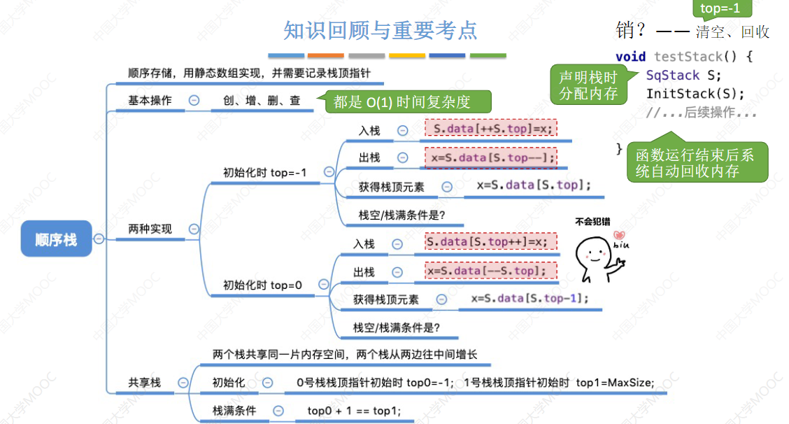
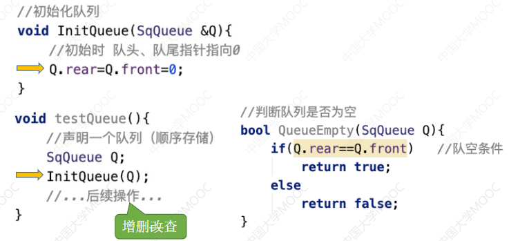

第三章 栈、队列、数组
# 栈(Stack)
## 定义：
线性表是具有相同数据类型的n(n≥0)个数据元素的有限序列，其中n为表长，当n=0时线性表是一个空表。若用L命名线性表，则其一般表示为

栈(Stack)是**只允许任一端进行插入或删除操作**的**线性表**
举个例子：石头堆，一串肉（只能从头吃到尾，放入的时候从顶部放到最低位）等等。

逻辑结构：与普通线性表相同
数据的运算：插入、删除操作有区别。

重要术语：**栈顶**，**栈底**，**空栈**

## 基本操作
线性表： 创销增删改查。

Pop(&S,&x)：&x是因为要把这个x带出去。

**栈的常考题型：**
进栈顺序：
a→b→c→d→e
有哪些合法的出栈顺序？

知识整合：

## 顺序栈的实现（物理结构）
跟线性表几乎一样：

**初始化操作：**

**增（进栈操作）：**

S.data[++S.top] =x：先+1，后执行S.data[S.top] = 1
S.data[\+\+S.top] =x：先执行S.data[S.top] = 1,后\+\+S.top

**删（出栈操作）：**

**查（读取栈顶元素操作）：**

跟出栈操作没啥区别。

另一种方式：

**共享栈：**

**知识整合：**

## 链式存储的栈（链栈）
**进栈**：头插法建立单链表
**出栈**：单链表的删除操作

### 定义：

**知识整合：**

# 队列(Queue)

栈(Stack) 是 只允许在一端进行插入 或 删除 操作的 线性表

队列(Queue) 是 只允许在一端进行 插入 在 另一端 删除 的线性表 

队列 其实就是 排队

**基本操作**

**知识整合：**

## 队列的顺序实现

初始化操作

**入队操作**

**假设队列并没有存满：**

**循环队列：**

**循环队列的入队操作：**

（其中，要牺牲这个2的存储单元，避免队列被程序当作空）

**循环队列的出队操作和查：**

（只能从队头 出队）

**方案一：**

方案二：

方案三：

**其他出题方法：**
当队尾指针指向队尾元素的话..：**（注意审题）**

初始化可以让front = 0 rear = n-1
**判断队空和队满：**

**知识整合：**

## 队列的链式存储
**和单链表几乎一样！（单链表的阉割版）**

**初始化（带头结点）：**

**初始化（不带头结点）：**

**入队（带头结点）**：

**入队（不带头结点）：**

**出队（带头结点）：**

**出队（不带头结点）：**

**队列满的条件：**

**知识整合：**

## 双端队列

**双端队列的更多形式：**

**考点：判断输出序列合法性**

输出：
**1，2，3，4 的情况**
输入1，再输出1，输入2，输出2.... 因此**合法。**

**2，4，1，3 的情况**

输入1，2 -> 输出 2 -> 输入3,4 ->输出4，没办法输出1，**因此不合法。**

**3，2，4，1的情况**

输入1，2，3 -> 输出3，2 -> 输入4 -> 出4 -> 出1 **合法。**

**4，3，2，1的情况**
这不用说了吧。

**具体答案：**

**如果用的是双端队列：**

栈合法的，双端也会合法。
**输入受限的双端队列：**

**输出受限的双端队列：**

**知识整合：**
