# 第五章 树
## 5.1.1~5.1.2树的定义和基本术语
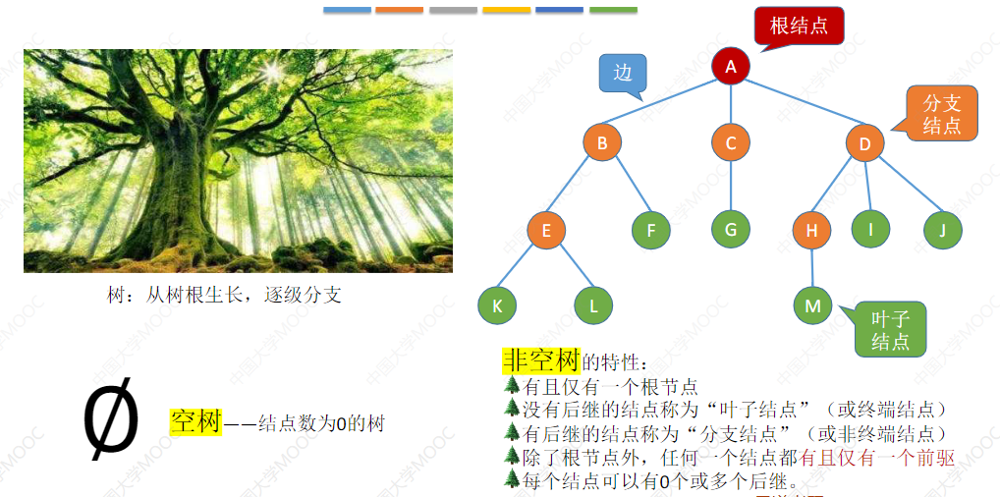

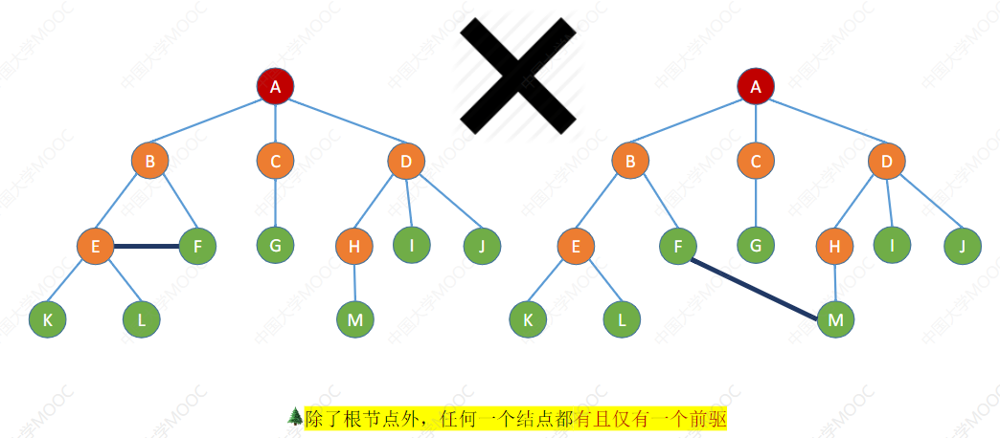

树是n(n≥0)个**结点**的有限集合，n=0时，称为**空树**，这是一种特殊情况。在任意一棵**非空树**中应满足：
1)有且仅有一个特定的称为**根**的结点。
2)当n>1时，其余结点可分为m(m>0)个**互不相交的有限集合**T1,T2,...,Tm,其中每个集合本身又是一棵树，并且称为根结点的**子树**。

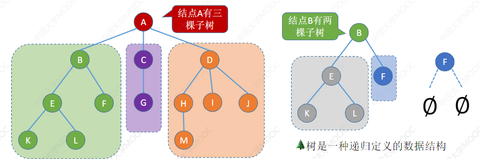

树形的逻辑结构的应用：（应用面很广的）
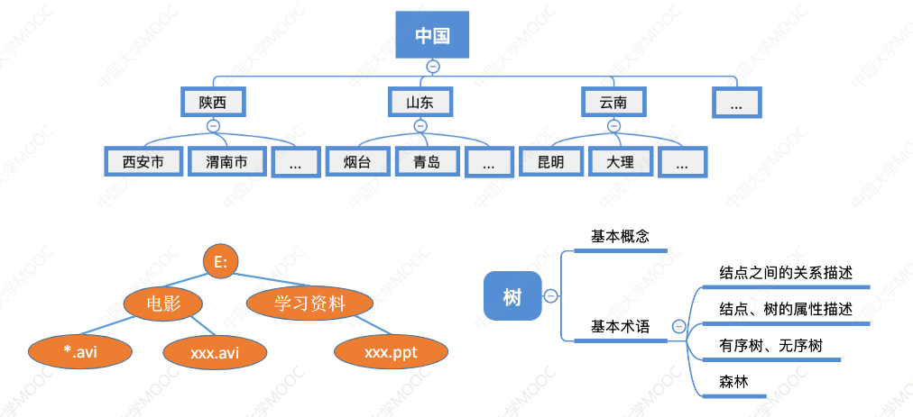

### 结点之间的关系描述
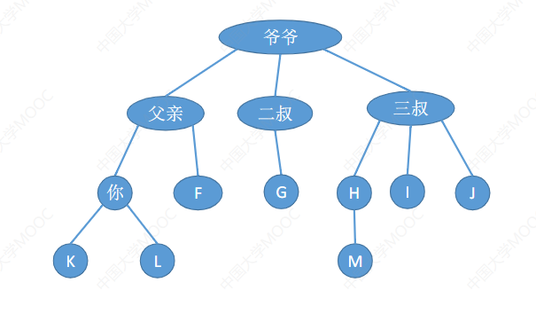

什么是祖先结点？
：从一个结点出发，往上走，直到根结点，路径上的所有结点。

什么是子孙结点？
：从一个结点出发，这个结点下面的所有结点（有关联的）。

什么是双亲结点（父节点）？
：从一个结点出发，一个结点的直接前驱。

什么是孩子结点？
：一个结点的后继。

什么是兄弟结点？
：同一个父结点的结点。

什么是堂兄弟结点？(使用频率很低)
：同一层次的结点。

什么是两个结点之间的路径？
：描述路径只能从上往下。（树上的边都是单向边）

什么是路径长度？
：经过几条边。

### 结点、树的属性描述
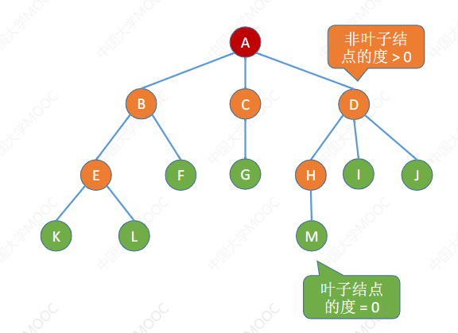

属性：
结点的层次（深度）(默认从1开始）一一从上往下数

结点的高度一一从下往上数

树的高度（深度）一一总共多少层

**结点的度**一一有几个孩子（分支）

**树的度**一一各结点的度的最大值

> 树的结点数 = 结点的总度数 + 1

### 有序树 v.s 无序树
有序树一一逻辑上看，树中结点的各了树从左至右是**有次序的**，不能互换

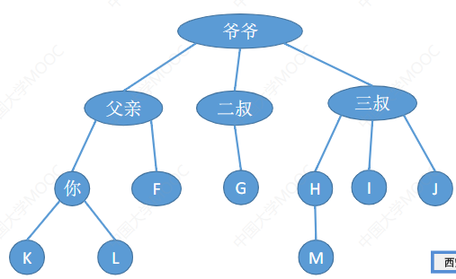

无序树一一逻辑上看，树中结点的各了树从左至右是**无次序的**，可以互换

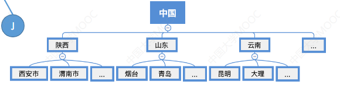

>具体看你用树存什么，是否需要用结点的左右位置反映某些逻辑关系。

### 树 v.s 森林
森林：森林是m(m≥0)棵**互不相交**的树的集合
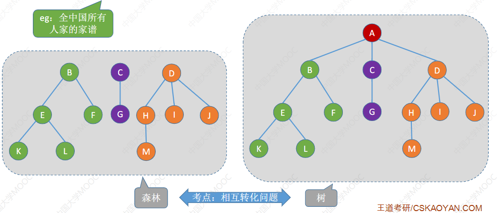
这有**考点！**

知识整合：
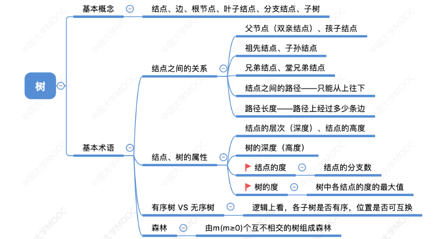

## 5.1.3树的常考性质：
### 常见考点1： 结点数=总度数+1
结点的度一一结点有几个孩子（分支）

### 常见考点2： 度为m的树、m叉树的区别

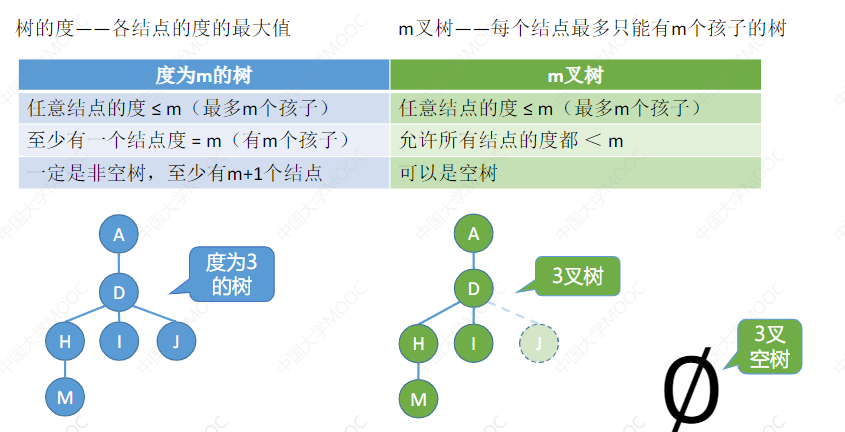
### 常见考点3： 度为m的树第i层至多有m^(i-1)个结点(i≥1)
m叉树第i层至多有m^(i-1)个结点(i≥1)

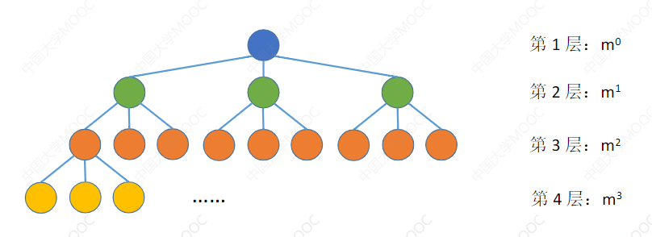

### 常见考点4：高度为h的m叉树至多有 (m^(h)-1 )/(m-1)个结点。
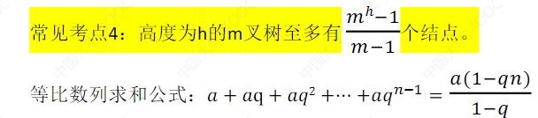
（等比数列公式应该是 a(1-q^(n)) / 1-q)

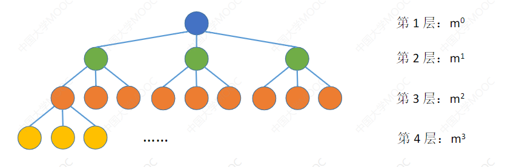
### 常见考点5： 高度为h的m叉树至少有h个结点；高度为h、度为m的树至少有h+m-1个结点。

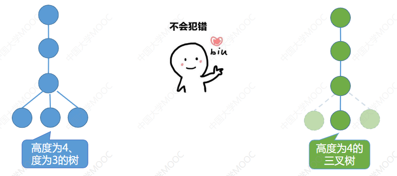
### 常见考点6： 具有n个结点的m叉树的最小高度为log m (n(m-1)+1)
高度最小的情况一一所有结点都有个孩子

知识整合：（有🚩的是容易错的）
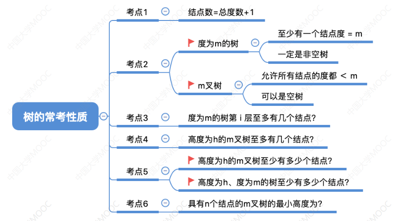

## 5.2.1_1 二叉树的定义以及基本术语

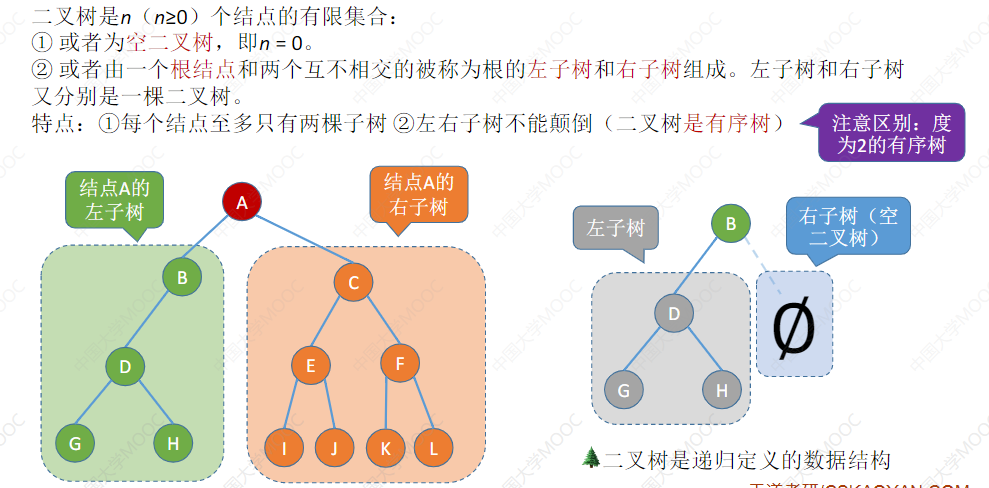和度为2不同，度是代表树中最大的分支是2（这个2是必须存在的）。而二叉树代表任何分支都是 <= 2(允许0）;

二叉树有五种形态：
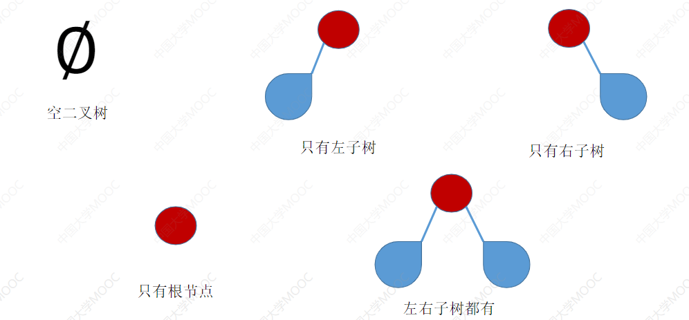

### 几个特殊的二叉树(喜欢考察)
满二叉树：(都拉满了（都有两个分支))
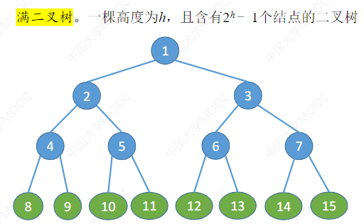
特点：
①只有最后一层有叶子结点
②**不存在度为1**的结点
③按层序从1开始编号，结点i的左孩了为2i,右孩
了为2i+1:、结点i的父节点为\[i/2\](如果有的话)

完全二叉树：(去掉一部分的满二叉树)
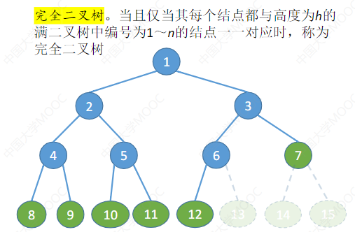
特点：
①只有最后两层可能有叶了结点
②**最多只有一个度为1**的结点 ==(考点) #EE3F4D==
③同 满二叉树 ③
④i<=\[n/2\]为分支结点，i>\[n/2\]为叶子结点

注意：以下二叉树并非 **"完全二叉树"**
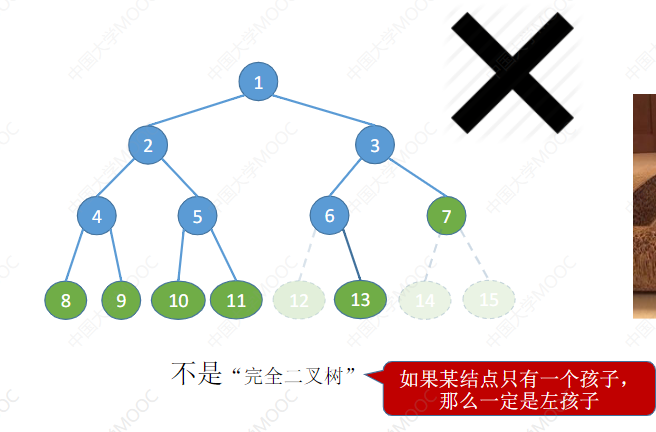

**二叉排序树：** 
一棵二叉树或者是空二叉树，或者是具有如下性质的二叉树：
**左子树**上所有结点的**关键字**均**小于根结点**的关键字；
**右子树**上所有结点的**关键字**均**大于根结点**的关键字。
左子树和右子树又各是一棵二叉排序树。

二叉排序树可用于元素的排序、搜索

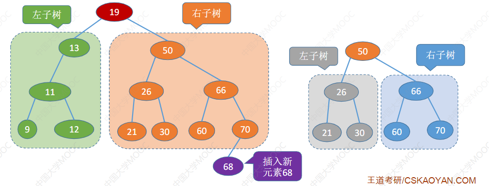
**平衡二叉树：**（主打的一个胖）
树上任一结点的左子树和右子树的**深度之差不超过1。**
平衡二叉树能有更高的搜索效率。

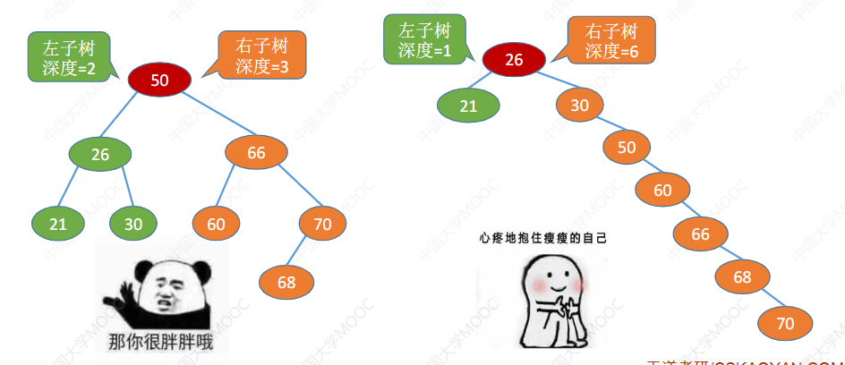

**知识整合：**
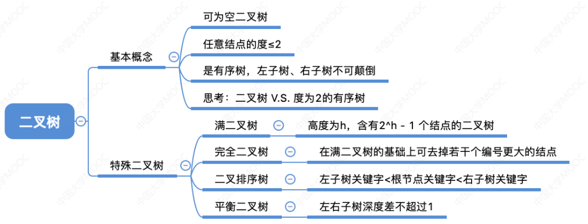

## 5.2.1_2二叉树的常考性质
### 常见考点1：设非空二叉树中度为0、1和2的结点个数分别为n0、n1和n2,则**n0=n2+1** （选择题中频率很高）
(叶子结点比二分支结点多一个)
假设树中结点总数为n,则
①n=n0+n1+n2 //二叉树只有度为0，1，2的结点，所以都加起来就是n
②n=n1+2n2+1 //树的结点数=总度数+1 （这个是算每个结点的子结点）
验证一下：
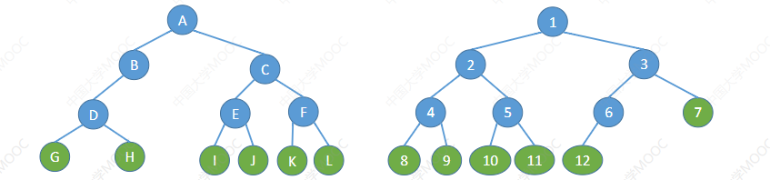

### 常见考点2：二叉树第i层至多有2^(i-1)个结点（≥1）；m叉树第i层至多有m^(i-1)个结点(i≥1)

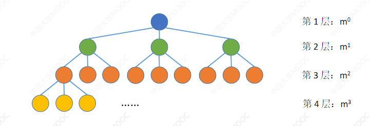

### 常见考点3：高度为h的二叉树至多有2^h - 1个结点（满二叉树)；高度为h的m叉树至多有个结点(m^(h)-1 )/(m-1)

## 完全二叉树的常考性质

### 常见考点1：具有n个(n>0)结点的完全二叉树的高度h为\[log2(n+1)\]或\[log2(n)\]+1
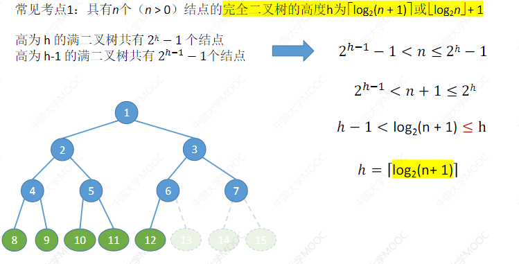

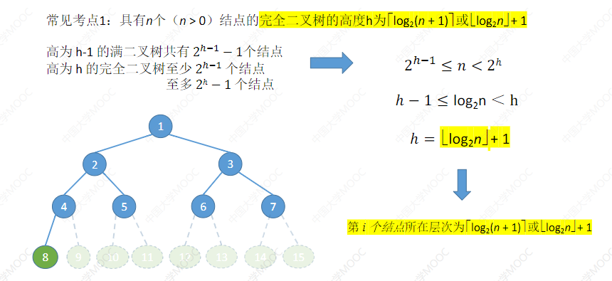

### 常见考点2：对于完全二叉树，可以由的结点数n推出度为0、1和2的结点个数为n0、n1和n2

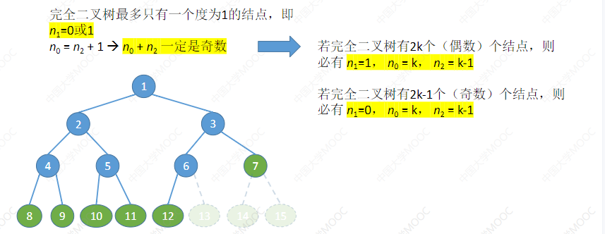

**知识整合：**
二叉树：
- **n0=n2 +1**
- 第i层至多有2^(i-1)个结点（≥1）
- 高度为h的二叉树至多有2^(h)-1个结点

完全二义树：
- 具有n个(n>0)结点的完全二叉树的高度h为\[log2(n+1)\]或\[Iog2(n)\]+1
- 对于完全二叉树，可以由的结点数n推出为0、1和2的结点个数为n0、n1和n2(突破点：完全二叉树最多只会有一个度为1的结点)

## 5.2.2 二叉树的存储结构
>从上至下，从左到右的顺序 依次存储 **完全二叉树**

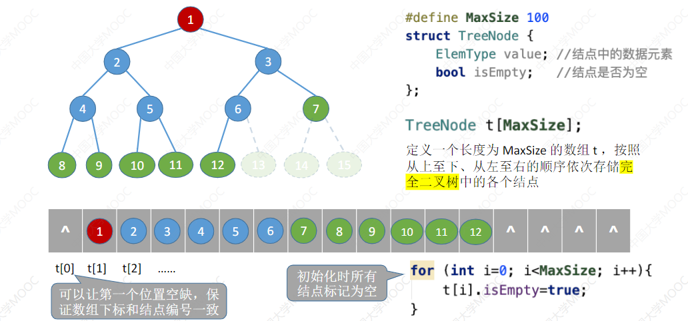
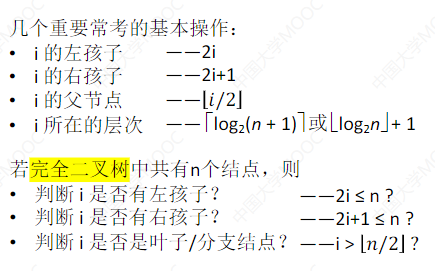

如果不是完全二叉树的话怎么办：
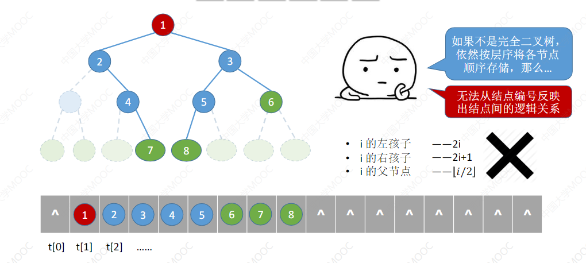

> 顺序存储中：一定要把二叉树的结点编号与完全二叉树对应起来。

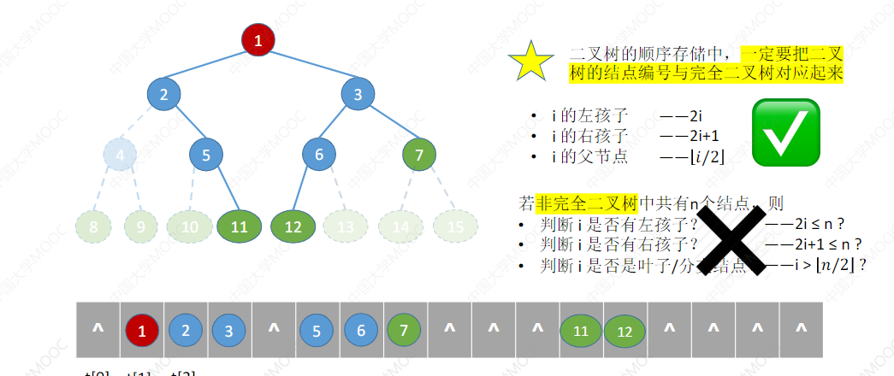

>**最坏情况：** 高度为h且只有h个结点的单支树（所有结点只有右孩子），也至少需要2^(h)-1个存储单元
结论：二叉树的顺序存储结构，只适合存储完全二叉树

链式存储：
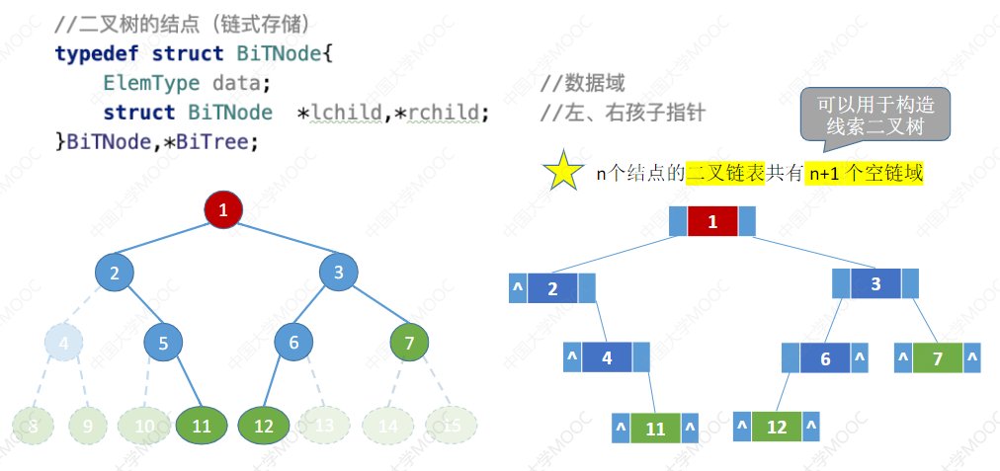

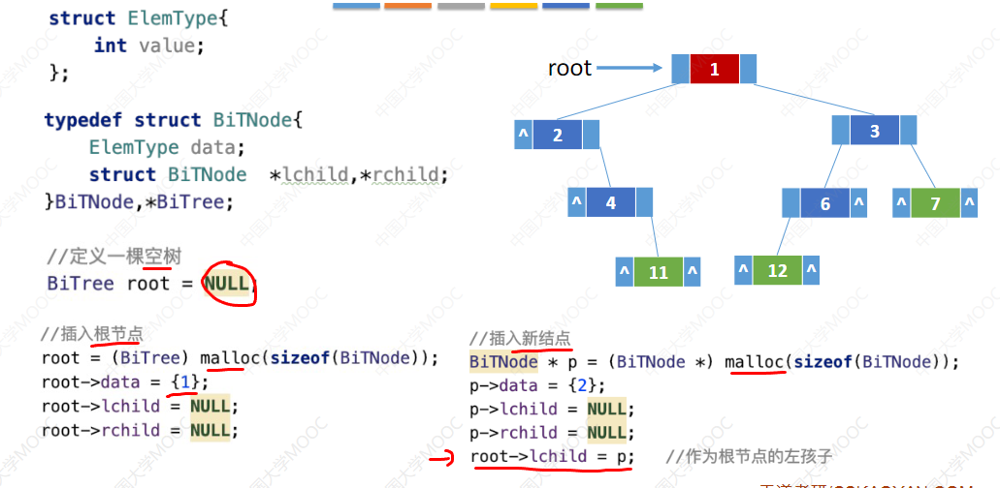