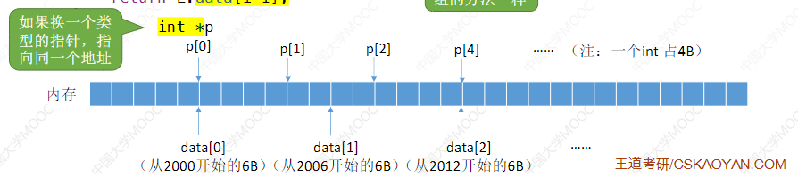

参考：王道考研-数据结构

# 1.数据结构学什么？
如何用程序代码把现实世界的问题 信息化
如果用计算机高效地处理这些信息从而创造价值

## 基本概念


**数据**：数据是**信息的载体**，描述一个客观食物属性的**能输入到计算机中并被计算机程序识别**的集合。

**数据元素**：数据基本单位，做为一个整体进行考虑和处理
一个数据元素由若干**数据项**组成。


**结构**：各个元素之间的关系

**数据结构**：相互之间存在一种或多种特定**关系**的数据元素的集合
**数据对象**：是具有**相同性质**的数据元素的集合，是数据的一个子集。

按照海底捞举例：

**数据结构**：某个特定门店的排队顾客信息和他们之间的**关系**

**数据对象**：全国所有门店的排队顾客信息


## 数据结构的三要素

### 逻辑结构--数据元素之间的逻辑关系

**集合**：各个元素同属一个集合，别无其他关系
**线性结构**：数据元素之间是一对一关系，除第一，每个元素都有**唯一前驱**；除最后，每个元素都有**唯一后继**
**树形结构**：元素之间是**一对多**关系
**图结构**：元素之间是**多对多**的关系

### 存储结构--如何用计算机表示数据的逻辑关系

**顺序存储**：把逻辑上相邻的元素存储在物理位置上也相邻的存储单元中。
**链式存储**：逻辑上相邻的元素在物理位置上可以不相邻（借用**指针**）
**索引存储**：附加索引表，索引表中每项称为索引项，索引项的一般形式（关键字，地址）
**散列存储**：根据元素的关键字直接计算出该元素的存储地址。又称哈希(Hash)存储

>顺序存储，在物理上必须是**连续的**；采用非顺序，物理上可以**离散的**。
>存储结构会影响：
>存储**空间分配的方便速度**
>对**数据运算速度**

### 数据的运算--施加在数据上的运算包括运算的定义和实现。
**运算的定义**是针对**逻辑结构的**，指出运算的功能：**运算的实现**是针对**存储结构的**，指出运算的具体操作步骤。

逻辑结构一一线性结构（队列）
结合现实需求定义队列这种逻辑结构的运算：
①队头元素出队：
②新元素入队：
③输出队列长度：
........

## 数据类型，抽象数据类型

**数据类型** 是一个值的结合和定义在此集合上的一组操作的总称。
1. 原子类型。其值不可再分的数据类型
	1. bool类型
	2. int类型
	3. .......

2. 结构类型。
	1. 定义一个具体的结构类型，表示某些东西。

```c
struct Customer{ //结构类型
	int num; //号码
	int people; //人数
	...    //其他信息

}

```

**抽象数据类型(Adstract Data Type,ADT)** ：抽象数据组织及与之相关的操作。
ADT用数学化的语言定义数据的逻辑结构，定义运算。与具体的实现无关。

**知识结合：**


# 2.线性表

## 定义(逻辑结构)

**线性表**：是具有**相同**数据类型的n(n>= 0) 个数据元素的**有限序列**，其中n为表长，当n = 0 时线性表是一个**空表**。
其表示为 **L=(a1,a2,....,ai,ai+1,.....,an)**
**注意**： 每个数据元素所占空间是一样大的，有有限次序。

概念：
ai 是第i个 元素线性表的位序
表头元素：a1
表尾元素：an
每个元素有**唯一直接前驱**，有**唯一后继**（除最前和最后）


## 基本操作(运算)

InitList(&L):**初始化表**。构造一个空的线性表L,分配内存空问。
DestroyList(&L):**销毁操作**。销毁线性表，并释放线性表L所占用的内存空问。
Listlnsert(&L,i,e):**插入操作**。在表L中的第i个位置上插入指定元素e。
ListDelete(&Li,&e):**删除操作**。删除表L中第i个位置的元素，并用e返回删除元素的值。
LocateElem(L,e):**按值查找操作**。在表L中查找具有给定关键字值的元素。
GetElem(L,i):**按位查找操作**。获取表L中第i个位置的元素的值。

Tips:
①对数据的操作（记忆思路）一一**创销**、**增删改查**
②C语言函数的定义一一<返回值类型>函数名(<参数1类型>参数1，<参数2类型>参数2，...)
③实际开发中，可根据实际需求定义其他的基本操作
④函数名和参数的形式、命名都可改变
⑤什么时候要传入引用“&”一一对参数的修改结果需要“**带回来**”

**对于&的实例：**

```c++
#include <iostream>
using namespace std;

void test1 (int x){
	x = 1024;
}


void test2 (int & x){
	x = 1024;

}

int main()
{
	int x = 1;
    cout << x;
	cout << "调用前 x = " << x <<"\n";
	test1(x);
	cout << "调用不带& x = " << x <<"\n";

	test2(x);
	cout << "调用带& x = " << x <<"\n";	
   return 0;
}
```

结果：
```
1调用前 x = 1
调用不带& x = 1
调用带& x = 1024
```

**知识结合：**


## 存储/物理结构

### 顺序表(顺序存储)

**定义：**
**顺序表** ： 用顺序存储的放松实现线性表
**顺序存储**：把逻辑上相邻的元素存储在物理位置上也相邻的存储单元中。


设线性表第一个元素的存放位置是LOC（L）
那a2的存放位置是在 LOC(L)+数据元素的大小
a3 = LOC(L)+2×数据元素的大小

C语言中：**sizeof(ElemType)** 可得知一个数据元素的大小
sizeof(int) = 4B
sizeof(Customer) = 8B //结构类型

### 基本操作的实现
#### 静态分配
```c++
#define MaxSize 10  // 定义最大长度
typedef struct{
	ElemType data[MaxSize]; //用静态"数组"存放数据元素
	int length; //顺序表的当前长度
}SqList; //命名
```
这出来的存储空间大小为 =  MaxSize × sizeof(ElemType)


```c++
#include<stdio.h>
#define MaxSize 10
typedef struct{
	int data[MaxSize]; //用静态"数组"存放数据元素
	int length; //顺序表的当前长度
}SqList;
//基本操作--初始化一个顺序表
void InitList(SqList &L){
	for(int i=0; i<MaxSize; i++) //第二步
		L.data[i] = 0; //将所有数据元素设置为默认初始值*
	L.length = 0; //第三步：顺序表初始长度为0
}
int main(){
	SqList L;  //第一步
	InitList(L);
	for (int i=0;i<L.length; i++)//如果写成 i<MaxSize 就有点不太好了。更好的方法是基础操作GetElem(L,i)
	return 0;
}
```

在第十行 L.data[i] = 0 ，如果不把数据元素设置默认初始值，默认元素会有问题，是内存里有遗留的"脏数据"
但是依旧可以省略，因为你用的时候这些数据就可以取代了。


静态分配问题：
Q: 如果"数组"存满了怎么办？
A：放弃治疗，表长确定后就无法更改。而一开始声明很大的话，就会浪费内存了。

#### 动态分配

```c++
#define InitSize 10  // 顺序表的初始长度
typedef struct{
	ElemType *data; //指示动态分配数组的指针
	int MaxSize;  //顺序表的最大容量
	int length; //顺序表的当前长度
	
}SeqList; //命名
```

Key:动态申请和释放内存空间
C--- malloc,Free函数
L.data = (ElemType \*)malloc(sizeof(ElemType) \* InitSize)
以上是存放 4B * 10
C++  ---- new,delete 关键字(面向对象)


int *p 指向malloc开拓的橙色L.data
free(p);是会回收橙色的data位置。

顺序表的特点：
1.随机访问，即可以在O(1)时间内找到第i个元素
2.存储密度高，每个节点只存储数据元素
3.拓展容量不方便
4.插入，删除操作不方便，需要移动大量元素。


**知识整合：**


### 顺序表插入和删除
#### 插入：
ListInsert(&L,i,e):**插入**操作
由于是用顺序物理存储结构来存储，所以要插入的话，就得把后面的往后一格，腾出一个位置给插入的元素


```c++
#define MaxSize 10
typedef struct{
	int data[MaxSize]; //静态，动态都可以用这个方法
	int length;
}SqList;

void ListInsert(SqList &L,int i,int e){
	for(int j=L.length;j>=i;j--) //将第i个元素及之后的元素后移
		L.data[j]=L.data[j-1];
	L.data[i-1]=e; //在位置i处放入e
	L.length++; //长度+1
}
int main(){
	SqList L; //声明一个顺序表
	InitList(L); //初始化顺序表
	....
	ListInsert(L,3,3); //插入顺序表
	return 0;
}
```

好的算法有健壮性：
```c++
bool ListInsert(SqList &L,int i,int e){
	if(i<1||i>L.length+1) //判断i的范围是否有效
		return false;
	if(L.length>=MaxSize)	//当前存储空间已满，不能插入
		return false;
	for(int j=L.length;j>=i;j--) //将第i个元素及之后的元素后移
		L.data[j]=L.data[j-1];
	L.data[i-1]=e; //在位置i处放入e
	L.length++; //长度加1
	return true;
}
好的算法，应该具有“健壮性”
能处理异常情况，并给使用者反馈
```

**插入操作时间复杂度：**

最好情况：新元素插入到表尾，不需要移动元素
i=n+1,循环0次：最好时间复杂度=0(1)
最坏情况：新元素插入到表头，需要将原有的n个元素全都向后移动
i=1,循坏n次；最坏时间复杂度=O(n):


#### 删除
ListDelete(&L,i,&e)删除操作。删除表L中第i个位置的元素，并用e返回删除元素的值。


**时间复杂度**：和插入差不多。


插入和删除的知识整合：


### 顺序表的查找
#### 按位查找
GetElem(L,i):按位查找操作。获得表中**第i个位置**的元素值

```c++
ElemType GetElem(SqList L, int i){
	return L.data[i-1];
}
```
(以上这个代码在**静态**还是**动态存储**都有效)

#### 指针问题!
关于ElemType \*data的意思（其实是指向malloc给他开的连续空间的起步**地址**）

如果换一个类型，就会变化（具体是占用的空间大小）int =4B



顺序表查找时间复杂度：O(1) --"随机存取"特性

#### 按值查找
LocateElem(L,e):按值查找操作。在表L中查找具有给点关键字值的元素。

```c++
int LocateElem(SeqList L,ElemType e){
	for(int i=0;i<L.length,i++)
		if (L.data[i] == e)
			return i+1;   //数组下标为i的元素值等于e，返回其为位序i+1
		return 0;
}
```

数组**下标**为i的元素值等于e，返回其**位序**i+1

if (L.data[i] == e) 基本数据类型可用，但**结构类型**的数据元素不能。要有点变化。

**结构类型：**

Tips：
考研初试中，手写代码可以直接用"==",无论ElemType是基本数据类型还是结构类型。
手写代码主要是考思想。


最好情况：目标元素在表头。循环1次：最好时问复杂度=0(1)
最坏情况：目标元素在表尾。循环n次：最坏时间复杂度=O(n):
平均情况：O(n)

知识整合


### 链表(链式存储)
单链表
双链表
循环链表
静态链表
#### 单链表


