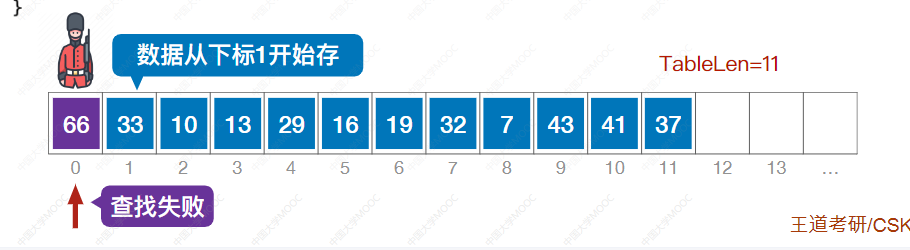
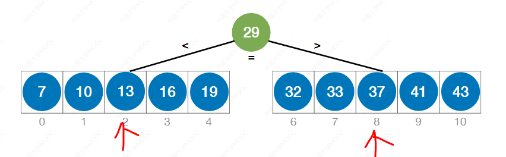
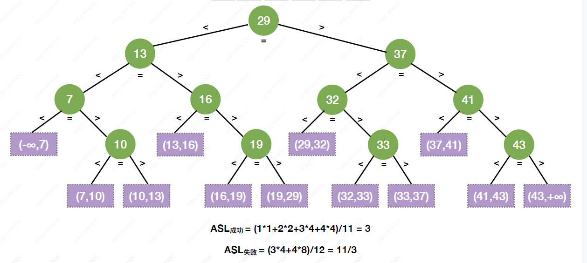

# 第 7 章 查找
[toc!]
## 7.1 查找的基本概念

**查找**一一一在数据集合中寻找满足某种条件的数据元素的过程称为查找
**查找表**(查找结构)一一一用于查找的数据集合称为查找表，它由**同一类型**的**数据元素**（或记录）组成
**关键字**一一一数据元素中**唯一标识该元素的某个数据项的值**，使用基于关键字的查找，查找结果应该是唯一的。

对查找表的常见操作

### 查找算法的评价指标

查找长度一在查找运算中，需要**对比**关键字的**次数**称为查找长度
**平均查找长度(ASL,Average Search Length)** 一**所有**查找过程中进行关键字的比较次数的平均值

知识整合：

## 7.2 顺序，折版，分块查找

### 7.2.1 顺序查找

#### 算法思想
顺序查找，又叫“线性查找”，通常用于线性表。
算法思想：从头到 jio挨个找（或者反过来也OK)

### 算法实现

（哨兵）—— 数据从下标1开始存。

从最后开始。

>减少了内存调用开销！！

### 算法优化

>（被查概率不相等）
>对于查找失败的问题还是很明显的。而上面的顺序查找成功和查找失败都很平均。

知识整合：

### 7.2.2 折半查找（考察频率高）

### 算法思想

>折半查找，又称“二分查找”，仅适用于**有序**的**顺序表。**

注：只有在[low,high]之间才有可能找到目标关键字

如果查找失败：

### 算法实现

### 查找判定树

>平衡二叉排序树！
>失败结点：成功结点的空指针。

### 折半查找效率

知识整合：

### 拓展思考

>如果向上取值

### 7.2.3 分块查找

分块区间：也就是有序的进行分块

实际查找的效果：

30 >= 22，那么22肯定在这个分块里面。

在 索引在 8 的位置， 30 和 29不匹配，所以会到下一个分块，结果就是超出范围了。

>分块查找，又称**索引顺序查找**，算法过程如下：
①在**索引表**中确定待查记录所属的分块（可顺序、可折半）
②在块内**顺序查找**

### 用折半查找查索引

>mid是30，匹配了，然后读取里面，然后就是 顺序查找，最终获得 30 是对的。

>进行折半查找。

>如果按照折半查找，会出问题，所以要改改： 当 low>high，low 所指分块中查找。

查找失败的例子：

### 查找效率分析 ASL

