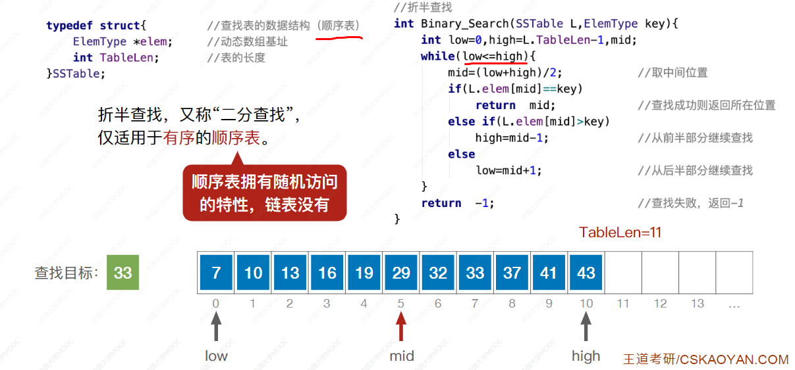
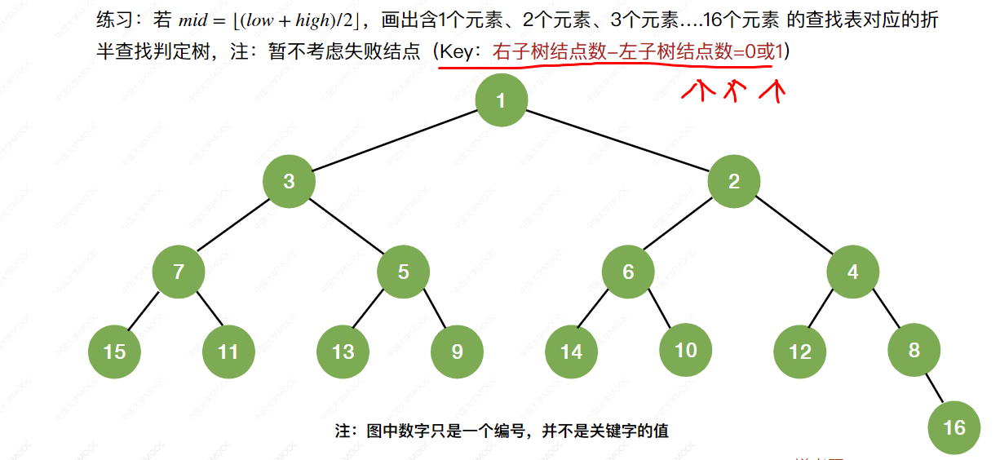
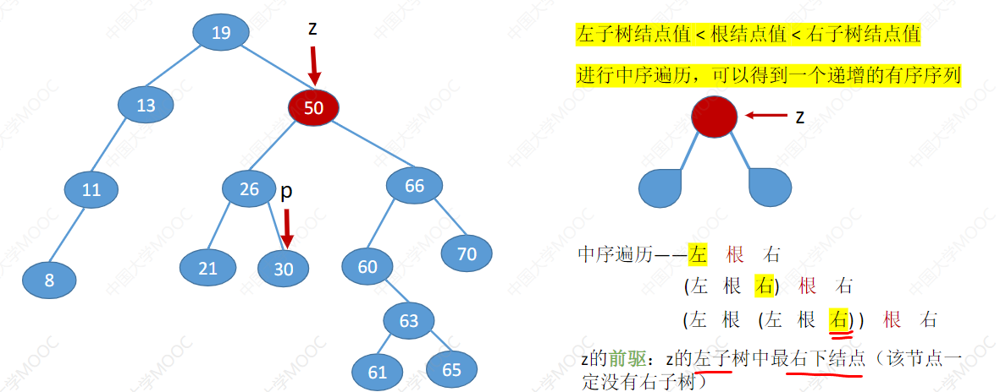
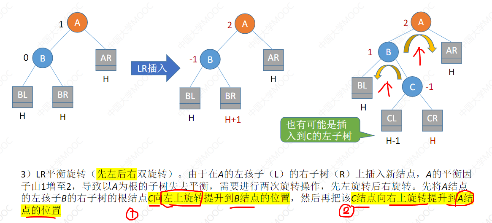
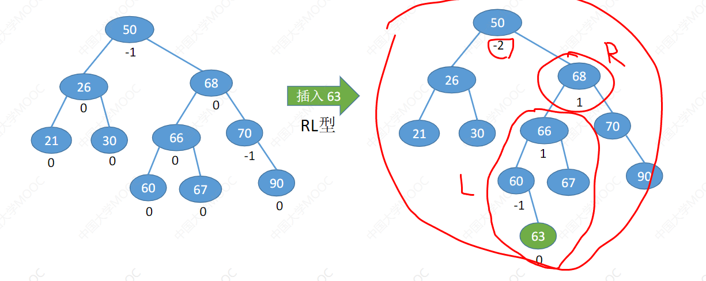
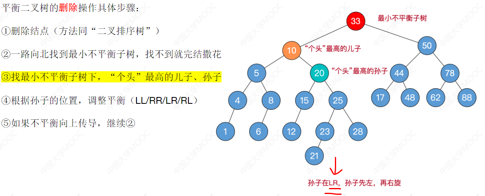
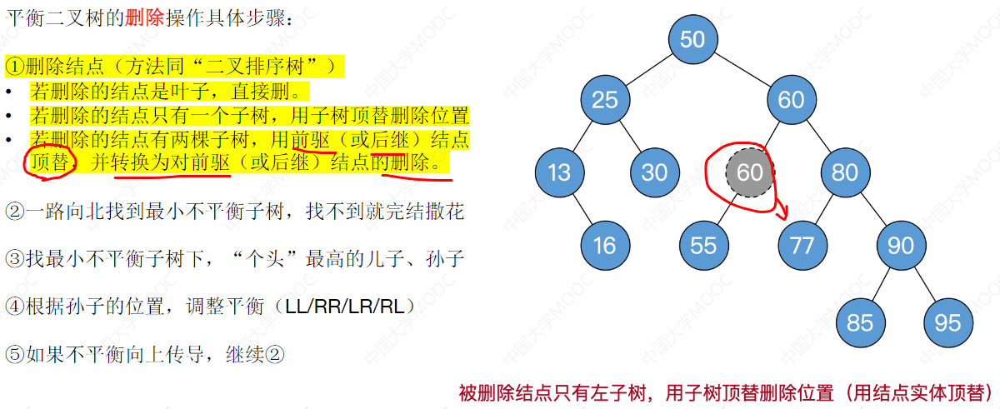
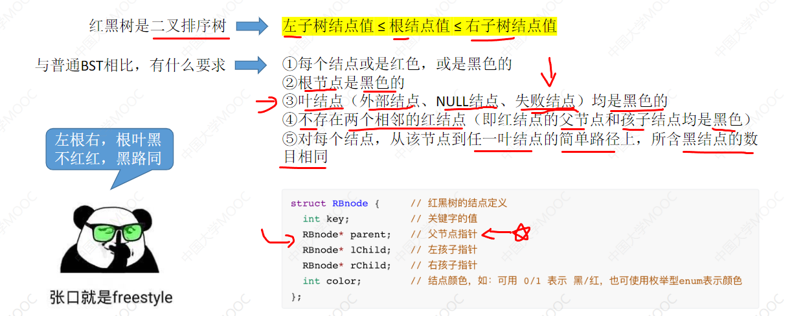
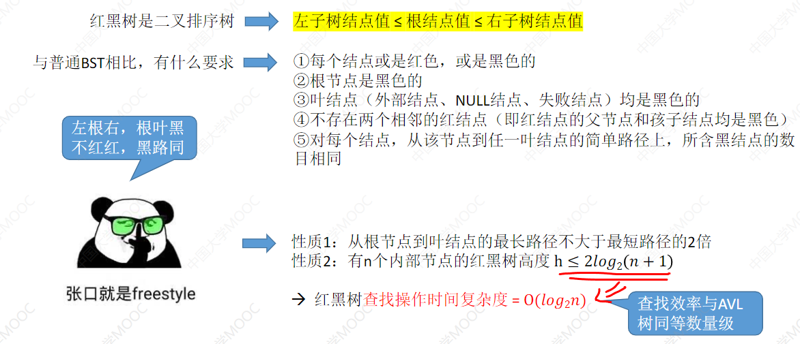

# 第 7 章 查找
[toc!]
## 7.1 查找的基本概念

**查找**一一一在数据集合中寻找满足某种条件的数据元素的过程称为查找
**查找表**(查找结构)一一一用于查找的数据集合称为查找表，它由**同一类型**的**数据元素**（或记录）组成
**关键字**一一一数据元素中**唯一标识该元素的某个数据项的值**，使用基于关键字的查找，查找结果应该是唯一的。

对查找表的常见操作

### 查找算法的评价指标

查找长度一在查找运算中，需要**对比**关键字的**次数**称为查找长度
**平均查找长度(ASL,Average Search Length)** 一**所有**查找过程中进行关键字的比较次数的平均值

知识整合：

## 7.2 顺序，折版，分块查找

### 7.2.1 顺序查找

#### 算法思想
顺序查找，又叫“线性查找”，通常用于线性表。
算法思想：从头到 jio挨个找（或者反过来也OK)

### 算法实现

（哨兵）—— 数据从下标1开始存。

从最后开始。

>减少了内存调用开销！！

### 算法优化

>（被查概率不相等）
>对于查找失败的问题还是很明显的。而上面的顺序查找成功和查找失败都很平均。

知识整合：

### 7.2.2 折半查找（考察频率高）

### 算法思想

>折半查找，又称“二分查找”，仅适用于**有序**的**顺序表。**

注：只有在[low,high]之间才有可能找到目标关键字

如果查找失败：

### 算法实现

### 查找判定树

>平衡二叉排序树！
>失败结点：成功结点的空指针。

### 折半查找效率

知识整合：

### 拓展思考

>如果向上取值

### 7.2.3 分块查找

分块区间：也就是有序的进行分块

实际查找的效果：

30 >= 22，那么22肯定在这个分块里面。

在 索引在 8 的位置， 30 和 29不匹配，所以会到下一个分块，结果就是超出范围了。

>分块查找，又称**索引顺序查找**，算法过程如下：
①在**索引表**中确定待查记录所属的分块（可顺序、可折半）
②在块内**顺序查找**

### 用折半查找查索引

>mid是30，匹配了，然后读取里面，然后就是 顺序查找，最终获得 30 是对的。

>进行折半查找。

>如果按照折半查找，会出问题，所以要改改： 当 low>high，low 所指分块中查找。

查找失败的例子：

### 查找效率分析 ASL

知识整合：

## 7.3 树形查找

### 7.3.1 二叉排序树 BST
#### 定义

二叉排序树 ——> 二叉查找树（BST,Binary Search Tree)

一棵二叉树或者是空二叉树，或者是具有如下性质的二叉树：
左子树上所有结点的关键字均**小于** **根结点**的关键字：
右子树上所有结点的关键字均**大于** **根结点**的关键字。
左子树和右子树又各是一棵二叉排序树。

>**中序遍历** 可以得到一个递增的有序序列

#### 查找

查找失败：

>递归实现

#### 插入

> 二叉树不允许存在两个 **关键字** 相同的结点。

#### 构造

#### 删除
先搜索找到目标结点：
①若被删除结点z是**叶结点**，则直接删除，不会破坏二叉排序树的性质。

②若结点z只有一棵左子树或右子树，则让z的**子树**成为z**父结点的子树**，替代z的位置。

③若结点z有左、右两棵子树，则令z的直接后继（或直接前驱）替代z,然后从二叉排序树中删去这个直接后继（或直接前驱），这样就转换成了第一或第二种情况。

>第一种思路，直接后继

>第二种思路，直接前驱。

>查找长度：**对比关键字的次数**。

#### 查找效率分析 ASL

>平衡二叉树：任何结点 左子树 和 右子树 之差 <= 1。

>查找失败

#### 知识整合：

### 7.3.2 平衡二叉树 AVL

#### 定义
平衡二叉树(Balanced Binary Tree),简称平衡树(AVL树)一一树上任一结点的左子树和右子树的高度之差不超过1。
**结点的平衡因子**=左子树高-右子树高。

#### 插入操作

#### 插入新结点后如何调整“不平衡”问题 (最关键)

##### LL（左孩子的左子树）

>1)L平衡旋转（右单旋转）。由于在结点A的左孩子(L)的左子树(L)上插入了新结点，A的平衡因子由1增至2，导致以A为根的子树失去平衡，
>需要一次向右的旋转操作。将A的左孩子B向右上旋转代替A成为根结点，将A结点向右下旋转成为B的右子树的根结点，而B的原右子树则作为A结点的左子树。

##### RR（右孩子的右子树）

>2)RR平衡旋转（左单旋转）。由于在结点A的右孩子(R)的右子树(R)上插入了新结点，A的平衡因子由-1减至-2，导致以A为根的子树失去平衡，需
>要一次向左的旋转操作。将A的右孩子B向左上旋转代替A成为根结点，将A结点向左下旋转成为B的左子树的根结点，而B的原左子树则作为A结点的右子树。

##### 代码思路

##### LR 左孩子的右子树

>3)LR平衡旋转（先左后右双旋转）。由于在A的左孩子(L)的右子树(R)上插入新结点，A的平衡因子由1增至2，导致以A为根的子树失去平衡，
>需要进行两次旋转操作，**先左旋转后右旋转。** 先将A结点的左孩子B的右子树的根结点C向左上旋转提升到B结点的位置，然后再把该C结点向右上旋转提升到A结点的位置
>先让C 左旋， 然后 A 右选。

> C **左旋**顶替 B ，然后 C 再**右旋**顶替 A

###### RL 右孩子的左子树

>同样，C **右选**顶替 B ，然后 C 再**左旋**顶替 A

##### 汇总：

>LL ——> 左孩子 右旋
RR ——> 右孩子 左旋
LR ——> 左孩子的右孩子 左旋右旋
RL ——> 右孩子的左孩子 右旋左旋

#### 拓展探讨 / 练习

问题解答：

练习1：

练习2：

练习3：

#### 查找效率分析

#### 知识整合

#### 删除（7.3.2_2)

>平衡二叉树的特性： 左<中<右

>平衡二叉树的删除操作具体步骤：
①删除结点（方法同“二叉排序树”）
②一路向北找到 **最小不平衡子树**，找不到就完结撒花（不需要调整）
③找最小不平衡子树下，“**个头”最高**的儿子、孙子
④根据孙子的位置，调整平衡(LL/RR/R/RL)
⑤如果不平衡向上传导，继续②

偷看：二叉排序树的知识整合。

##### AVL树删除操作 —— 例1 无问题

##### AVL树删除操作 —— 例2 RR

>"个头" 并非看 关键字的量，而是高度（深度）

##### AVL树删除操作 —— 例3 RL

##### AVL树删除操作 —— 例4 不平衡向上传导

>不平衡向上传导

这样就完成了。

##### AVL树删除操作 —— 例5 删除的结点有两颗子树(选前驱)

>前驱：左孩子一路往右
>后继：右孩子一路往左

情况RR：右子树左转。 == 儿子左转

##### AVL树删除操作 —— 例6 删除的结点有两颗子树(选后继)

>两个选择，85 和 95 个头都是最高的孙子，两者都可以选。

>不可能考这种有多处理方式的题目。

知识整合：

>平衡二叉树的删除操作 比较少考

### 7.3.3 红黑树 RB T

> BST ——> AVL ——> RBT

#### 定义：

> 红黑树 = 二叉排序树 ——> 左 <= 根 <= 右

>1.结点要么红，要么黑。
>2.根一定黑
>3.叶也一定黑
>4.红不相连
>5.每条路上黑的量相同。

>左根右，根叶黑，不相红，黑路同。

这个才是符合的。

一种可能的出题思路。

>结点的黑高：从某结点出发（不含该结点）到达任一空叶结点的路径上黑结点总数。

>红黑树的查找 == BST,AVL 查找

#### 插入：

#### 删除：
