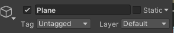
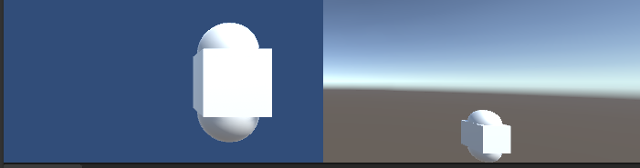
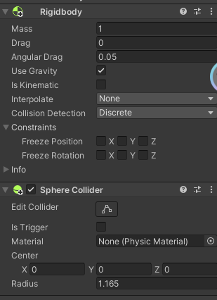
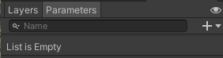
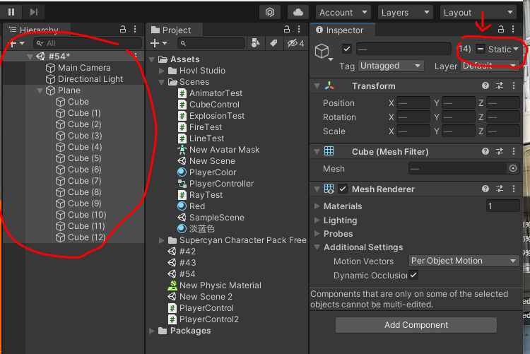

参考视频：[Unity教程 零基础带你从入门到大神](https://www.bilibili.com/video/BV1gQ4y1e7SS?p=7&spm_id_from=pageDriver&vd_source=d1002d9c1ba92da4ba3fca4fdca6d750)
参考书籍：新印象-Unity2020游戏开发基础与实战
# 第二章 打造3D游戏世界
## 06. 初中就学过？记录位置的坐标系

Unity遵守 左手坐标定律，则：


每个方块都遵守的，就叫做**世界坐标系**

而一旦方块成为了某方块的**子方块**

Quad 为父物体
Plane 为子物体

那么子方块的坐标 并非遵守 世界坐标系。而是 **父物体**自己的坐标系，则是 **本地坐标系**

**For Example：**
移动前：
这是Quad的坐标

这是Plane的坐标


移动后：
Quad：

Plane：


所以 父物体 怎么移动 子物体 的坐标都不变。

显示中，有轴心(Pivot)和中心(Center)区分，不影响操作。
位于左上角的：


## 07.对物体的基本操作


**第一个工具**：手型工具（鼠标滚轮）就是拖拽画面。 (快捷键Q)
其中你还可以按住右键 然后WASD，也可以按住Alt 左右上下移动。

**第二个工具**：移动工具。用于移动物品(有XYZ轴)  (快捷键W)
红色箭头是X轴
绿色箭头是Y轴
蓝色箭头是Z轴
额外：
红色方块是YOZ面（动Y轴和Z轴）
绿色方块是ZOX面（动Z轴和X轴）
蓝色方块是YOX面（动Y轴和X轴）

**第三个工具**：旋转工具。  (快捷键E)
同样的，颜色也对应着各轴。

**第四个工具**：缩放工具。  (快捷键R)
就是缩放物体。

**第五个工具**：矩形工具。  (快捷键T)
一般是用于2D，可以两个轴向的任意调整。

**第六个工具**：综合工具。  (快捷键Y)
这是我们的合体技！（但就是麻烦）

第七个工具：拓展工具。
就是按照原物体进行拓展。

## 08. 导入游戏模型！
对项目（Project） 按右键 ，然后展示资源文件（Show in Explorer)

就能打开对应的文件夹了。


拿到一些模型文件的话，就先放在Assets 里吧。 

对文件按右键，可以让里面的文件导出成包。（Unity package file）
双击点开，就可以把包里的内容都放到游戏内容里。
（和装快递，或者PS的PSD档差不多意思）


### 一个物体 与 材质球
一个物体其实是由多个三角形组成


那为什么图形会可视呢（就是为什么会有白色的东西填充）：
那其实是因为这个 图形文件里 存在着渲染。
这个渲染内容在 Inspector 里的：


以上是默认的渲染，**材质球。**

那如何修改呢？

在项目（Project）右键，创建(Create)材质(Material)，就可以获得 New Material的文件，文件内容如下：


然后如果想要直接应用，就把这个 **材质球** 文件直接拖动到 **对应的物体里**，就可以了。（真的很人性化的操作）’


>重点来了：
>这个 材质球 和 对应的物体 并非是 物体 **复制** 材质球 的关系，而是**引用关系**。
>当 材质球 产生变化， 对饮的物体也会产生变化。


#### 材质球的类型（着色器 Shader）


材质球存在着很多类型，你可以任意去调整。（同样的会影响全部和这个材质球关联的物体）

专门去特效的人，会在材质中专门去做新的shaders（着色器）。

## 09.没有资源？去商店啊！
前提提要：


每个物体可以打开这个网格，然后去调整改变物体形状。
这个网格基于怎么样显示呢，就是这个Mesh Filter


这个是**材质列表**。

>Unity 拥有资源商店，你可以用这个商店去获取你想要的东西。
>窗口（Windows)里的资源商店（asset store)
>网站：https://assetstore.unity.com/zh

## 10.有山有路有悬崖？地形！
>山，水什么的从资源商店获取。

导入这个！


第一个按钮 添加相邻地形(Create Neighbor Terrains)
这个可以添加 相同大小 的 地形 在 选中地形的相邻位置（这不就城市天际线买地嘛）

第二个按钮 绘制地质地形(Paint Terrain)

在绘制中有多个选项。
- Raise or Lower Terrain，用来画山的。
	- 左键提高山，Shift + 左键 = 挖坑。
- Paint Holes,画洞。
- Paint Texture,绘制纹理.
- Set Height,设置高度。
	- 按住Shift 然后对某个山峰左键，可以取山的高度。
	- Flatten Tile 可以移平山地，变成完全平的平地（高度由你来定）。（单独一个瓦片(区域））
		- Flatten All 就是全部移平。
 - Smooth Height，平滑高度。
	 - 其强度按照 Blur Direction
		 - -1 : 磨高不磨低
		 - +1：磨低不磨高
-	Stamp Terrain 印章地形
	-	就只有第一下抬地形，不能拖拽。

最后一个按钮的最后一行可以调整地形分辨率（Mesh Resonlution)(On Terrain Data)


图中，突起的山地是由 Raise or Lower Terrain 制成，而突起的平地是由 Set Height 制成。


>左边的山是用Raise or Lower Terrain 
>左2的突起平地是 Set Height
>中间的柱子是 Raise or Lower Terrain + Paint Holes
>右上角的星星是： Stamp Terrain
>右下角的山是：Raise or Lower Terrain + Smooth Terrain

## 11.绘制地形，给地形化个妆！

打开 在上一个视频中的 **Paint Texture,绘制纹理**.你就会获得以下界面：


其中地形层 Terrain Layers ，去添加一个地形层。
效果如下：


然而，材质可以有多个，而第二个开始就得由你自己绘制了。效果如下：

而让我们回到地形的五个按钮。


第三个按钮，绘制树木(Paint Trees)

而树也需要**先被定义。**


树的绘制也可以按照： Brush Size，Tree Density，Tree Height 来调整。

树大部分保持随机即可，不然太过工业化了（太假）（你疑似有点工业化了）

树其中有个功能：
可以大量放置树。


地形的第四个按钮：添加细节Paint Details


具体效果就变成这样了。！

>以上的绘制操作都是**左键绘制**，**Shift + 左键** 去清除。

# 第三章 游戏脚本基础
## 12.正片来了？！游戏的灵魂，脚本组件（C\#)【书中P.056】

在进行之前先讲个故事：

在Unity开发中，一个物体就对应一个脚本。

我这边创建两个物件，A物件有五个功能（比如：碰撞，重力...），正常来说我都会把这些脚本功能都放到这物体上。
然而，我还有一个B物体，有三个功能，其中这三个功能和A物体重合，那我需要重新给这个物体写一个新的相同的功能嘛？

所以，这个就需要组件了。
>重点： 组件（Component）  = 功能！
>为什么物体有着不一样的效果，其实是因为组件差异。
>比如说为什么灯光就是灯光？因为存在灯光组件。

其中：Rigidbody 是重力组件。

比如说我们编写了一个C#的脚本，然后把这个脚本拖拽到这个物体的Inspector中，即可运用此脚本。

为什么物体有着不一样的效果。

而创建一个新的GameObject（Empty）其组件中必定有：位置

然后你添加什么组件，他就是怎么样的一个东西~

这些就变成灯光了。

>Unity每个物体其实都是空物体，但是存在组件，组件赐予了物体的属性。

## 13.玩转脚本组件

组件就是Component ，在两个地方可以调用。第一，上方菜单栏；第二，物体中的Inspector界面。

一个方块有如下的组件。
- Cube(Mesh Filter)网格过滤器
- Mesh Renderer(网格填充)
- Box Collider(碰撞体积)

如果你能注意到，有些组件有个✔的地方，那个是 **是否启用组件？** 的意思。

对着组件按右键，你可以获得组件更多的功能（比如重置，复制等等）
一个物体可以有多个组件。

如果你复制粘贴是同一个组件，那可以多一个选项： 粘贴组件值（Paste Component Value)

如果你写了一个脚本，你可以拖到那个物体中，这样就使用你这脚本组件了。此外，你在组件里也是可以找到这个的。
甚至！你在组件那搜寻，如果不存在你想要的组件，那么你可以添加新的脚本（在添加组件的位置中）


而如果想要重命名这个脚本文件名，那么你就点一下，然后隔一段时间再点即可。

## 14.尽职的一生，了解脚本的生命周期。【书中P.059】

什么是生命周期？就是脚本从他创建出来，到销毁的这个过程。

```c#
using System.Collections;
using System.Collections.Generic;
using UnityEngine;
///<summary>
///
///</summary>
public class TEST : MonoBehaviour
{
    private void Awake() //最早调用，所以一般可以实现单列模式
    {
        Debug.Log("Awake");
    }
    //Start is called before the first frame update

    private void OnEnable() //组件激活后调用 一次
    {
        Debug.Log("OnEnable");
    }
    void Start() //Update之前调用一次，OnEnable之后调用。
    {
        Debug.Log("Start"); 
    }

    //Update is called once per frame
    void Update() //帧率调用方法，每帧调用一次（不建议输出）
    { 
        
    }

    private void LateUpdate() //Update执行完就执行（跟屁虫）
    {
         
    }

    private void FixedUpdate() //固定频率调用（和帧没关系）
    {
        
    }

    private void OnDisable() //与OnEnable相反，组件非激活调用 一次。
    {
        Debug.Log("OnDisable");
    }

    private void OnDestroy()//当销毁时调用
    {
     
    }
}
 
```
以上代码中的**Start()** 和**Update()** 就是生命周期方法其中的两个。


```c#
//我们再 class里写一个awake
 private void Awake()
 {
     Debug.Log("Awake");
 }

```
>脚本要在**物体里**，才会被真正的调用。（脚本成为物体组件）


上述代码的效果：


```c#
//我们再 class里写一个awake
  private void OnEnable()
 {
 	Debug.Log("OnEnable");
 }
```
代码效果：


关于FixedUpdate的固定时间，在Project Settings 里可以进行修改。


## 15.不能插队！脚本的执行顺序问题。

>如果存在多个脚本，那调用的优先级是怎么样的呢？


结果是这样的。


那有没有方法是可以让一个脚本**优先运行**呢？

第一个最简单的方法：Awake();
把必须先执行的放到Awake上，而另外一个脚本就别用Awake了
==（一听就知道这个非常不推荐使用） #9E9E9E==

当然是用第二个方法更好啦。
随机一个脚本：
打开Execution Order（执行顺序的意思）

其中执行顺序是由最小到最大。
图中右下角的位置的加号，选择你想要的代码，然后调整数值即可。

>额外内容：
>如果有东西一定要先初始化，那么你就得放到 Awake() 方法里，最好不要放在 OnEnable()方法里。

# 16.别搞错了，给游戏物体做个标记
在物体的头部位置点一下物体，就可以提供出一个**物体标记。**


接下来看看以下两个内容：Tag（标签），Layer（图层）

先讲 **Tag：**
>每个商品都有**唯一的标签**：每个手机都有**唯一的标识符**。（比起这个例子，更好的例子应该是**分组**）


以上的例子和Unity中的物体标签是差不多意思。
给了标签给了物体，是不会影响物体形态的。
给予最大的目的是为了归类。

比如说：如果我放了很多物体，那我怎么去找到我想要的那个物体呢（比如说玩家）？可以通过标签进行。

接下来是**Layer（图层）**：
Layer的范围是更广的，往往是代表了一类东西。进行碰撞检测，摄像机拍摄往往和Layer相关。


图层最多32个（因为是32bit数据）

图层能够做什么呢？举个实用的例子：

摄像机里有个组件，组件中有个内容Culling Mask：


这个东西选中后可以把某个图层**不可视化。** 这样你就可以用于隐藏一些东西，做到一些效果。

## 17.不用怕孩子，向量很简单。（向量与标量）

标量：只有大小的量。

向量：既有大小，也有方向。

向量的模：向量的大小。

单位向量：大小为1的向量。

单位化，归一化：把向量转为单位向量的过程。


比如说：如何去让一个角色面向敌人，那就得需要获得一个看向敌人的一个向量，就可以看向他了。

## 向量的运算及意义

向量加法：平行四边形原则。
：A(x1y1) + B(x2y2) = x1+x2,y1+y2


减法：B的终点指向A的终点
: A(x1y1) - B(x2y2) = x1 - x2,y1 -y2 


乘法：方向不变，大小*n

点乘：得到两个向量之间的夹角
：A. B = x1x2+y1y2 = n = |a||b|cos&

## 19.复制复制复制！预制体与变体。

先设计一个"Enemy"


把这个Enemy的物体 拖拽 到 Project栏里。
之后他就不是一个独立物体，而是真实存在的预设体（一个文件）了。

有什么好处呢？
一，预设体文件里进行修改，也会影响到游戏中的物体；而游戏里的物体你进行修改，却不会影响到物体中的值。
（按照我的想法来说：就是游戏里的物体是子类，然后预设体文件的父类，物体引用了预设体文件。）

物件变成预设体之后，在游戏里你可以点 Prefab中的 Select，就可以找到在文件夹里对应的预设体文件。

你也可以选择打开预设体（单独打开）

>当预设体发生变动的时候，游戏里对应的也会产生变化。

在变化中是有一些需要注意：


最后一个 Audio Chorus Filter 图标上显示了一个加号，这代表着这个组件并非预设体本身的，而是这个物体本身，不属于预设体的一个组件。

当然，你可以点右键，让这个组件归属于 预设体。（甚至你可以批量转交）

### 变体
**那如果我想要给一些特定的物体加入一些特定的内容呢？**


你就可能需要创建两个Enemy（这个是旧版本的操作）

这样做的话导致一个问题，只对Enemy进行修改是没办法控制Enemy(2)的。

但你想要的是，除了帽子其他都一样？那怎么办呢。

这个就是Unity新版本有的东西 **"变体"**

基于一个预设体，然后做出一个新的物体。
再把这个新的物体拖拽到Project栏里，然后就会弹出以下的弹窗。


- Original Perfab
	- 就是原始预设体，当作一份新的预设体
- Perfab Variant
	- 预设体变体，他也是一个预设体，但是不同的是如果原预设体进行修改，这个预设体也会产生变化。

## 20.既是位置，也是方向，Vector3的使用（常用的类与结构体）

用的最多的结构体：Vector3

>其中：Vector 2 是有两个变量（X,Y)，Vector 3有三个(X,Y,Z)，而Vector 4 有四个变量(X,Y,Z,W)。


Vector3 的代码：
```c#
private void Start()
{
   // Vector3可以代表：向量、坐标、旋转(45,90,0)、缩放(1,1,0.5f)
   // Vecotr3不一定就是向量，可以表达其他意思。
   //初始化一个v
    Vector3 v = new Vector3(1,1,1);
    v = Vector3.zero;
    v = Vector3.one;
    v = Vector3.forward; //(0,0,1)
    v = Vector3.down; //(0,-1,0)
    //手动修改。
    v.x = 0;
    v.y = 1;
    v.z = 2;
     
    //：(1,0,0) X轴
    v = Vector3.right;

    //(0,0,1) Z轴
    Vector3 v2 = Vector3.forward;


    //计算两个向量的夹角 显示90
    Debug.Log(Vector3.Angle(v,v2));

    //计算两点之间的距离 显示1.414214
    Debug.Log(Vector3.Distance(v,v2));

    //点乘 显示: 0
    Debug.Log(Vector3.Dot(v, v2));
    //叉乘 显示: (0.00,-1.00,0.00)
    Debug.Log(Vector3.Cross(v,v2));
    //插值 显示(0.5,0.5,0.5) 如果最后一个是0.8f 则：(0.8,0.8,0.8)
    Debug.Log(Vector3.Lerp(Vector3.zero,Vector3.one,0.5f));

    //向量的模 显示:1
    Debug.Log(v.magnitude);

    //规范化向量 显示:(1.00,0.00,0.00)
    Debug.Log(v.normalized);
}   
```

## 21.方向的描述，欧拉角与四元数
```c#
 //旋转：欧拉角，四元数
 Vector3 rotate = new Vector3(0,30,0);

 //四元数 (X,Y,Z,W)
 Quaternion quaternion = Quaternion.identity; //无旋转

 // 欧拉角 -> 四元数
 quaternion = Quaternion.Euler(rotate);

 // 四元数 -> 欧拉角
 rotate = quaternion.eulerAngles;

 //看向一个物体
 quaternion = Quaternion.LookRotation(new Vector3(0, 0, 0));
```

## 22.报错啦！ 别急，Debug来帮你
Debug代码：
```c#
//普通输出
Debug.Log("Test");
//以警告的方式输出
Debug.LogWarning("Test2");
//以错误的方式输出
Debug.LogError("Test3");


//绘制一条线 :(起点，终点，颜色）代码中是从 (0,0,0) 到 (1,1,1)
//只有开发人员才能看到，并非游戏实际内容。
Debug.DrawLine(Vector3.zero,Vector3.one,Color.blue);

//绘制一条射线 (起点,方向(射线)，颜色）
Debug.DrawRay(Vector3.zero, Vector3.up, Color.red);
```

## 23.动态修改物体属性？游戏物体类的使用。

>前期提要：
>一个物体包含不同组件之后，就有着不同的形态和功能。
>每个游戏物体都对应C#中的类：GameObject

其中 public GameObject Cube 代码后可以获得这个东西：

```c#
public class EmptyTest : MonoBehaviour
{
    //写了这个之后在Unity里的组件就会有Cube选项。
    //通过这样的方法就可以在一个脚本里操控另一个物体了。
    public GameObject Cube;

    //获取预设体 
    //与Cube 同理。
    public GameObject Prefab;


    private void Start()
    {
        //拿到当前脚本所挂载的游戏物体
        //其实这一句没必要写，只是展示一下。
        GameObject go = this.gameObject;
        //输出 Empty
        Debug.Log(go.name);
        //gameObject 就是这个脚本附属的一个物体。
        //那不写GameObject go 的话就可以这样写：
        

        //名称
        Debug.Log(gameObject.name);
        //Tag（标签）
        Debug.Log(gameObject.tag);
        //Layer (图层输出的是索引）
        Debug.Log(gameObject.layer);

        //打印立方体(Cube)的名称
        Debug.Log(Cube.name);
        
        //是否激活
        //由于父物体激活状态会影响到这个物体的激活状态，因此就有两种代码表示。
        //当前真正的激活状态
        Debug.Log(Cube.activeInHierarchy);
        //当前自身的激活状态
        Debug.Log(Cube.activeSelf);

        //获取Transform 组件
        Transform trans = this.transform; //真正去用可以省略这一句

        Debug.Log(transform.position);

        //获取其他组件
        //<泛型>：去写你要的组件类型即可。
        BoxCollider bc = GetComponent<BoxCollider>();


        //获取当前物体的子物体身上的某个组件
        GetComponentInChildren<CapsuleCollider>(bc);

        //获取当前物体的父物体身上的某个组件
        GetComponentInParent<BoxCollider>();

        //添加一个组件 <组件>
        gameObject.AddComponent<AudioSource>();

        //给Cube添加
        Cube.AddComponent<AudioSource>();

        //通过游戏物体的名称来获取游戏物体
        //代码的意思是：找一个物体，物体名叫 Test
        GameObject test = GameObject.Find("Test");

        //通过游戏标签来获取物体
        test = GameObject.FindWithTag("Enemy");

        //调整激活状态
        Cube.SetActive(false);

        //通过预设体来实例化一个游戏物体
        //实体化了一个克隆物体。
        //代码意思：实体化一个物体，放到(0,0,0)的位置上，不旋转。
        Instantiate(Prefab,Vector3.zero,Quaternion.identity); 

        GameObject go2 = Instantiate(Prefab, Vector3.zero, Quaternion.identity);

        //销毁
        Destroy(go2);

    }
}
```

## 24.游戏时间的使用

```c#
public class TimeTest : MonoBehaviour
{

    float timer = 0;

    private void Start()
    {
        //游戏开始到现在所花的时间
        Debug.Log(Time.time);

        //时间缩放值
        Debug.Log(Time.timeScale);

        //固定时间间隔
        Debug.Log(Time.fixedDeltaTime);


    }
    //假设 电脑 60帧一秒  1/60 1/120
    private void Update() //以帧调用
    {
        //这个相当于一个计时器(每一种帧的运行时间都加进去了）
        timer = timer + Time.deltaTime;
        //上一帧到这一帧所用的游戏时间 （这个用的非常多）
        Debug.Log(Time.deltaTime);

        //例子：如果大于3秒
        if (timer > 3)
        {
            Debug.Log("3秒过去了");
            timer = 0;
        }
    }

    private void FixedUpdate()
    {
        //这个是固定时间调用
    }
}

```

## 25.路径权限要理清，Application很重要。

>Unity游戏中的目录结构不一样，所以需要知道文件的位置。

```c#
//游戏数据文件夹路径（返回字符串（路径））
//路径引导到Assets文件夹里。
//（只读，加密压缩）
Debug.Log(Application.dataPath);
//如果想读取Assets文件夹里的一个文件，就可以这样做：
Debug.Log(Application.dataPath + "/文件名");

//持久化文件夹路径
//路径引导到一个空间（保存一些游戏数据的）
Debug.Log(Application.persistentDataPath);

//StreamingAssets文件夹路径(只读，配置文件）
//打包后，所有人都可以看的到的，就是配置文件。
Debug.Log(Application.streamingAssetsPath);

//临时文件夹
//另一个系统路径
Debug.Log(Application.temporaryCachePath);

//控制是否在后台运行（就是窗口化或者离开后游戏是否继续运行）
Debug.Log(Application.runInBackground);

//打开URL
Application.OpenURL("https://cn.bing.com/");

//退出游戏
Application.Quit();
```

Run In Background，后台运行控制。


## 26.需要切换场景？场景类你一定要了解。


创建一个 "MyScene" 的场景文件。


我们希望能在这个SampleScene通过代码自动加载到MyScene的场景来，怎么做呢？

在左上角 File 里 点 Build Settings。

图中，最上方的 Scenes In Build便是。
如果你这个场景是需要用的，那么把他拖拽到这个位置就对了。


接下来就可以做场景跳转了。

```c#
//需要导入这名称空间
using UnityEngine.SceneManagement; 

...
    //两个类：场景类，场景管理类。

    //加载/跳转场景
    //这个是通过索引
    SceneManager.LoadScene(1);

    //通过名称
    SceneManager.LoadScene("MyScene");


    //场景类：
    //获取当前场景
    Scene scene = SceneManager.GetActiveScene();
    //输出场景名称（用于验证）
    Debug.Log(scene.name);

    //场景是否已经加载 bool值
    Debug.Log(scene.isLoaded);

    //场景路径 字符串
    Debug.Log(scene.path);

    //场景索引 数值
    Debug.Log(scene.buildIndex);

    //获取所有的根游戏物体（数组）
    GameObject[] gos =scene.GetRootGameObjects();

    //场景管理类：
    //总共场景数量
    Debug.Log(SceneManager.sceneCount);

    //创建新场景
    SceneManager.CreateScene("newScene");

    Scene scene2 = SceneManager.CreateScene("newScene");

    //卸载场景：(异步销毁）
    SceneManager.UnloadSceneAsync("newScene");

    //加载场景：（场景，加载方法（枚举））
    SceneManager.LoadScene("MyScene",LoadSceneMode.Single);

    //其中有：Single(直接替换) Addictive（添加）

    //加载场景会有进度条，那就是在加载中，如果场景太大，那么加载就很久了。
    //那就需要另一个方法：异步加载
    SceneManager.LoadSceneAsync("MyScene");
}


```

## 27.Async异步加载场景并获取进度。

>进行异步加载然后时时刻刻展示进度。

异步和同步：[从小白到高手，你需要理解同步与异步](https://zhuanlan.zhihu.com/p/270428703)

同步是这样的：
这个例子中老板交给你任务后就一直**等待**什么都不做**直到你写完**，这个场景就是所谓的同步。


而这是异步：
这个例子老板交代完任务就去忙其它事情，你完成任务后简单的告诉老板任务完成，这就是所谓的异步。


更多的异步：


>异步的加载就是通过 **多线程** **协程**进行的。

[为什么return 前面要加yield?](https://blog.csdn.net/qq_33060405/article/details/78484825)

```C#
public class AsyncTest : MonoBehaviour
{
    AsyncOperation operation;
    private void Start()
    {
        //开始协程
        StartCoroutine(loadScene());
    }

    //协程方法 ： 用来异步加载场景
    IEnumerator loadScene()
    {
        operation = SceneManager.LoadSceneAsync(1);
        //加载完场景不要自动跳转
        operation.allowSceneActivation = false;
        yield return operation;
    }

    float timer = 0;

    private void Update()
    {
        //输出加载进度 0 - 0.9
        //等学会了UI就可以用进度条了。
        Debug.Log(operation.progress);
        timer += Time.deltaTime;
        //如果到达5秒，再跳转
        if (timer > 5)
        {
            operation.allowSceneActivation = true;
        }
        //学到按键操作可以更好一些。
    }
}

```

## 28.位置旋转缩放来聚齐，了解Transform
>游戏物体中的父子关系并非由物体自己标识，而是Transform组件。


```c#
public class TransformTest : MonoBehaviour
{
    private void Start()
    {
        
        //获取位置 (Vector3)
        //代表世界位置
        Debug.Log(transform.position);
        //面板位置/相对父物体位置
        Debug.Log(transform.localPosition);

        //获取旋转 (四元数）
        //相对世界位置
        Debug.Log(transform.rotation);
        //面板位置/相对父物体位置
        Debug.Log(transform.localRotation);

        //获取欧拉角(Vector3)
        //相对世界位置
        Debug.Log(transform.eulerAngles);
        //面板位置/相对父物体位置
        Debug.Log(transform.localEulerAngles);

        //获取缩放
        //只有相对于父物体的缩放
        Debug.Log(transform.localScale);

        //Z轴一般是前方，X轴是右手。
        //旋转Y轴，方向就会发生变化。

        //向量
        Debug.Log(transform.forward); //前方 Z轴
        Debug.Log(transform.right); //右方 X轴
        Debug.Log(transform.up); //上方 Y轴

        //父子关系
        //获取父物体
        GameObject ob = transform.parent.gameObject;
        //子物体个数
        Debug.Log(transform.childCount);

        //解除与子物体的父子关系
        transform.DetachChildren();

        //获取子物体
        //通过名字
        Transform trans = transform.Find("Child");
        //索引，获取第几个子物体
        trans = transform.GetChild(0);

        //判断一个物体是不是另外一个物体的子物体
        //trans的物体是不是transform的一个子物体
        //在游戏就是表现为 Child物体是不是为 Sphere的子物体。
        bool res = trans.IsChildOf(transform);

        //设置为父物体
        //trans的父物体设为 transform（本物体)
        trans.SetParent(transform);
    }

    private void Update()
    {
        //时时刻刻都看向（0，0，0）点
        //之后无论如何都会看向那个点
        transform.LookAt(Vector3.zero);

        //旋转 （轴，速度）
        //每一帧Y轴旋转一。
        //爱地魔力转圈圈
        transform.Rotate(Vector3.up, 1);

        //绕某个物体旋转 (物体坐标，轴，速度）
        transform.RotateAround(Vector3.zero, Vector3.up, 5);

        //移动
        //每一帧移动0.1
        //燕子你不在我怎么活啊！
        transform.Translate(Vector3.forward * 0.1f);
    }
}

```

## 29.键鼠操作\[P.069\]

```c#
    //键鼠是每一帧都需要进行判断，所以要放到Update中。
    private void Update()
    {
        //鼠标点击 0左键 1右键 2中键
        //按下鼠标 
        if (Input.GetMouseButtonDown(0))
        {
            //只有按下的瞬间才会触发
            Debug.Log("Click Left button");
        }

        //持续按下鼠标 （按住）
        if(Input.GetMouseButton(0))
        {
            Debug.Log("持续按下鼠标左键");
        }

        //抬起鼠标
        if(Input.GetMouseButtonUp(0))
        {
            Debug.Log("抬起了鼠标左键");
        }

        //按下键盘按键
        if (Input.GetKeyDown(KeyCode.A))
        {
            Debug.Log("按下了A");
        }

        //持续按下（按住）
        if (Input.GetKey(KeyCode.A))
        {
            Debug.Log("按住了A");
        }


        //抬起按键
        if (Input.GetKeyDown("a")) //这种字符串也是可以的
        {
            Debug.Log("松开了A");
        }
    }
}

```

>书中有更多操作，可以看看。


## 30.操作需要兼容与过度？虚拟轴的运用。

>游戏机的手柄左侧的摇杆就是 轴。


>为什么要搞虚拟轴，因为可以让不同设备都可以兼容游戏的操作。

虚拟轴在：


最常用的是：水平Horizontal 和 垂直Vertical


left = a ，right = b


当只存在一个按键的时候，就构不成 **虚拟轴**（必须得有两个），所以这就反而是 **虚拟按键**。

输入管理器里：只有**水平**和**垂直**是 轴，其他的都是按键。

```c#
private void Update()
{
    //获取水平轴
    //获取哪个轴，就填写轴的名称
    float horizontal = Input.GetAxis("Horizontal");
    float vertical = Input.GetAxis("Vertical");
    Debug.Log(horizontal + "  " + vertical);

    //虚拟按键
    //也有 Down，UP和普通之分
    if (Input.GetButtonDown("Jump"))
    {
        Debug.Log("空格");
    }
}
```

## 31.触屏操作


```c#
private void Start()
{
    //多点触摸，启动！
    Input.multiTouchEnabled = true;
}

private void Update()
{
    //判断单点触摸
    if(Input.touchCount == 1)
    {
        //触摸对象
        Touch touch = Input.touches[0];
        //触摸位置
        Debug.Log(touch.position);
        //触摸阶段
        switch (touch.phase)
        {
            case TouchPhase.Began: //开始阶段
                break;
            case TouchPhase.Moved: //移动
                break;
            case TouchPhase.Stationary: //静止
                break;
            case TouchPhase.Ended: //结束
                break;
            case TouchPhase.Canceled: //被打断
                break;

        }

    }

    //判断多点触摸
    if(Input.touchCount == 2)
    {
        Touch touch = Input.touches[0];
        Touch touch1 = Input.touches[1];
    }

}
```

# 第四章，游戏场景!【0.79】
## 32.RGB！巧用灯光与烘培


按右键就可以创建以上的灯光类型。


灯光Type(类型)有四种：
- Directional(定向)
	- 灯光是无穷远的地方照射过来的（太阳的那种感觉）
	- 灯光不受物体XYZ轴（位置）影响，受旋转影响。
- Spot(聚光)
	- 相当于一个手电筒。
	- 这个灯光就受位置和旋转影响了。
	- 可以控制范围。
- Point(点光源)
	- 一个点360度发光。
	- 可以控制范围。
- Area(baked only)(区域)(仅烘培)
	- 影楼照相的时候有个特别大的灯光，就和这个类似了。
	- 以一个面发出灯光。
	- 灯光在平时是看不到的，仅烘焙。


什么是仅烘焙？
在灯光组件里有个模式选项：
模式有三：
- RealTime实时
	- 游戏场景中，实时通过计算，生成灯光。
	- 比如说赛车的头灯。
- Mixed混合(实时+烘焙)
- Baked已烘焙
	- 先调好这个灯光，这个灯光属于永远不会变的，设定好的灯光。


那怎么去使用 Area 的定光？
找其中一个物体，右上角的下三角。选择 Contribute GI

点击左上角的Window -> Rendering(渲染) -> Light(关照)


点击Generate Lighting(生成光照)（烘焙）

之后就烘焙完成了~


## 33.做个好导演，选择合适的摄像机！
 
 两种摄像机：
 


这是相机的组件：

在Projection那可以选择是透视还是正交。

Clear Flags 的意思是如果是相机没有拍摄到东西的地方，就会用以下选项中的内容进行填充。（类似于背景）
在Clear Flags(清除标志)中有多个选项：
- Skybox(天空盒)
	- 其实就是MC的那种天空，其实是一个盒子的材质。
- Soild Color(纯色)
	- 就是纯色
- Depth Only(仅深度)
	- 拍摄不到就不拍摄了。
	- 这个用于叠加的
- Don't Clear(不清除)
	- 黑色


Depth Only(仅深度) 需要进一步探讨一下：

假设我们有两个相机，一个主一个副，两个相机对应位置不同，拍摄的物体也不同。
我默认希望能展示 主相机，但是游戏先展示了副相机，那这种时候就需要深度来进行调节。

深度越大，就会覆盖深度低的相机。

当深度相同时，加上Depth Only就会有不一样的事情发生。
比如说：我们把主相机的Clear Flags 调整成 Depth Only，且把深度Depth 调为 和 副相机一样的 深度。

接下来就会发生以下事情。


中间巨大的物体其实是主相机所拍下来的，而右边小的那个才是副相机的视角。

用我的理解就是：两个相机融合起来，或者是 背景变为 **另一个相机的背景。**

相机锥形视野其实有两个面：
一个是从这个相机发射出来的面（近面）(Near)
最大的面就是（远面）(Far)
在这两面之间的物体才能显示。


Viewport Rect(矩形)

这个就代表了相机能拍摄到的内容.

具体效果：
Clear Flags = Solid Color(纯色)
Viewpot Rect = X =0 Y=0 W 0.6 H =1



>这不就是双人成行了嘛!

Camera 组件里还有一些内容：
Target Texture(目标纹理)：你相机拍摄到的内容

Target Display(目标显示)：Display视窗。


可以去创建一个渲染器纹理（Render Texture) 文件。
把他拖到相机的Target Texture(目标纹理)上，拍摄到的内容就会时时刻刻的传到这个纹理文件中了。


## 34.让游戏的灵魂升华，添加声音吧。
一般会分为两类：
音乐(bgm)，音效(se)

在相机中有一个Audio Listener 组件，有了这个组件才能听到声音。

要让物体播放声音，就需要物体有一个 Audio Source的组件。


第一个是AudioClip，每一个音频放到Unity中都是 AudioClip形式（音频剪辑）

最后一个有个 3D Sound Settings 这个是一个球体，在这个球体可以发出声音~（**这个会用的上）**

其中的代码：
```c#
//AudioClip (你要播放的音频片段）
//写上这个，在Unity上组件中就会展示
public AudioClip music;
public AudioClip se;

//播放器组件
private AudioSource player;

private void Start()
{
    player = GetComponent<AudioSource>();
    //设定播放的音频片段
    player.clip = music;

    //循环
    player.loop = true;

    //音量
    player.volume = 0.5f;

    //播放
    player.Play();
}

private void Update()
{
    //按空格去切换声音的播放和暂停
    if (Input.GetKeyDown(KeyCode.Space))
    {
        //如果当前正在播放声音 （里面这个是只读类型的）
        if (player.isPlaying)
        {
            //暂停 
            player.Pause();
            //停止（结束）
            player.Stop();
        }else
        {
            //继续
            player.UnPause();
            //开始播放 （从头）
            player.Play();
        }
    
    }

    //按鼠标左键播放声音
    if (Input.GetMouseButtonDown(0))
    {
        player.PlayOneShot(se);
    }
}
```

## 35.视频播放(MP4文件)

>我创建一个平面，然后希望这个平面去播放视频（MP4），接下来就是流程。

在物体上加一个组件 Video Player


>导入到Unity里的视频文件默认为 Video Clip

在Render Mode（渲染模式）里选择 Render Texture（渲染器纹理）

然后把创建出来的新 渲染器纹理拖拽到这个位置上。

在这个时候，这个Video Clip播放的内容，就都会显示在这个**渲染器纹理**中。

只要把这个纹理引用在物体上，就可以得出这个效果。（卧槽，P5）


你还可以把这个视频创建在一个UI上。
在UI项中创建一个原始图像(Raw Image)

在原始图像本身就有个纹理（Texture)：

直接把 渲染器纹理 **拖拽到** 这个Texture中，即可。

那如何去通过脚本进行控制？
```c#

using UnityEngine.Video; //Video需要用这个名称空间


private VideoPlayer player; //声明一个Video类

private void Start()
{
    player = GetComponent<VideoPlayer>();
}


private void Update()
{
    if(Input.GetMouseButtonDown(0))//剩下基本和Audio差不多。
    {
        if (player.isPlaying)
        {
            //...
        }
    }
}
```

2024/3/12
## 36.让角色动起来！角色控制器

这时候我们就需要一个新的组件了。


附上代码：
```c#
private CharacterController player;
private void Start()
{
    player = GetComponent<CharacterController>();
}

private void Update()
{
    //虚拟轴的时候提到过
    //水平轴 
    float horizontal = Input.GetAxis("Horizontal");

    //垂直轴
    float vertical = Input.GetAxis("Vertical");

    //创建成一个方向向量 (X,Y,Z)
    Vector3 dir = new Vector3(horizontal,0,vertical);
    //Debug.DrawRay(transform.position, dir,Color.red);

    //朝向该方向移动

    //不受重力影响
    player.SimpleMove(dir * 2);
}
```

## 37.物理系统！给物体添加重力

在之前提到过，Unity有一个组件：Rigidbody


加上这个就受到重力影响了。
-	Mass 质量
	-	物体质量
-	Drag 阻力
	-	下落所遇到的空气阻力
-	Angular Drag 角阻力
	-	旋转时候影响的阻力
- Use Gravity 使用重力
	- 受/不受重力影响
	- 并非不受物理影响。
- Is Kinematic  是否开启运动学
	- 开了之后就真正不受物理系统影响了。
- Interpolate 插值
	- 默认是无插值
	- 在运动过程中需要插值吗的意思。
- Collision Detection 碰撞检测
	-  默认：离散的(非连续检测)
	-  如果有高速物体产生碰撞，那非连续就很糟糕。（子弹效应）
	-  高速物体的碰撞检测： 连续动态/持续 (消耗性能)
		-  举个例子：CF的卡箱子
	- Continuous Speculative 
		- 处于非连续和连续之间的一个状态。
- Constraints 冻结/限制
	-  Freeze Position / Freeze Rotation 就是冻结某一个方向的移动。


## 38.检测碰撞！ 产生与监听。

创建一个地面，地面本身就存在一个碰撞组件：

同理，其他物体也有：


其中，绿色线框就代表着碰撞器的检测。（半径默认0.5)

而当你把绿色线框的范围加大时，实现碰撞的就不是物体本身，而是线框所展示出来的范围。


>两个碰撞物体，至少要有一个物体是有 Rigidbody的组件。

只要产生碰撞，两个物体的任意一个都可以检测碰撞~

我们假设我们用 一团火 作为碰撞实验。

这个物体需要有这个：


附上脚本代码：
```c#
//创建一个爆炸预设体
public GameObject Prefab;


//监听发生碰撞
private void OnCollisionEnter(Collision collision)
{
    //创建一个爆炸物体
    //(预设体，位置，旋转）
    Instantiate(Prefab, transform.position, Quaternion.identity);
    //销毁自身
    Destroy(gameObject);
	//获取碰撞到的物体
	Debug.Log(collision.gameObject.name);
}

//持续碰撞中
private void OnCollisionStay(Collision collision)
{
    
}

//结束碰撞
private void OnCollisionExit(Collision collision)
{
    
}

```

预设体是别的物体。这个物体是展示爆炸效果.
但如果只是这样就会出一个BUG：这个爆炸就会反复展示：

那为了解决这个爆炸预设体，所以我们需要再写一个脚本，给到这个预设体上。

附上脚本：
```c#
public class ExplosionTest : MonoBehaviour
{
    float timer = 0;

    private void Update()
    {
        timer += Time.deltaTime;
        if (timer > 1) //一秒后自动销毁
        {
            Destroy(gameObject);
        }
    }
}
```

>由于这个是特效，其实可以考虑运用检测：粒子动画结束。

>为什么要分开去写代码呢，这样就可以把分工明确了。不用把一个东西放到一个地方。

## 39.踩到机关触发陷阱！触发与碰撞区别

我们首先给这个物体提供PlayerControl的脚本，让这个物体先可以动。

附上PlayerControl 脚本
```c#
public class PlayerControl : MonoBehaviour
{
    private CharacterController player;
    private void Start()
    {
        player = GetComponent<CharacterController>();
    }

    private void Update()
    {
        //虚拟轴的时候提到过
        //水平轴 
        float horizontal = Input.GetAxis("Horizontal");

        //垂直轴
        float vertical = Input.GetAxis("Vertical");

        //创建成一个方向向量 (X,Y,Z)
        Vector3 dir = new Vector3(horizontal,0,vertical);
        //Debug.DrawRay(transform.position, dir,Color.red);

        //朝向该方向移动

        //不受重力影响
        // * Time.deltaTime 就可以做到每秒移动 dir * 2 了；
        player.SimpleMove(dir * 2 * Time.deltaTime);

        //这个也可以~
        //transform.Translate(dir *2);

    }
}
```

>Q:如何让相机保持一个和你Scene界面一样的角度呢？
A:在左上角：GameObject -> Align with View 即可

然后给"Player"物体 附上 rigidbody 组件。(产生碰撞的必要条件)

>产生碰撞的必要条件：两个物体都有碰撞器，两个至少有一个有 rigidbody


现在我们模拟一个场景：玩家是蓝色，而墙壁是红色。接下来我需要放置一个"压力板"（检测判断），这个执行后会把这个墙壁弄消失。

这些碰撞和上节讲过的碰撞差不多。但是最重要的是：
你需要把其中一个物体的 **Is Trigger(触发器)给调整为 True;**

（必须有一个碰撞器组件，他的Is Trigger是启用的）

当Is Trigger 启用了，这个物体就"半透明化"，物体是可以穿过他的。


所以往往我们会用**看不见的**触发器。
只需把这个Mesh Renderer（渲染器）点掉即可。

当然也可以搞个空物体，但是需要碰撞检测。

接下来，写个脚本，挂载到触发器物体即可：
```c#
public class CubeControl : MonoBehaviour

{
    //需要拿到碰撞的信息类
    private void OnCollisionEnter(Collision collision)
    {
        
    }

    //Trigger触发OnTriggerEnter(进入触发的碰撞器）
    private void OnTriggerEnter(Collider other)
    {
        GameObject Wall = GameObject.Find("Wall");
        if (Wall != null)
        {
            Wall.SetActive(false);
        }
    }

    private void OnTriggerStay(Collider other)
    {
        
    }

    private void OnTriggerExit(Collider other)
    {
        
    }
}
```


这样，玩家只要触碰到中间红色的方块，就可以把墙给去掉了。

>触发看似简单，但触发器非常重要，在游戏里触发是是非常常用的。

## 40.铰链，弹簧，特殊的物理关节

>门和墙壁之间的关系,就是其中一种物理关节。

### 铰链关节组件


加上这个组件，门上就会有一个小小的箭头。

而这个轴就是铰链，用这个轴当作铰链然后把门给固定在这个位置了。

但这样不是门的效果，我们需要做出门的效果，就得把这个铰链轴放到侧面，那怎么做：

把上述这两个变量进行调整：

就可以获得以下的效果：


你推一下，他就开始动了。


接下来这样左的话就可以让他自动门了。

### 弹簧组件

我们假设这有两个物体，我想上下物体通过弹簧连接：
这时候就需要Spring Joint（弹簧联合）组件

这个组件放到上面的那个物体里。然后在Connected Body里选择下面的物体。（这个选择必须是包含Rigidbody的）

这样就可以了。


最后还有一个 固定组件

把Fixed Joint 放到 上面的物体，并连接下面的物体，这样在物理上这两个物体就**连接**起来了。
接下来下面物体怎么移动都没办法移动，但上面物体移动会影响到下面物体的移动。

## 41.冰面与地面，物理材质的影响
如果只有rigidbody的组件，且场景如下：


这个红色的箱子因 **“摩擦力”** 是不会掉下去的。
除非蓝色的地板倾斜度很高。

如何去调整呢？:

在蓝色地板里 Mesh Collider 组件，其中Material 是none的。

现在我们想要一个Physical Material（物理材质），可以影响 **"摩擦力"** 的
此时，我们需要创建一个 物理材质 ，并非 材质。


然后拖拽到 平台的 Mesh Collider 组件里的 Material即可。

- Dynamic Friction 动态摩擦力
	- 动态摩擦力，在动的时候的摩擦力。
- Static Friction 静态摩擦力
	- 静态的摩擦力，就是不动的情况。 
	- 比如说 0.6,我低于0.6我就不动。
- Bounciness 弹力
- Friction Combine 摩擦组合
- Bounce Combine 反弹合并


## 42.游戏中的红外线，射线检测

>举个例：玩英雄联盟的是时候，你鼠标按右键，角色就会移动到那个位置。


我们从摄像机位置发出一个射线，射线打向你点击的位置。

从摄像机 射 一个射线到 三维世界里， 通过射线，获取点击的位置。

```c#
public class RayTest : MonoBehaviour
{
    private void Start()
    {
        //方式一
        Ray ray = new Ray(Vector3.zero, Vector3.up);
        
    }

    private void Update()
    {
        //方式二
        if (Input.GetMouseButtonDown(0))
        {
            //常用的检测
            //按下鼠标左键发射射线
            Ray ray = Camera.main.ScreenPointToRay(Input.mousePosition);

            //声明一个碰撞信息类
            RaycastHit hit;
            //碰撞检测
            bool res = Physics.Raycast(ray, out hit);
            //如果碰撞到的情况下：hit就有内容了
            if (res == true)
            {
                Debug.Log(hit.point);
                transform.position = hit.point;
            }
            //多检测
            RaycastHit[] hits = Physics.RaycastAll(ray,100, 1<< 10);

        }

        
    }
}
```

## 43.粒子系统
> 创建->Effect效果0->Particle System粒子系统

在创建完粒子系统后，你就可以获得这个界面：

这个是粒子系统的控制器。


粒子系统组件：

- Duration 持续时间
- Looping 循环
- Prewarm 预热
	- 没点这个就会一点一点的出来（粒子效果)
	- start Delay 启动延迟
		- 多长时间后才开始启动
-  Start Lifetime 起始生命周期
	-  一个粒子的生命周期
- Start Speed 起始速度
	-  就是速度
-  3D Start Size
	-  就3D形状
-  Start Size
-  3D start Rotation
-  Start Rotation
- Flip Rotation 翻转旋转  
	- 粒子差异性明显一点
- Start Color
- Gravity Modifier 重力修改器
- Simulation Space 模拟空间
	-  粒子按照父物体来移动
- Simulation Speed 模拟速度  


其中这个可以修改粒子的量，和发射规律。

这个是发射器发射的形状。

这个是渲染器，可以修改粒子的渲染模式。


>根据书本上的内容，试试做出一个火焰效果。

## 44.绘制一个彩色线条和拖尾吧

本期需要的组件：


如果出现这个情况，就代表材质丢失了。

在组件里的material 里 修改一下材质即可。

物体无论在哪，这个”线“ 都不会产生移动。

真正线的地方是组件里的 Positions


其中:
Corner Vertices 可以让角度变得更加圆润。
End Cap Vertices 可以让末端润滑
Loop 启动的话就可以 头尾连接了。


第一个图标是让线条用几个点（简化），第二个 + 号是可以凭空创造 
点位。

这个可以调整宽度。


### 拖尾


拖尾组件：


## 45. 为游戏物体制作简单的动画吧I(Animation（旧版）)
Animation组件

左上角:
窗口 -> 动画 -> 动画


创建一个动画，假设是从左到右移动的一个动画。


所以添加属性，选transform即可。


两种方法去做动画：
1.手动:


2.录制：


动画文件中存在好几种不同的模式：


你还可以通过曲线来看变化。

然后，Animation是可以通过代码的方式去运用的。

代码如下：

```C#
void start()
{

}

void Update()
{
 if(Input.GetMouseButtonDown(0))
 {
 	//动画文件名为right
 	GetComponent<Animation>().Play("right")
 }
}
```

## 46. 为游戏物体制作简单的动画吧II(Animator（新版）)

>新的Animator组件和旧的Animation组件差别还挺大的。

Animator组件

此时就需要创建一个动画控制器。

点进去里面就有这样的画面：

而做动画的内容和旧的Animation组件所学的内容一样。
但是在一些方面又不同：


之后创建两个动画文件，假设一个是 Right 一个是Left
此时打开控制器文件：


>以上的方块一般叫做：动画状态（是一个一个动画组成）

进去就播放right的动画。


如果想用left当作动画开头，就对left状态按右键然后选为**图层默认状态**即可。

然后同样的也存在脚本控制：


```c#
public class AnimatorTest : MonoBehaviour
{
    private Animator animator;

    private void Start()
    {
        //获取动画器组件
        animator = GetComponent<Animator>();
    }
    private void Update()
    {
	    
        if (Input.GetMouseButtonDown(0))
        {
		    //这个（）里得是字符串string
            animator.Play("right");
        }
    }
}
```

## 47.让角色动起来！角色动画的使用

>本章节运用的资源：Character Pick: Free Sample

操作和上两章是一样的。
然后直到你给一个预设体提供了动画控制器，点开控制器。

然后拖拽一个站立动画作为 开始动画，就可以获得一个站立的小人了。


然后我们再加上一个动画状态，此时我想要控制怎么办呢？

对着idle状态点击右键, Make Transition(创建过渡)

这个意思是什么？就是idle动画结束后，就会播放pickup动画。

那么如果这样呢：

结果就会变成：idle动画->pickup动画->idle动画->pickup动画....

这样不行，我们得加点条件：点开这个Parameters:


在加号部分点开，然后选中Trigger（触发器）类型，取名为pickup：


在condition位置选择pickup，接下来就不会自动的过渡到pickup的动画了。
>pickup其实是一个Trigger参数，触发和不触发（False,true)
>但和bool值不同的是，触发后会自动关掉。

脚本代码控制：
```c#
private void Update()
{
    if (Input.GetKeyDown(KeyCode.F))
    {
        //触发pickup参数
        GetComponent<Animator>().SetTrigger("pickup");
    }
}
```

虽然脚本控制了，但是有延迟（具体来说就是：idle动画结束后才会执行pickup动画）
这时候就需要这个：把Has Exit Time 去掉即可。


接下来就是会立刻执行pickup的动画了。

## 48.使用按键来控制角色运动吧！

延续上述提过的动画控制器，然后接下来就可以这样做：


1.创建一个bool值的 isRun变量。
2.这个过渡线 其中的Conditions 添加 isRun 为 true
3.另一个过渡线 的 Conditions 添加 isRun 为 false
4.把两边的 Has Exit Time 都去掉。

接下来就是脚本代码：
```c#
public class PlayerControl2 : MonoBehaviour
{
    //声明一个animator
    private Animator animator;

    private void Start()
    {
        //这个得写！如果不先赋值，就没办法获取值
        animator = GetComponent<Animator>();
    }

    private void Update()
    {
        //水平轴
        float horizontal = Input.GetAxis("Horizontal");

        //垂直轴
        float vertical = Input.GetAxis("Vertical");

        //向量(只影响X,Z轴）
        Vector3 dir = new Vector3(horizontal, 0, vertical);

        //当用户按下了方向键
        if (dir != Vector3.zero)
        {
            //面向向量(四元数）
            //旋转
            transform.rotation = Quaternion.LookRotation(dir);
            //播放跑步动画
            animator.SetBool("IsRun",true);

            //朝向前方移动 (这个time.deltatime就把这个单位改成秒了。
            transform.Translate(Vector3.forward * 2 * Time.deltaTime);
        }else
        {
            //播放站立动画
            animator.SetBool("IsRun",false);
        }
    }

}
```

之后你就可以获得一个拥有着动画效果且可以移动的小人了！

但是如果你实际试了试，是有点不跟手的，这其中的原因是：动画操作器里的：

Transition Duration(过渡持续时间) = 直接修改为0

这样就可以跟手（虽然还是差一点）了，但是失去了动画过渡，就会有着很明显的违和感，生硬感（动画切换的时候）

## 49.动画不按理想来？剪辑的常用设置
选中一个动画文件：

选中 动画类型：

人形动画单独分出来了。(人形用的人很多)
泛型是支持所有类型的动画播放。(门打开的动画，玻璃击碎的动画)

第二个 Avator 默认即可


红线往下就是**动画剪辑。**

循环时间部分：
如果绿灯就匹配，如果黄灯就可能不太好匹配，而红灯就是完全不匹配了。

如果你在播放的时候，动画进行旋转，那就是他自带的旋转：
只要把根变换旋转中的 烘焙成的动作 勾选上，就可以去掉旋转效果了。


而如果不想让他Y轴动，也是同样的方法。

>无论你改了什么，都得记得去点上**应用**。

## 50.角色挥拳特效？曲线和帧时间的使用
还是在Animation里的内容：

可以打开曲线的画面：


假设曲线是这样的，且取名为 Test。

假设我要做一个艾斯 炎拳的效果，且需要有很多特效的那种感觉，此时我们就需要用曲线了。

随着这个挥拳的动画时间越久，这个火焰就会越大。这个就需要曲线来做：挥拳越久，曲线提供的数值越大，这样就可以通过这个数值来控制火焰大小。

那么这个曲线数值怎么获取呢？


在动画控制器里，创建一个同名的float类型数值。这样就可以获取这个曲线了。

通过代码即可获取并打印出来。
```c#
//随时获取Test参数并打印出来
Debug.Log(animator.GetFloat("Test"));
```

甚至你可以整多个曲线：


接下来是Event**事件**：


这个Events中的条和下方动画是一致的，所以拖动下方动画的进度条，上方的也会移动。


然后在进度条到达一个位置的时候，此时可以添加一个事件帧

假设我们左脚落地设置一个事件帧，右脚落地也设置一个，分别取名为 "leftFoot","rightFoot"

在代码里就这样写：

```C#
void leftFoot()
{
    Debug.Log("左脚落地了");
}
void rightFoot()
{
    Debug.Log("右脚落地了");
}

```

## 51.走路？跑步？连走带跑？混合动画。
你可以创建一个**空的动画状态**！

然后你可以创建一个 Blend Tree：


双击打开Blend Tree，即可获得以下画面：


左边是Blend Tree的内部东西，右边是Blend tree 外面的内容。
下面部分是：点击内部Blend Tree的内容：
其中：Blend Type有不同的类型，默认1D

这样两个动画就混合了。
左边显示的是 两个动画关联，右上显示的是 当参数变化的时候两边动画的权重。。而右边第2个是展示混合动画里有多少动画。

可以嵌套的：


## 52.动画太多怎么办？别急，分层！
其实在Parameters参数左边，有个Layers图层：

其中Base Layer为默认图层。
提一下这个：

如果你对这个连了线（创建了过渡），代表 **无论什么状态** 都会过渡到你所指的动画里。

假设这个状态连接到 跑步动画，这样任何动画都可以过渡到跑步里。

而在图层里你可以创建一个子状态集：
点进去，就获得以下的画面：

而这个是结束状态：

一般就不管了。

创建子状态集是为了：比如说你希望拿刀的是一套动画状态，而拿枪是另外一套。这样就可以用子状态集进行分类。

状态集也可以互相过渡：


情况是这样的：


当运行时，他们这两个动作都会运行，但是！在游戏画面里，他会执行idle动画。
这是因为**Weight权重**。

如果我们让这两个权重一致，这样就会变成 **融合动画**了。

就是他就会一直挥手（Wave)。（甚至你加上移动，他就会边移动边挥手）

如果我想要挥手只是手臂上的挥手（手臂由New Layer控制），而身体部分的动画是Base Layer控制的。

接下来就是这样做：在New Layer里

Mask（遮罩）：Avatar Mask

首先我们先创建一个Avatar Mask 文件：（这不逃离塔科夫吗（

先把人全红，然后指定位置变绿。

然后把这个文件给到 New Layer的Mask里，就可以了。

之后挥手动作就可以和移动动作一起了（边跑边挥手）

## 53.你走哪，我指哪，反向动力学
假设是这样的一个场景：一人一球


我想保证人无论怎么移动，他都看向球体，或者，手指向球体。

>为什么是叫反向动力学？
>我们动手，是从手臂，手肘，手腕去动手的。
>但是Unity里是先手，然后手腕，手肘，手臂。
>是一个反向的控制。

接下来怎么做？
首先去拿到目标物体（Sphere）的位置组件（Transform）
```c#
public Transform target;
```


然后打开 动画控制器里的 IK Pass


附上代码，通过代码运行：
```c#
//IK写到这个方法内
//int layerIndex 是某层的意思
private void OnAnimatorIK(int layerIndex)
{
    //设置头部IK(权重)
    //1就是让这个头部IK生效
    animator.SetLookAtWeight(1);
    //设置看向的位置
    animator.SetLookAtPosition(target.position);
}

```

球：你瞅啥
 人：瞅你咋地
 
 但如果人没办法"看到"球体，就不会盯着球体了。
 
 > 没想到吧，这种瞪着你的效果，其实就这么简单就可以做出来了。


手部上也可以这样做，但是有些区别：
```c#
private void OnAnimatorIK(int layerIndex)
{
    //设置头部IK(权重)
    //1就是让这个头部IK生效
    animator.SetLookAtWeight(1);
    //设置看向的位置
    animator.SetLookAtPosition(target.position);
    //设置右手IK权重
    animator.SetIKPositionWeight(AvatarIKGoal.RightHand,1);
    //是否需要影响旋转?
    animator.SetIKRotationWeight(AvatarIKGoal.RightHand, 1);
    //设置右手IK（位置）
    animator.SetIKPosition(AvatarIKGoal.RightHand,target.position);
    //设置右手IK（旋转）
    animator.SetIKRotation(AvatarIKGoal.RightHand,target.rotation);
}
```

最后效果：

人：你...要牵手吗
球：...滚。

> IK貌似用的比较少，更多是用商城里的IK插件。


## 54.给地面涂上颜色，导航网格的使用

> 不单只提供了位置信息，也直接给你位置的移动。
> 你人在一个位置，你点击一下，人会走到你点击的位置。
> 或者
> 让NPC移动到你点击的位置。
> 甚至如果途中有障碍，会自动绕过障碍到达目的地。
> （自动寻路）


本章节场景：


随后，我们选中所有相关物体，包括墙壁，然后点上右上角的static：
调为：**Navigation Static(静态导航)**

这个是代表这些物体告诉导航系统，来用这些物体生成导航网格。

左上角Window -> AI -> Navigation

就可以打开导航界面：


选择Bake栏（这一栏是最重要的）

Agent是代理，也就是一个人的意思。 Radius和Height 就是人的半径和人的身高，step height就是一步能上多高，通过这些来计算。

点击 Bake ，就可以获得以下效果：

可以注意到楼梯位置并没有连接好，进行一些调整：


但你发现了吗，边缘宽度很大，这其实是因为这个边缘是基于**人(代理）的半径（Agent Radius）**，为了避免模型穿模或者各种问题。

## 55.让导航动起来吧

本章节场景：（胶囊为玩家）


想要跟着导航移动，Player物体里需要存在这个组件：Nav Mest Agent


在Agent Type 里打开其他的：

就可以点开这个界面（其实是为了让每种人型有不同(胖子，瘦子，矮人...)的导航效果。)

添加组件后，多了个碰撞器（图中绿色的）

这个是导航代理的碰撞器，和原本胶囊本身的碰撞器不是同一个。

其他的都看中文翻译能看懂，其中有一个很重要：**优先级**
如果有两个物体**同时导航**，那就会产生一个先进，另一个后进。这样哪个优先级高，那个先进。

接下来就是用脚本来操作：
```c#
using UnityEngine.AI; //导航需要导入的名称空间

...

public class PlayerControl : MonoBehaviour
{
    //声明一个组件变量
    private NavMeshAgent agent;

    private void Start()
    {
        //获取代理组件
        agent = GetComponent<NavMeshAgent>();
    }


    private void Update()
    {
        //如果按下鼠标
        if (Input.GetMouseButtonDown(0))
        {
            //获取点击位置
            Ray ray = Camera.main.ScreenPointToRay(Input.mousePosition);
            //获取射线信息类
            RaycastHit hit;
            //射线检测：
            if (Physics.Raycast(ray,out hit))
            {
                //点击位置
                Vector3 point = hit.point;
                //设置该位置为导航目标点
                agent.SetDestination(point);
            }
        }

    }

}
```

>接下来就会导航移动了！

## 56.网格链接与动态障碍物