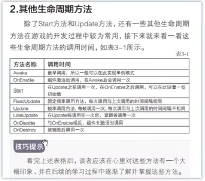

参考视频：[Unity教程 零基础带你从入门到大神](https://www.bilibili.com/video/BV1gQ4y1e7SS?p=7&spm_id_from=pageDriver&vd_source=d1002d9c1ba92da4ba3fca4fdca6d750)
参考书籍：新印象-Unity2020游戏开发基础与实战
# 第二章 打造3D游戏世界
## 06. 初中就学过？记录位置的坐标系

Unity遵守 左手坐标定律，则：


每个方块都遵守的，就叫做**世界坐标系**

而一旦方块成为了某方块的**子方块**

Quad 为父物体
Plane 为子物体

那么子方块的坐标 并非遵守 世界坐标系。而是 **父物体**自己的坐标系，则是 **本地坐标系**

**For Example：**
移动前：
这是Quad的坐标

这是Plane的坐标


移动后：
Quad：

Plane：


所以 父物体 怎么移动 子物体 的坐标都不变。

显示中，有轴心(Pivot)和中心(Center)区分，不影响操作。
位于左上角的：


## 07.对物体的基本操作


**第一个工具**：手型工具（鼠标滚轮）就是拖拽画面。 (快捷键Q)
其中你还可以按住右键 然后WASD，也可以按住Alt 左右上下移动。

**第二个工具**：移动工具。用于移动物品(有XYZ轴)  (快捷键W)
红色箭头是X轴
绿色箭头是Y轴
蓝色箭头是Z轴
额外：
红色方块是YOZ面（动Y轴和Z轴）
绿色方块是ZOX面（动Z轴和X轴）
蓝色方块是YOX面（动Y轴和X轴）

**第三个工具**：旋转工具。  (快捷键E)
同样的，颜色也对应着各轴。

**第四个工具**：缩放工具。  (快捷键R)
就是缩放物体。

**第五个工具**：矩形工具。  (快捷键T)
一般是用于2D，可以两个轴向的任意调整。

**第六个工具**：综合工具。  (快捷键Y)
这是我们的合体技！（但就是麻烦）

第七个工具：拓展工具。
就是按照原物体进行拓展。

## 08. 导入游戏模型！
对项目（Project） 按右键 ，然后展示资源文件（Show in Explorer)

就能打开对应的文件夹了。


拿到一些模型文件的话，就先放在Assets 里吧。 

对文件按右键，可以让里面的文件导出成包。（Unity package file）
双击点开，就可以把包里的内容都放到游戏内容里。
（和装快递，或者PS的PSD档差不多意思）


### 一个物体 与 材质球
一个物体其实是由多个三角形组成


那为什么图形会可视呢（就是为什么会有白色的东西填充）：
那其实是因为这个 图形文件里 存在着渲染。
这个渲染内容在 Inspector 里的：


以上是默认的渲染，**材质球。**

那如何修改呢？

在项目（Project）右键，创建(Create)材质(Material)，就可以获得 New Material的文件，文件内容如下：


然后如果想要直接应用，就把这个 **材质球** 文件直接拖动到 **对应的物体里**，就可以了。（真的很人性化的操作）’


>重点来了：
>这个 材质球 和 对应的物体 并非是 物体 **复制** 材质球 的关系，而是**引用关系**。
>当 材质球 产生变化， 对饮的物体也会产生变化。


#### 材质球的类型（着色器 Shader）


材质球存在着很多类型，你可以任意去调整。（同样的会影响全部和这个材质球关联的物体）

专门去特效的人，会在材质中专门去做新的shaders（着色器）。

## 09.没有资源？去商店啊！
前提提要：


每个物体可以打开这个网格，然后去调整改变物体形状。
这个网格基于怎么样显示呢，就是这个Mesh Filter


这个是**材质列表**。

>Unity 拥有资源商店，你可以用这个商店去获取你想要的东西。
>窗口（Windows)里的资源商店（asset store)
>网站：https://assetstore.unity.com/zh

## 10.有山有路有悬崖？地形！
>山，水什么的从资源商店获取。

导入这个！


第一个按钮 添加相邻地形(Create Neighbor Terrains)
这个可以添加 相同大小 的 地形 在 选中地形的相邻位置（这不就城市天际线买地嘛）

第二个按钮 绘制地质地形(Paint Terrain)

在绘制中有多个选项。
- Raise or Lower Terrain，用来画山的。
	- 左键提高山，Shift + 左键 = 挖坑。
- Paint Holes,画洞。
- Paint Texture,绘制纹理.
- Set Height,设置高度。
	- 按住Shift 然后对某个山峰左键，可以取山的高度。
	- Flatten Tile 可以移平山地，变成完全平的平地（高度由你来定）。（单独一个瓦片(区域））
		- Flatten All 就是全部移平。
 - Smooth Height，平滑高度。
	 - 其强度按照 Blur Direction
		 - -1 : 磨高不磨低
		 - +1：磨低不磨高
-	Stamp Terrain 印章地形
	-	就只有第一下抬地形，不能拖拽。

最后一个按钮的最后一行可以调整地形分辨率（Mesh Resonlution)(On Terrain Data)


图中，突起的山地是由 Raise or Lower Terrain 制成，而突起的平地是由 Set Height 制成。


>左边的山是用Raise or Lower Terrain 
>左2的突起平地是 Set Height
>中间的柱子是 Raise or Lower Terrain + Paint Holes
>右上角的星星是： Stamp Terrain
>右下角的山是：Raise or Lower Terrain + Smooth Terrain

## 11.绘制地形，给地形化个妆！

打开 在上一个视频中的 **Paint Texture,绘制纹理**.你就会获得以下界面：


其中地形层 Terrain Layers ，去添加一个地形层。
效果如下：


然而，材质可以有多个，而第二个开始就得由你自己绘制了。效果如下：

而让我们回到地形的五个按钮。


第三个按钮，绘制树木(Paint Trees)

而树也需要**先被定义。**


树的绘制也可以按照： Brush Size，Tree Density，Tree Height 来调整。

树大部分保持随机即可，不然太过工业化了（太假）（你疑似有点工业化了）

树其中有个功能：
可以大量放置树。


地形的第四个按钮：添加细节Paint Details


具体效果就变成这样了。！

>以上的绘制操作都是**左键绘制**，**Shift + 左键** 去清除。

# 第三章 游戏脚本基础
## 12.正片来了？！游戏的灵魂，脚本组件（C\#)【书中P.056】

在进行之前先讲个故事：

在Unity开发中，一个物体就对应一个脚本。

我这边创建两个物件，A物件有五个功能（比如：碰撞，重力...），正常来说我都会把这些脚本功能都放到这物体上。
然而，我还有一个B物体，有三个功能，其中这三个功能和A物体重合，那我需要重新给这个物体写一个新的相同的功能嘛？

所以，这个就需要组件了。
>重点： 组件（Component）  = 功能！
>为什么物体有着不一样的效果，其实是因为组件差异。
>比如说为什么灯光就是灯光？因为存在灯光组件。

其中：Rigidbody 是重力组件。

比如说我们编写了一个C#的脚本，然后把这个脚本拖拽到这个物体的Inspector中，即可运用此脚本。

为什么物体有着不一样的效果。

而创建一个新的GameObject（Empty）其组件中必定有：位置

然后你添加什么组件，他就是怎么样的一个东西~

这些就变成灯光了。

>Unity每个物体其实都是空物体，但是存在组件，组件赐予了物体的属性。

## 13.玩转脚本组件

组件就是Component ，在两个地方可以调用。第一，上方菜单栏；第二，物体中的Inspector界面。

一个方块有如下的组件。
- Cube(Mesh Filter)网格过滤器
- Mesh Renderer(网格填充)
- Box Collider(碰撞体积)

如果你能注意到，有些组件有个✔的地方，那个是 **是否启用组件？** 的意思。

对着组件按右键，你可以获得组件更多的功能（比如重置，复制等等）
一个物体可以有多个组件。

如果你复制粘贴是同一个组件，那可以多一个选项： 粘贴组件值（Paste Component Value)

如果你写了一个脚本，你可以拖到那个物体中，这样就使用你这脚本组件了。此外，你在组件里也是可以找到这个的。
甚至！你在组件那搜寻，如果不存在你想要的组件，那么你可以添加新的脚本（在添加组件的位置中）


而如果想要重命名这个脚本文件名，那么你就点一下，然后隔一段时间再点即可。

## 14.尽职的一生，了解脚本的生命周期。【书中P.059】

什么是生命周期？就是脚本从他创建出来，到销毁的这个过程。

```c#
using System.Collections;
using System.Collections.Generic;
using UnityEngine;
///<summary>
///
///</summary>
public class TEST : MonoBehaviour
{
    private void Awake() //最早调用，所以一般可以实现单列模式
    {
        Debug.Log("Awake");
    }
    //Start is called before the first frame update

    private void OnEnable() //组件激活后调用 一次
    {
        Debug.Log("OnEnable");
    }
    void Start() //Update之前调用一次，OnEnable之后调用。
    {
        Debug.Log("Start"); 
    }

    //Update is called once per frame
    void Update() //帧率调用方法，每帧调用一次（不建议输出）
    { 
        
    }

    private void LateUpdate() //Update执行完就执行（跟屁虫）
    {
         
    }

    private void FixedUpdate() //固定频率调用（和帧没关系）
    {
        
    }

    private void OnDisable() //与OnEnable相反，组件非激活调用 一次。
    {
        Debug.Log("OnDisable");
    }

    private void OnDestroy()//当销毁时调用
    {
     
    }
}
 
```
以上代码中的**Start()** 和**Update()** 就是生命周期方法其中的两个。



```c#
//我们再 class里写一个awake
 private void Awake()
 {
     Debug.Log("Awake");
 }

```
>脚本要在**物体里**，才会被真正的调用。（脚本成为物体组件）


上述代码的效果：


```c#
//我们再 class里写一个awake
  private void OnEnable()
 {
 	Debug.Log("OnEnable");
 }
```
代码效果：


关于FixedUpdate的固定时间，在Project Settings 里可以进行修改。


## 15.不能插队！脚本的执行顺序问题。

>如果存在多个脚本，那调用的优先级是怎么样的呢？


结果是这样的。


那有没有方法是可以让一个脚本**优先运行**呢？

第一个最简单的方法：Awake();
把必须先执行的放到Awake上，而另外一个脚本就别用Awake了
==（一听就知道这个非常不推荐使用） #9E9E9E==

当然是用第二个方法更好啦。
随机一个脚本：
打开Execution Order（执行顺序的意思）

其中执行顺序是由最小到最大。
图中右下角的位置的加号，选择你想要的代码，然后调整数值即可。

>额外内容：
>如果有东西一定要先初始化，那么你就得放到 Awake() 方法里，最好不要放在 OnEnable()方法里。