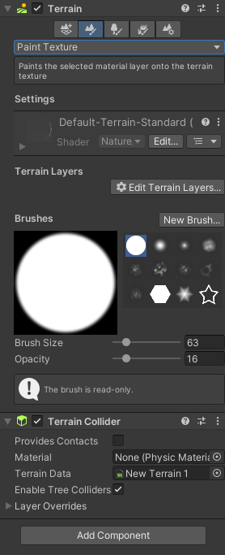
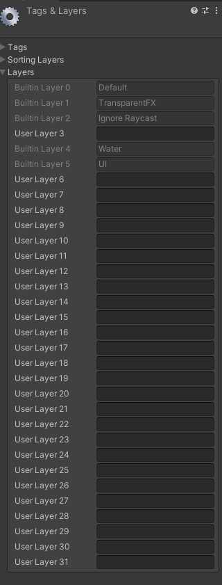
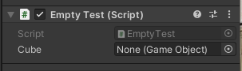

参考视频：[Unity教程 零基础带你从入门到大神](https://www.bilibili.com/video/BV1gQ4y1e7SS?p=7&spm_id_from=pageDriver&vd_source=d1002d9c1ba92da4ba3fca4fdca6d750)
参考书籍：新印象-Unity2020游戏开发基础与实战
# 第二章 打造3D游戏世界
## 06. 初中就学过？记录位置的坐标系

Unity遵守 左手坐标定律，则：


每个方块都遵守的，就叫做**世界坐标系**

而一旦方块成为了某方块的**子方块**

Quad 为父物体
Plane 为子物体

那么子方块的坐标 并非遵守 世界坐标系。而是 **父物体**自己的坐标系，则是 **本地坐标系**

**For Example：**
移动前：
这是Quad的坐标

这是Plane的坐标


移动后：
Quad：

Plane：


所以 父物体 怎么移动 子物体 的坐标都不变。

显示中，有轴心(Pivot)和中心(Center)区分，不影响操作。
位于左上角的：


## 07.对物体的基本操作


**第一个工具**：手型工具（鼠标滚轮）就是拖拽画面。 (快捷键Q)
其中你还可以按住右键 然后WASD，也可以按住Alt 左右上下移动。

**第二个工具**：移动工具。用于移动物品(有XYZ轴)  (快捷键W)
红色箭头是X轴
绿色箭头是Y轴
蓝色箭头是Z轴
额外：
红色方块是YOZ面（动Y轴和Z轴）
绿色方块是ZOX面（动Z轴和X轴）
蓝色方块是YOX面（动Y轴和X轴）

**第三个工具**：旋转工具。  (快捷键E)
同样的，颜色也对应着各轴。

**第四个工具**：缩放工具。  (快捷键R)
就是缩放物体。

**第五个工具**：矩形工具。  (快捷键T)
一般是用于2D，可以两个轴向的任意调整。

**第六个工具**：综合工具。  (快捷键Y)
这是我们的合体技！（但就是麻烦）

第七个工具：拓展工具。
就是按照原物体进行拓展。

## 08. 导入游戏模型！
对项目（Project） 按右键 ，然后展示资源文件（Show in Explorer)

就能打开对应的文件夹了。


拿到一些模型文件的话，就先放在Assets 里吧。 

对文件按右键，可以让里面的文件导出成包。（Unity package file）
双击点开，就可以把包里的内容都放到游戏内容里。
（和装快递，或者PS的PSD档差不多意思）


### 一个物体 与 材质球
一个物体其实是由多个三角形组成


那为什么图形会可视呢（就是为什么会有白色的东西填充）：
那其实是因为这个 图形文件里 存在着渲染。
这个渲染内容在 Inspector 里的：


以上是默认的渲染，**材质球。**

那如何修改呢？

在项目（Project）右键，创建(Create)材质(Material)，就可以获得 New Material的文件，文件内容如下：


然后如果想要直接应用，就把这个 **材质球** 文件直接拖动到 **对应的物体里**，就可以了。（真的很人性化的操作）’


>重点来了：
>这个 材质球 和 对应的物体 并非是 物体 **复制** 材质球 的关系，而是**引用关系**。
>当 材质球 产生变化， 对饮的物体也会产生变化。


#### 材质球的类型（着色器 Shader）


材质球存在着很多类型，你可以任意去调整。（同样的会影响全部和这个材质球关联的物体）

专门去特效的人，会在材质中专门去做新的shaders（着色器）。

## 09.没有资源？去商店啊！
前提提要：


每个物体可以打开这个网格，然后去调整改变物体形状。
这个网格基于怎么样显示呢，就是这个Mesh Filter


这个是**材质列表**。

>Unity 拥有资源商店，你可以用这个商店去获取你想要的东西。
>窗口（Windows)里的资源商店（asset store)
>网站：https://assetstore.unity.com/zh

## 10.有山有路有悬崖？地形！
>山，水什么的从资源商店获取。

导入这个！


第一个按钮 添加相邻地形(Create Neighbor Terrains)
这个可以添加 相同大小 的 地形 在 选中地形的相邻位置（这不就城市天际线买地嘛）

第二个按钮 绘制地质地形(Paint Terrain)

在绘制中有多个选项。
- Raise or Lower Terrain，用来画山的。
	- 左键提高山，Shift + 左键 = 挖坑。
- Paint Holes,画洞。
- Paint Texture,绘制纹理.
- Set Height,设置高度。
	- 按住Shift 然后对某个山峰左键，可以取山的高度。
	- Flatten Tile 可以移平山地，变成完全平的平地（高度由你来定）。（单独一个瓦片(区域））
		- Flatten All 就是全部移平。
 - Smooth Height，平滑高度。
	 - 其强度按照 Blur Direction
		 - -1 : 磨高不磨低
		 - +1：磨低不磨高
-	Stamp Terrain 印章地形
	-	就只有第一下抬地形，不能拖拽。

最后一个按钮的最后一行可以调整地形分辨率（Mesh Resonlution)(On Terrain Data)


图中，突起的山地是由 Raise or Lower Terrain 制成，而突起的平地是由 Set Height 制成。


>左边的山是用Raise or Lower Terrain 
>左2的突起平地是 Set Height
>中间的柱子是 Raise or Lower Terrain + Paint Holes
>右上角的星星是： Stamp Terrain
>右下角的山是：Raise or Lower Terrain + Smooth Terrain

## 11.绘制地形，给地形化个妆！

打开 在上一个视频中的 **Paint Texture,绘制纹理**.你就会获得以下界面：



其中地形层 Terrain Layers ，去添加一个地形层。
效果如下：


然而，材质可以有多个，而第二个开始就得由你自己绘制了。效果如下：

而让我们回到地形的五个按钮。


第三个按钮，绘制树木(Paint Trees)

而树也需要**先被定义。**


树的绘制也可以按照： Brush Size，Tree Density，Tree Height 来调整。

树大部分保持随机即可，不然太过工业化了（太假）（你疑似有点工业化了）

树其中有个功能：
可以大量放置树。


地形的第四个按钮：添加细节Paint Details


具体效果就变成这样了。！

>以上的绘制操作都是**左键绘制**，**Shift + 左键** 去清除。

# 第三章 游戏脚本基础
## 12.正片来了？！游戏的灵魂，脚本组件（C\#)【书中P.056】

在进行之前先讲个故事：

在Unity开发中，一个物体就对应一个脚本。

我这边创建两个物件，A物件有五个功能（比如：碰撞，重力...），正常来说我都会把这些脚本功能都放到这物体上。
然而，我还有一个B物体，有三个功能，其中这三个功能和A物体重合，那我需要重新给这个物体写一个新的相同的功能嘛？

所以，这个就需要组件了。
>重点： 组件（Component）  = 功能！
>为什么物体有着不一样的效果，其实是因为组件差异。
>比如说为什么灯光就是灯光？因为存在灯光组件。

其中：Rigidbody 是重力组件。

比如说我们编写了一个C#的脚本，然后把这个脚本拖拽到这个物体的Inspector中，即可运用此脚本。

为什么物体有着不一样的效果。

而创建一个新的GameObject（Empty）其组件中必定有：位置

然后你添加什么组件，他就是怎么样的一个东西~

这些就变成灯光了。

>Unity每个物体其实都是空物体，但是存在组件，组件赐予了物体的属性。

## 13.玩转脚本组件

组件就是Component ，在两个地方可以调用。第一，上方菜单栏；第二，物体中的Inspector界面。

一个方块有如下的组件。
- Cube(Mesh Filter)网格过滤器
- Mesh Renderer(网格填充)
- Box Collider(碰撞体积)

如果你能注意到，有些组件有个✔的地方，那个是 **是否启用组件？** 的意思。

对着组件按右键，你可以获得组件更多的功能（比如重置，复制等等）
一个物体可以有多个组件。

如果你复制粘贴是同一个组件，那可以多一个选项： 粘贴组件值（Paste Component Value)

如果你写了一个脚本，你可以拖到那个物体中，这样就使用你这脚本组件了。此外，你在组件里也是可以找到这个的。
甚至！你在组件那搜寻，如果不存在你想要的组件，那么你可以添加新的脚本（在添加组件的位置中）


而如果想要重命名这个脚本文件名，那么你就点一下，然后隔一段时间再点即可。

## 14.尽职的一生，了解脚本的生命周期。【书中P.059】

什么是生命周期？就是脚本从他创建出来，到销毁的这个过程。

```c#
using System.Collections;
using System.Collections.Generic;
using UnityEngine;
///<summary>
///
///</summary>
public class TEST : MonoBehaviour
{
    private void Awake() //最早调用，所以一般可以实现单列模式
    {
        Debug.Log("Awake");
    }
    //Start is called before the first frame update

    private void OnEnable() //组件激活后调用 一次
    {
        Debug.Log("OnEnable");
    }
    void Start() //Update之前调用一次，OnEnable之后调用。
    {
        Debug.Log("Start"); 
    }

    //Update is called once per frame
    void Update() //帧率调用方法，每帧调用一次（不建议输出）
    { 
        
    }

    private void LateUpdate() //Update执行完就执行（跟屁虫）
    {
         
    }

    private void FixedUpdate() //固定频率调用（和帧没关系）
    {
        
    }

    private void OnDisable() //与OnEnable相反，组件非激活调用 一次。
    {
        Debug.Log("OnDisable");
    }

    private void OnDestroy()//当销毁时调用
    {
     
    }
}
 
```
以上代码中的**Start()** 和**Update()** 就是生命周期方法其中的两个。


```c#
//我们再 class里写一个awake
 private void Awake()
 {
     Debug.Log("Awake");
 }

```
>脚本要在**物体里**，才会被真正的调用。（脚本成为物体组件）


上述代码的效果：


```c#
//我们再 class里写一个awake
  private void OnEnable()
 {
 	Debug.Log("OnEnable");
 }
```
代码效果：


关于FixedUpdate的固定时间，在Project Settings 里可以进行修改。


## 15.不能插队！脚本的执行顺序问题。

>如果存在多个脚本，那调用的优先级是怎么样的呢？


结果是这样的。


那有没有方法是可以让一个脚本**优先运行**呢？

第一个最简单的方法：Awake();
把必须先执行的放到Awake上，而另外一个脚本就别用Awake了
==（一听就知道这个非常不推荐使用） #9E9E9E==

当然是用第二个方法更好啦。
随机一个脚本：
打开Execution Order（执行顺序的意思）

其中执行顺序是由最小到最大。
图中右下角的位置的加号，选择你想要的代码，然后调整数值即可。

>额外内容：
>如果有东西一定要先初始化，那么你就得放到 Awake() 方法里，最好不要放在 OnEnable()方法里。

# 16.别搞错了，给游戏物体做个标记
在物体的头部位置点一下物体，就可以提供出一个**物体标记。**


接下来看看以下两个内容：Tag（标签），Layer（图层）

先讲 **Tag：**
>每个商品都有**唯一的标签**：每个手机都有**唯一的标识符**。（比起这个例子，更好的例子应该是**分组**）


以上的例子和Unity中的物体标签是差不多意思。
给了标签给了物体，是不会影响物体形态的。
给予最大的目的是为了归类。

比如说：如果我放了很多物体，那我怎么去找到我想要的那个物体呢（比如说玩家）？可以通过标签进行。

接下来是**Layer（图层）**：
Layer的范围是更广的，往往是代表了一类东西。进行碰撞检测，摄像机拍摄往往和Layer相关。



图层最多32个（因为是32bit数据）

图层能够做什么呢？举个实用的例子：

摄像机里有个组件，组件中有个内容Culling Mask：


这个东西选中后可以把某个图层**不可视化。** 这样你就可以用于隐藏一些东西，做到一些效果。

## 17.不用怕孩子，向量很简单。（向量与标量）

标量：只有大小的量。

向量：既有大小，也有方向。

向量的模：向量的大小。

单位向量：大小为1的向量。

单位化，归一化：把向量转为单位向量的过程。


比如说：如何去让一个角色面向敌人，那就得需要获得一个看向敌人的一个向量，就可以看向他了。

## 向量的运算及意义

向量加法：平行四边形原则。
：A(x1y1) + B(x2y2) = x1+x2,y1+y2


减法：B的终点指向A的终点
: A(x1y1) - B(x2y2) = x1 - x2,y1 -y2 


乘法：方向不变，大小*n

点乘：得到两个向量之间的夹角
：A. B = x1x2+y1y2 = n = |a||b|cos&

## 19.复制复制复制！预制体与变体。

先设计一个"Enemy"


把这个Enemy的物体 拖拽 到 Project栏里。
之后他就不是一个独立物体，而是真实存在的预设体（一个文件）了。

有什么好处呢？
一，预设体文件里进行修改，也会影响到游戏中的物体；而游戏里的物体你进行修改，却不会影响到物体中的值。
（按照我的想法来说：就是游戏里的物体是子类，然后预设体文件的父类，物体引用了预设体文件。）

物件变成预设体之后，在游戏里你可以点 Prefab中的 Select，就可以找到在文件夹里对应的预设体文件。

你也可以选择打开预设体（单独打开）

>当预设体发生变动的时候，游戏里对应的也会产生变化。

在变化中是有一些需要注意：


最后一个 Audio Chorus Filter 图标上显示了一个加号，这代表着这个组件并非预设体本身的，而是这个物体本身，不属于预设体的一个组件。

当然，你可以点右键，让这个组件归属于 预设体。（甚至你可以批量转交）

### 变体
**那如果我想要给一些特定的物体加入一些特定的内容呢？**


你就可能需要创建两个Enemy（这个是旧版本的操作）

这样做的话导致一个问题，只对Enemy进行修改是没办法控制Enemy(2)的。

但你想要的是，除了帽子其他都一样？那怎么办呢。

这个就是Unity新版本有的东西 **"变体"**

基于一个预设体，然后做出一个新的物体。
再把这个新的物体拖拽到Project栏里，然后就会弹出以下的弹窗。


- Original Perfab
	- 就是原始预设体，当作一份新的预设体
- Perfab Variant
	- 预设体变体，他也是一个预设体，但是不同的是如果原预设体进行修改，这个预设体也会产生变化。

## 20.既是位置，也是方向，Vector3的使用（常用的类与结构体）

用的最多的结构体：Vector3

>其中：Vector 2 是有两个变量（X,Y)，Vector 3有三个(X,Y,Z)，而Vector 4 有四个变量(X,Y,Z,W)。


Vector3 的代码：
```c#
private void Start()
{
   // Vector3可以代表：向量、坐标、旋转(45,90,0)、缩放(1,1,0.5f)
   // Vecotr3不一定就是向量，可以表达其他意思。
   //初始化一个v
    Vector3 v = new Vector3(1,1,1);
    v = Vector3.zero;
    v = Vector3.one;
    v = Vector3.forward; //(0,0,1)
    v = Vector3.down; //(0,-1,0)
    //手动修改。
    v.x = 0;
    v.y = 1;
    v.z = 2;
     
    //：(1,0,0) X轴
    v = Vector3.right;

    //(0,0,1) Z轴
    Vector3 v2 = Vector3.forward;


    //计算两个向量的夹角 显示90
    Debug.Log(Vector3.Angle(v,v2));

    //计算两点之间的距离 显示1.414214
    Debug.Log(Vector3.Distance(v,v2));

    //点乘 显示: 0
    Debug.Log(Vector3.Dot(v, v2));
    //叉乘 显示: (0.00,-1.00,0.00)
    Debug.Log(Vector3.Cross(v,v2));
    //插值 显示(0.5,0.5,0.5) 如果最后一个是0.8f 则：(0.8,0.8,0.8)
    Debug.Log(Vector3.Lerp(Vector3.zero,Vector3.one,0.5f));

    //向量的模 显示:1
    Debug.Log(v.magnitude);

    //规范化向量 显示:(1.00,0.00,0.00)
    Debug.Log(v.normalized);
}   
```

## 21.方向的描述，欧拉角与四元数
```c#
 //旋转：欧拉角，四元数
 Vector3 rotate = new Vector3(0,30,0);

 //四元数 (X,Y,Z,W)
 Quaternion quaternion = Quaternion.identity; //无旋转

 // 欧拉角 -> 四元数
 quaternion = Quaternion.Euler(rotate);

 // 四元数 -> 欧拉角
 rotate = quaternion.eulerAngles;

 //看向一个物体
 quaternion = Quaternion.LookRotation(new Vector3(0, 0, 0));
```

## 22.报错啦！ 别急，Debug来帮你
Debug代码：
```c#
//普通输出
Debug.Log("Test");
//以警告的方式输出
Debug.LogWarning("Test2");
//以错误的方式输出
Debug.LogError("Test3");


//绘制一条线 :(起点，终点，颜色）代码中是从 (0,0,0) 到 (1,1,1)
//只有开发人员才能看到，并非游戏实际内容。
Debug.DrawLine(Vector3.zero,Vector3.one,Color.blue);

//绘制一条射线 (起点,方向(射线)，颜色）
Debug.DrawRay(Vector3.zero, Vector3.up, Color.red);
```

## 23.动态修改物体属性？游戏物体类的使用。

>前期提要：
>一个物体包含不同组件之后，就有着不同的形态和功能。
>每个游戏物体都对应C#中的类：GameObject

其中 public GameObject Cube 代码后可以获得这个东西：

```c#
public class EmptyTest : MonoBehaviour
{
    //写了这个之后在Unity里的组件就会有Cube选项。
    //通过这样的方法就可以在一个脚本里操控另一个物体了。
    public GameObject Cube;

    //获取预设体 
    //与Cube 同理。
    public GameObject Prefab;


    private void Start()
    {
        //拿到当前脚本所挂载的游戏物体
        //其实这一句没必要写，只是展示一下。
        GameObject go = this.gameObject;
        //输出 Empty
        Debug.Log(go.name);
        //gameObject 就是这个脚本附属的一个物体。
        //那不写GameObject go 的话就可以这样写：
        

        //名称
        Debug.Log(gameObject.name);
        //Tag（标签）
        Debug.Log(gameObject.tag);
        //Layer (图层输出的是索引）
        Debug.Log(gameObject.layer);

        //打印立方体(Cube)的名称
        Debug.Log(Cube.name);
        
        //是否激活
        //由于父物体激活状态会影响到这个物体的激活状态，因此就有两种代码表示。
        //当前真正的激活状态
        Debug.Log(Cube.activeInHierarchy);
        //当前自身的激活状态
        Debug.Log(Cube.activeSelf);

        //获取Transform 组件
        Transform trans = this.transform; //真正去用可以省略这一句

        Debug.Log(transform.position);

        //获取其他组件
        //<泛型>：去写你要的组件类型即可。
        BoxCollider bc = GetComponent<BoxCollider>();


        //获取当前物体的子物体身上的某个组件
        GetComponentInChildren<CapsuleCollider>(bc);

        //获取当前物体的父物体身上的某个组件
        GetComponentInParent<BoxCollider>();

        //添加一个组件 <组件>
        gameObject.AddComponent<AudioSource>();

        //给Cube添加
        Cube.AddComponent<AudioSource>();

        //通过游戏物体的名称来获取游戏物体
        //代码的意思是：找一个物体，物体名叫 Test
        GameObject test = GameObject.Find("Test");

        //通过游戏标签来获取物体
        test = GameObject.FindWithTag("Enemy");

        //调整激活状态
        Cube.SetActive(false);

        //通过预设体来实例化一个游戏物体
        //实体化了一个克隆物体。
        //代码意思：实体化一个物体，放到(0,0,0)的位置上，不旋转。
        Instantiate(Prefab,Vector3.zero,Quaternion.identity); 

        GameObject go2 = Instantiate(Prefab, Vector3.zero, Quaternion.identity);

        //销毁
        Destroy(go2);

    }
}
```

## 24.游戏时间的使用

```c#
public class TimeTest : MonoBehaviour
{

    float timer = 0;

    private void Start()
    {
        //游戏开始到现在所花的时间
        Debug.Log(Time.time);

        //时间缩放值
        Debug.Log(Time.timeScale);

        //固定时间间隔
        Debug.Log(Time.fixedDeltaTime);


    }
    //假设 电脑 60帧一秒  1/60 1/120
    private void Update() //以帧调用
    {
        //这个相当于一个计时器(每一种帧的运行时间都加进去了）
        timer = timer + Time.deltaTime;
        //上一帧到这一帧所用的游戏时间 （这个用的非常多）
        Debug.Log(Time.deltaTime);

        //例子：如果大于3秒
        if (timer > 3)
        {
            Debug.Log("3秒过去了");
            timer = 0;
        }
    }

    private void FixedUpdate()
    {
        //这个是固定时间调用
    }
}

```

## 25.路径权限要理清，Application很重要。

>Unity游戏中的目录结构不一样，所以需要知道文件的位置。

```c#
//游戏数据文件夹路径（返回字符串（路径））
//路径引导到Assets文件夹里。
//（只读，加密压缩）
Debug.Log(Application.dataPath);
//如果想读取Assets文件夹里的一个文件，就可以这样做：
Debug.Log(Application.dataPath + "/文件名");

//持久化文件夹路径
//路径引导到一个空间（保存一些游戏数据的）
Debug.Log(Application.persistentDataPath);

//StreamingAssets文件夹路径(只读，配置文件）
//打包后，所有人都可以看的到的，就是配置文件。
Debug.Log(Application.streamingAssetsPath);

//临时文件夹
//另一个系统路径
Debug.Log(Application.temporaryCachePath);

//控制是否在后台运行（就是窗口化或者离开后游戏是否继续运行）
Debug.Log(Application.runInBackground);

//打开URL
Application.OpenURL("https://cn.bing.com/");

//退出游戏
Application.Quit();
```

Run In Background，后台运行控制。


## 26.需要切换场景？场景类你一定要了解。


创建一个 "MyScene" 的场景文件。


我们希望能在这个SampleScene通过代码自动加载到MyScene的场景来，怎么做呢？

在左上角 File 里 点 Build Settings。

图中，最上方的 Scenes In Build便是。
如果你这个场景是需要用的，那么把他拖拽到这个位置就对了。


接下来就可以做场景跳转了。

```c#
//需要导入这名称空间
using UnityEngine.SceneManagement; 

...
    //两个类：场景类，场景管理类。

    //加载/跳转场景
    //这个是通过索引
    SceneManager.LoadScene(1);

    //通过名称
    SceneManager.LoadScene("MyScene");


    //场景类：
    //获取当前场景
    Scene scene = SceneManager.GetActiveScene();
    //输出场景名称（用于验证）
    Debug.Log(scene.name);

    //场景是否已经加载 bool值
    Debug.Log(scene.isLoaded);

    //场景路径 字符串
    Debug.Log(scene.path);

    //场景索引 数值
    Debug.Log(scene.buildIndex);

    //获取所有的根游戏物体（数组）
    GameObject[] gos =scene.GetRootGameObjects();

    //场景管理类：
    //总共场景数量
    Debug.Log(SceneManager.sceneCount);

    //创建新场景
    SceneManager.CreateScene("newScene");

    Scene scene2 = SceneManager.CreateScene("newScene");

    //卸载场景：(异步销毁）
    SceneManager.UnloadSceneAsync("newScene");

    //加载场景：（场景，加载方法（枚举））
    SceneManager.LoadScene("MyScene",LoadSceneMode.Single);

    //其中有：Single(直接替换) Addictive（添加）

    //加载场景会有进度条，那就是在加载中，如果场景太大，那么加载就很久了。
    //那就需要另一个方法：异步加载
    SceneManager.LoadSceneAsync("MyScene");
}


```

## 27.Async异步加载场景并获取进度。

>进行异步加载然后时时刻刻展示进度。

异步和同步：[从小白到高手，你需要理解同步与异步](https://zhuanlan.zhihu.com/p/270428703)

同步是这样的：
这个例子中老板交给你任务后就一直**等待**什么都不做**直到你写完**，这个场景就是所谓的同步。


而这是异步：
这个例子老板交代完任务就去忙其它事情，你完成任务后简单的告诉老板任务完成，这就是所谓的异步。


更多的异步：


>异步的加载就是通过 **多线程** **协程**进行的。

[为什么return 前面要加yield?](https://blog.csdn.net/qq_33060405/article/details/78484825)

```C#
public class AsyncTest : MonoBehaviour
{
    AsyncOperation operation;
    private void Start()
    {
        //开始协程
        StartCoroutine(loadScene());
    }

    //协程方法 ： 用来异步加载场景
    IEnumerator loadScene()
    {
        operation = SceneManager.LoadSceneAsync(1);
        //加载完场景不要自动跳转
        operation.allowSceneActivation = false;
        yield return operation;
    }

    float timer = 0;

    private void Update()
    {
        //输出加载进度 0 - 0.9
        //等学会了UI就可以用进度条了。
        Debug.Log(operation.progress);
        timer += Time.deltaTime;
        //如果到达5秒，再跳转
        if (timer > 5)
        {
            operation.allowSceneActivation = true;
        }
        //学到按键操作可以更好一些。
    }
}

```