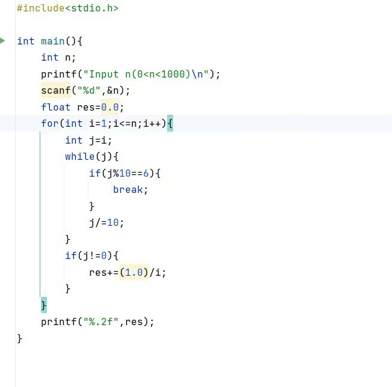
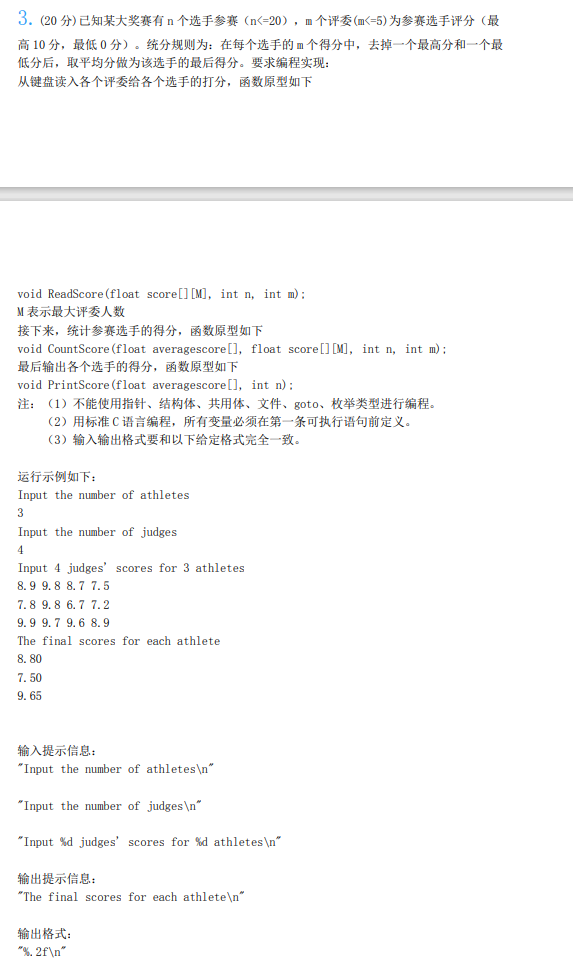

# 第一题：KY168 字符串内排序
[字符串内排序_牛客题霸_牛客网 (nowcoder.com)](https://www.nowcoder.com/practice/cc2291ab56ee4e919efef2f4d2473bac?tpId=64&tqId=29615&tPage=1&rp=1&ru=/ta/hit-kaoyan)

>输入一个字符串，长度小于等于200，然后将输出按字符顺序升序排序后的字符串。

```c
#include <stdbool.h>
#include <stdio.h>
#include <string.h>


void BubbleSort(char text[],int n)
{
    for(int i = 0; i < n-1; i++)
    {
        bool flag = false;
        for(int j=n-1;j>i;j--)
        {
            if(text[j-1] > text[j])
            {
                char t = text[j-1];
                text[j-1] = text[j];
                text[j] = t;
                flag = true;
            }
        }
        if (flag == false)
            return;
    }

}


int main() {

    char text[200];

    scanf("%s",&text);

    //printf("%s",text);

    int n = strlen(text);

    BubbleSort(text,n);

    printf("%s",text);

}

```

>思路：冒泡排序（要记得排序的内容）
>注意事项：
>1.C语言函数调用需要先定义
>2.scanf("%s",&text)
>3.printf("%s",text)
>4.bool值需要引用 <stdbool.h>
>5.string 相关内容需要引入 <string.h>

# 第二题 KY169 求最大值

[求最大值_牛客题霸_牛客网 (nowcoder.com)](https://www.nowcoder.com/practice/d54521e5efa242e8a7fd6ae36f6cf70d?tpId=64&tags=&title=&difficulty=0&judgeStatus=0&rp=1&sourceUrl=)
```c
#include <stdio.h>

int main() {
    
    int number,i,max = 0;
    for (i=0 ; i<10 ; i++)
    {
        scanf("%d",&number);
        if(number > max ) 
        {
            max = number;
        }
    }

    printf("max=%d",max);
    return 0;
}
```
>注意：
>1.这一题不一定要用数组，可以用int即可。
>2.scanf 可以如上使用
>3.最好有个return 0 ，好习惯。

# KY170 字符串去特定字符


```C
#include <stdio.h>
#include <string.h>

int main() {
    char s[100],c;

    scanf("%s %c",&s,&c); //必须得这么做

    int n = strlen(s);
    int i ,j;
    char a[n];
    for( i = 0,j=0; i < n ; i++)
    {
        if(s[i] != c)
        a[j++] = s[i]; //通过j++
    }
    a[j] = '\0'; //最后放入这个，printf会判断到这里停止。
    
    printf("%s",a);

}
```

>思路：
>通过两个字符串s 和 a，一个char c，输入完字符串s 和 char c之后，通过判断，如果(s[i] != c)就放入 字符串a中，如果不是则不放入。到最后  '\0'进行收尾。

>注意事项：
>1.scanf不要分开用，要用就一起scanf("%s %c",&s,&c);
>2.a[j] = '\0' 注意：'字符' "字符串"。
>3.a[j\+\+]是可行的，也是会在里面进行 \+\+


# KY171 计算两个矩阵的乘积

[计算两个矩阵的乘积_牛客题霸_牛客网 (nowcoder.com)](https://www.nowcoder.com/practice/ed6552d03e624ba58d16af6d57e1c3e9?tpId=64&tags=&title=&difficulty=0&judgeStatus=0&rp=1&sourceUrl=)
```c
#include <stdio.h>

int main() {
    int x[2][3];
    int y[3][2];

    scanf("%d %d %d  %d %d %d  %d %d  %d %d  %d %d ",&x[0][0],&x[0][1],&x[0][2],&x[1][0],&x[1][1],&x[1][2],&y[0][0],&y[0][1],&y[1][0],&y[1][1],&y[2][0],&y[2][1]);


    for (int i = 0 ; i < 2 ; i++)
    {
        int amount = x[i][0] * y[0][0] + x[i][1] * y[1][0] + x[i][2] * y[2][0];
        printf ("%d ",amount);
        amount = x[i][0] * y[0][1] + x[i][1] * y[1][1] + x[i][2] * y[2][1];
        printf("%d\n",amount );

    }

    return 0;
}
```

>直接创死。
>就是单纯的用公式堆。
>注意：
>1.scanf可以这么用的。

# KY157 互换最大最小数

```c
#include <math.h>
#include <stdio.h>
#define N 21
int main() {
    int n[N];

    int y;
    scanf("%d",&y);

    for (int i = 0; i < y ; i++)
    {
        scanf("%d",&n[i]);
    }

    int min = n[0];
    int max = n[0];
    int minIndex = 0;
    int maxIndex = 0;
    for(int i = 0; i < y ;i++) //选择排序
    {
        if (n[i] > max)
        {
            max = n[i];
            maxIndex = i;
        }

        if (n[i] < min)
        {
            min = n[i];
            minIndex = i;
        }

        
    }

    int temp = n[minIndex];
    n[minIndex] = n[maxIndex];
    n[maxIndex] = temp;

    for (int i = 0; i < y ; i ++)
    {
        printf("%d ",n[i]);
    }

    return 0;
}
```

>思路就是：找出最大和最小值，然后对应的index位保存，保存后进行swap，即可做出来。

# KY158 找x

[找x_牛客题霸_牛客网 (nowcoder.com)](https://www.nowcoder.com/practice/069e2130430c41229ab25e47fa0949a6?tpId=64&tags=&title=&difficulty=&judgeStatus=&rp=1&sourceUrl=&gioEnter=menu)

```c
#include <stdio.h>

int main() {
    int n;
    int y[200];

    scanf("%d",&n);

    for (int i = 0 ; i < n ; i++)
    {
        scanf("%d",&y[i]);
    }

    int x;
    scanf("%d",&x);

    for (int i = 0 ; i < n ; i++)
    {
        if(y[i] == x)
        {
            printf("%d",i);
            return 0;
        }
    }
    printf("-1");


    return 0;
}
```

>思路：没什么难度，不同的是一找到就return，就不继续做了。

# KY160 众数

>权值较小的那一个是什么意思？
>我猜是值更小的那一个：

```c
#include <stdio.h>

int main() {
    int number[10] = {0,0,0,0,0,0,0,0,0,0};
    int n;

    for (int i = 0; i < 20 ; i++)
    {
        scanf("%d",&n);
        for (int j = 0; j < 11 ; j++)
        {
            if(n == j)
            {
                number[j]++;
                break;
            }
        }
    }
    int max = number[0];
    int maxIndex = 0;
    for (int i = 0; i < 11 ; i++)
    {
        if (max < number[i])
        {
                max = number[i];
                maxIndex = i;
        }

        
    }
    printf("%d",maxIndex);
}
```

>思路：首先读取，在读取过程中 就进行检测，因为限制在 1~10的数据里，那么就来一个number[10]，index作为数值，里面的数值代表出现的次数。
>每次输入就读取一次数值，并放入对应的index里，在读取完后，就会加入max 和 maxindex，然后就进行逐个对比，最终对比出最大的index，那个就是。

>注意：
>1. int number[10] = {0,0,0,0,0,0,0,0,0,0}; 有脏数据啊！得要这样干才能把脏数据消除。
>2. 注意 循环的 i < 20 和 j < 11 的大小。


# KY161 最大公约数

[最大公约数_牛客题霸_牛客网 (nowcoder.com)](https://www.nowcoder.com/practice/20216f2c84bc438eb5ef05e382536fd3?tpId=64&tags=&title=&difficulty=0&judgeStatus=0&rp=1&sourceUrl=)

```c
#include <stdio.h>

int main() {
    
    int a , b;
    scanf ("%d %d",&a,&b);
    int c = b;
    while( a%b != 0)
    {
        c = a % b;
        a = b;
        b = c;
    }

    printf("%d",c);
    return 0;
}
```

[求最大公约数的4种方法_最大公约数公式-CSDN博客](https://blog.csdn.net/wyh_ty/article/details/105949789)


>按照以上这个思路去走吧。

# KY162 完数
[完数_牛客题霸_牛客网 (nowcoder.com)](https://www.nowcoder.com/practice/3d8cabccd6224b638573293a811c6346?tpId=64&tags=&title=&difficulty=0&judgeStatus=0&rp=1&sourceUrl=)


```c

#include <stdio.h>
#include <stdbool.h>

bool PerfectNumber(int x)
{
    int sum = 0;
    for (int i = 1;i < x ; i++)
    {
        if( x % i == 0)
        {
            sum += i;
        }
    }
    if (sum == x)
    {
        return true;
    }
    else return false;
}

int main() {
    int n;
    //求完数，并不是求这个数的完数。
    scanf("%d",&n);

    for (int i = 1 ; i <= n ; i++)
    {
        if(PerfectNumber(i))
        {
            printf("%d ",i);
        }
    }
    return 0;

}
```

>思路：输入数值， 然后每个 1 ~ 数值 的数据都和数据进行 %，如果是0，就代表是因子，并放入sum之中。
>注意：
>1. % 0 是会报错的，因此要注意的是 int i = 1 开始。
>2. 运用bool 值 需要 <stdbool.h>

# KY163 素数判定

```c
#include <stdio.h>

int main() {
    int n;
    //除了1和它本身外，不能被其他自然数整除,素数。
    scanf("%d",&n);

    if (n == 0 || n == 1 || n < 0)
    {
        printf("no");
        return 0;
    }
    int sum = 0;
    for (int i = 1 ; i < n ; i ++)
    {
        if (n % i == 0)
            sum += 1;
        if (sum > 1)
        {
            printf("no");
            return 0;
        }   
    }
    if(sum == 1)
    {
        printf("yes");
    }
    return 0;
}
```

>思路：先排除一定不是素数的情况，然后再根据对每个 1 ~ n（不包括n） 的数据进行 %，如果 == 0，那就 sum +1 .
>那么就是 如果 sum > 1 的时候，就代表 肯定有多一个数字也是这个的因子，因此肯定不是素数。

>注意：
>1. 还是注意一下 sum的位置，不要放在循环中。
>2. 同时可以多运用return来终止循环。
>3.  0 % 是会报错的。


# KY164 字符串链接

```c
#include <stdio.h>
#include <string.h>

int main() {
    
    char s1[100],s2[100];
    while(scanf("%s%s",s1,s2)!=EOF)
    {
    printf("%s%s\n",s1,s2);
    }
}
```
>思路：通过中间隔空格获取，然后在printf的时候不要空格即可。
>注意：
>1. while(scanf("%s%s",s1,s2)!=EOF) 是真的很好用，记得要用。

# KY 159 判断三角形类型

>问题：
>函数指针引用是怎么引用的。
>特别是数组，数组是怎么办呢。

```c
#include <stdio.h>

void Sort( int angle[3]) //冒泡排序
{
    for (int i = 0; i < 3 ; i++)
        for (int j = 3-1; j > i ; j--)
        {
            if (angle[j-1] > angle[j])
            {
                int temp = angle[j-1];
                angle[j-1] = angle[j];
                angle[j] = temp;
                
            }
        }
    if(angle[0]*angle[0] + angle[1]*angle[1] == angle[2]*angle[2])
        printf("直角三角形");
    else if(angle[0]*angle[0] + angle[1]*angle[1] > angle[2]*angle[2])
        printf("锐角三角形");
    else printf("钝角三角形");

}

int main() {
    int a,b,c;

    scanf("%d %d %d",&a,&b,&c);
    int angle[3] = {a,b,c};
    //排序
    Sort (angle);
    
    return 0;
}

```

>思路：首先进行排序，排序后在按照公式：a^2 + b^2 = c^2 的情况。如果大于就锐角，等于就直角，小于就钝角。
>注意：
>1. 以上这个是冒泡排序，注意冒泡排序的设计，多记一下，大概率都会用上。

# KY165 百万富翁问题

```c
#include <stdio.h>
#include <math.h>
int main() {
    
    //注意：是陌生人找百万富翁。因此陌生人每天给10w，富翁每天越来越多
    int baiWan = 1 ,moSheng = 10;

    for (int i = 0; i < 30 -1  ; i++)
    {
        int k = 2;
        for (int j = 0 ; j < i ; j++)
            k *= 2;
        baiWan += k;
        moSheng += 10;
        

    }

    printf("%d %d",moSheng,baiWan);

    return 0;
}
```

>思路：这一题主要考的是次方的代码方式，然后第一天就是0次方的话就当作1，所以第一天不作为计算，之后每一天会重置 int k = 2 ，然后计算出 k的i次方之后放入 k中。
>因此重点就是这一部分：
>int k = 2;
        for (int j = 0 ; j < i ; j++)
            k *= 2;
            

# KY166 数组逆置

```c

#include <stdio.h>
#include <string.h>

int main() {
    char a[100];
    char c[100];

    scanf("%s",a);

    
    for (int i = 0 , j = strlen(a) -1; i < strlen(a) ;j--,i++)
    {
        c[j] = a[i]; 
    }
    
    c[strlen(a)] = '\0';

    printf("%s",c);

    return 0;
}
```

>思路：通过输入一个字符串，然后读取字符串的数据，再加入一个新的字符串，从尾到头插入。即可。
>注意：
>1. 记得最后加一个 '\0' (字符)
>2. 注意数值上的不同，strlen（a) = 5 ，下标是 0~4。所以 j = strlen(a) - 1

# 番外：哈尔滨工业大学历届考题14年

> 杨辉三角形。


> 数组量开的不要这么少。
> 数组下标。
> 

```c

for (i = 0 ; i < n ; i++)
{
	a[]
}
```


```

exit(1); 其实是和 return 差不多，或者一样。
```

```
for(k=1;k=10) { data[k+1]=data[k+1]+data[k]/10; data[k]=data[k]^10; } }
```


就看看最高位有没有进位的趋向，如果有就进位。

size 如果超出了位数。


# 15 哈工大复试试题

O(n) , O(n^2)




## 第2题

>建议s1[1000] （多开点）
>scanf("%\[\^\\n\]",s); //正则，除了\n 的字符我都要。


## 第3题





```c
#include<stdio.h>
const int M=5;
void CountScore(float averagescore[],float score[][M],int n,int m);
void ReadScore(float score[][M],int n,int m){
    for(int i=1;i<=n;i++){
        for(int j=0;j<m;j++){
            scanf("%f",&score[i][j]);
        }
    }
    float averages[1000];
    CountScore(averages,score,n,m);
}
void CountScore(float averagescore[],float score[][M],int n,int m){
    if(m==1||m==2){
        for(int i=1;i<=n;i++){
            printf("0.00\n");
        }
        return ;
    }
    for(int i=1;i<=n;i++){
        for(int j=0;j<m;j++){
            for(int k=0;k<j;k++){
                if(score[i][j]<score[i][k]){
                    float temp=score[i][j];
                    score[i][j]=score[i][k];
                    score[i][k]=temp;
                }
            }
        }
    }
    for(int i=1;i<=n;i++){
        for(int j=0;j<m;j++){
            printf("%f ",score[i][j]);
        }
        printf("\n");
    }
    for(int i=1;i<=n;i++){
        float sum=0;
        for(int j=1;j<m-1;j++){
            sum+=score[i][j];
        }
        sum=sum*1.0/(m-2);
        averagescore[i]=sum;
    }
    for(int i=1;i<=n;i++){
        printf("%.2f\n",averagescore[i]);
    }
}
int main(){
    float score[100][M];
    int n;
    int m;
    scanf("%d%d",&n,&m);
    ReadScore(score,n,m);
}
```

>这个你要知道的是数组

# KY156 百鸡问题

```c

#include <stdio.h>

int main() {
    int n;
    scanf("%d",&n);
    for(int i=0;i<=100;i++){
        for(int j=0;j<=100-i;j++){
            int k=100-i-j;
            int m=n-5*i-3*j;
            if(m*3>=k){
                printf("x=%d,y=%d,z=%d\n",i,j,k);
            }
        }
    }
}
```

>百鸡问题其实很直接，就是对每个鸡的情况都遍历一遍就好说了。

# KY167 数字阶梯求和

```c
#include<stdio.h>
int c[1000];
int max(int n,int m){
    if(n>m){
        return n;
    }else{
        return m;
    }
}
int add(int a[],int b[],int n,int m){
    for(int i=0;i<max(n,m);i++){
        c[i]=a[i]+b[i];
    }
    for(int i=0;i<max(n,m);i++){
        if(c[i]>=10){
            c[i+1]=c[i]/10+c[i+1];
        }
        c[i]=c[i]%10;
    }
    int idx=max(n,m);
    while(c[idx]>=10){
        c[idx+1]=c[idx]/10+c[idx+1];
        c[idx]%=10;
        idx++;
    }
    if(idx==max(n,m)){
        return idx;
    }else{
        return idx+1;
    }
}
int main(){
    int a,n;
    scanf("%d%d",&a,&n);
    int idx=0;
    for(int i=1;i<=n;i++){
        int temp[1000];
        for(int j=0;j<i;j++){
            temp[j]=a;
        }
        idx=add(c,temp,idx,i);
    }
    for(int i=idx-1;i>=0;i--)
        printf("%d",c[i]);
}
```